# 抱歉，sns.distplot()还不够好。这是，虽然

> 原文：<https://towardsdatascience.com/sorry-but-sns-distplot-just-isnt-good-enough-this-is-though-ef2ddbf28078?source=collection_archive---------9----------------------->

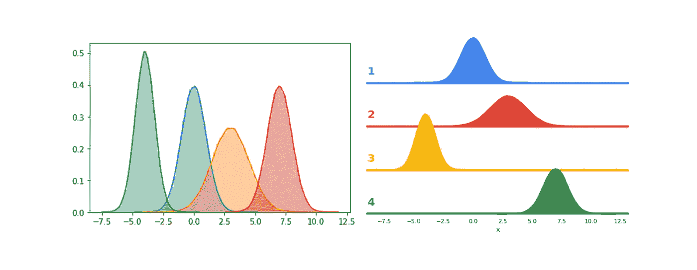

## 美丽的情节永远不会在一行代码中创造出来

> 所有图片由作者创作。

Python 中的现代绘图库是数据科学家的天赐之物，他们可以用一行代码创建复杂的数据表示(加上一些加载库和数据的代码)。用快速可视化来指导数据分析和模型构建是很好的，但是正式的可视化呢？

抱歉，但这些“一行程序”还不够。你添加的额外几行(大概类似于`plt.title()`)也不会给你的情节带来任何公正。

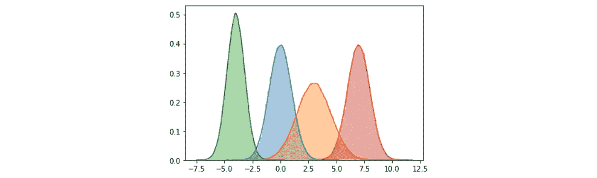

“一句台词情节”的成果。还过得去，但是离它应该在的地方太远了。

虽然默认绘图很容易并且产生普通的结果，但是使用库`matplotlib`和`seaborn`中的构建块从头构建绘图允许我们创建更加漂亮和非正统的图形。最重要的是，有了正确的信息，创造这些创造性的情节并不难，而且*和*值得额外的努力来创造一个真正脱颖而出的视觉效果。

这需要做更多的工作，但是这一点点额外的努力是值得的。

从头开始创造一个美丽的情节可以分为五个步骤:

1.  解构你的情节。勾画出你希望你的图看起来像什么，并确定每个组成部分。
2.  建立一个 FacetGrid 框架，这是一项投资，当您将各种对象合并到您的地块中时，它将被证明是有价值的。
3.  创造中心。
4.  添加注释。
5.  添加最终润色。

## 1 |解构你的情节

太多时候，可视化者一头扎进创建一个图，有数据武装，但没有他们想要创建的清晰概念。专业仪表板创建者总是推荐的一个技巧是在你开始编码之前就画出你的图表。通过这种方式，你将能够识别你认为合适的和不合适的，并能够清楚地标记出构成情节复杂性和意义的对象和关系。

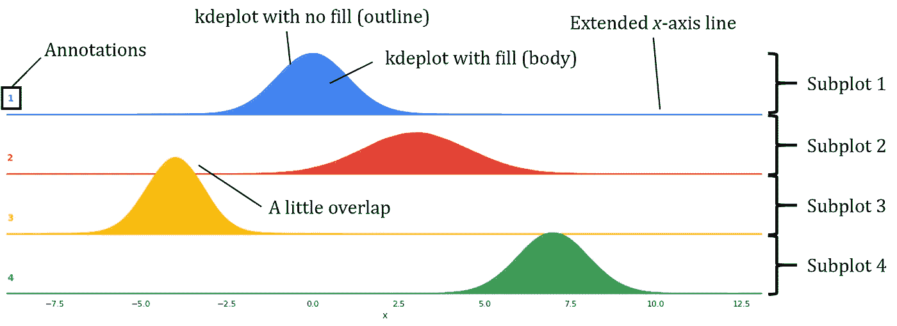

## 2 | FacetGrid

与其直接使用 seaborn(或 matplotlib)函数如`sns.barplot()`来绘图，不如花时间投资一个 FacetGrid。虽然从技术上讲，它不绘制任何信息，但它有助于组织您的数据，并建立一个清晰的框架，您将在其中构建您的图。

让我们来看看我们的数据，它的结构相对简单:

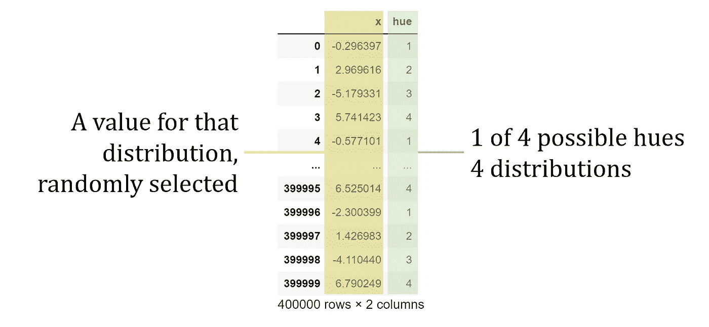

在我们的例子中，我们只需要满足`FacetGrid`的六个参数:我们从中提取的数据，一个用于子情节行的区分特性，另一个用于色调(颜色)，情节的尺寸(高度和纵横比，决定宽度)，以及情节调色板，在这个情节中是手动指定的，但可以用 seaborn 的任何内置调色板来替换。

目前，我们的地块是空的，因为我们没有用任何东西填充它，但我们可以看到我们地块的主要框架已经建成。它已经自动为我们创建了四行——每一行代表列`hue`中的一个唯一值，以及我们设置的维度准则。

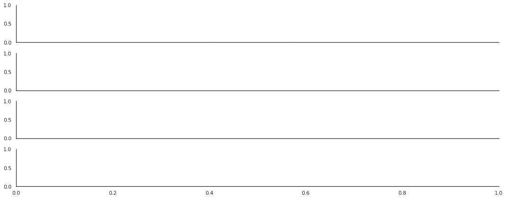

创建一个`FacetGrid`对象`g`将允许我们轻松地在上面添加对象，而不需要为不同的数据流和类别而烦恼。特别是当创建更复杂的图形，并且有许多对象层叠在彼此之上时，`FacetGrid`将被证明是一项有价值的投资。

## 3 |绘制中心

剧情的主要含义在*的核心部分*中传达。在我们的例子中，中心部分是四个分布图的集合。在我们的情节解构中，我们确定每个分布情节实际上由两个情节组成——一个没有填充作为轮廓，另一个有填充。这使得我们的可视化看起来更专业。

每当我们将一个 plot 对象添加到 FacetGrid 生态系统中时，我们必须遵守以下语法:

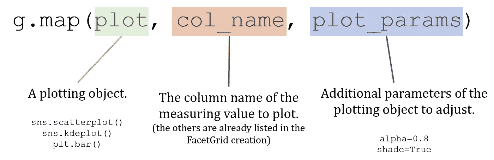

FacetGrid 绘图语法。

使用 FacetGrid 的好处是我们不需要在迭代中变得混乱——相反，生态系统以一种有组织的方式自动处理我们所有的命令，因为我们在创建框架的早期就设置了严格的参数。

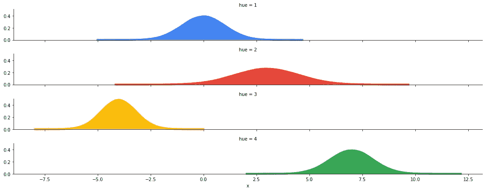

在我们的情节解构中的另一个观察是，我们想要一条沿着 *x* 轴的线来保持美学上的连续性。添加一条基础 *x* 线很简单:

在这种情况下，我们的绘图对象是`plt.axhline`，我们的‘测量值’是`y=0`，因为 *x* 轴被定义为 *y* 等于 0 的所有点。

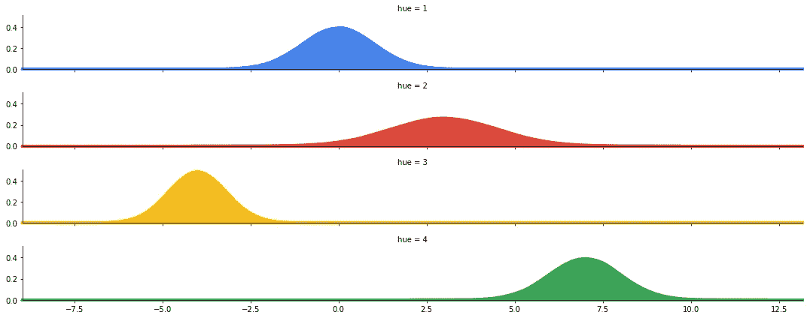

无论您想要添加哪种类型的绘图对象，无论是一维的(如本例所示)还是二维的，您都可以使用 FacetGrid 来帮助组织您的绘图。

因为目前一切都是默认的，情节可能不会看起来像我们想要的那样，但我们会根据情节的解构不断调整中心人物以及支持对象，直到我们对它的外观感到满意。

## 4 |添加标签

中心装饰完成后，是时候添加标签了。在情节解构中，我们决定移除代表密度的 y 轴上的标签。在这种情况下，每个标签只是一个从 1 到 4 的数字，对应于该分布。使用 FacetGrid，这是一个简单的任务:

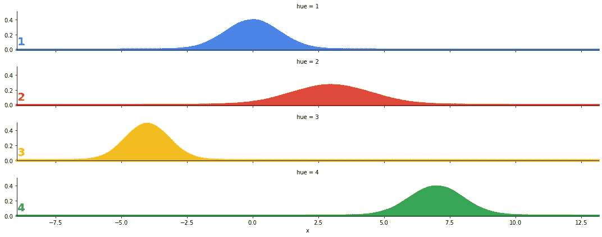

此时，使用 FacetGrid 的好处应该是非常明显的。只需将函数视为绘图对象，FacetGrid 通过检索我们请求的参数来完成所有繁重的工作。传统的标记方法是使用 matplotlib(坦白地说，已经过时了)系统手动检索对象的位置，并编写一个迭代器，但是使用一个更简化的生态系统为我们完成了这一切。

## 5 |最后润色

现在，关键元素——核心部分和标签——已经完成，是时候结束最后的润色了，这与其他元素一样重要。

在情节解构中，我们要求在分布情节之间有一些重叠。在这种情况下，我们需要调整 FacetGrid 对象的内部参数`g`，而不是添加另一个绘图对象。

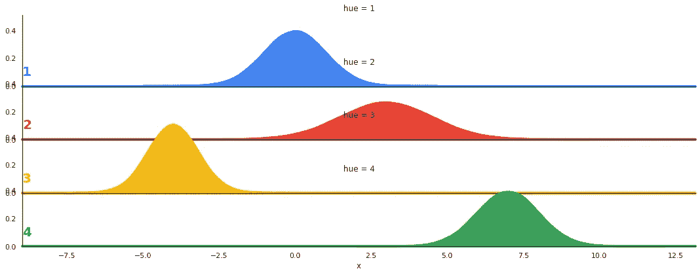

我们确实需要对 seaborn 的样式做另一个一般性的改变，以防止轴重叠的问题(即，它们被空格隔开)。

> 提示: *Matplotlib 和 seaborn 有很多有用的函数。毫无疑问，当你创造自己的情节时，你会遇到一些问题。文档页面和堆栈溢出是你最好的朋友！请务必利用 Python 绘图库提供的所有强大功能。*

最后，为了去掉默认包含的标题和 *y* 标记，以及脊骨，我们对 FacetGrid 对象做了一些修改。

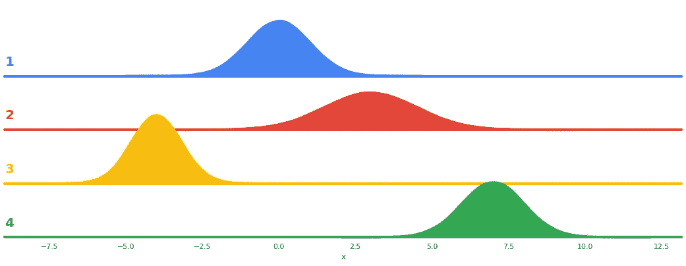

# …我们完成了！

考虑我们在这里创建的一个图的例子，可视化[线性判别分析](/linear-discriminant-analysis-explained-in-under-4-minutes-e558e962c877)如何将代表手写数字的 784 像素图像转换成二维和一维表示。

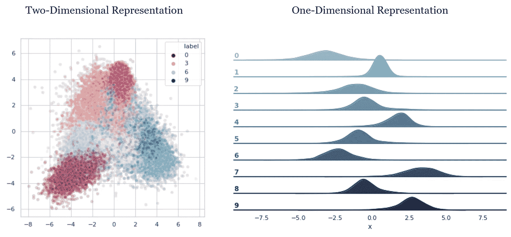

在这五个步骤的过程中，我们能够使用 matplotlib 和 seaborn 的大量构建块创建一个原始的情节。有了这个用于创建情节的框架和文档页面的强大功能，您将能够构建美丽而富有创造性的情节，这是值得付出额外工作的。你唯一的限制是你的想象力。

## 如果你喜欢，

你可能会喜欢我的其他可视化作品。

 [## 您的最终 Python 可视化备忘单

### 轻松创建美丽的、可定制的情节

towardsdatascience.com](/your-ultimate-python-visualization-cheat-sheet-663318470db)  [## 让图表看起来更专业的简单方法

### 培养良好视觉化的直觉

medium.com](https://medium.com/analytics-vidhya/easy-ways-to-make-your-charts-look-more-professional-9b081655eae7)