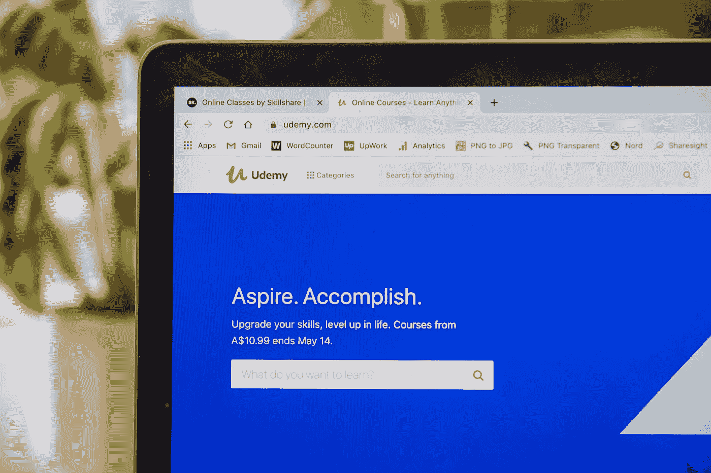

# 抱歉，在线课程不会让你成为数据科学家

> 原文：<https://towardsdatascience.com/sorry-online-courses-wont-make-you-a-data-scientist-8639d5f00889?source=collection_archive---------0----------------------->

## 为什么你真的应该停止注册更多的课程而不应用你已经知道的东西

由 [Unsplash](https://unsplash.com?utm_source=medium&utm_medium=referral) 上的 [Lewis Keegan @ SkillScouter](https://unsplash.com/@skillscouter?utm_source=medium&utm_medium=referral) 拍照

那是一个周末。我刚刚完成了另一门关于数据科学的在线课程。我觉得很有成就感。嗯，在“成功完成”5 门不同的课程并获得每门课程的“证书”后，任何人都会倾向于相信他们现在是**真正的数据科学家**。我也没有什么不同。

但是在线课程可能是一件有趣的事情。他们中的大多数都有精彩的描述，他们将涵盖的主题的巨大列表，承诺让你擅长一种或多种技能，如果我们幸运的话，我们还可以看到其他参与者的一堆证词，通常是关于课程如何将参与者从永久的厄运中拯救出来，并使他或她成为该领域的绝对冠军。但是，我们大多数人真正期待的是我们得到的最终证书。那些网上印有我们名字的彩色文件对我们大多数人来说是最大的不同。但有一天，我们坐在我们潜在雇主对面的一个房间里，发现他们中的大多数人似乎对我们的证书没有我们预期的那么感兴趣。有些人甚至没有礼貌地承认花了多少时间才拿到这些证书。他们会开门见山地说:“如果你没有参与过任何项目，这些证书就没用了”。当有人告诉你这一点时，你很难接受。更重要的是，我们在面试中表现出色并被选中的希望主要寄托在我们参加的在线课程上。这是我们投入的金钱、时间和精力。甚至在比赛前就取消我们的主要武器会削弱任何人的信心。

相信我。我曾以大学二年级学生的身份去过那里，一天之内，我带着两份简约的简历、5 份不同的证书和巨大的希望走进 7 个不同的房间，每个房间都有不同的公司参加学院的年度实习节。我唱的是*的同一首歌“我有这些课程的证书……”*在前 6。在第六家公司，我受到了口头形式的致命一击*“看。很高兴你完成了这些课程。但是，你什么都没做。您没有 Github 帐户。我们不知道你的能力。所以，我们很抱歉。”*

*哎哟！内心深处的伤痛。*我能感觉到我的气管经常堵塞，这使我无法清晰地说话，这是我在情绪受到严重打击时的典型特征。但是，这显然不是他们的错。他们向我展示了现实，一个我一直回避的现实。

> 我们在生活中都会遇到这样的情况，有人拿起一面镜子放在我们面前。这是我生命中的一段时光。

当这种情况发生时，我们可以选择是闭上眼睛还是睁着眼睛。我决定让他们保持开放，这可能是所有的差异。这就是我写这篇文章的原因。

# 为什么要做项目？

我们都如此热衷于完成课程的原因是，我们往往认为在线课程是对我们学位的积极支持，并且会受到雇主的青睐。由于大学学位在一些组织中是强制性的，甚至被认为是一份工作，我们认为在线课程将被同等重视，并被视为“额外学习”。是的，这是毫无疑问的。

然而，考虑到互联网给每个人提供的接触量，任何人都可以参加在线课程。因此，即使我们完成了一门课程，我们也不会比其他完成了同样课程的人有什么特别的优势。公司会比较候选人，因为这是他们轻松选择他们认为符合自己需求的候选人的唯一方法。**竞争是我们所做的一切事情的本质。因此，保持与众不同的唯一方法就是参与项目。**

参与项目的另一个原因是学习。网络课程无疑教会了我们很多东西，但它们受到阻止教师在课堂上向学生传授所有专业知识的力量的制约——教学大纲**。网上课程必须计划好，任何必须计划的事情都要有一个代价，那就是不能解决讨论中的话题的所有可能的方面。**

**另一方面，如果我们从事一个项目，我们采取的每一步都会让我们学习一个新概念。我们犯的错误将远远超过我们在网上课程中犯的错误。然而，如果我们愿意从这些错误中学习，我们吸收的知识将会相当丰富和有用。**

# **向基于项目的学习过渡**

**在那次面试中被贬低之后，我作为一个有决心的人回家了。我决心开始做项目，而不仅仅是依靠我的证书。但是，从我们的自然倾向过渡到一种新的实践可能是最困难的事情。**

**我读了一些关于如何应用数据科学和项目工作的文章。然后在接下来的几天里和同行进行了几次轻松的对话。坦率地说，有几次谈话非常令人沮丧。并不是说我的同龄人不善言谈，他们中的一些人似乎比我聪明得多。他们似乎在做令人印象深刻的事情。一些人在制造无人机，我唯一一次看到无人机是在电视上。有趣的是，我一听说他们在制造无人机就想和他们合作。但是，我不想问。我觉得我不够好，不能做这样酷的项目。*感叹！我们都会犯错……***

**然而，最令人困惑的挑战是，我只习惯于每周作业决定我进步的课程。评分系统被正式化了，**有人在给我评分**。在一个项目中，事情是不同的。**我不得不自我评估。而且，我无法做到这一点。我从来不能确定我是否做得足够好。我无法成为自己的评价者。****

> **有时候，我们太容易被迫将自己生命的主宰交给别人。迫使我们这样做的力量往往是我们自己无法理解自己的优势和劣势。**

**我意识到我需要准备好成为我最好的评估者。我就是这么做的。我坐下来起草了我的项目构想，甚至设定了要实现的目标，并设定了时间限制。老实说，我超过了每一个截止日期，但我确保至少完成了我决定要做的事情的 80%。**

**挂在我房间里的白板见证了我每天的计划，我作弊的日子，我学到的概念，我试图重新定义的概念和我一直喜欢画的框图。我的第一个项目是[分析巧克力棒评分](https://github.com/ry05/Chocolate-Bar-Analysis)。这是一个纯粹的 EDA 项目，它给了我第一次在自主项目上工作的经历。我从事这项工作是因为我有兴趣更多地了解世界各地的巧克力评级。**

**如果我们觉得以这样或那样的方式与一个项目联系在一起，对我们来说做这个项目并不困难。*因此，保持这种个人风格，并对事业而不是所使用的工具感到兴奋，对于能够坚持完成一个项目非常重要。***

**如果那句关于因事业而兴奋的话看起来有点难以理解，这里有另一篇文章，我很清楚地被事业所兴奋！**

** [## 利用数据造福社会——一个实例

### 一个五人小组如何利用经验数据为一个隐藏在农村角落的村庄做好事的故事…

towardsdatascience.com](/leveraging-data-for-social-good-a-practical-example-adac053bdeaa) 

# 但是，为什么基于项目的学习不容易呢？

我经常在大学的讲座间隙停下来，拿起一张纸，疯狂地写下我刚刚想到的想法。这些想法中有很多从未实现，因为**它们似乎不够令人印象深刻，无法与**一起完成。感觉这些想法不会帮助我成为一个酷的数据科学家。*想成为一名出色的数据科学家太过雄心勃勃，因为事实上我离成为一名数据科学家还差得很远(我现在仍然是)。然而，想要从事酷项目的歇斯底里让我被束缚在不合逻辑的极端。我在不知不觉中寻找*我的无人机*。*

甚至巧克力分析项目最初也被我搁置，因为听起来不够酷。感谢上帝，我重新考虑了。我们大多数人搁置项目是因为我们觉得与别人已经完成的项目相比，它并不好。坦率地说，这是一种自残的想法。我们没有看到没有两个人 X 和 Y 有相同的背景。所以，我们不能期望在任何时候都和别人一样好或者比别人更好。我们所能做的就是尝试。结果真的不在我们手里。那些从事复杂项目的人可能比我们知道得更多。

> 不知道浮力的性质，我们就不能指望造出一艘船。试图这样做是非常愚蠢的。

那么，我们想变傻吗？我想没有。

# 最后一点

从事学术项目从来没有完美的方法。这主要是因为每个学生都有不同的方法来完成项目。有些人是为了成绩，有些人是为了学习，有些人是两者兼而有之。一些人将项目视为在他们的舒适区工作的一种方式，而另一些人将项目视为学习更新概念的一种方式。从事学术项目的组合和方法有很多。然而，我在 CSE 本科期间注意到的几个要点是我将留给你的。

*   项目并不意味着被降格为想法之间纯粹的比较。每个项目都有一个学习点，它总是在我们的手中，不是看项目没有什么，而是看它有什么。
*   公开讨论想法和话题对我们的成长总是有益的。但是，接受好的反馈也同样重要。
*   自我监督我们的项目进展是必要的，因为在现实世界中没有人会监督我们。
*   最后，即使是微小的进步也要奖励自己，这将确保我们永远不会失去动力

最后，我不抹黑网络课程。有些证书对雇主来说真的很重要。此外，课程是学习特定技能的好地方。其中一些是由享有很高声誉的从业者服用的，并使我们装备良好。事实上，我从精彩的[数据营](https://www.datacamp.com/)中学到了数据科学的第一步。*但是，光有设备是不会让你变好的。*

由 [Sanyam Bhutani](https://medium.com/u/a08b1e531f9c?source=post_page-----8639d5f00889--------------------------------) 撰写的这篇精彩的文章提供了关于如何正确学习在线课程的深刻见解，或者正如他更喜欢的那样，*不要学习在线课程的错误方法。*

 [## 如何不做 Fast.ai(或者任何 ML MOOC)

### 关于如何不被 fast.ai 打败的固执己见的指南

medium.com](https://medium.com/@init_27/how-not-to-do-fast-ai-or-any-ml-mooc-3d34a7e0ab8c) 

那么，你还在等什么？拿起一个项目，开始工作，注意应用学习对你自己的魔力。**