# 数据宁滨与熊猫削减或 Qcut 方法

> 原文：<https://towardsdatascience.com/sort-and-segment-your-data-into-bins-to-get-sorted-ranges-pandas-cut-and-qcut-7785931bbfde?source=collection_archive---------2----------------------->


罗伯特·科林斯在 [Unsplash](https://unsplash.com?utm_source=medium&utm_medium=referral) 上拍摄的照片

## 当你在寻找一个范围而不是一个确切的数值，一个等级而不是一个分数

宁滨在处理数字数据以了解某些趋势时，数据可能是非常有用的策略。有时，我们可能需要一个年龄范围，而不是确切的年龄，一个利润率而不是利润，一个等级而不是分数。数据宁滨非常有助于解决这些问题。熊猫库有两个有用的函数 [cut](https://pandas.pydata.org/pandas-docs/stable/reference/api/pandas.cut.html) 和 [qcut](https://pandas.pydata.org/pandas-docs/stable/reference/api/pandas.qcut.html) 用于数据绑定。但有时它们会令人困惑。在本文中，我将尝试详细解释两者的用法。

# 扔掉

为了理解宁滨的概念，我们可以参考直方图。在本教程中，我将使用一个学生成绩数据集。请随意从以下链接下载数据集:

[](https://github.com/rashida048/Datasets/blob/master/StudentsPerformance.csv) [## rashida 048/数据集

### 此时您不能执行该操作。您已使用另一个标签页或窗口登录。您已在另一个选项卡中注销，或者…

github.com](https://github.com/rashida048/Datasets/blob/master/StudentsPerformance.csv) 

现在导入必要的包和数据集。

```
import pandas as pd
import numpy as np
import seaborn as snsdf = pd.read_csv('StudentsPerformance.csv')
```


使用上面的数据集，制作数学成绩数据的直方图:

```
df['math score'].plot(kind='hist')
```

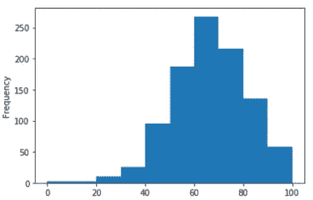

我们没有提到任何数量的箱子，但在幕后，有一个宁滨操作。数学成绩被分成 10 个部分，比如 20-30，30-40。在许多情况下，我们需要离散地定义箱，并在数据分析中使用它们。

# qcut

此函数尝试将数据划分为大小相等的箱。基于分布而不是箱的实际数值边缘，使用百分位数来定义箱。因此，您可能希望在像这样的简单数据中有大小完全相同的容器

```
pd.Series(pd.qcut(range(100), 4)).value_counts()
```

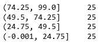

在本例中，我们给出了一个从 0 到 99 的范围，并要求 qcut 函数将其分成 4 个相等的区间。它制作了 4 个相等的仓，每个仓有 25 个元素。但是，当数据较大且分布有点复杂时，每个条柱中的 value_counts 可能不相等，因为条柱是使用百分位数定义的。

以下是 qcut 的一些使用案例:

**练习 1:生成 4 个均匀分布的容器**

qcut 最简单的用法是，指定容器并让函数本身划分数据。将数学成绩分成 4 等份。

```
pd.qcut(df['math score'], q=4)
```

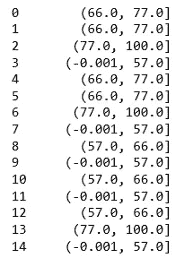

结果大了很多。我只是展示了一部分。虽然数学分数的范围也是从 0 到 100，但是箱边缘不像前面的演示那样是 25、50、75 和 100。因为人口分布不是那么均匀。如上面的直方图所示，最高分的学生从 60 分到 80 分，分布是左偏的。

**练习 2。检查每个箱子中的数值计数，以检查箱子边缘**

```
pd.qcut(df['math score'], q=4).value_counts()
```

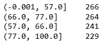

根据该表，266 名学生的分数在 0 到 57 分之间，属于 25%的范围。241 名学生处于 50%的范围内，得分在 57 到 66 之间。这么多学生小范围分数。最后的范围很大。最后一个季度的范围很大，从 77 到 100。

**练习 3。用不同数量的箱子做另一个简单的 qcut】**

这一次，我想将它作为一列添加到 DataFrame 中，并包含一个名为 precision 的参数。精度定义计算箱精度时要使用的小数位数。

```
df['math_score_7'] = pd.qcut(df['math score'], q=7, precision = 0)
```

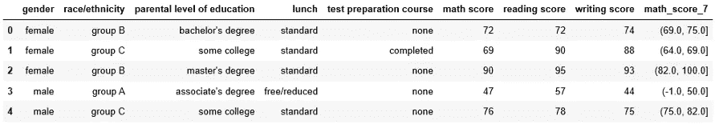

看数据集的右边。将添加一个显示媒体夹的新列。让我们检查箱子的值计数

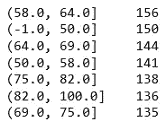

这些 bin 标签是熊猫在幕后自动计算出来的。所以，他们可能更难向客户解释。当我们需要一个特定的部门时，这也很难使用。但是有一个解决方案。qcut 允许对箱进行显式标记。

**由于数据集有太多我们在本教程中不需要的列，我删除了一些列。因为我们在做练习的时候会添加一些栏目。**

```
df = df.drop(columns=['test preparation course', 'lunch', 'writing score', 'parental level of education'])
```

**练习 4。根据分布情况给学生打分。**

列出我们可能要用的分数。在前面的示例中，我们将 bin 的数量作为 q 的值。这一次，我们必须明确地添加等级的范围。看看下面的代码。我们有五个不同的等级。

```
labels_5 = ['C', "B-", 'B', 'A-', 'A']
df['math score_labels'] = pd.qcut(df['math score'], q=[0, 0.4, 0.5, 0.65, 0.80, 1], labels=labels_5)
```

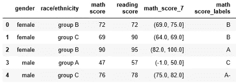

这里要记住一点，我在 q 列表里加的比例或者百分比，并不是数学分数。正如我前面提到的，它们是基于人口分布的。使用 cut 方法可以很容易地根据分数来分配等级。我将在后面的例子中展示这一点。

**5。重复上一个没有标签的练习。**

```
df['math score_no_labels'] = pd.qcut(df['math score'], q=[0, 0.4, 0.5, 0.65, 0.80, 1], labels=False, precision=1)
```

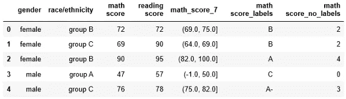

右边是我们刚刚创建的新列“数学分数 _ 无标签”。当我指定精度为 1 时，它取了一个小数点。0.0、1.0、2.0 和 4.0 是自动生成的序列。如果我们对箱进行值计数，它会看起来更清楚。

```
df['math score_no_labels'].value_counts()
```

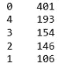

当我们标上 no _ labels 时，我们会根据人口的分布来打分。

**6。返回每个等级的标签。**

对于本例，使用参数 retbins 返回每个 bin 的阈值或上限。

```
results, bin_edges = pd.qcut(df['math score'], q=[0, 0.4, 0.5, 0.65, 0.80, 1], labels=labels_5, retbins=True)
results_table = pd.DataFrame(zip(bin_edges, labels_5), columns=['Limits', 'Tier'])
```

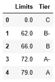

# 切口

宁滨的另一种方法。但概念不同。在 qcut 中，当您传递 q=4 时，它将尝试平均划分人口，并相应地计算箱边缘。但是在 cut 方法中，它将数据范围分成 4 等份，总体也将随之变化。

在上面的练习二中，当我们通过 q=4 时，第一个面元是，(-.001，57.0)。但是，如果我们使用 cut 方法并传递 bins = 4，bin 阈值将是 25、50、75、100。因为总分是 100。之后，它将自动计算落入这些箱中的人口。

```
pd.cut(df['math score'], bins=4).value_counts()
```

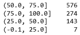

更精确地了解容器边缘可能很重要。看看上表，一个 bin 是(50，75)，下一个是(75，100)。一个学生需要知道他或她的分数是否是 75 分，他或她得了多少分。**要知道'('括号表示'不包含'，']'表示包含。**所以 75 包含在(50，75)bin 中，不包含在(75，100)中。

**练习:根据成绩定义学生的等级。**

仅仅为了这个练习，假设没有不及格的分数。像这样定义等级:0-40 是 C，40 -55 是 B，55-65 是 B，65-75 是 A，75-100 是 A。

```
cut_grades = ['C', "B-", 'B', 'A-', 'A']
cut_bins =[0, 40, 55, 65, 75, 100]
df['grades'] = pd.cut(df['math score'], bins=cut_bins, labels = cut_grades)
```

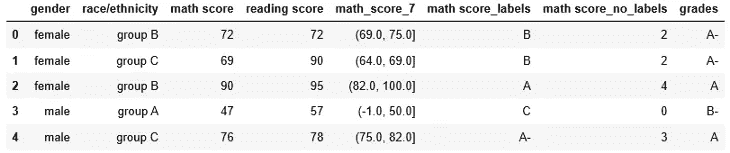

现在，**将该分级与 qcut 方法**中的分级进行比较。在 qcut 方法中，你不能决定分数来定义等级。你只能决定人口比例。分数是根据百分制决定的。在 cut 方法中，你决定某一等级的分数。

在本例中，cut 方法可能看起来更合适。因为根据分数来评分更有意义。但是在现实世界中还有许多其他情况需要基于分布的宁滨。希望不要再混淆 cut 和 qcut 的概念了。下面是 cut 和 qcut 方法的视频教程:

## 推荐阅读

[](/your-everyday-cheatsheet-for-pythons-matplotlib-c03345ca390d) [## Python Matplotlib 的日常备忘单

### 完整的可视化课程

towardsdatascience.com](/your-everyday-cheatsheet-for-pythons-matplotlib-c03345ca390d) [](/dictionary-in-details-python-programming-7048cf999966) [## 详细字典:Python 编程

### 举例学习在编程问题求解中使用字典

towardsdatascience.com](/dictionary-in-details-python-programming-7048cf999966) [](/a-complete-guide-to-confidence-interval-and-examples-in-python-ff417c5cb593) [## 置信区间的完整指南，以及 Python 中的示例

### 对统计学中一个非常流行的参数——置信区间及其计算的深入理解

towardsdatascience.com](/a-complete-guide-to-confidence-interval-and-examples-in-python-ff417c5cb593) [](/polynomial-regression-from-scratch-in-python-1f34a3a5f373) [## Python 中从头开始的多项式回归

### 学习用一些简单的 python 代码从头开始实现多项式回归

towardsdatascience.com](/polynomial-regression-from-scratch-in-python-1f34a3a5f373) [](/all-the-datasets-you-need-to-practice-data-science-skills-and-make-a-great-portfolio-857a348883b5) [## 练习数据科学技能和制作优秀投资组合所需的所有数据集

### 一些有趣的数据集提升你的技能和投资组合

towardsdatascience.com](/all-the-datasets-you-need-to-practice-data-science-skills-and-make-a-great-portfolio-857a348883b5) [](/logistic-regression-in-python-to-detect-heart-disease-2892b138d0c0) [## Python 中用于检测心脏病的逻辑回归

### 发展逻辑回归演算法的重要方程式和如何发展逻辑回归演算法…

towardsdatascience.com](/logistic-regression-in-python-to-detect-heart-disease-2892b138d0c0)