# Python 中的排序和子集化

> 原文：<https://towardsdatascience.com/sorting-and-subsetting-in-python-f9dd2e14caa0?source=collection_archive---------38----------------------->

## 使用熊猫图书馆进行动手数据分析


照片由[安 H](https://www.pexels.com/@ann-h-45017?utm_content=attributionCopyText&utm_medium=referral&utm_source=pexels) 从[派克斯](https://www.pexels.com/photo/contemporary-art-2838545/?utm_content=attributionCopyText&utm_medium=referral&utm_source=pexels)拍摄

在本帖中，我们将通过熊猫图书馆学习一些强大的数据分析技术。探索数据集是数据分析的第一个关键步骤。为了更好地理解数据，有许多方法可以做到这一点。但是今天，我们将介绍两种最简单也是最重要的方法来找到数据帧中有趣的部分。排序和子集化是本文将要讨论的两个内容。介绍完了，让我给你介绍一个叫*熊猫、*的朋友，他将在这次旅程中帮助我们。

# 熊猫

Pandas 构建在两个基本 python 包之上:NumPy 和 Matplotlib。

*   NumPy 提供了多维数组对象来方便数据操作，pandas 用它来存储数据。
*   Matplotlib 具有强大的数据可视化功能，pandas 利用了这一点。

存储用于分析的数据有多种方式，但矩形数据(也称为“表格数据”)是最常用的一种。

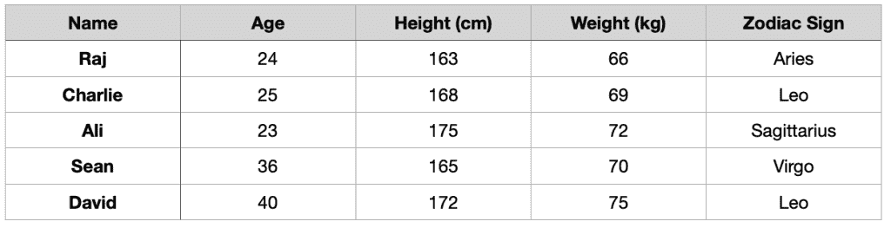

data.csv

例如在下表中；每个观察或每个人都是一行。每个变量或者说每个人的财产是一列。

Pandas 设计用于处理矩形数据，就像我们拥有的这个。

# 熊猫数据框

在 pandas 中，矩形数据被表示为 DataFrame 对象。每一种用于数据分析的编程语言都有类似熊猫的东西。比如 R 也有数据框，SQL 有个叫数据库表的东西。

列中的每个值都具有相同的数据类型，可以是文本或数字，但是不同的列可以包含不同的数据类型。

## 输入数据

首先，我们必须导入 pandas，然后使用一种称为“read_csv”的特殊方法读取“data.csv”文件。您可以在 excel 或任何电子表格程序中创建自己的数据文档，然后将其导出为 csv 文件。

```
import pandas as pd 
df = pd.read_csv("data.csv")print(df)
```

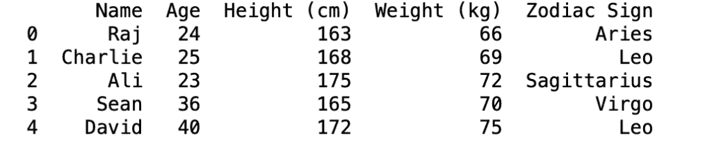

结果

当您第一次收到一个新数据集时，您想做的第一件事是快速浏览并了解数据。熊猫有一些很好的方法来探索甚至操纵数据。今天，我将向您介绍以下方法:对数据进行排序和子集化。我将向你们展示它们每一个的结果，以便更好地理解它是如何工作的。让我们从排序值开始。

# 排序值

我们要做的第一件事是通过排序来改变行的顺序。通过这种方式，您将能够在数据框架的顶部看到数据的最终收益。可以使用 sort_values 方法对行进行排序。您必须传入您想要按数据框架排序的列名。

例如，如果我们对 weight_kg 列名应用 sort_values 方法，我们将根据它们的重量对它们进行排序。我们将把最轻的人放在上面，最重的放在下面。

```
df.sort_values('Weight (kg)')
```


结果

如果您想知道是否可以根据多个列名对数据帧进行排序，是的，这是可能的。我们所要做的就是在 sort_values 方法中将列名作为一个列表传递。

```
df.sort_values(['Weight (kg)','Height (cm)'])
```

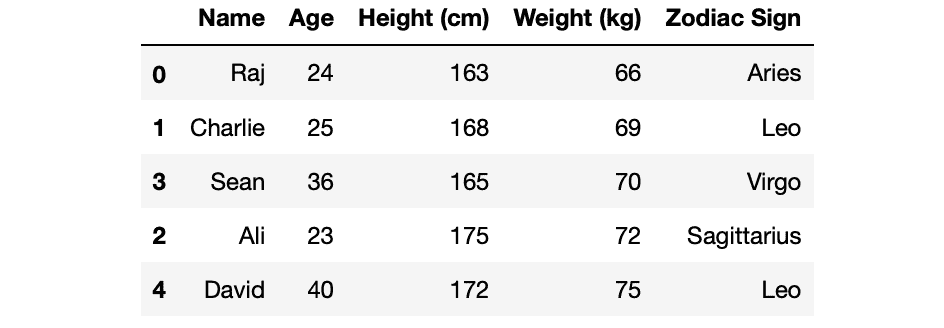

结果

要改变值的排序方向，我们所要做的就是添加另一个名为 ascending 的属性，然后向该属性传递一个列表。在我们的例子中，人们现在按照从最高到最低的顺序排列。

```
df.sort_values(['Weight (kg)','Height (cm)'], ascending=[True, False])
```

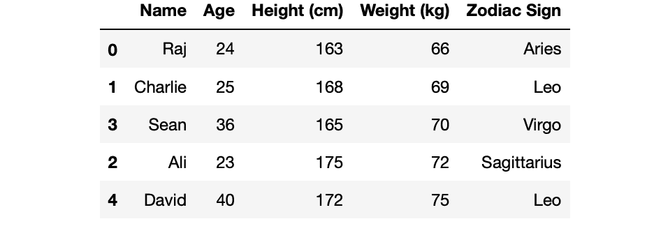

结果

# 子集化

## 子集化列

子集化是探索数据和了解数据的另一种方式。假设您只想查看一列的值。我们可以使用 DataFrame 的名称，后跟括号内的列名来实现这一点。

```
df['Name']
```

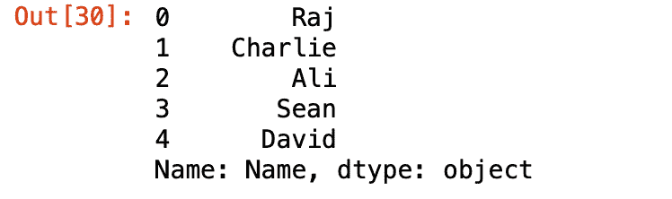

结果

如果您想查看多列而不是一列，这也非常容易。你只需要在括号内的列名列表中传递。我通常使用这种方法来查看列之间是否有密切的关系。

```
df[['Name', 'Height (cm)']]
```

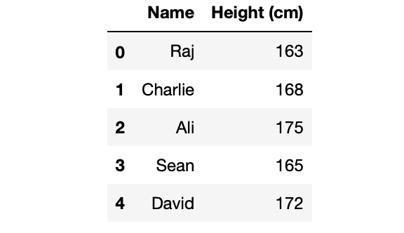

结果

## 子集化行

对行进行子集化是了解数据的另一种方式。有许多方法可以对行进行子集化，但是我们将在本文中介绍的方法是最常见的方法，即创建一个逻辑条件过滤方法。

例如，假设我们要过滤身高超过 170cm 的人。我们可以用下面的代码行来实现:

```
df[df['Height (cm)'] > 170]
```

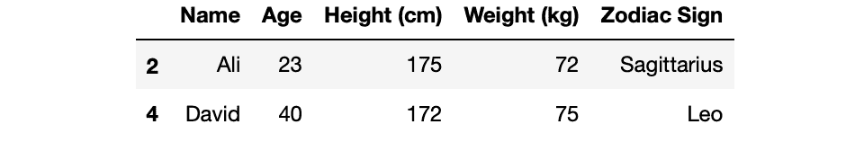

结果

可能有字符串类型的列，还有另一种过滤文本数据的方法。逻辑表达式将类似于我们所做的，但这一次我们将使用两个等号来做检查。

```
df[df['Zodiac Sign'] == 'Leo']
```

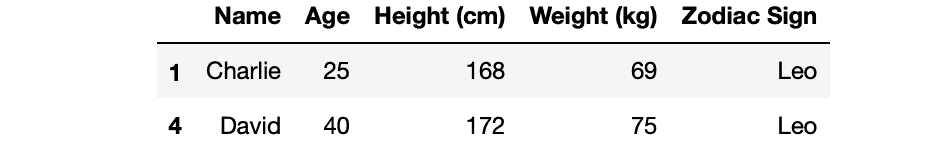

结果

最后，如果您希望根据多个条件对行进行子集化，我们所要做的就是使用逻辑运算符(如“and”或“or”)来组合这些条件。我们来做一个快速的例子，过滤身高超过 160cm，生肖是狮子座的人。一个很好的方法是在不同的行中创建两个不同的条件，然后在最后使用“and”操作符将它们组合起来。

```
tall_cond = df['Height (cm)'] > 160
sign_cond = df['Zodiac Sign'] == 'Leo'df[tall_cond & sign_cond]
```

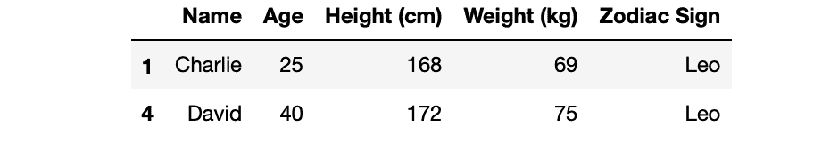

结果

您也可以在一行中完成这个子集设置，如下所示:

```
df[(df['Height (cm)'] > 160) & (df['Zodiac Sign'] == 'Leo')]
```

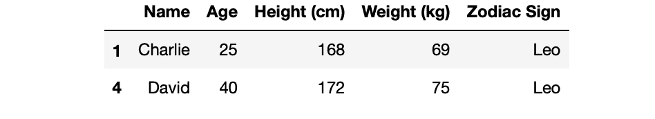

结果

# 最后一个提示

最后，这是子集化行的最佳实践之一。有一个特殊的方法叫做“isin()”，正如您可以理解它的名字一样，它过滤具有特定值的行。当根据特定值进行子集设置时，此方法很有用，因此没有范围。在下面的例子中，我将筛选出黄道十二宫与白羊座相匹配的行。

```
leo_zodiac = df['Zodiac Sign'].isin(['Aries'])leo_zodiac
```

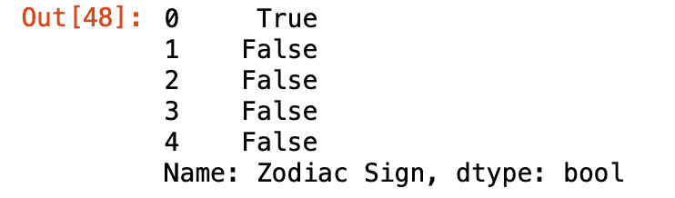

结果

这篇文章到此为止，现在我们对如何使用 Pandas 库分析数据有了更好的理解。我们在小数据上做了实践练习，但是我强烈建议在大数据上练习这些方法。可以勾选 [Kaggle](https://www.kaggle.com) 下载数据。这也是一个发现数据科学挑战并尝试解决它们的好地方。跟上时代的最好方法是练习。

感谢你阅读这篇文章，我希望你今天喜欢并学到了一些新东西。以后我会分享更多的熊猫方法来帮助你分析你的数据。保持安全和快乐的编码！:)

> *跟随我的* [博客](https://medium.com/@lifexplorer) *和* [走向数据科学](https://towardsdatascience.com/) *留下灵感。*