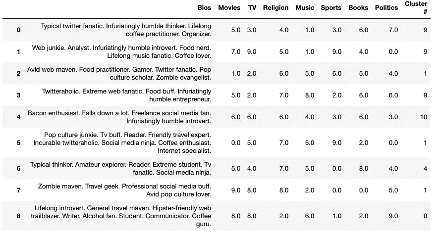
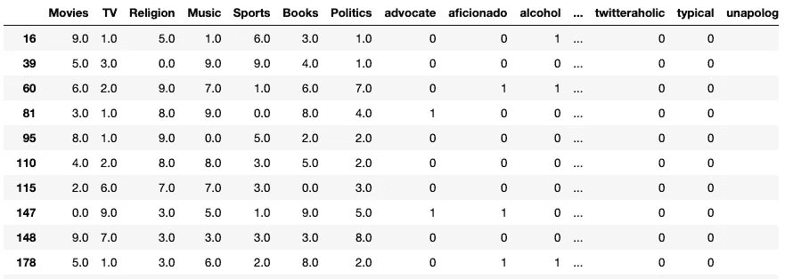
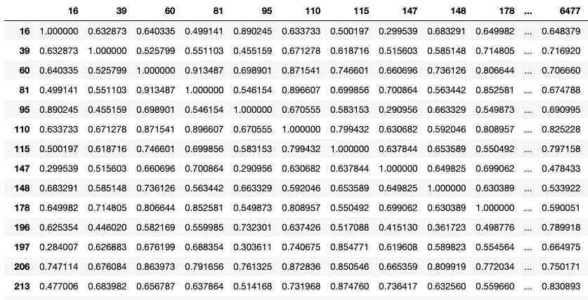
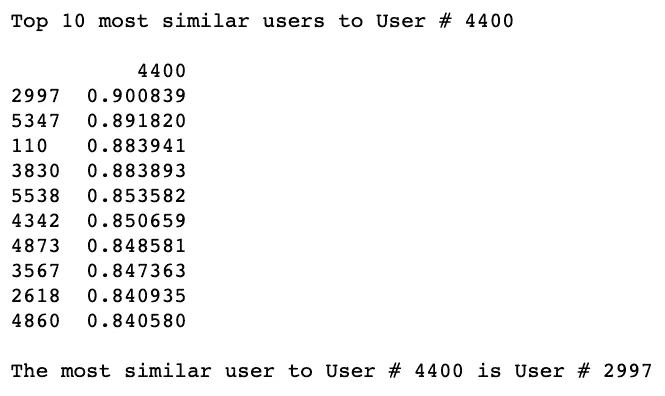

# 我用机器学习来组织约会档案

> 原文：<https://towardsdatascience.com/sorting-dating-profiles-with-machine-learning-and-python-51db7a074a25?source=collection_archive---------20----------------------->

## 在约会档案中寻找相关性


Jonah Pettrich 在 [Unsplash](https://unsplash.com?utm_source=medium&utm_medium=referral) 上的照片

答在无休止地浏览数百个约会档案，却找不到一个匹配的之后，人们可能会开始怀疑这些档案怎么会出现在他们的手机上。所有这些简介都不是他们要找的类型。他们已经刷了几个小时甚至几天，没有发现任何成功。他们可能会问:

> “为什么这些约会应用程序向我显示我知道我不会与之匹配的人？”

对于许多厌倦了在应该匹配的时候向左滑动的人来说，用来显示约会档案的约会算法可能看起来很糟糕。每个约会网站和应用程序都可能利用他们自己的秘密约会算法来优化用户之间的匹配。但是有时候感觉就像是在没有任何解释的情况下向其他人展示随机的用户。我们怎样才能更多地了解并解决这个问题？通过使用一个叫做 ***的小东西，机器学习*** 。

我们可以使用机器学习来加快约会应用程序中用户之间的匹配过程。通过机器学习，简档可以潜在地与其他相似的简档聚集在一起。这将减少相互不兼容的配置文件的数量。从这些聚类中，用户可以找到更像他们的其他用户。机器学习聚类过程已在下面的文章中介绍过:

[](/dating-algorithms-using-machine-learning-and-ai-814b68ecd75e) [## 我用机器学习和人工智能做了一个约会算法

towardsdatascience.com](/dating-algorithms-using-machine-learning-and-ai-814b68ecd75e) 

如果你想知道我们是如何实现交友档案的聚类的，请花点时间阅读一下。

> [在这里注册一个中级会员，可以无限制地访问和支持像我这样的内容！在你的支持下，我赚了一小部分会费。谢谢！](https://marco-santos.medium.com/membership)

# 聚类配置文件数据

使用上面文章中的数据，我们能够在一个方便的 Pandas 数据框架中成功地获得聚类的日期分布图。



聚类约会简档数据的屏幕截图

在此数据框架中，每行都有一个配置文件，在对数据集应用 [***分层凝聚聚类***](https://www.datanovia.com/en/lessons/agglomerative-hierarchical-clustering/) 后，我们可以看到它们所属的聚类组。每个配置文件属于一个特定的群集号或组。然而，这些团体可以使用一些改进。

# 对集群配置文件进行排序

有了聚类的配置文件数据，我们可以通过根据它们彼此的相似程度对每个配置文件进行排序来进一步细化结果。这个过程可能比你想象的更快更容易。

对聚类数据集进行排序所需的所有代码

## 代码分解

让我们从`random`开始将代码分解成简单的步骤，在整个代码中使用它只是为了选择要选择的集群和用户。这样做是为了让我们的代码适用于数据集中的任何用户。一旦我们有了随机选择的聚类，我们就可以缩小整个数据集的范围，只包括那些具有所选聚类的行。

## …向量化…

缩小所选集群组的范围后，下一步是对该组中的 bios 进行矢量化。 ***我们使用的矢量器与我们创建初始聚类数据帧时使用的矢量器相同—*** `CountVectorizer()`。(*在我们对第一个数据集进行矢量化时，之前已经实例化了矢量器变量，这可以在上面的文章*中观察到)。

```
# Fitting the vectorizer to the Bios
cluster_x = vectorizer.fit_transform(group['Bios'])# Creating a new DF that contains the vectorized words
cluster_v = pd.DataFrame(cluster_x.toarray(), 
                         index=group.index,   
                         columns=vectorizer.get_feature_names())
```

通过对 Bios 进行矢量化，我们创建了一个包含每个 Bios 中的单词的二进制矩阵。

之后，我们将把这个矢量化的数据帧连接到所选的组/集群数据帧。

```
# Joining the vector DF and the original DF
group = group.join(cluster_v)# Dropping the Bios because it is no longer needed
group.drop('Bios', axis=1, inplace=True)
```

将两个数据框连接在一起后，我们剩下矢量化的 bios 和分类列:



从这里我们可以开始寻找彼此最相似的用户。

# 在约会简档中寻找相关性

一旦我们创建了一个填充了二进制值和数字的数据框架，我们就可以开始寻找年代测定曲线之间的相关性。每个约会档案都有一个独特的索引号，我们可以从中借鉴。

一开始，我们总共有 6600 份约会资料。在聚类并将数据帧缩小到所选的聚类之后，年代测定概况的数量可以在 100 到 1000 的范围内。在整个过程中，约会档案的指数保持不变。现在，我们可以使用每个索引号来引用每个约会档案。

每个索引号代表一个独特的约会档案，我们可以找到相似或相关的用户每个档案。这是通过运行一行代码来创建一个相关矩阵来实现的。

```
corr_group = group.T.corr()
```

我们需要做的第一件事是*转置*数据帧，以便切换列和索引。这样做是为了使我们使用的关联方法适用于索引而不是列。一旦我们转置了 DF，我们就可以应用`.corr()`方法，这将在指数之间创建一个相关矩阵。



指数的相关矩阵(测年曲线)

该相关矩阵包含使用 [***皮尔逊相关法***](https://statistics.laerd.com/statistical-guides/pearson-correlation-coefficient-statistical-guide.php) 计算的数值。接近 1 的值彼此正相关，这就是为什么你会看到 1.0000 的指数与他们自己的指数相关。

从这里，您可以看到我们在使用这个关联矩阵寻找相似用户时的发展方向。

# 寻找十大相似的约会档案

现在我们有了一个包含每个索引/日期剖面的相关分数的相关矩阵，我们可以开始根据它们的相似性对剖面进行排序。

```
random_user = random.choice(corr_group.index)print("Top 10 most similar users to User #", random_user, '\n')top_10_sim = corr_group[[random_user]].sort_values(by=
             [random_user],axis=0, ascending=False)[1:11]print(top_10_sim)print("\nThe most similar user to User #", random_user, "is User #", top_10_sim.index[0])
```

上面代码块中的第一行从关联矩阵中选择一个随机的约会配置文件或用户。从这里，我们可以选择包含所选用户的列，并对该列中的用户进行排序，这样它将只返回前 10 个最相关的用户(不包括所选索引本身)。



成功！—当我们运行上面的代码时，我们会得到一个用户列表，按照他们各自的相关性分数排序。我们可以看到与我们随机选择的用户最相似的前 10 名用户。这可以用另一个集群组和另一个配置文件或用户再次运行。

# 结束语

如果这是一个约会应用程序，用户将能够看到与自己最相似的前 10 名用户。这将有望减少刷卡时间，减少挫折感，并增加我们假设的约会应用程序用户之间的匹配。假设的约会应用程序的算法将实现无监督的机器学习聚类，以创建约会档案组。在这些组中，算法将根据它们的相关分数对简档进行分类。最后，它将能够向用户展示与自己最相似的约会资料。

潜在的下一步将是尝试将新数据纳入我们的机器学习匹配器。也许让一个新用户输入他们自己的自定义数据，看看他们会如何匹配这些虚假的约会资料。

# 资源

[](https://github.com/marcosan93/AI-Matchmaker) [## Marcos an 93/人工智能媒婆

### 利用人工智能和机器学习来匹配约会档案与另一个原始概念和想法数据收集…

github.com](https://github.com/marcosan93/AI-Matchmaker) [](/dating-algorithms-using-machine-learning-and-ai-814b68ecd75e) [## 我用机器学习和人工智能做了一个约会算法

towardsdatascience.com](/dating-algorithms-using-machine-learning-and-ai-814b68ecd75e)