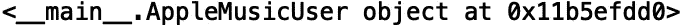
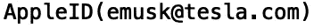
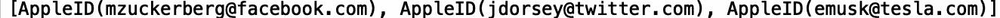
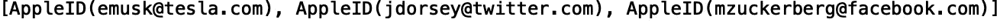
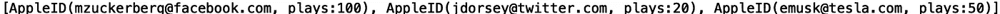
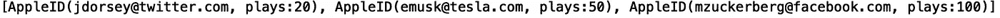

# Python 中的对象排序

> 原文：<https://towardsdatascience.com/sorting-objects-in-python-d43db6edaaea?source=collection_archive---------53----------------------->

## 对同一类别的对象进行排序


[来源](https://www.pexels.com/photo/leaves-hang-on-rope-1389460/)

在计算机科学中，类是定义具有相关属性和方法的对象的蓝图。计算机科学中的一个常见任务是基于属性对数据结构进行排序。在本帖中，我们将讨论如何基于属性值对同一类的对象进行排序。

我们开始吧！

假设我们有一个名为“AppleMusicUser”的类，它有一个初始化 apple 用户 ID 的“__init__”方法:

```
class AppleMusicUser:
    def __init__(self, apple_id):
        self.apple_id = apple_id
```

让我们用电子邮件“emusk@tesla.com”创建一个“AppleMusicUser”类的实例:

```
user1 = AppleMusicUser("emusk@tesla.com")
```

如果我们打印这个对象，我们会得到:

```
print(user1)
```



这表示“AppleMusicUser”对象位于指定的内存地址。我们可以通过添加一个“__repr__”方法来更改该对象的表示方式:

```
class AppleMusicUser:
    def __init__(self, apple_id):
        self.apple_id = apple_id
    def __repr__(self):
        return 'AppleID({})'.format(self.apple_id)
```

现在如果我们打印:

```
print(user1)
```



接下来，假设我们有一个“AppleMusicUser”对象列表:

```
users = [AppleMusicUser("mzuckerberg@facebook.com"), AppleMusicUser("jdorsey@twitter.com"), AppleMusicUser("emusk@tesla.com")]
```

让我们打印对象列表:

```
print(users)
```



我们可以使用“sorted()”方法和 lambda 函数根据 apple ID 对对象列表进行排序:

```
print(sorted(users, key = lambda u: u.apple_id))
```



或者，我们可以使用运算符模块中的“attrgetter()”方法来定义排序方法中的键:

```
from operator import attrgetter
print(sorted(users, key = attrgetter('appled_id')))
```


我个人更喜欢使用“attrgetter()”来定义排序键，但是使用 lambda 函数也很好。使用“attrgetter()”的优势在于速度和提取多个属性的能力。

对于我们的最后一个示例，假设我们有一个附加属性“plays”，对应于播放的歌曲数量:

```
class AppleMusicUser:
    def __init__(self, apple_id, plays):
        self.apple_id = apple_id
        self.plays = plays 
    def __repr__(self):
        return 'AppleID({}, plays:{})'.format(self.apple_id, self.plays)
```

让我们重新定义我们的对象列表:

```
users = [AppleMusicUser("mzuckerberg@facebook.com", 100), AppleMusicUser("jdorsey@twitter.com", 20), 
         AppleMusicUser("emusk@tesla.com", 50)]
print(users)
```



我们可以根据播放次数对对象进行分类:

```
from operator import attrgetter
print(sorted(users, key = attrgetter('plays')))
```



我就讲到这里，但是您可以自己随意摆弄代码。

# 结论

总之，在这篇文章中，我们讨论了如何在 python 中对对象进行排序。首先，我们展示了如何使用 sorted 方法和 lambda 函数根据属性“apple_id”对对应于“AppleMusicUser”类实例的对象进行排序。接下来，我们展示了如何通过在操作符模块中使用“attrgetter”方法来执行相同的排序任务。最后，我们展示了如何根据与用户播放的歌曲数量相对应的附加属性进行排序。我希望你觉得这篇文章有用/有趣。这篇文章的代码可以在 [GitHub](https://github.com/spierre91/medium_code/blob/master/classes_in_python/sorting_objects.py) 上找到。感谢您的阅读！