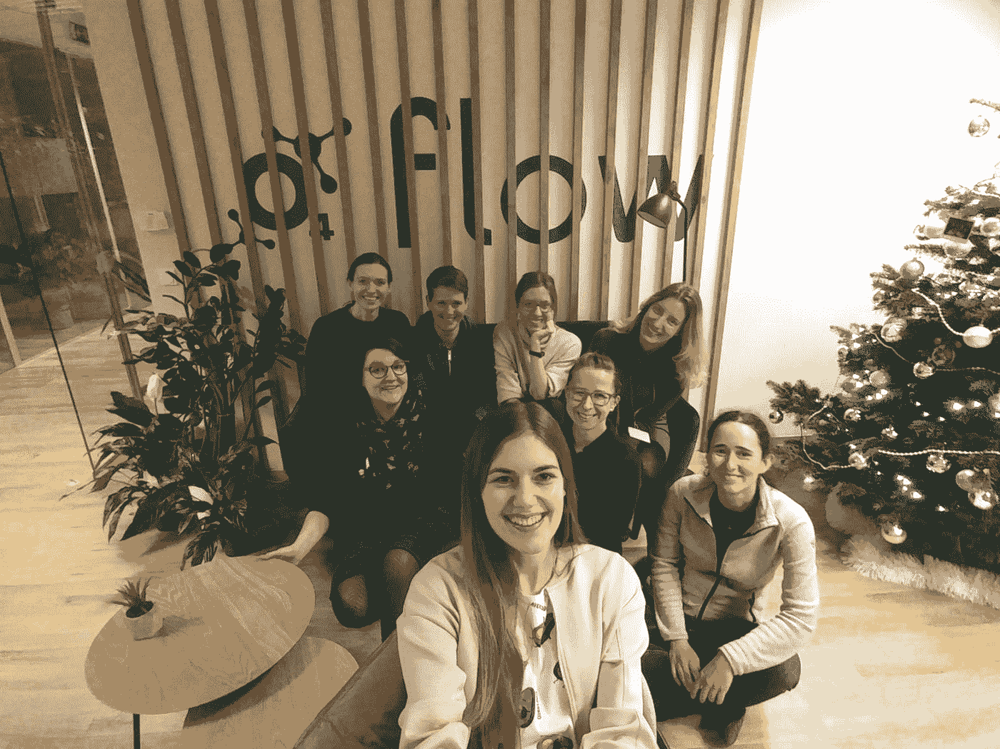

# 基于声音的鸟类分类

> 原文：<https://towardsdatascience.com/sound-based-bird-classification-965d0ecacb2b?source=collection_archive---------7----------------------->

## 一群波兰妇女如何利用深度学习、声学和鸟类学对鸟类进行分类

你有没有想过你刚听到唱歌的那只鸟的名字？一群来自机器学习妇女数据科学组织波兰分会的妇女不仅思考了这个问题，还决定自己创造一个解决方案，能够根据鸟类发出的声音来检测它们的种类。



拥有 Python 经验的女性数据科学家、博士生、鸟类学家、数据分析师和软件工程师加入了一系列为期两周的冲刺，共同致力于该项目。

该项目旨在合作解决现实生活中的问题，机器学习可以帮助解决数据科学项目的典型结构，包括数据研究和分析、数据准备、模型创建、结果分析(或模型改进)和最终演示。

经过几周的工作，该小组已经成功地建立了一个解决方案，在测试样本上预测正确的鸟的名字，准确率为 87%**。**

**你对已经建成的解决方案好奇吗？我们邀请你进入一个鸟鸣的世界。**

> ****小鸟的问题****

**鸟鸣的分析和分类是一个非常有趣的问题。**

**鸟类有多种声音，不同的声音有不同的功能。最常见的是歌曲和“其他声音”(如通话类型)。**

**这首歌是“更漂亮的”——一种有旋律的声音，由于这种声音，鸟儿可以标记它们的领地并找到伴侣。通常比“打电话”复杂得多，时间也长得多。**

**呼叫型语音包括接触型、引诱型和报警型语音。接触和吸引的叫声用于在飞行或觅食时将鸟类保持在一个群体中，例如在树梢上，警告鸟类警惕(例如当捕食者到来时)。最常见的是这些简短的声音。**

**示例:**

****

***大山雀***

*   **这首歌是一首简单明快的韵文，带有轻微的机械音，如*“te-ta te-ta te-ta”*或不同重音的三音节、*“te-te-ta te-ta te-ta te-ta”***

**[样本](https://www.xeno-canto.org/463492)**

*   **这个电话有丰富的曲目。欢快的*“萍萍”*声音，欢快的*“丝嘟嘟嘟嘟”*还有叽叽喳喳的*“忒突突”*。在秋天你经常可以听到略带质疑、比较害羞的“*te te tiuh”*。他发出嘶哑的爆裂声*【云-云-云】*警告道。坡道让森林充满了持久的穿透力*“te-te-te-te-te”。***

**[样品](https://www.xeno-canto.org/464650)**

> **为什么基于声音的鸟类分类是一项具有挑战性的任务？**

**你会遇到很多问题:**

*   **背景噪音—尤其是在使用城市中记录的数据时(例如城市噪音、教堂、汽车)**
*   **多标签分类问题——当许多物种同时歌唱时**
*   **不同类型的鸟鸣(如前所述)**
*   **物种间的差异——生活在不同地区或国家的同一物种之间的鸟鸣声可能存在差异**
*   **数据集问题—由于一个物种比另一个物种更受欢迎，数据可能非常不平衡，有大量不同的物种，记录可能有不同的长度和质量(音量、清洁度)**

****

> ****那么，过去的问题是如何解决的？****

**仅仅通过它们的歌声来识别鸟类可能是一项困难的任务，但这并不意味着这是不可能的。但是如何处理这些问题呢？**

**为了找到答案，需要深入研究论文，并发现大多数工作恰巧是由各种人工智能挑战发起的，如 [**BirdCLEF**](https://www.imageclef.org/BirdCLEF2019) 和 [**DCASE**](http://dcase.community/challenge2019/index) 。幸运的是，这些挑战的获胜者通常会描述他们的方法，所以在查看了排行榜后，我们获得了一些有趣的见解:**

*   **几乎所有获奖的解决方案都使用了*卷积神经网络*(CNN)或*递归卷积神经网络* (RCNNs)**
*   **基于 CNN 的模型和肤浅的基于特征的方法之间的差距仍然相当大**
*   **即使许多记录相当嘈杂，CNN 在没有任何额外的噪音消除的情况下工作良好，许多团队声称噪音降低技术没有帮助**
*   ***数据增强技术*似乎被广泛使用，尤其是用于音频处理的技术，如时间或频率偏移**
*   **一些获奖团队成功地用*半监督学习方法*(伪标记)接近它，一些团队通过模型集成增加 AUC**

**但是，当我们只有声音记录时，如何应用 CNN，即旨在从图像中提取特征以分类或分割图像的神经网络？**梅尔频率倒谱(MFCC)就是答案。****

**fmf**

```
SOUND_DIR='../data/xeno-canto-dataset-full/Parusmajor/Lithuania/Parusmajor182513.mp3'

*# Load the mp3 file*
signal, sr = librosa.load(SOUND_DIR,duration=10) *# sr = sampling rate**# Plot mel-spectrogram*
N_FFT = 1024         
HOP_SIZE = 1024       
N_MELS = 128            
WIN_SIZE = 1024      
WINDOW_TYPE = 'hann' 
FEATURE = 'mel'      
FMIN = 1400 

S = librosa.feature.melspectrogram(y=signal,sr=sr,
                                    n_fft=N_FFT,
                                    hop_length=HOP_SIZE, 
                                    n_mels=N_MELS, 
                                    htk=**True**, 
                                    fmin=FMIN, 
                                    fmax=sr/2) 

plt.figure(figsize=(10, 4))
librosa.display.specshow(librosa.power_to_db(S**2,ref=np.max), fmin=FMIN,y_axis='linear')
plt.colorbar(format='**%+2.0f** dB')
plt.show()
```

****

**mel 光谱图示例**

> **但是它是什么，它是如何工作的？**

**我们听到的每一个声音都是由多个声音频率同时组成的。这就是音频听起来“低沉”的原因。**

**频谱图的诀窍是在一张图中同时显示这些频率，而不是像波形那样只显示振幅。Mel scale 是一种声音音高的音频音阶，对于听众来说，这些音高似乎彼此距离相等。这背后的想法与人类的听觉方式有关。当我们将这两个想法联系起来时，我们得到了一个修改的频谱图(Mel-频率倒谱),它简单地忽略了人类听不到的声音，并标出了最重要的部分。**

**创建声谱图的音频长度越长，图像上的信息就越多，但模型也会变得越拟合。如果您的数据有很多噪音或静音，那么持续 5 秒钟的音频可能无法捕捉到所需的信息。因此，决定从 10 秒钟的持续音频中创建图像**(它将最终的模型精度提高了 10%！)**。由于鸟儿以高频歌唱，所以应用了高通滤波器来消除无用的噪声。**

****

**信息不足(无声)且主要是噪音的 5s 光谱图示例**

> ****该做模特了！****

**在使用高通滤波从 10 秒持续音频文件中创建 mel 频谱图后，数据被分成**训练(90%)、验证(10%)和测试集(10%)。****

```
IM_SIZE = (224,224,3) 
BIRDS = ['0Parus', '1Turdu', '2Passe', '3Lusci', '4Phoen', '5Erith',
'6Picap', '7Phoen', '8Garru', '9Passe', '10Cocco', '11Sitta','12Alaud', '13Strep', '14Phyll', '15Delic','16Turdu', '17Phyll','18Fring', '19Sturn', '20Ember', '21Colum', '22Trogl', '23Cardu','24Chlor', '25Motac', '26Turdu']
DATA_PATH = 'data/27_class_10s_2/'
BATCH_SIZE = 16
```

**内置的 Keras 库数据生成器负责所有光谱图的数据扩充和标准化。**

```
train_datagen = ImageDataGenerator(preprocessing_function=preprocess_input,  
                                   width_shift_range=0.2,
                                   height_shift_range=0.2,
                                   shear_range=0.2,
                                   zoom_range=0.1,
                                   fill_mode='nearest')train_batches = train_datagen.flow_from_directory(DATA_PATH+'train',classes=BIRDS, target_size=IM_SIZE, class_mode='categorical', shuffle=**True**,batch_size=BATCH_SIZE)

valid_datagen = ImageDataGenerator(preprocessing_function=preprocess_input)valid_batches = valid_datagen.flow_from_directory(DATA_PATH+'val',classes=BIRDS,target_size=IM_SIZE, class_mode='categorical', shuffle=**False**, batch_size=BATCH_SIZE)test_datagen = ImageDataGenerator(preprocessing_function=preprocess_input)test_batches = test_datagen.flow_from_directory(DATA_PATH+'test', classes=BIRDS,target_size=IM_SIZE,class_mode='categorical', shuffle=False,batch_size=BATCH_SIZE)
```

**最终模型建立在 **EfficientNetB3** 和 27 个不同类别(鸟类)的基础上，具有 Adam 优化器、分类交叉熵损失函数和平衡的类别权重。学习率在高原上降低。**

```
*# Define CNN's architecture* net = efn.EfficientNetB3(include_top=**False**,                       weights='imagenet', input_tensor=**None**,                        input_shape=IM_SIZE) x = net.output 
x = Flatten()(x) 
x = Dropout(0.5)(x) output_layer = Dense(len(BIRDS), activation='softmax', name='softmax')(x) 
net_final = Model(inputs=net.input, outputs=output_layer)      net_final.compile(optimizer=Adam(),                  loss='categorical_crossentropy', metrics=['accuracy'])*# Estimate class weights for unbalanced dataset* class_weights = class_weight.compute_class_weight(                'balanced',                 np.unique(train_batches.classes),                  train_batches.classes) # Define callbacks ModelCheck = ModelCheckpoint('models/efficientnet_checkpoint.h5', monitor='val_loss', verbose=0,                               save_best_only=**True**, save_weights_only=**True**, mode='auto', period=1) ReduceLR = ReduceLROnPlateau(monitor='val_loss', factor=0.2,                               patience=5, min_lr=3e-4)
```

****

**解决方案概述—音频数据预处理和神经网络模型**

```
*# Train the model*net_final.fit_generator(train_batches,
                        validation_data = valid_batches,
                        epochs = 30,
                        steps_per_epoch= 1596,
                        class_weight=class_weights, callbacks[ModelCheck,ReduceLR])
```

**最后，该解决方案以 87%的准确率**在测试样本**上预测了正确的鸟的名字，其中:**

*   **11 个班级的 F1 分数超过 90%**
*   **8 个班级的 F1 分数在 70%和 90%之间**
*   **2 个班级的 F1 分数在 50%和 70%之间**
*   **6 个班级的 F1 分数低于 50%。**

****

**神经网络模型的分类报告**

**如果您有兴趣**在 jupyter 笔记本上查看代码**，您可以在这里找到它:**

**[](https://github.com/m-kortas/Sound-based-bird-species-detection/blob/master/medium.ipynb) [## m-kortas/基于声音的鸟类探测

github.com](https://github.com/m-kortas/Sound-based-bird-species-detection/blob/master/medium.ipynb) 

作者:

[https://medium.com/@magdalenakortas](https://medium.com/@magdalenakortas)

[https://medium.com/@agnieszkamikolajczyk](https://medium.com/@agnieszkamikolajczyk)**