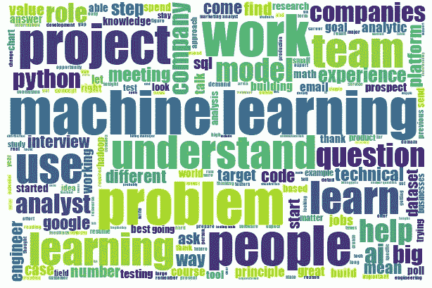
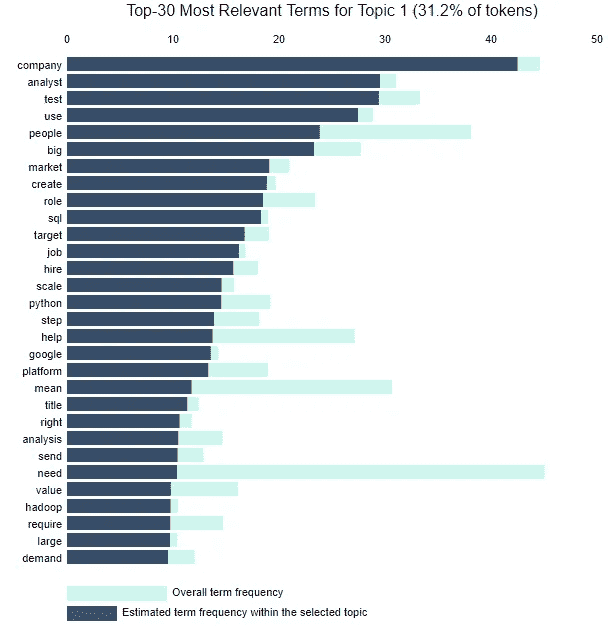
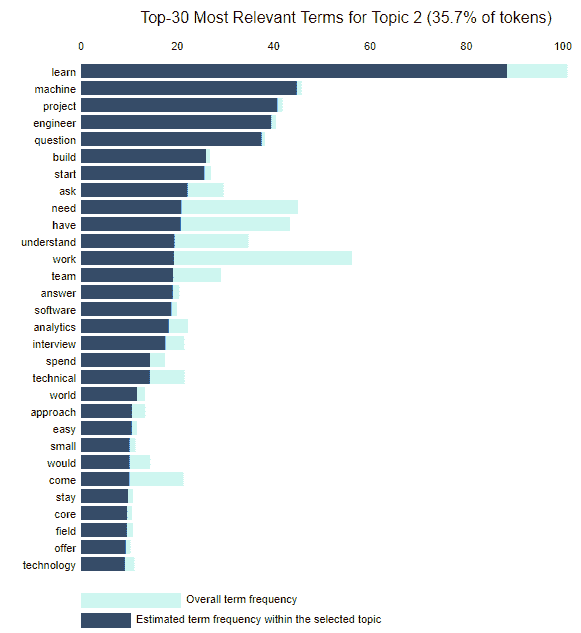
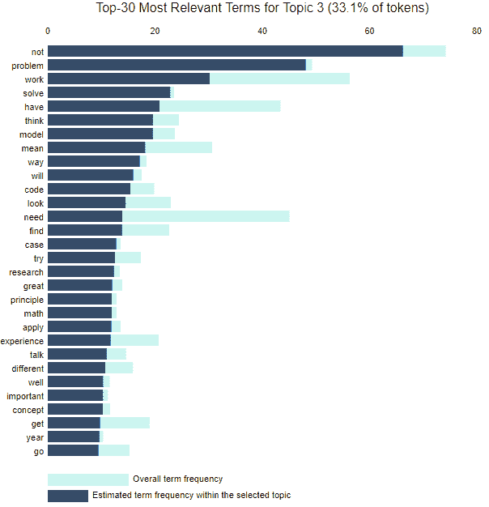

# 消息来源一致认为:数据科学技能超越了数据

> 原文：<https://towardsdatascience.com/sources-agree-data-science-skills-go-beyond-data-4cd9057960c4?source=collection_archive---------60----------------------->

## 数据科学有什么神奇的技能组合？让我们用数据科学来找出答案。

马里乌斯·马萨拉尔在 [Unsplash](https://unsplash.com/?utm_source=unsplash&utm_medium=referral&utm_content=creditCopyText) 上的照片

正如数据科学爱好者所知，除了技术方面，在这个领域还有很多东西可以超越。数据专业人员需要广泛的技能，远远超出数据处理和分析的技术层面。

本周的 Alter Everything 播客节目展示了数据和分析顾问卡琳·琼斯和与卡琳一起工作的数据爱好者宁妮·哈根森。他们的谈话强调了人际技能、沟通能力和商业头脑对于数据科学和分析的成功至关重要。

那些技能都是什么？为了探索围绕这个技能集的在线对话，我决定收集和分析一些数据，很自然地，受到这个奇妙的[主题](https://community.alteryx.com/t5/Data-Science/Getting-to-the-Point-with-Topic-Modeling-Part-1-What-is-LDA/ba-p/611874) [建模](https://community.alteryx.com/t5/Data-Science/Getting-to-the-Point-with-Topic-Modeling-Part-2-How-to-Configure/ba-p/613596)三部曲的启发(第 3 部分即将推出！).这似乎是一个有趣的机会，可以将 Alteryx Designer 的主题建模应用到人们在互联网上讨论的数据科学技能集上。([主题建模](https://help.alteryx.com/current/designer/topic-modeling-tool)是 [Alteryx 智能套件](https://community.alteryx.com/t5/Analytics/Unleashing-Advanced-Analytics-with-the-Alteryx-Intelligence/ba-p/574803)的一部分，其中包括一些新的文本挖掘工具。)

# 收集意见

我在 Designer 中构建了一个工作流，从数据科学网站 [KDnuggets](https://www.kdnuggets.com/) 中抓取了 64 篇文章，并标记了“技能”并清理了文本。我还使用了[文本预处理](https://help.alteryx.com/current/designer/text-pre-processing-tool)来快速准备剩余的文本，然后将其发送到[主题建模](https://help.alteryx.com/current/designer/topic-modeling-tool)和[单词云](https://help.alteryx.com/current/designer/word-cloud)工具中。下面的单词 cloud 给了你一些突出思想的预览，但是主题建模让我们挖掘得更深一点。

我让主题建模工具识别这些文章中的三个主要主题。你肯定应该阅读[关于这个过程如何工作的所有细节](https://community.alteryx.com/t5/Data-Science/Getting-to-the-Point-with-Topic-Modeling-Part-1-What-is-LDA/ba-p/611874)，但简单来说:这是一种无人监督的方法，这意味着我没有预先指定我希望模型找到什么，而是让它自己识别文章文本中的关键思想。这个工具假设我输入的每个文本块都是这三个不同主题的混合，因为我要求三个主题。它根据某些单词一起出现的概率，计算出这些主题在每个组块中是如何表示的。不过，它没有给找到的主题命名；它需要我们弄清楚它的单词组合是什么意思。

# 技术技能等

从这个分析中得出的主题模型可以有多种解释，但这是我所看到的。主题 1 试图描述组织中数据分析师或数据科学家的角色，并提到一些技术术语(Python、SQL、Hadoop)。然而，它还包括“价值”、“市场”和“需求”等概念，这些概念可以反映一名熟练的数据专业人员为组织带来的业务专业知识。对于主题 1 的出现得分较高的一些原始文本块包括:

*   “…数据科学家不仅拥有技术技能，他们还拥有领域专业知识”
*   “了解数据科学和机器学习的基本原理仍然是必需的，但知道如何将它们应用于您的问题更有价值”
*   “记住，我的目标不是发明一种新的机器学习算法；这是为了向客户展示机器学习对他们的业务有或没有的潜力”

主题 2 将“学习”作为其最相关的术语，“机器”排在第二位，因此快速的结论是，主题 2 反映了机器学习技能对于数据科学的重要性。然而，更仔细的研究表明，也许“学习”也可以用另一种方式来解释。主题 2 中得分较高的部分文本包括:

*   “除了课堂学习，你还可以通过构建应用程序、创建博客或探索数据分析来实践你在课堂上学到的知识，从而让你学到更多知识”
*   “沟通问题比技术问题更难”
*   “如果你被困在一个问题上，坐着盯着代码也许能解决问题，也许不能。相反，用语言和队友交流。”

本主题中包含的其他一些术语是“问题”、“理解”、“团队”、“方法”和“提议”这个主题似乎有一个数据专业人员持续学习和技能发展的主题。

最后，主题 3 看起来代表了技术技能和解决问题的交叉，术语“问题”、“解决”、“思考”、“模型”和“代码”显示出高度的相关性。“数学”也出现在这里，“研究”和“概念”也是如此，暗示了一些在数据领域有用的更具体的智力技能。

*   “机器学习看起来很神奇。在某些情况下的确如此。但在事实并非如此的情况下，承认这一点很重要。”
*   “数据点太多，人类无法理解。这是一个典型的因信息过量而死亡的案例
*   “沟通技巧”和“数据可视化”
*   “花时间思考公司的产品，你的工作如何影响业务的核心，以及你将如何开展工作来解决一个重要问题的一些想法”
*   “如果你被所需的技能压得喘不过气来，这完全没关系(我也是！)"

# 用于分析的人类环境

是的，这确实是一个很长的技能列表！这一快速分析表明，在关于数据科学技能的讨论中，反复强调的不仅仅是技术技能，还有将数据分析置于人类和业务环境中的能力。如果人类没有能力找出正确的问题解决策略、要问的问题、要用的方法以及对结果的解释，那么最好的模型或分析就没有多大意义。

在本周的《改变一切》一集中，了解卡琳和宁妮如何看待数据驱动的公司文化和职业成功所需的技能。

*原载于* [*Alteryx 社区*](https://community.alteryx.com/t5/Data-Science/Sources-Agree-Data-Science-Skills-Go-Beyond-Data/ba-p/613738) *。在* [*Alteryx 数据科学门户*](http://alteryx.com/data-science) *找到更多资源。*