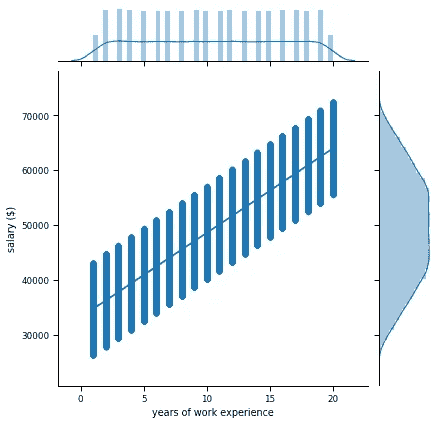

# 训练数据中非预期偏差的来源

> 原文：<https://towardsdatascience.com/sources-of-unintended-bias-in-training-data-be5b7f3347d0?source=collection_archive---------41----------------------->

图片来源:@ un splash 上的 Fionn Claydon

## 使用合成数据揭示非预期偏差来源的实例

几乎每周，媒体都会强调输出有偏差的机器学习模型的例子。随着歧视成为公众讨论的焦点，社会不平等是如何反映在 ML 模型的有偏见的输出中的？在典型的数据科学管道的每一步做出的决策，从制定问题到收集数据、培训和部署模型，最终都会伤害下游用户。我们的目标是对不同来源的偏差如何反映在数据中有一个实际的理解。为了实现这一目标，我们将使用合成数据构建示例，以说明不同的偏差源如何影响最大似然输出及其基本特征。指导原则是，理解一件事的好方法是自己去建造它！

我们将在分类的背景下考虑有偏见的数据集，即预测二元目标结果的任务(标签):“信用卡要约会被接受还是拒绝？”、“申请人还不还贷？”。预测模型使用特定申请的特征(银行对申请人的了解)来预测相关标签。构建预测模型的工作流程是将具有可能与预测标签相关的要素的数据集放在一起，并训练一个模型，该模型以最高的精度预测训练数据集中的标签。

对于许多数据科学家来说，进行预测建模的目标是训练一个可容忍复杂性的模型，该模型在预测标签时足够准确。近年来，许多人指出，这种优化模型准确性的方法模糊了为所有用户建立公平、公正模型的目标。有许多模型是准确的，但却导致了非常有害的结果，特别是针对历史上面临歧视的受保护特征(例如，年龄或种族):从总是预测男性申请人更适合这份工作的人力资源应用程序，到预测黑人更有可能再次犯罪的保释模型，到建议较少患病的白人而不是更多患病的黑人进行预防性 care⁴.的健康保险模型许多国家的法律将一个人的受保护属性定义为种族、性别、年龄、性取向、身体或精神残疾和婚姻 status⁵ ⁶。在受保护的属性(性取向)方面，特权群体(如男性)和非特权群体(如女性或 LGBTQ)之间存在歧视。评估几个受保护属性交叉的群体的结果也很重要，例如黑人 LGBTQ 个人与白人男性。

# 我们如何判断一个模型是否有意想不到的偏差？

探索性数据分析(EDA)和公平性度量是重要的工具。如果一个群体的标签比例存在较大差异(例如，只有 10%的阳性标签是女性)，EDA 可以警告我们，并激励进一步的调查。公平 metrics⁷ ⁹允许我们为模型设置一个期望的输出，并检查这个输出是否跨组实现。这里值得注意的一点是，公平指标不可能都满足 simultaneously⁷.我们将使用两个常用的公平指标:人口均等和机会均等。人口统计均等要求分配的标签独立于群体成员。该指标计算为非特权组和特权组标签的比率。当概率独立于群体成员时，人口统计奇偶数为 1；根据美国 EEOC⁸倡导的 80%规则的概括，0.8 的比率是合理的，较小的数字表明存在偏差。平等机会指标强调了一个事实，即积极的标签通常是一个理想的结果(“一个机会”，如“抵押贷款获得批准”)，因此侧重于比较各组之间的真实积极率(TPR):积极标签被正确预测为积极的比率。TPR 度量具有适应比较组的不同基线率的额外好处，因为它询问已经发现的阳性标记的预期数量的百分比。

考虑以下贷款申请评估的男性和女性申请人的例子。绿色的人被批准，而红色的人被拒绝。

顶行，实际标签。底部行，预测标签

计算预测标签的人口统计奇偶校验(DP)度量:

DP 男性= 4 / 6

DP 女性= 2 / 4

真实阳性率(TPR)指标:

TPR 男= 3 / (3 + 1) = 3 / 4，即 3 x 真阳性，1 x 假阴性

TPR 阴性= 1 / (1 + 1) = 1 / 2，而 1 倍真阳性和 1 倍假阴性

# 偏见的常见来源是什么？

我们将深入研究的五个领域(总部位于 on⁹)是:

1.  委托书
2.  有限的功能
3.  倾斜样本
4.  有污点的例子
5.  样本大小差异

我们的出发点是一个简单的场景。想象一下，一家人力资源公司在考虑给应聘者提供什么样的待遇时，试图预测他们的薪水。该公司已经收集了大约 10 万个数据点。对于每个申请人，公司都知道他们以前的工作类型(后端或前端开发人员)、工作经验年数、性别、额外的认证和工资，为了简单起见，他们将这些限制在 52k 以下或以上。我们使用简单的线性回归模型构建了这个数据集:

*工资= c_exp *年 _ 经验+c _ Job * Job+c _ Cert * Cert+c _ Noise * Noise*

其中 *c_exp* ， *c_job* ， *c_cert* ， *c_noise* 是决定每个变量对结果*薪金*的影响的系数

*年数 _ 经历*:申请人的工作经历年数

*证书*:二进制特征编码申请人是否有额外证书

*工作*:二进制特征编码，不管申请人有后端还是前端开发工作

*噪音*:一个随机数，表明还有其他因素决定*工资*，而我们没有包括这些因素

我们从大约 10 万名申请者的合成数据集开始。以下是数据的前几行:

最初，男性和女性的工资没有差别，而后端开发人员的平均工资略高于前端工程师。

第一行，最初，基于性别、证书或工作类型的平均工资没有差别。最后一行，工资随着工作年限的增长而线性增长。误差线为 SD。

标签的分布并不不平衡。薪资高于和低于门槛值的申请人数量在不同性别之间具有可比性。

相似数量的男性和女性的工资高于和低于初始数据集中的门槛值。

# 委托书

一个很难避免的偏见来源是与性别(代理)等受保护属性相关的特征。在我们的数据集中，*性别*和*认证*之间的相关性为 0.7。在真实的数据集中，大多数变量都与性别有一定的关联(例如，喜欢的运动)。移除所有相关变量是不切实际的，因为我们将没有数据来训练模型。如果与性别等变量相关的特征没有被删除，那么模型可以使用它们进行分类，从而可能导致有偏差的输出。简单地删除*性别*变量是无效的，因为模型仍将使用代理变量中可用的性别信息来基于性别进行分类。此外，从数据集中移除性别信息使得不可能通过计算公平性度量来评估模型。因此，更现实的设置是根据与受保护的特征(例如不同程度的性别)相关的特征来训练模型，尽管可能不直接根据性别信息。

证书是性别信息的代理。

# 有限的功能

在为全体人口建立的模型中，一种常见的测量偏差是缺乏少数群体的信息特征。我们在下面的例子中说明了这种类型的偏见，其中每个人的工资仍然是工作类型、工作经验年数和证书的函数，但是对于一定比例的后端开发人员来说，工资是由她们所知道的软件工具和框架决定的(kubernetes！).我们的例子说明了这样一种情况，女性比男性需要知道更多的框架，因为她们不太可能被潜在的雇佣。我们改变了 70%有 7 到 15 年工作经验和后台工作的女性的工资。改变这样一个特定的用户群可以让我们检查分析工具能在多大程度上找到他们。对于这些女性，我们从统一的分布中随机选取她们的工资，而事实上，如果我们收集了关于软件框架的信息，工资将是完全指定的。

比较变革前(橙色)和变革后(绿色)妇女的工资分配情况。蓝色表示所有女性的工资分配。

我们从探索性数据分析中了解到，在工资发生变化后，除了妇女的平均工资略有下降之外，不同变量的工资分布没有显著变化。

在进行了一些探索性的数据分析后，我们之前介绍的工资变化并不明显

此外，标签的分布在男性和女性之间也同样平衡(女性有 42%的工资高于门槛，而男性有 58%)。这个特定的数据集在我们试图预测的标签分布方面是平衡的，所以我们不在样本大小不一致的情况下，我们将在下面更详细地描述。这就是为什么使用实际的公平性度量是模型构建过程中的一个重要步骤。

低于和高于工资门槛的男性和女性申请人的数量相当接近

有了这个数据集，我们现在正在训练一个模型来预测申请人的收入是低于还是高于 52K(门槛)。我们将数据集分为训练集和测试集，在训练集上训练模型，在测试集上评估模型。在修改后的数据集上训练的最小调整 XGBoost 模型在预测申请人的工资是高于还是低于临界值时有 86%的准确性。让我们来计算公平指标:人口均等和机会均等。

平等机会指标强调了男女之间的差距，TPR=0.77。在我们修改过的数据集的上下文中，正如我们从用于生成数据的线性模型中所预期的那样，工作年限和工资之间存在线性关系。在改变了一部分女性应聘者的薪资后，薪资与工作年限的关系就发生了变化。对于有 7 到 15 年工作经验的申请者，*薪资*可以取更大范围的值。该模型将很难像以前一样准确地预测该群体的结果，从而产生更多的错误，从而导致 TPR 这一平等机会指标的值更低。

左图，工作年限(分布在图的上边缘)和薪资(分布在右边缘)之间是线性关系。右图:在修改了 70%具有 7 至 15 年工作经验的女性的工资后，该群体中的申请人可能的工资范围更广，从而降低了模特的表现。

合成数据集，如我们上面创建的数据集，在测试不同的去偏置方法时非常有用。在上述案例中，对于来自非特权群体的申请人而言，数据集的特征有限，标准探索性数据分析在识别模型性能不佳方面不如公平性指标有帮助。一旦我们使用了额外的指标，并确定了有限的功能问题，接下来的任务就是如何提高这组申请人的预测性能。现实生活数据集的另一个困难来源是，许多偏见来源将同时存在，从而使建立公平模型的任务变得困难。最后，值得记住的是，我们到目前为止探索的偏见的来源更容易诊断，因为它们导致模型对特定群体⁰.的预测结果不太准确最困难的任务是识别模型何时做出完全准确的预测，但这些预测反映了我们社会中存在的不平等。在机器学习方面，除了数据本身，还有许多其他的偏见来源。评估模型预测的多元化团队和对这些预测的批判态度对于防止歧视的自动传播是绝对必要的。

在第 2 部分中，我们将看看其他来源的偏见:偏斜的样本，样本大小的差异和污染的例子。

[1] H. Suresh，J.V. Guttag，理解机器学习的意外后果的框架，【https://arxiv.org/abs/1901.10002 

[2]路透社，亚马逊废弃显示对女性有偏见的秘密 AI 招聘工具，[https://www . Reuters . com/article/us-Amazon-com-jobs-automation-insight/Amazon-scraps-secret-AI-recruiting-tool-show-bias-against-women](https://www.reuters.com/article/us-amazon-com-jobs-automation-insight/amazon-scraps-secret-ai-recruiting-tool-that-showed-bias-against-women-idUSKCN1MK08G)

[3] ProPublica，机器偏见，[https://www . ProPublica . org/article/Machine-Bias-risk-assessments-in-criminal-pending](https://www.propublica.org/article/machine-bias-risk-assessments-in-criminal-sentencing)

[3] Z. Obermeyer，B. Powers，C. Vogeli，S. Mullainathan，剖析用于管理人口健康的算法中的种族偏见，DOI: 10.1126/science.aax2342，【https://science.sciencemag.org/content/366/6464/447】T4

[4] A .纳拉亚南，教程:21 个公平定义及其政治，[https://www.youtube.com/watch?v=jIXIuYdnyyk](https://www.youtube.com/watch?v=jIXIuYdnyyk)

[5]2010 年《平等法》，[https://www . citizensadvice . org . uk/law-and-courts/discrimina tion/about-discrimina tion/Equality-Act-2010-discrimina tion-and-your-rights/](https://www.citizensadvice.org.uk/law-and-courts/discrimination/about-discrimination/equality-act-2010-discrimination-and-your-rights/)

[6] S. Barocas，A.D. Selbst，大数据的不同影响，[http://ssrn.com/abstract=2477899,](http://ssrn.com/abstract=2477899,)2014 年

[7]美国平等就业机会委员会(EEOC)，雇员选择程序统一准则，1979 年 3 月 2 日

[8] M. Hardt，[机器学习中的公平性](https://fairmlbook.org/tutorial1.html)，NIPS 2017 年教程在[https://mrtz.org/nips17/#/28](https://mrtz.org/nips17/#/28)

[9] S. N. Goodman，S. Goel，M. R. Cullen,《机器学习、健康差异和因果推理》,《内科学年鉴》, DOI:10.7326/M18–3297