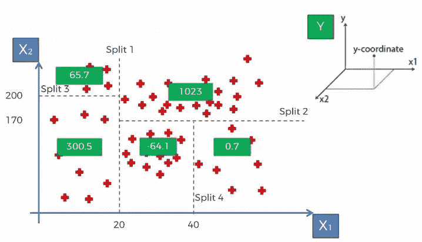
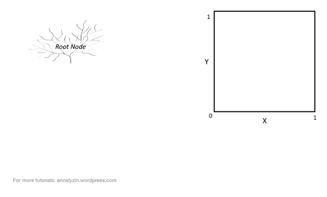
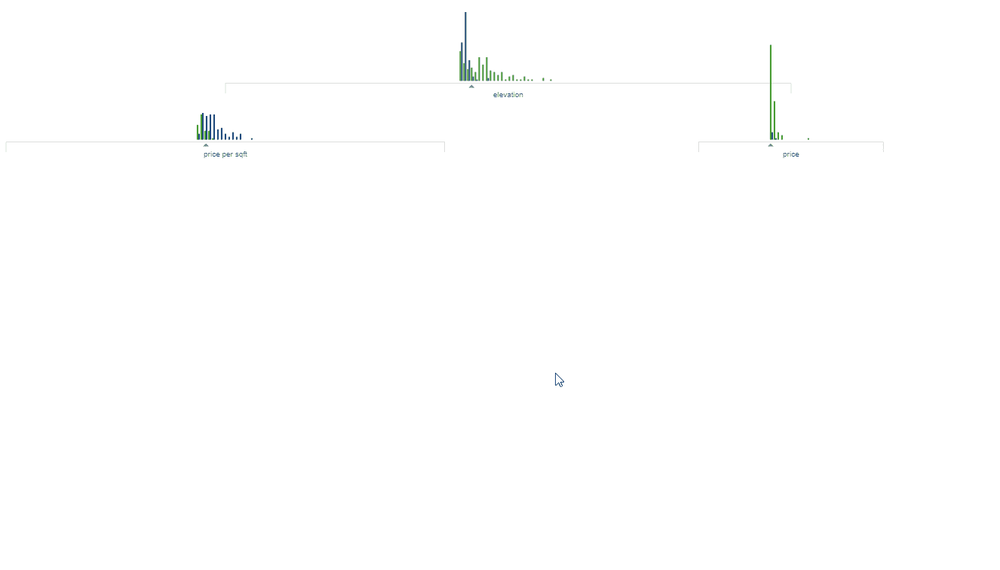
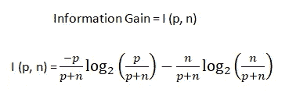
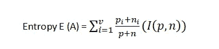
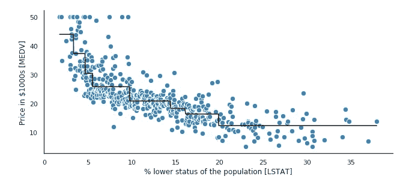

# 播下决策树回归的种子

> 原文：<https://towardsdatascience.com/sowing-the-seeds-of-decision-tree-regression-2bb238dfd768?source=collection_archive---------33----------------------->


来自 [Dribbble](https://dribbble.com/shots/14102810-Treehouses/attachments/5724704?mode=media) 的图片由 [Eric Nyffeler](https://dribbble.com/doe_eyed)

## 机器学习系列第五篇

在本文中，我们将讨论决策树，一种监督学习算法，通常被称为 CART，可用于回归和分类问题。

顾名思义，这种算法的主要作用是使用树形结构做出决策。为了找到解决方案，决策树根据预测数据对结果变量做出连续的、分层的决策。决策树通常在处理非线性数据时使用。



作者图片

由于其简单性以及易于理解和实现的事实，它们被广泛应用于大量行业。

# **熟悉一些新术语**

现在，在我们进一步讨论之前，理解一些与算法相关的重要术语很重要。决策树由许多节点组成，每个节点代表一个特定的特征。决策树的第一个节点通常被称为根节点。



图像由 [Algobeans](https://algobeans.com/2016/07/27/decision-trees-tutorial/) 拍摄

树的深度是树中除根节点之外的总级别数。一个分支表示一个决策，可以被视为不同节点之间的链接。一片叶子告诉你每个样本属于哪一类。

# **决策树是如何工作的**

决策树逐步将数据集划分为小的数据组，直到它们达到足够小的集合，可以用某个标签来描述。同时，一个相关的决策树被增量开发。

决策树对数据采用自顶向下的方法。二叉树的分裂可以是二进制的，也可以是多进制的。该算法将数据划分为一组矩形，并在每个矩形上拟合模型。矩形(分割)的数量越多，复杂性就越大。



图片由 [r2d3.us](http://r2d3.us) 提供

使用超级复杂的决策树的一个缺点是，由于模型对训练数据的学习非常好，因此很可能会陷入过度拟合的情况，从而难以推广到新的未知数据。

然后，它检查数据集的所有特征，通过将数据分成越来越小的子组来找到最佳结果，直到树结束。

# **信息增益和熵**

信息增益基于在属性上分割数据集后熵的减少。熵控制决策树决定如何分割数据。



构建决策树的目标是找到返回最高信息增益的属性。



现在，我们将通过构建决策树模型来实际应用我们所学的知识。

> *你可以在我的* [*GitHub*](https://github.com/ashwinraj-in/MachineLearningTutorials/blob/master/DecisionTree.ipynb) *手柄上访问用于构建这个决策树模型的完整代码和其他资源。*

## **1。导入库**

构建模型的第一步是导入必要的库。Pandas、Numpy 和 Matplotlib 是最常用的库，分别用于数据操作、科学计算和在图形上绘制数据。

```
#Import the Libraries and read the data into a Pandas DataFrameimport pandas as pd
import numpy as np
import matplotlib.pyplot as plt
import seaborn as snstest=pd.read_csv("california_housing_test.csv")
train=pd.read_csv("california_housing_train.csv")
```

如今，Seaborn 还被广泛用于制作 python 中的统计图形。导入必要的库之后，我们的下一步是将数据集加载到我们的 Jupiter 笔记本中。在这里，我使用谷歌合作实验室笔记本进行演示。

## **2。数据可视化和特征选择**

在成功地将数据加载到我们的笔记本之后，我们的下一步是可视化数据。为了找到各种特征之间的任何相关性，可视化数据是很重要的。

```
#Visualise the dataplt.figure()
sns.heatmap(data.corr(), cmap='coolwarm')
plt.show()sns.lmplot(x='median_income', y='median_house_value', data=train)
sns.lmplot(x='housing_median_age', y='median_house_value', data=train)
```

此后，选择适当的特征来构建模型。这通常被称为特征工程。特征工程是利用领域知识通过各种数据挖掘技术从原始数据中提取特征的过程。

```
#Select appropriate featuresdata = data[[‘total_rooms’, ‘total_bedrooms’, ‘housing_median_age’, ‘median_income’, ‘population’, ‘households’]]
data.info()data['total_rooms'] = data['total_rooms'].fillna(data['total_rooms'].mean())
data['total_bedrooms'] = data['total_bedrooms'].fillna(data['total_bedrooms'].mean()
```

当数据集中的要素数量很大时，要素选择非常重要。

## **3。拟合模型**

一旦选择了特征，数据集就被分成训练数据和测试数据。这是通过从 sklearn 库中导入 train_test_split 函数来实现的。

```
#Split the dataset into training and testing dataimport train_test_split
X_train, X_test, y_train, y_test = train_test_split(train, y, test_size = 0.2, random_state = 0)y_train = y_train.reshape(-1,1)
y_test = y_test.reshape(-1,1
```

请注意，我们在代码之间调用了库。Python 允许我们在代码之间的任何地方导入库。

```
#Fit the model over training datafrom sklearn.tree import DecisionTreeRegressor
dt = DecisionTreeRegressor()
dt.fit(X_train, y_train)
```

之后，我们从 Scikit 学习库中导入决策树模型，并初始化我们的回归模型。然后，我们将数据放入模型中。这样我们就成功地建立了决策树模型。

# **缺点**

与决策树相关的一个主要问题是，它会遭受高方差，即数据中的一个小变化会导致一组完全不同的分裂。类似地，在一个类支配另一个类的情况下，它们也会创建有偏向的树。



图片来自[准备论坛](https://preparingforgre.com/item/153325)

决策树被限制在边界内，并且通常寻找局部最优值，而不是全局最优值。然而，这些缺点可以很容易地使用集合方法来纠正，如 bagging 和 boosting，我们将在接下来的帖子中讨论。

至此，我们已到达本文的结尾。我希望你会发现这篇文章内容丰富。如果你有任何问题，或者如果你认为我有任何错误，请联系我！您可以通过[邮箱](http://rajashwin812@gmail.com/)或 [LinkedIn](http://linkedin.com/in/rajashwin/) 与我联系。