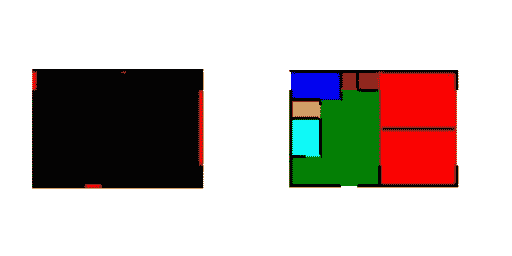
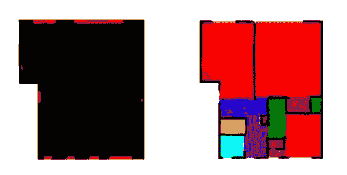
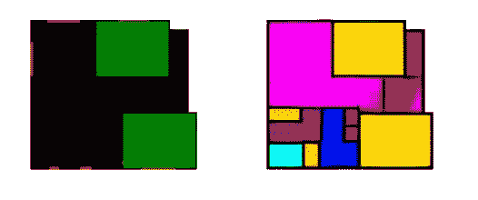
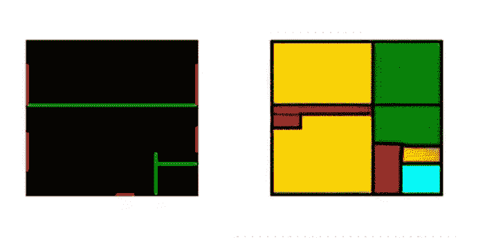

# 空间布局和 GANs

> 原文：<https://towardsdatascience.com/space-layouts-gans-19861519a5e9?source=collection_archive---------13----------------------->

## 支持 GAN 的平面图生成

[***【斯塔尼斯拉斯】夏洛***](https://www.linkedin.com/in/stanislas-chaillou-b1931090/) ***建筑师&数据科学家*** *@* [*太空人 AI*](https://spacemaker.ai/)

图 1: **公寓楼数据集** |来源:作者

在这篇文章中，我们公布了一些我们最近的成果和过去一个季度在航天制造商 AI 的研发部门实施的方法。该项目是许多正在进行的研究计划之一，旨在支持 Spacemaker 的长期愿景。

一个 **部门布局对任何一个建筑师来说都是一项具有挑战性的基本任务。知道如何放置房间，决定它们的大小，找到它们之间的相关邻接，同时定义相关的类型是任何起草者在设计平面图时都要考虑的关键问题。在本文中，**我们建议展示由生成对立神经网络模型(GANs)提供的可能性，以及它们生成相关平面图设计的能力**。简而言之，我们求助于 GAN 模型，更具体地说是 [Pix2Pix](https://phillipi.github.io/pix2pix/) ，在给定一组初始条件&约束的情况下，帮助我们设计房屋平面图。**

# 一、爱与甘

世代对立的神经网络最近提供了人工智能模型创造能力的证据。与任何机器学习模型一样，gan 从提供给它们的数据中学习具有统计意义的现象。然而，它们的结构代表了一个突破:由两个关键模型*生成器*和*鉴别器*组成，GANs 利用两个模型之间的反馈回路来完善它们生成相关图像的能力。鉴别器被训练来从一组数据中识别图像。经过适当的训练，该模型能够区分从数据集中取出的真实示例、来自与数据集无关的“*假的*”图像。然而，生成器被训练来创建类似于来自相同数据集的图像的图像。当发生器创建图像时，鉴别器向其提供反馈。作为响应，发生器会进行调整，以产生更真实的图像。**通过这种反馈循环，GAN 慢慢建立起创建相关合成图像的能力**，将观察到的数据中发现的现象考虑在内。

图 2: **生成对抗性神经网络的架构** | [图像来源](https://medium.freecodecamp.org/an-intuitive-introduction-to-generative-adversarial-networks-gans-7a2264a81394)

*表象&学习*

因为 GANs 对我们来说是一个巨大的机会，知道向他们展示什么输入是至关重要的。我们有机会让模型直接从平面图图像中学习。通过格式化图像，我们可以控制模型将要学习的信息类型。例如，简单地向我们的模型显示地块的形状和相关的建筑物覆盖区，将产生一个能够在给定地块形状的情况下创建典型建筑物覆盖区的模型。为了确保输出的质量，我们将使用我们自己的架构感来管理我们训练集的内容:一个模型的好坏取决于我们给它的数据。

举例来说，下面是一个典型的训练序列(*图 3* ):这个序列是在一天半的训练过程中实现的，显示了我们的一个 GAN 模型如何逐步学习如何为一个住宅单元布置房间和开窗。

图 3: **训练序列** |来源:作者

# 二。数据管理和培训

我们建议将 GANs 应用于平面图生成。如上例所示，GANs，更具体地说是 Pix2Pix，可以被训练来绘制房间布局。通过向 Pix2Pix 提供成对的图像，模型将学习从一个图像到另一个图像的映射。

*下面，我们展示了从我们的一个训练集中获取的图像(图 4)。*

图 4: **训练集样本** |来源:作者

平面图的配色方案|来源:作者

在上面的图像中，左侧图像(输入)用黑色对公寓单元的**足迹进行编码，用红色**对立面开口的**位置进行编码。在右侧，这一对显示了相应的房间布局，房间程序使用上述颜色方案进行了编码。**

# 三。产生

在本章中，**我们展示了三种不同的生成范例，它们都面向起草过程的不同现实**。当建筑师绘制平面图时，约束框定了他/她的设计过程:例如，结构网格的存在决定了墙壁在空间中的位置；在一个给定的地方有一个给定的房间的必要性给整个空间布局带来了压力；在某一点上立面开口的存在定义了房间应该如何设置，等等。

**在设计房屋平面图时，我们已经分离出 3 个主要用例** ( *图 5* )，对应不同的类型约束。

图 5: **3 个用例** |来源:作者

**A) *自由计划*** *生成*简单地解决了用户仅指定:

*   [1]公寓单元的足迹
*   [2]立面开口的位置

**B) *特定于项目的*** *生成*解决了由特定房间类型的布局驱动设计的情况。特别地，用户将指定:

*   [1]公寓单元的足迹
*   [2]立面开口的位置
*   **【3】公寓覆盖区内给定房间的位置**

**C) *针对特定结构的*** *代*解决了由承重元件(如墙和柱)的布置来驱动设计的情况。在这里，用户将指定:

*   [1]公寓单元的足迹
*   [2]立面开口的位置
*   **【3】****承重墙在空间的位置**

## A.自由计划生成

在第一种方法中，**我们希望让我们的模型做出大多数决策，同时用最少的*内部*约束来约束它。**没有结构或房间布置会制约空间中元素的布局；用户将仅指定立面中的开口和公寓占地面积。然后，我们的 GAN 模型将*自由地*规划空间，并通过模仿训练集中发现的属性来布置房间、墙壁和房间之间的开口。

*在*、*下面，我们展示了一些典型的结果(图 6)。*

图 6: **甘生成的结果** |来源:作者

平面图的配色方案|来源:作者

## B.特定于计划的计划生成

在这种方法中，**我们假设生成主要是由特定房间的位置驱动的。**例如，对于一个给定的公寓布局，设计师可能想要定义卧室的位置，并让机器自己负责放置其余的房间。我们支持这种设计逻辑，允许用户在输入(绿色补丁)中输入卧室的大小和位置，以及公寓的占地面积和立面的开口。因此，该模型能够尊重这一初始位置，同时用“*服务于*”空间(程序中应该出现的其他房间)包围卧室。

下面，我们展示了一些典型的结果(图 7)。

图 7:【甘】生成结果 |来源:作者

平面图的配色方案|来源:作者

## C.特定于结构的计划生成

在第三种方法中，**我们考虑承重墙的存在作为初始约束。**通过用绿线标记训练集的输入图像，我们向我们的 GAN 模型发信号通知这些墙壁的存在，并训练它生成关于这些结构元素的房间布局。

*下面，我们展示一些典型的结果(图 8)。*

图 8: **甘生成的结果** |来源:作者

平面图的配色方案|来源:作者

# 四。…向量化…

在最后一步，**中，我们提供了一个简单的管道来矢量化我们的 GAN 输出** ( *图 9* )。需要明确的是，因为光栅图像是我们生成模型的结果，我们需要对这些输出进行后期处理，把它们变成实际的几何图形。上图描述了整个管道。

图 9: **矢量化步骤&流水线** |来源:作者

*阈值处理*

**我们首先设定初始 GAN 输出**的阈值，以提取每个房间的边界，同时跟踪它们各自的程序。使用 OpenCV 中的房间颜色和轮廓选择可以轻松实现这种阈值处理。然而，产生的轮廓是不规则和不准确的，但是程序类型和每个程序在空间中的位置是受尊重的。

*聚类*

接下来，**我们恢复每个房间折线的正交性**，同时使用 X 均值聚类算法将轮廓捕捉在一起。 [*X 均值聚类*](https://codedocs.xyz/annoviko/pyclustering/classpyclustering_1_1cluster_1_1xmeans_1_1xmeans.html) 简单地检查点沿 X 和 Y 方向的分布，并以无监督的方式创建这些点的聚类。然后，每个聚类将生成一条“网格线”，任何相邻点都将被捕捉到该网格线。

*结果*

**下面，我们展示了我们矢量化管道**的结果(*图 10* )。如果在此过程中保留了平面图形状和房间的相对位置，一些更好的细节可能会丢失。

图 10: **矢量化步骤的结果** |来源:作者

平面图的配色方案|来源:作者

# 动词 （verb 的缩写）结论

公寓布局的生成可以极大地受益于一种统计方法。在绘制平面图时，GANs 似乎更适合处理复杂的拓扑问题，并有可能超越或至少补充以前的程序技术。

在本文中，**我们只展示了围绕这个主题的一些变化，并希望在不久的将来看到更多这方面的研究。**使用 GAN 生成图形的最新发展开启了生成类似结果的替代技术，同时比基于光栅的 GAN 技术对生成的几何图形保持更多的控制。