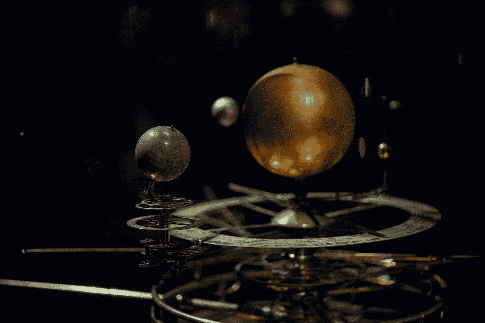
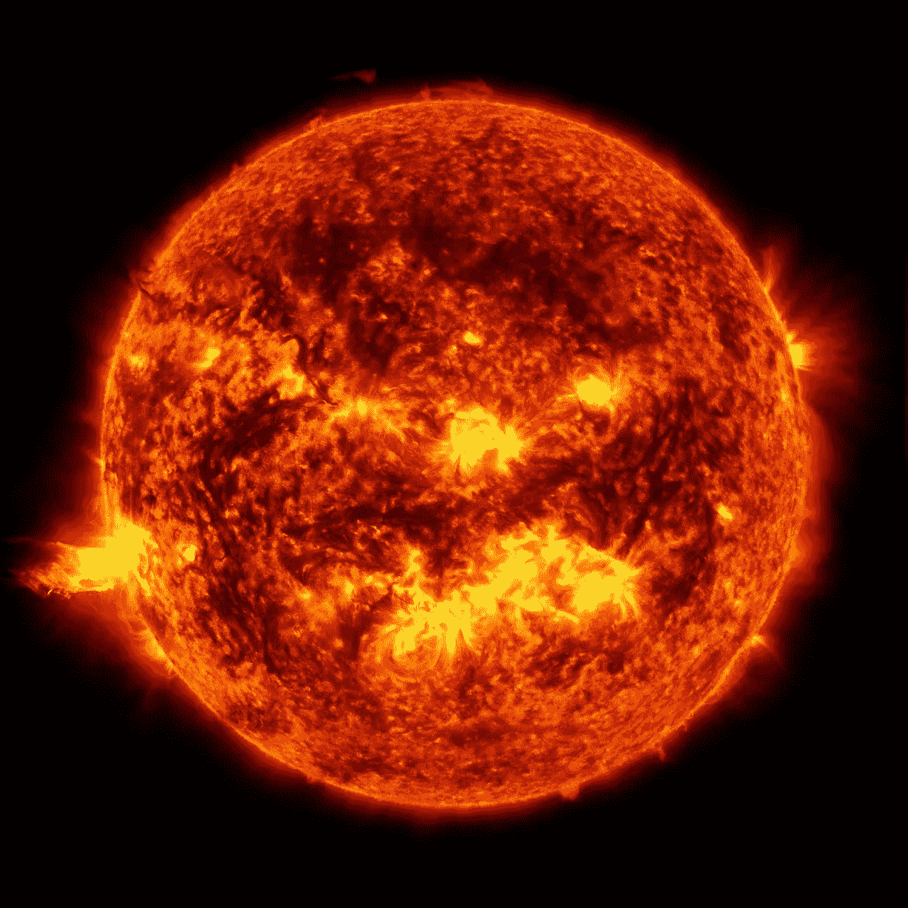
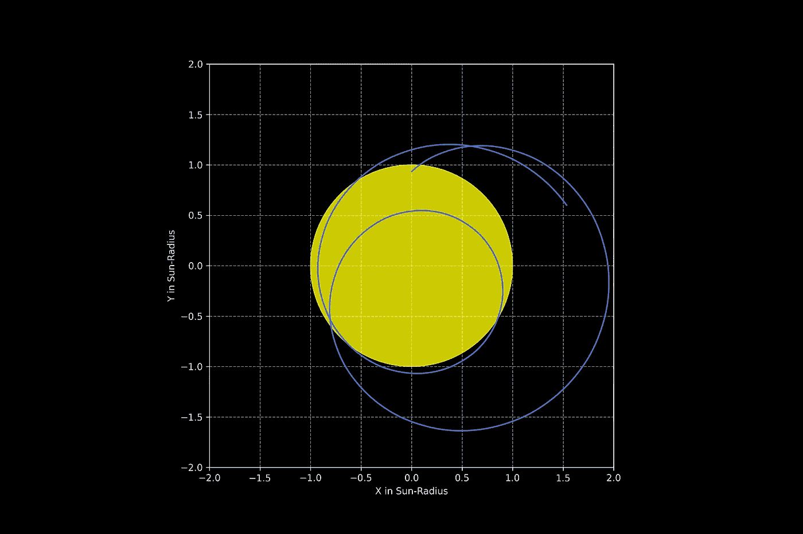

# 用 Python 研究空间科学——看开普勒第一定律

> 原文：<https://towardsdatascience.com/space-science-with-python-2-a-look-at-keplers-first-law-84caa6c75a35?source=collection_archive---------19----------------------->

## [https://towards data science . com/tagged/space-science-with-python](https://towardsdatascience.com/tagged/space-science-with-python)

## Python 教程系列的第二部分



由[罗斯·斯奈登](https://unsplash.com/@rosssneddon?utm_source=medium&utm_medium=referral)在 [Unsplash](https://unsplash.com?utm_source=medium&utm_medium=referral) 上拍摄的照片

## *前言*

这是我的 Python 教程系列“Python 的空间科学”的第二部分。这里显示的所有代码都上传到了[*GitHub*](https://github.com/ThomasAlbin/SpaceScienceTutorial)*上。尽情享受吧！*

## 介绍

> 行星的轨道是一个椭圆，太阳位于两个焦点之一

这是开普勒行星运动定律中的第一条。400 年前，约翰尼斯·开普勒根据他和第谷·布拉尼的研究中的长期观察得出了这些定律。他使用了大量人工确定的行星位置数据，从而得出了自己的结论。想象一下，作为一名数据科学家，有大量打印好的 Excel 表格，没有电脑，只有一些机械数学设备和一些耐心。没有 GPU 优化或者云计算。这是对科学的真正承诺。

但是太阳真的只位于太阳系的中心吗？考虑到牛顿力学定律，我们的地球、小行星、行星以及太阳都围绕着一个共同的重心旋转。太阳包含了太阳系超过 99 %的质量。那么，所谓的太阳系重心(SSB)相对于太阳中心的可能移动*对*有意义吗？今天我们将用我们的 Python 技巧和第一篇教程中的 SPICE 知识来回答这个问题。

## 准备

[上次](https://medium.com/@thomas.albin/space-science-with-python-setup-and-first-steps-1-8551334118f6?source=friends_link&sk=dd1c9a350ad3f618921dc07cbef81e70)我们学习了 SPICE 及其使用所谓的内核计算各种参数的方法。我们使用 SPICE 函数 [furnsh](https://naif.jpl.nasa.gov/pub/naif/toolkit_docs/C/cspice/furnsh_c.html) 加载了必要的内核。每个内核都是单独加载的。然而，较大的项目可能需要加载几十个内核。这将使我们的 Python 代码膨胀，并且很容易忘记自己的代码。为了防止这种情况，SPICE 引入了内核元文件。元文件包含所需内核的相对或绝对路径。对于本教程，每个部分都有自己的元文件，它设置了到 *_kernels* 目录的相对路径。让我们来看看元文件:

kernel_meta.txt —本教程的 SPICE 内核元文件

前 6 行以命令 *\begintext* 开始。下面的文本块是注释部分，用户可以在其中添加任何项目相关信息。最后一个块从 *\begindata* 开始。这表明 SPICE 后面的所有部分都与编码部分相关。 *KERNELS_TO_LOAD* 列出了本教程部分使用的所有内核文件。请注意:如果您加载包含类似信息的内核(例如，您意外地首先加载了 naif0012.tls 闰秒内核，然后加载了 naif0011.tls 内核)，SPICE 会考虑这个顺序并取最后一个。

## 我们开始吧

现在我们为我们的项目做好了准备。首先，我们需要导入必要的模块。如果您还没有安装 [*NumPy*](https://numpy.org/) ，请通过 *pip3* 安装。我们会经常需要它。然后函数[*furn sh*](https://naif.jpl.nasa.gov/pub/naif/toolkit_docs/C/cspice/furnsh_c.html)*用于加载我们新创建的内核元文件。*

*第 1/8 部分*

*对于位置计算，我们需要设置开始/初始和结束时间戳。这里，我们将日期设置为 UTC 时间 2000–01–01(午夜),并将 10，000 天(大约 27.5 年；这个值是我随机选择的)。这些计算可以用 Python 库[*datetime*](https://docs.python.org/3/library/datetime.html)*来完成。*之后，第 14 行和第 15 行的起始时间和结束时间分别被转换成字符串。最后，UTC 字符串被转换成相应的星历时间。*

*第 1/8 部分*

*为什么闰秒内核是必要的？一天有 24 小时，一年有 365 天，每 4 年增加一天。这适用于我们的日常生活。从一个详细的科学角度来看，我们的地球围绕自己和太阳旋转的时间略有不同，需要加以补偿。从千禧年开始的这 10，000 天间隔中增加了多少时间？*

*一天有 86400 秒。这个值乘以 10，000 天得出 864，000，000 秒。从 ET 中的结束时间(第 5 行)减去 ET 中的初始时间得到 864，000，005.0012845 秒。大约增加了 5 秒钟。这对我们的教程来说并不重要，但是在一些高精度的科学领域，每一毫秒都很重要。*

*我们最后设置了一个 NumPy 数组，它包含开始和结束时间之间的 10，000 个时间步长。*

*第 3/8 部分*

*现在我们已经准备好计算太阳系重心在 x，y，z 方向相对于太阳中心的位置。为此，我们使用 SPICE 函数 [*spkgps*](https://naif.jpl.nasa.gov/pub/naif/toolkit_docs/C/cspice/spkgps_c.html) 来计算位置(在上一个教程中，我们使用了一个类似的函数 [*spkgeo*](https://naif.jpl.nasa.gov/pub/naif/toolkit_docs/C/cspice/spkgeo_c.html) ，它返回状态向量(位置和速度)*)。*该功能需要以下输入参数:*

*   ****targ***:SSB 的 NAIF ID 码(0)。复杂的 SPICE 文档列出了所有可用的太阳系 ID 代码以及航天器任务*
*   ****et*** :星历时间*
*   ****ref*** :感兴趣的参照系。在我们的例子中，我们计算 ECLIPJ2000 中的位置。所以，我们地球的黄道平面是参考平面*
*   ****obs*** :太阳的 NAIF ID(10)*

*[第二个输出值是所谓的光时间，它存储了光在太阳中心和 SSB 之间的传播时间。因为我们不需要这个值，所以我们使用一个下划线。](https://naif.jpl.nasa.gov/pub/naif/toolkit_docs/C/cspice/spkgps_c.html)*

*第 4/8 部分*

*让我们打印出初始时间点的结果，来感受一下 x，y，z 分量和距离。*

*第 5/8 部分*

*我们得到以下输出:*

```
*Position (components) of the Solar System Barycentre w.r.t the
centre of the Sun (at initial time): 
X = 1068000.0 km
Y = 417681.0 km
Z = -30845.0 km

Distance between the Solar System Barycentre w.r.t the
centre of the Sun (at initial time): 
d = 1147185.0 km*
```

*嗯……我们得到了一些大数字。太阳中心和 SSB 之间的距离超过 100 万公里(大约是地球和月球之间距离的 3 倍)。这是…很多吗？*

*理解天文学中的大数主要是为了定标，例如 1 个天文单位(AU)或 1 光年。在这里，我们可以通过使用太阳的半径(大约 700，000 km)来定义我们自己的尺度。太阳的半径可以从相应的 SPICE 内核中提取出来。*

*在我们进入编程部分之前，我们需要回答另一个问题。太阳的半径是多少？它以某种方式连接到表面，但是*一个巨大等离子球*的表面是什么？*

**

*来自美国宇航局太阳动力学天文台(SDO)的太阳图像。学分:学分:[NASA/戈达德/SDO](https://images.nasa.gov/details-GSFC_20171208_Archive_e001435)*

*答案很复杂。定义太阳表面有不同的方法。太阳地震学测量，水星凌日的时间测量，或者将表面的定义与光球层(在那里可以观察对流单元和太阳黑子)的某一层联系起来，会导致不同的结果。在 [2015](https://arxiv.org/pdf/1510.07674.pdf) 年，国际天文学联合会将半径设定为 695700 公里，周期。稍微偏移的值(696，000 km)存储在 SPICE 内核 *pck00010.tpc* 中，该内核在本教程开始时加载。*

*使用函数 [*bodvcd*](https://naif.jpl.nasa.gov/pub/naif/toolkit_docs/C/cspice/bodvcd_c.html) 我们可以提取太阳的半径。该函数需要 3 个参数:*

*   ****bodyid*** :太阳的 NAIF ID(10)*
*   ****项*** :“半径”告诉函数我们需要太阳的半径信息*
*   ****maxn*** :预期收益参数个数。因为我们得到了一个椭球体的半径值(x，y，z 方向),所以这个数字被设置为 3。*

*第一个输出参数表示返回值的数量，它不是必需的。我们用一个下划线来忽略这个值。由于所有半径值都相同，我们使用第一个条目作为太阳的半径。*

*第 6/8 部分*

*现在，我们可以画出太阳和 SSB 的轨迹。我们使用 [*matplotlib*](https://matplotlib.org/) 来完成这个任务。我们为我们的结果创建一个二维投影，并且只绘制 x-y 坐标(黄道平面上的运动)。*

*以下代码片段显示了如何创建下图。我们添加一个代表太阳的黄色圆圈。因为距离是相对于太阳半径而定的，所以我们可以简单地使用半径 1。*

*第 7/8 部分*

**

*太阳系重心(蓝色)相对于太阳中心(黄色)的轨迹。该图显示了 x-y 平面(黄道平面)上的投影。1 太阳半径相当于 696，000 公里。*

*该图显示了蓝色的轨迹，人们可以很容易地看到，SSB 并不总是在太阳内(尽管太阳包含了太阳系 99 %以上的质量)！*

*SSB 停留在太阳之外的时间百分比是多少？让我们来看看:*

*第八部分*

*合计:65%左右！惊人的结果。*

## *结论*

*我希望你喜欢今天的课。我们使用了一些在上一个教程中已经知道的 SPICE 函数，加深了我们的知识。我们将继续这样做，稳步地为更复杂的任务建立一个“知识基础”。*

*所以从一开始就回答这个问题:*太阳在轨道的焦点之一的中心吗？*嗯，它是太阳系的重心。太阳围绕这个中心“摆动”。这是否意味着开普勒定律是错误的？这就是科学:你假设一个描述自然的理论，直到它被证明是错误的或者被改进。对于非高精度测量和计算机模型，太阳可以很容易地放在我们太阳系的中心。*

*下一个教程将于 2020 年 4 月 29 日发布。敬请关注，祝周末愉快，*

*托马斯*