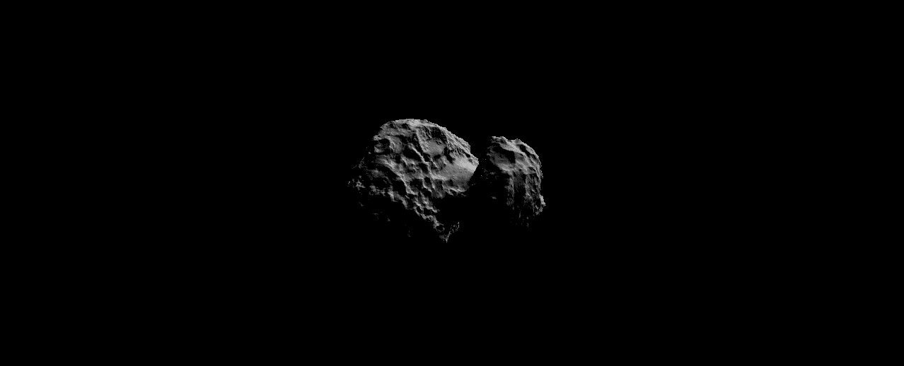
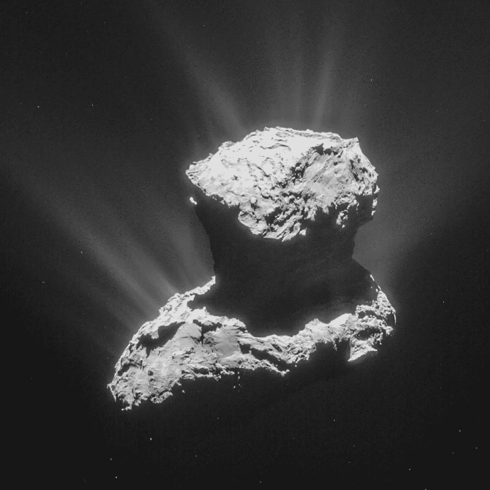
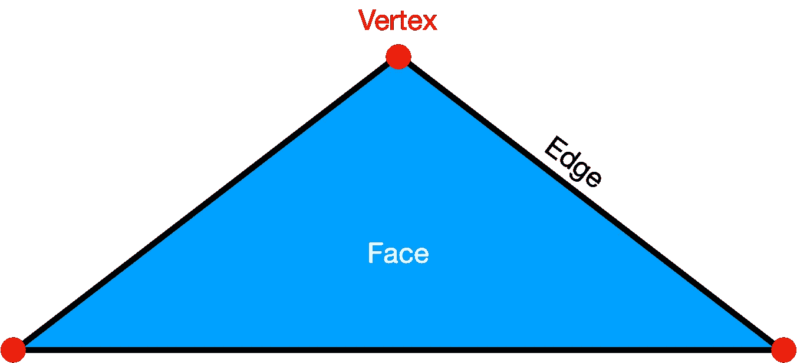
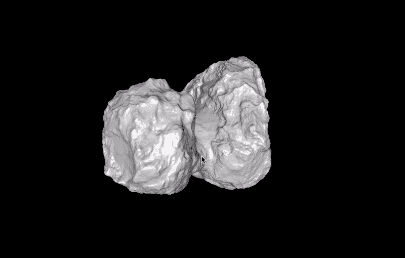
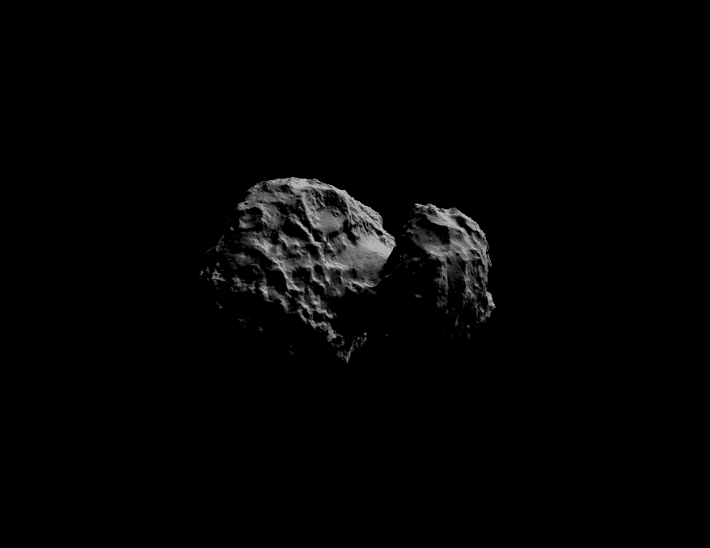

# Python 的空间科学——3d 彗星

> 原文：<https://towardsdatascience.com/space-science-with-python-a-comet-in-3-d-3774b1d71d9b?source=collection_archive---------63----------------------->

## [用 Python 进行空间科学](https://towardsdatascience.com/tagged/space-science-with-python)

## [系列教程的第 12 部分](https://towardsdatascience.com/tagged/space-science-with-python)将以对一颗特殊彗星的科学观察开始:67P/Churyumov–Gerasimenko



彗星 67P/Churyumov-Gerasimenko 的三维渲染模型。一个人怎么能理解、工作和想象如此美好的形状模型呢？这就是我们今天课程的目标。贷方:T. Albin

# 前言

*这是我的 Python 教程系列“Python 的空间科学”的第 12 部分。这里显示的所有代码都上传到* [*GitHub*](https://github.com/ThomasAlbin/SpaceScienceTutorial) *上。尽情享受吧！*

# (简短的个人)介绍

今天是 2014 年 11 月 12 日。过去的几天是压倒性的。如此激动，以至于我没有睡多少觉…现在…我在等待，和其他几位科学家一起坐在屏幕前，等待并见证人类历史上的一个科学和工程里程碑:宇宙飞船在 67P/Churyumov-Gerasimenko 彗星上着陆。着陆器的名字:菲莱；欧空局任务**罗塞塔/菲莱**的重要组成部分。

罗塞塔号宇宙飞船穿越行星际空间的轨迹。这个动画使用 Rosetta spk [SPICE](https://naif.jpl.nasa.gov/naif/index.html) 内核来计算航天器和天体的路径。今天，我们先来看看用来制作这个动画的库。贷方:T. Albin

航天器任务确实是一代工程。我看过一些文件，记录了我在小学时的想法和目标。在中学教育期间发射了该任务(2004 年)，在学士研究期间，该任务仍在星际空间飞行(2009-2012 年)。然后，在我 2014 年攻读硕士学位期间，我现在和科学家们坐在科隆(德国)的着陆器控制中心，在尘埃撞击监测器(DIM)团队工作，作为表面电探测和声学监测实验(SESAME)合作的一部分[1，2，3]。DIM 是着陆器上一个立方体大小和形状的仪器。它的目的是测量毫米大小的尘埃颗粒在着陆(下降)阶段对彗星表面本身的影响。测量原理很简单:DIM 通过对压电元件的冲击来分析和推导粒子的属性……这些电子元件将摇摆的吉他弦转换为电信号……使其成为一把*电吉他*。

“菲莱”的着陆和“罗塞塔”轨道飞行器数月的密切观察揭示了一个在我们太阳系最开始形成的古老宇宙世界:由水冰、矿物质和丰富的有机化合物组成。罗塞塔/菲莱，以及与它相关的我的个人故事，可能会成为另一篇数据较少的科学媒体文章的一个很好的补充。就目前而言，重要的是这次任务收集了大量的数据，这些数据已经被分析或者仍在等待分析，并且[已经发布了](https://www.aanda.org/component/toc/?task=topic&id=977)。所有的数据都是公开的，要么在 [NASA 的行星数据系统网站](https://pds.nasa.gov/) (PDS)上，要么在 [ESA 的行星科学档案馆](https://archives.esac.esa.int/psa/) (PSA)上。

在上一节课中，我们学习了很多关于彗星的知识，它们的起源，它们与木星的关系以及观测偏差。今天，我们将看看这颗示范性彗星核心的形状。



彗星是否给地球带来了必不可少的生命“积木”？也许吧。[67P/Churyumov–Gerasimenko(图片)确实含有至关重要的有机化合物](https://www.esa.int/Science_Exploration/Space_Science/Rosetta/Rosetta_s_comet_contains_ingredients_for_life)。离开彗星的白色“条纹”是尘埃和气流。鸣谢:[ESA/Rosetta/NavCam](https://www.esa.int/ESA_Multimedia/Images/2016/05/Rosetta_s_comet)；许可证: [CC BY-SA IGO 3.0](https://creativecommons.org/licenses/by-sa/3.0/igo/)

# 形状模型

Preusker 等人(2015) [1]使用了来自轨道飞行器 Rosetta 上一个名为*光学、光谱和红外远程成像系统* (OSIRIS)的相机系统的图像数据，为这颗形状怪异的彗星定义了一个坐标系统，并导出了一个所谓的形状模型。一个形状模型包含了一个物体的三维信息，允许一个人渲染，可视化和处理三维物体。形状模型包含所谓的*顶点*和另外的*边*或*面*信息:

*   **顶点**:顶点是一个简单的位置向量，包含空间中一个点的 X、Y 和 Z 坐标
*   **边**:边将顶点连接在一起。它们包含连接的相应顶点的两个索引信息
*   **面**:边缘包围了被称为面的区域。代替定义边，可以定义创建面(例如，三角形、矩形等)的顶点索引列表。)



形状模型三角形的约定(示例)。贷方:T. Albin

彗星 67P 的形状模型也由所谓的*导航相机* (NAVCAM)得出，这些相机用于确定航天器在太空中的方位。NAVCAM 是一个有意的工程设备，允许一个人获得科学的洞察力。

我们在之前的教程中使用的 NASA 强大的 [SPICE](https://naif.jpl.nasa.gov/naif/index.html) 工具包有一些很棒的功能来处理形状模型。这些模型被缩写为所谓的 *dsk* s(数字形状内核)。我们将在以后回到 *dsk* 函数。

# 67P 上的三维视图

今天我们将需要安装一个新的 3 D 渲染的包: [*visvis*](https://github.com/almarklein/visvis) 。 *visvis* 使用各种图形后端，如: [FLTK](https://www.fltk.org/) 、 [GTK](https://www.gtk.org/) 、 [Wx](https://www.wxpython.org/) 以及 [PyQT5](https://pypi.org/project/PyQt5/) 。在本教程中，我们将使用 QT 并通过以下方式安装它:

```
pip install PyQt5
```

现在我们可以通过以下方式安装 *visvis* :

```
pip install visvis
```

请注意一些事情:这个会话的安装和测试已经在 Mac OS Catalina 上完成。如果您在 Linux 或 Windows 上遇到任何问题，请不要犹豫，在这里提问。我们会想办法解决的。

如果你对更多的例子感兴趣，visvis 的创建者提供了一个很好的 wiki 页面。创建者还声明有类似的库，如 [*vispy*](https://github.com/vispy/vispy/) 。

首先，让我们导入已经知道的库(还有 [*imageio*](http://imageio.github.io/) 和 [*tqdm*](https://github.com/tqdm/tqdm) 在[补充文章](/space-science-with-python-supplements-for-papers-4876ec46b418)中使用)。我们还需要自定义函数 *func* (第 10 行)来下载形状模型。由于其大小约为 85 MB，形状模型无法存储在教程对应的 [GitHub](https://github.com/ThomasAlbin/SpaceScienceTutorial) 存储库中。

第 1/10 部分

应为形状模型创建额外的文件夹(第 2 行)。模型的下载链接列在第 3 行和第 4 行。您可以看到该链接包含了 *dsk* SPICE 符号。形状模型的文件名看起来有点神秘，所以让我们来看看文件夹对应的[自述文件](https://repos.cosmos.esa.int/socci/projects/SPICE_KERNELS/repos/rosetta/raw/kernels/dsk/aareadme.txt)。它指出:

```
ROSETTA Spacecraft DSK Naming Convention for the science phase:

                PPP_BB_RRRR_IMETPRO_N_VV.BDS
```

缩写如下:

```
token          description
------------   --------------------------------------------
PPP            project prefix: ROS

BB             body: CG for 67P/C-G, LU for Lutetia, or ST for 
               Steins

RRRR           number of plates: Knnn (for nnn thousand plates) or
               Mnnn (for mmm million plates)IMETPRO        camera-method-producer combined into a single 
               7-character token:

               I   -  camera:

                 O for OSIRIS
                 N for NAVCAM
                 M for multiple

               MET -  method:

                 SPC for StereoPhotoClinometry
                 MSD for Multi-Resolution StereoPhotoClinometry
                 SPG for StereoPhotoGranulometry

               PRO -  producer:

                 ESA for European Space Agency/ESOC
                 LAM for Laboratoire d'Astrophysique de Marseille
                 LPS for Laboratoire d'Astrophysique de Marseille
                         + Planetary Science Institute
                 DLR for Deutsches Zentrum fur Luft- und Raumfahrt
                         e.V.

N              surface naming: U for unnamed (surface ID = body ID, 
               for use with Toolkits N0065 or earlier) or N for 
               named (surface IDs are set to distinct numbers that 
               are mapped to surface names using keywords provided            
               in the project FK v25 or later)VV             version: V1, V2, V3 ....

BDS            extension: .BDS
```

在我们的例子中，我们有一个来自罗塞塔任务( *ROS* )的彗星 67P/Churyumov–Gerasimenko(*CG*)的形状模型。数据集( *M0001* )中至少有 100 万个车牌(人脸)，由马赛天体物理实验室( *LPS* ): *OSPCLPS* 用所谓的立体照片倾斜法( *SPC* )从 OSIRIS 相机( *O* )中导出。该对象被命名为( *N* )，当前版本为 1 ( *V1* )。数据存储在所谓的 *OBJ* 文件中。

第 2/10 部分

下载完成后，我们用 [*【熊猫】*](https://pandas.pydata.org/)[*read _ CSV*](https://pandas.pydata.org/pandas-docs/stable/reference/api/pandas.read_csv.html)函数加载形状模型。该文件有 4 列。第一个表示顶点带 *v* 或面带 *f* 的类型。最后三列是相应的坐标(顶点)或顶点索引(面)。根据打印结果(见下文),我们有将近 600，000 个顶点和超过 100 万个面，正如文件名已经指出的那样。

第 3/10 部分

```
Some statistics and parameters of the shape model
Rows and columns of the data set: (1791747, 4)
Number of vertices: 597251
Number of faces: 1194496
```

现在，我们可以通过用*熊猫*[头 函数打印前 5 行来看看顶点(第 2 行和第 3 行)和面(第 4 行和第 5 行)数据:](https://pandas.pydata.org/pandas-docs/stable/reference/api/pandas.DataFrame.head.html)

第 4/10 部分

我们可以看到顶点的坐标和顶点(面)的索引。顶点的坐标以千米为单位，代表了彗星内核的实际三维物理尺寸！

```
Vertices (Sample)
  TYPE        X1        X2        X3
0    v  0.570832 -1.000444  0.532569
1    v  0.564360 -1.000224  0.525360
2    v  0.557853 -0.997863  0.520762
3    v  0.553592 -0.998414  0.512192
4    v  0.550212 -0.992514  0.507304
Faces (Sample)
       TYPE      X1      X2      X3
597251    f   474.0   522.0   305.0
597252    f   474.0   719.0   522.0
597253    f  1961.0  2160.0  1651.0
597254    f  1961.0  2159.0  2160.0
597255    f  5513.0  5668.0  5285.0
```

通过将顶点子集转换为带有 [*到*](https://pandas.pydata.org/pandas-docs/stable/reference/api/pandas.Series.tolist.html) 的列表，我们可以很容易地为 Python 列表分配顶点(第 2 行和第 3 行)。然而，faces(第 4 行)需要更多的数据解析。我们将在下一个代码片段中看到它。

第 5/10 部分

让我们打印面子集中的最小(第 2 行)和最大(第 3 行)顶点索引…

第 6/10 部分

…我们看到，最小索引是 1；此外，该指数似乎是浮动的。对于我们的 Python 例程，索引从 0 开始。我们需要将指数减去 1:

```
Minimum vertex index in faces: 1.0
Maximum vertex index in faces: 597251.0
```

减法只在第 2 行完成。然后，我们将浮点数转换成整数，并将 faces 子集转换成 Python 列表。

第 7/10 部分

我们现在准备好出发了！我们应该能够调整窗口的分辨率，根据计算机的性能来改变设置。为此， *visvis* 的[创建者](https://github.com/almarklein)为 QT4 提供了一个[的好例子。我们需要更改第五季度的一些进口商品:](https://github.com/almarklein/visvis/blob/master/examples/embeddingInQt4.py)

第 8/10 部分

我们已经准备好探索我们的彗星了！首先，我们创建 *visvis* 应用程序(第 2 行和第 3 行)。我们创建之前在第 6 行定义的主窗口，并在第 7 行设置合适的分辨率。现在，用 [*网格*](https://github.com/almarklein/visvis/wiki/functions#mesh) 功能读取形状模型。提交顶点和面以及一个参数，该参数告诉函数有多少个顶点定义了一个面(这里:3)。第 14 行获取 axes 对象(类似于 *matplotlib* )，允许我们设置背景颜色(第 17 行)和调整一些参数(第 20 和 21 行)。现在，我们在第 26 行设置一个相机设置( *3d* )。注意:如果你想沿着彗星“飞”，就像在一个游戏里一样(用 w-a-s-d(平移)和 i-j-k-l(倾斜))，把这个参数换成“飞”。在 29 中定义了视场以及初始摄像机的方位角和仰角(线 32 和 33)。最后，我们可以运行它(第 36 行)。

第 9/10 部分

下面，你可以看一个短片。请随意在您的计算机上本地运行该应用程序，调整设置并探索这个宇宙世界。67P 造型诡异。它很可能是由一个双星系统组成，在过去的某个时刻合并而成。“橡胶鸭”由两个带有弹坑和盆地的身体组成，而中间的“脖子”则要光滑得多。物体(486958) Arrokoth 的形状与美国国家航空航天局的新视野号相似。



“吊儿郎当”探索彗星 67P。左键单击:旋转彗星。滚轮:放大和缩小。shift+左键单击:更改相机的指向点。双击左键:默认相机复位。贷方:T. Albin

最后，让我们以教程开头的第一个动画来结束我们的探索。为此，我们设置了一个较小的分辨率，因为生成的 GIF 不应超过 25 MB(中等限制；第 9 行)。我们在第 14 行和第 15 行改变彗星的物质属性；生成的对象不太亮，看起来更真实。此外，默认情况下，我们的相机视图有一个“附加聚光灯”来照亮物体。我们关闭这个光源(第 36 和 37 行)并在第 38 行添加一个固定光源。现在，在第 44 行到第 57 行中，我们在一个 for 循环中动态地改变相机的方位角(第 47 行)，并在每一步中重新绘制图形(第 50 行和第 51 行)。在第 54 行提取结果图像，第 57 行将图像数据转换为 8 位矩阵，并将结果附加到第 41 行定义的列表中。最后，在第 60 行，我们创建一个 GIF 格式的动画。

第 10/10 部分



我们从一开始就以最终的形状模型可视化来结束今天的课程。这个可视化结果来自代码片段 10/10。贷方:T. Albin

# 结论

享受 Python 和 *visvis* 的 3 D 力量！在等待多年到达彗星后，科学家们花费了数百个小时来推导这一科学上高度精确的形状模型！现在由你来探索这个世界，并将模型与存储在 [ESA 图像数据库](https://www.esa.int/ESA_Multimedia/Images)中的实际观察结果进行比较。我们将使用这个模型，并获得更多的参数，如彗星的整个表面，我们还将使用 67P 坐标系。*我们对 67P 了解多少？*

托马斯

# 附录

顺便说一句。我展示的方法实际上已经被用于科学见解和出版物！看一下【2】:[链接](https://www.aanda.org/articles/aa/pdf/2015/11/aa26400-15.pdf)。在图 3 中，您可以看到当时的最新模型。有了菲莱相应的 spk 内核，你可以试着重现这个图形(没有着陆器)！

# 参考

[1]阿尔贝托·弗兰德斯；哈拉尔德·克吕格；松，亚历山大；阿尔宾，托马斯；阿诺德沃尔特。Rosetta/Philae 上的尘埃撞击监测器(DIM):用冰粒作为彗星模拟材料的测试。行星和空间科学，第 99 卷，第 128-135 页。2014 年 9 月。DOI:[10.1016/j . PSS . 2014 . 05 . 014](https://ui.adsabs.harvard.edu/link_gateway/2014P&SS...99..128F/doi:10.1016/j.pss.2014.05.014)

[2]克吕格，哈拉尔德；克劳斯·塞登斯蒂克；汉斯-赫伯特·菲舍尔；阿尔宾，托马斯；冷漠，Istvan 阿诺德、沃尔特；阿尔贝托·弗兰德斯；Hirn，阿提拉；小林，正德；松，亚历山大；彼得，阿提拉；莫里斯·波多拉克。*在彗星 67P/Churyumov-Gerasimenko* 进行尘埃撞击监测(SESAME-DIM)测量。天文学&天体物理学，第 583 卷，同上。A15，13 页，2015 年 11 月。DOI:[10.1051/0004–6361/2015 26 400](https://ui.adsabs.harvard.edu/link_gateway/2015A&A...583A..15K/doi:10.1051/0004-6361/201526400)。arXiv: [arXiv:1510.0156](https://ui.adsabs.harvard.edu/link_gateway/2015A&A...583A..15K/arxiv:1510.01563)

[3] Hirn，阿提拉；阿尔宾，托马斯；Apáthy，istván；德拉·科尔特，文森佐；汉斯-赫伯特·菲舍尔；阿尔贝托·弗兰德斯；松，亚历山大；彼得，阿提拉；克劳斯·塞登斯蒂克；哈拉尔德·克鲁格。*Rosetta/Philae 上的尘埃撞击监测器(SESAME-DIM):彗星 67P/Churyumov-Gerasimenko 上的毫米粒子通量*。天文学&天体物理学，第 591 卷，同上。A93，7 页，2016 年 6 月。DOI:[10.1051/0004–6361/201628370](https://ui.adsabs.harvard.edu/link_gateway/2016A&A...591A..93H/doi:10.1051/0004-6361/201628370)。arXiv:[arXiv:1605.06291](https://ui.adsabs.harvard.edu/link_gateway/2016A&A...591A..93H/arxiv:1605.06291)

[4]普劳斯克，f；斯霍尔滕，女；马茨，k-d；t .罗奇；k .威尔纳；Hviid，S. F .Knollenberg，j；约尔达湖；古铁雷斯，P. J .库尔特，e；莫托拉；阿赫恩先生。n .托马斯；西耶克斯，h。巴比耶里特区；拉米，p；罗德里戈河；科斯尼博士；里克曼；凯勒，H. U .阿加瓦尔，j。巴鲁奇，文学硕士。贝尔托，j .-l；贝尔蒂尼岛；克雷莫内塞；达·德普诉；戴维森湾；德贝，s；德切科，硕士；福纳西尔公司；富勒，硕士；o .格劳辛岛；居特勒角；叶文辉；克拉姆；库珀斯，m；拉拉，法律硕士；拉扎林，m；洛佩兹·莫雷诺，J. J。马尔扎里，女；米查利克；纳莱托，g；新泽西州奥克雷；图比亚纳角；Vincent，J. -B. *彗星 67P/Churyumov-Gerasimenko 的形状模型、参考系统定义和制图标准——Rosetta/OSIRIS 图像数据的立体摄影测量分析*。天文学&天体物理学，第 583 卷，同上。A33，19 页，2015 年 11 月。DOI:[10.1051/0004–6361/201526349](https://ui.adsabs.harvard.edu/link_gateway/2015A&A...583A..33P/doi:10.1051/0004-6361/201526349)