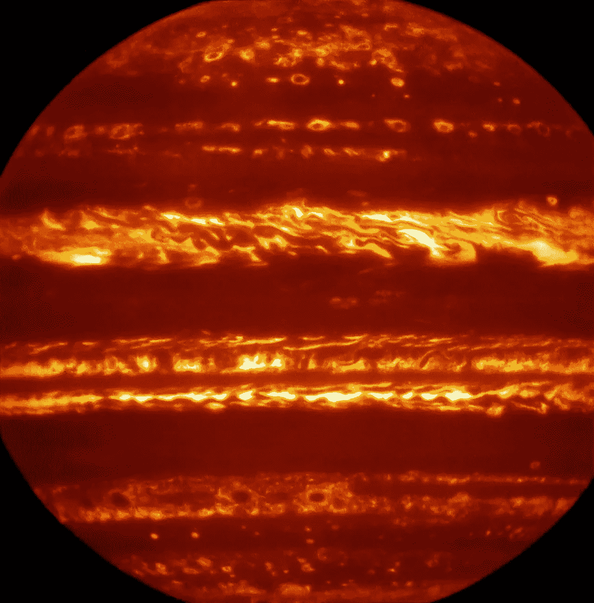

# Python 的空间科学——与木星的会合

> 原文：<https://towardsdatascience.com/space-science-with-python-a-rendezvous-with-jupiter-55713e4ce340?source=collection_archive---------51----------------------->

## [用 Python 进行空间科学](https://towardsdatascience.com/tagged/space-science-with-python)

## [系列教程的第 9 部分](https://towardsdatascience.com/tagged/space-science-with-python)聚焦于周期性彗星。它们与木星有什么关系，我们能在数据中看到吗？



木星非常不寻常的颜色。这张所谓的假彩色图像是太阳系最大行星的红外图像。它是由欧洲南方天文台(ESO)的甚大望远镜(VLT)拍摄的。捕获光的波长:5 微米(5000 纳米)。信用:[ESO/l . Fletcher](https://www.eso.org/public/unitedkingdom/images/eso1623a/)；许可: [*知识共享署名 4.0 国际许可*](http://creativecommons.org/licenses/by/4.0/)

# 前言

*这是我的 Python 教程系列“用 Python 进行空间科学”的第 9 部分。这里显示的所有代码都上传到了*[*GitHub*](https://github.com/ThomasAlbin/SpaceScienceTutorial)*上。尽情享受吧！*

*本教程的数据库已经在* [*上一届*](/comets-visitors-from-afar-4d432cf0f3b) *中创建，但也上传到我的* [*GitHub 资源库*](https://github.com/ThomasAlbin/SpaceScienceTutorial/tree/master/_databases/_comets) *中。*

# 介绍

你不需要一个空间限制的，价值数十亿美元的仪器来做科学。有时，一个 50 厘米的望远镜(直径)足以对科学界产生巨大的影响。现在是 1993 年。三位天文学家分析他们的观测结果:卡罗琳、尤金·m·舒梅克和大卫·利维刚刚发现了一颗新彗星！它的名字是:鞋匠-利维 9。

Shoemaker-Levy 9 是一颗常见的彗星，其核心直径为 4 公里，具有典型的冰成分。然而，动力学是奇怪的，表明一场宇宙灾难，即彗星和我们太阳系中最大的行星:木星的碰撞。

一年后，彗星越来越接近木星。潮汐力将彗星撕成 21 块大小不同的碎片。由此产生的宇宙*珍珠项链*撞击了地球，留下了暂时的伤痕。这样的撞击对我们的母星来说将是毁灭性的，但是木星的引力如此之大，以至于天文学家认为这颗行星保护我们免受任何更大碎片的伤害。


苏梅克-利维 9 号碎片与木星的图像合成。木星上的黑点是木星的一个卫星的影子(你可以在影子右上方看到它)。这些图像是由哈勃太空望远镜拍摄的。致谢:[美国国家航空航天局、欧空局、H. Weaver 和 E. Smith STScI 以及 J. Trauger 和 R. Evans 美国国家航空航天局喷气推进实验室](https://images.nasa.gov/details-PIA17007)

*但是木星会吸收所有的物体吗？*航天器任务利用行星进行所谓的变轨机动，以改变它们的轨迹和速度。*像木星这样的行星也会改变天体的轨道吗？我们在数据中看到了这种影响吗？*让我们来了解一下。

# Tisserand 参数

数据科学太牛逼了！最先进的算法和方法使我们能够从复杂的数据中获得洞察力。它允许我们降低维度来识别结构和连接。所以让我们把这些方法应用到彗星的轨道元素上，对吗？

无论是作为数据科学家还是学术界的科学家，处理数据都需要数据工程。其中一部分是特征工程。在空间科学中，特别是在天体动力学中，复杂的理论可以为各种各样的课题提供概念基础。这些理论帮助我们描述和预测某些方面；它们需要是可证伪的；他们可能会提供一些想法，帮助我们应用有特定目的的方法，而不是盲目地应用一些蛮力方法。这就需要文献研究了。

我们的问题是一个动力学问题。我们想知道是否有一个定量参数可以帮助我们理解一个行星和另一个物体之间的动态联系。

感谢*默里&德莫特*有**本**书可以回答任何动力学问题:*太阳系动力学*【1】。他们很好地总结了费利克斯·蒂瑟朗[2]的观点，他在 1896 年提出了一个理论，即天体的轨道元素在与一个更大的行星近距离相遇后以某种方式“保留”下来。让我们假设一颗彗星在近距离遭遇木星之前有一个半长轴 *a* ，一个偏心率 *e* 和一个倾角 *i* 。经过一次转换后，元件被改变为*角、ẽ* 和 *ĩ* 。Tisserand 发现必须满足以下等式:


因此，轨道要素在经过一次变轨后不会随机改变，而是遵循一定的常数定律，即保持一个常数因子。

进一步，Tisserand 找到了后来被称为 Tisserand 的参数 *T* 。使用相同的轨道要素和例如木星(Jup)的半长轴，可以将无量纲参数计算为:


*这个参数在数量上意味着什么？*一个主要的想法(见[3]中的图 7):Tisserand 参数在 2 和 3 之间表示所谓的木星家族彗星(JFC)。一种彗星的子类型，它的原始轨道被木星改变，以一种更近的轨道围绕太阳旋转。

这是否适用于某些 P 型彗星？[上次](/space-science-with-python-the-origin-of-comets-3b2aa57470e7)，我们已经看到大多数 P 型的远日点值在 5 AU 左右(接近木星的半长轴)。

# Python walk

我们可以用 Python 来回答这个问题。首先，我们需要在过去几次中使用过的强制库。这次，我们将再次创建一个基于核密度估计(KDE)的 Tisserand 参数分布。为此，我们需要[scipy模块(第 13 行)。](https://www.scipy.org/)

第 1/9 部分

第 3 行连接到我们已知的 comet 数据库，该数据库是在第 7 节教程[中创建的。稍后需要一个 SQLite 游标(第 6 行)。第 11 至 13 行和第 17 至 19 行分别提取 P 型和 C 型彗星的半长轴、倾角和偏心率。此外，相应的彗星名称将在以后使用，我们只考虑偏心率为< 1 的束缚轨道。](/comets-visitors-from-afar-4d432cf0f3b)

第 2/9 部分

对于 Tisserand 参数，我们需要木星的半长轴。我们使用以前会话中的一些 [SPICE](https://naif.jpl.nasa.gov/naif/toolkit.html) 函数来计算这个参数。我们在第 6 行的元文件内核是通过 [*furnsh*](https://naif.jpl.nasa.gov/pub/naif/toolkit_docs/C/cspice/furnsh_c.html) 函数加载的，包含了太阳系天体的 spk 内核的路径和行星常数内核的路径。我们通过使用 [*utc2et*](https://naif.jpl.nasa.gov/pub/naif/toolkit_docs/C/cspice/utc2et_c.html) 函数在第 9 行设置任意星历时间(et)，并在第 13 到 16 行计算相应的 ECLIPJ2000 坐标中的木星状态向量。观测者是太阳( [NAIF 码 10](https://naif.jpl.nasa.gov/pub/naif/toolkit_docs/C/req/naif_ids.html) )，目标物体是木星的重心( [NAIF 码 5](https://naif.jpl.nasa.gov/pub/naif/toolkit_docs/C/req/naif_ids.html) )。不需要考虑像差影响，因此我们使用函数 [*spkgeo*](https://naif.jpl.nasa.gov/pub/naif/toolkit_docs/C/cspice/spkgeo_c.html) 。为了将状态向量转换成轨道元素，我们使用函数 [*oscltx*](https://naif.jpl.nasa.gov/pub/naif/toolkit_docs/C/cspice/oscltx_c.html) ，然而在此之前(第 19 和 20 行)我们需要使用函数 [*bodvcd*](https://naif.jpl.nasa.gov/pub/naif/toolkit_docs/C/cspice/bodvcd_c.html) 从行星内核中提取太阳的 G*M 值。计算出的半长轴在第 26 行赋值，并在第 29 行转换为 AU(使用函数 [convrt](https://naif.jpl.nasa.gov/pub/naif/toolkit_docs/C/cspice/convrt_c.html) )。

第 3/9 部分

现在我们可以在 C 和 P 型数据帧中添加一个新列，包含每个彗星的 Tisserand 参数。第 3 行和第 4 行将参数定义为 lambda 函数。需要注意将倾斜度值从度转换为弧度(第 11 行和第 16 行)。

第 4/9 部分

让我们来看看由此产生的统计数据。第 7 行到第 10 行使用我们新计算的 Tisserand 参数(第 7 行和第 8 行)计算 JFC 的百分比。

第 5/9 部分

```
Descriptive statistics of the Tisserand parameter of P type comets
count    627.000000
mean       2.672696
std        0.555275
min       -0.648993
25%        2.610908
50%        2.805879
75%        2.935148
max        3.663401
Name: TISSERAND_JUP, dtype: float64
```

根据我们的计算，83 %的 P 型彗星都是 JFC，因此与木星有动态联系！这是很多吗？让我们来看看……

```
Percentage of P type comets with a Tisserand parameter between 2 and 3: 83.0%
```

… C 型彗星。75 %的彗星的 Tisserand 参数小于 1.35。小 Tisserand 参数与具有大半长轴的高度偏心轨道相关。嗯……这完全适用于我们轨道时间超过 200 年的长周期彗星。

```
Descriptive statistics of the Tisserand parameter of C type comets
count    159.000000
mean       0.535408
std        1.365811
min       -2.758114
25%       -0.412254
50%        0.548308
75%        1.357792
max        3.578201
Name: TISSERAND_JUP, dtype: float64
```

新计算的参数应该存储在数据库中。但是我们如何向一个已经存在的表中添加一个新列呢？这段代码将帮助我们。定义了一个用 SQL PRAGMA 命令提取列名(第 30 行)的函数(将在以后的教程中使用)。如果列名存在(第 33 行)，什么也不会发生。否则(第 37 行到第 40 行),添加一个具有所请求的 SQL 列类型的新列。在第 43 到 47 行，我们添加了 Tisserand 参数作为一个新列。请注意:执行这部分不会有任何效果，因为你也将从[我的 GitHub 库](https://github.com/ThomasAlbin/SpaceScienceTutorial)下载更新的 comet 数据库。

第 6/9 部分

命令[*execute many*](https://docs.python.org/2/library/sqlite3.html#sqlite3.Cursor.executemany)*使我们能够更新包含多行数据的表格。在第 2+3 行和第 6+7 行中，我们更新了 Tisserand 参数，其中我们使用 comet 的名称作为 SQL 表和 dataframe 之间的键。*

*第 7/9 部分*

*最后一步，我们可以用 KDE 可视化组织和参数结果。我们可以使用上次的代码片段来创建一个 Tisserand 参数分布…*

*第 8/9 部分*

*…以及剧情本身。这是正确编码和满足 [PEP8 标准](https://www.python.org/dev/peps/pep-0008/)和注释的优势:人们可以使用代码片段和函数用于未来目的，而无需*重新发明轮子*。绘图函数也可以很容易地以一种通用的方式作为一个公共函数。*

*第九部分*

*下图显示了结果分布。归一化分布相对于 0 和 5 之间的 Tisserand 参数作图。蓝色和橙色的直方图以及 KDE 分别显示了 C 型和 P 型彗星的数据。正如打印的统计数据所示，您可以看到 P 型分布非常窄，集中在值 2 和 3 之间。因此，P 型彗星更有可能是 JFC 型彗星，与 C 型彗星的联系更为紧密。*这意味着什么？嗯，木星“捕获”了长周期彗星，并改变了它们的轨道元素，使它们成为内太阳系的一部分。然而，这些彗星的远日点大约相当于木星的半长轴。几百年后，与这颗气体巨星的又一次亲密接触再次改变了轨道。**

**

*P 型和 C 型彗星组织参数的直方图和 KDE 分布。贷方:T. Albin*

# *结论与展望*

*1896 年的一个理论帮助我们揭示了 P 型彗星的动力学本质。这个理论纯粹是建立在轨道动力学上的，有一定的假设，而且当时没有任何数据来证明它！如果与快速生活的机器学习和数据科学世界相比，拥有持久的理论和功能似乎是“无聊的”。但是，推导出一个持续几十年的持久理论是一项智力成就，它使我们能够在非常深的层次上理解某些空间科学概念。*

*Tisserand 参数是一个多维方程。下一节课将会是一个补充教程，我们会试着将这个公式形象化，以更好地感受这个等式。然后，我们将确定彗星群中的偏差效应，然后……我们将熟悉一颗特殊的彗星:67P/Churyumov–Gerasimenko。67P 得到了很好的研究，我们将创建惊人的 3D 动画来了解彗星的形状和起源。*

*托马斯*

# *参考*

*[1]c .默里和 s .德莫特(2000 年)。*太阳系动力学*。剑桥:剑桥大学出版社。doi:10.1017/CBO 978113917417417*

*[2]蒂塞朗，1896 年。*东帝汶第四铁路*。巴黎高迪尔-维拉尔斯*

*[3] [完成太阳系清单，太平洋天文学会会议记录，第 107 卷，T.W. Rettig 和 J.M. Hahn 编辑。，第 173-191 页。](http://articles.adsabs.harvard.edu/pdf/1996ASPC..107..173L)*