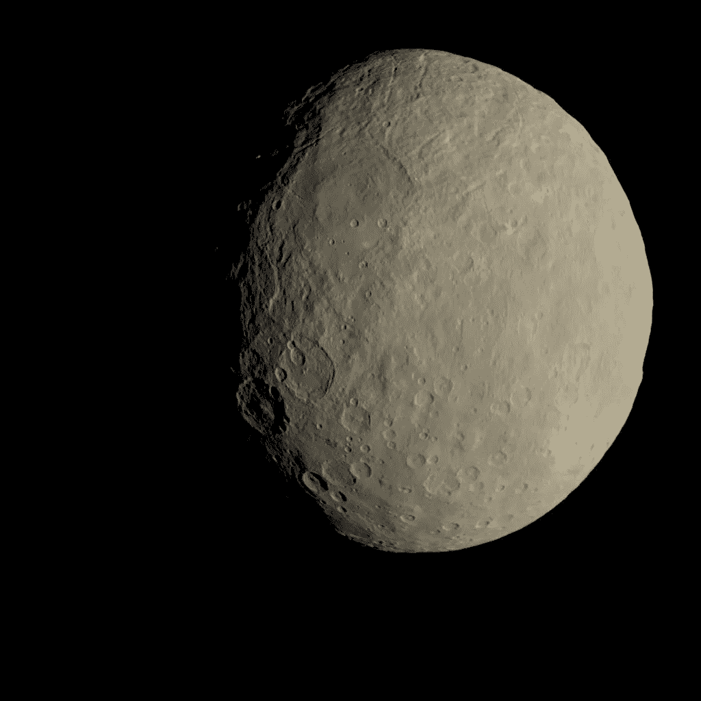
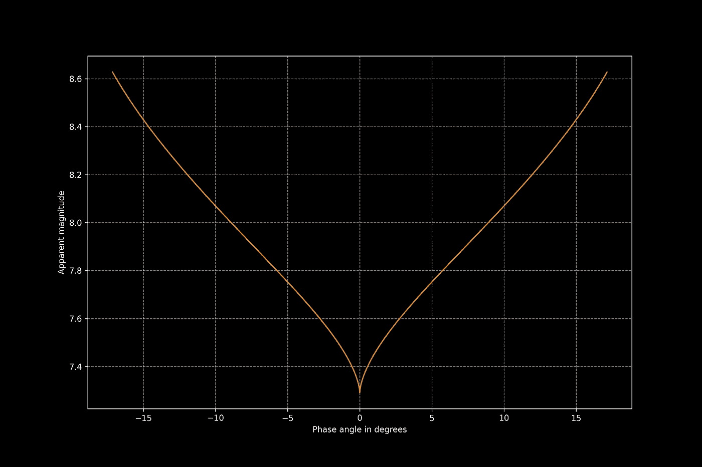
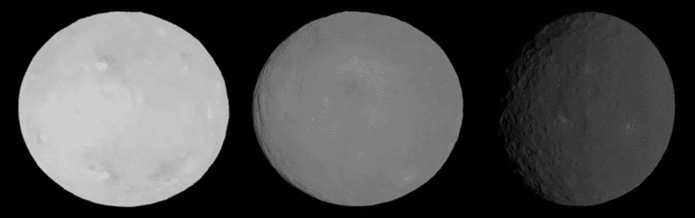

# Python 与空间科学——一个非常鲜明的对立

> 原文：<https://towardsdatascience.com/space-science-with-python-a-very-bright-opposition-62e248abfe62?source=collection_archive---------51----------------------->

## [用 Python 进行空间科学](https://towardsdatascience.com/tagged/space-science-with-python)

## [系列教程的第 19 部分](https://towardsdatascience.com/tagged/space-science-with-python)深入小行星研究:小行星的亮度是如何变化的？有哪些依赖，有没有什么神奇的效果？

矮行星谷神星的图像构成。来自黎明号任务的图像在这里被用来创建一个代表人眼所感知的小行星颜色的图像。致谢:[美国宇航局/JPL 加州理工学院/加州大学洛杉矶分校/MPS/德国航天中心/国际开发协会](https://images.nasa.gov/details-PIA21079)

# 前言

*这是我的 Python 教程系列“用 Python 进行空间科学”的第 19 部分。这里显示的所有代码都上传到了*[*GitHub*](https://github.com/ThomasAlbin/SpaceScienceTutorial)*上。尽情享受吧！*

# 介绍

今天，我们将讨论另一个与亮度相关的话题:小行星视星等的计算和确定。我们将在下一篇文章中讨论一些更概念性的话题，然后我们将从一个与小行星相关的科学项目开始，教程#20！如果你需要一些关于天文学星等的信息，我建议你先阅读我以前的文章:

 [## Python 的空间科学——黑暗天空中的亮点

### 本系列教程的第 16 部分描述了空间科学中另一个重要的基本概念:物体的亮度。

towardsdatascience.com](/space-science-with-python-bright-dots-in-the-dark-sky-73909507a0ca) 

# 反射的复杂性

你今天早上照镜子了吗？大概。但这篇太空科学文章不是关于你对自己的认知；这是关于它背后的物理定律。平面镜及其反射性质很容易解释: ***光的入射角=光的出射角*** 。完成了。

但是在太空中，我们没有镜子或简单的几何学来计算彗星、流星或小行星的亮度。这方面的大多数方程是凭经验确定的，并且只在某个解空间内有效。在本文中，我们将继续讨论几节课前开始的话题:小行星。

# 做文学工作就是做科学

如果你不在学术界工作，让我告诉你一件事:每个科学项目都是从文献工作开始的。*别人做了什么？对于某个复杂的“利基”问题，是否已经有了解决方案？*你会从哪里开始寻找一个*“用来计算小行星亮度的方程式或公式”*？

这项任务具有挑战性，因为每天都有大量的论文、会议记录、文章和书籍发布。此外，如果你不在大学的任何研究机构工作，你将无法获得某些期刊。然而，大多数研究人员将他们的论文上传到一个名为*arXiv*(*X*读作希腊语“chi”)的预印服务器上:

 [## arXiv.org

### arXiv 是一个免费的分发服务和开放存取的档案库，包含 1，732，878 篇学术文章，涉及领域包括…

arxiv.org](https://arxiv.org/) 

此外，科学家试图改善其他人的工作。*但是改进被正确地评审了吗？还是老的经验主义解决方案有时更好？*在我们的例子中，我们搜索所谓的 *H-G 幅度/相位函数*由 Bowell 等人(1989)定义。这是一个计算小行星亮度的经验函数，至今仍在使用！

即使是较新的版本，如 Muinonen 等人(2010 年)，也不如旧的 H-G 函数那样广为人知[1]。

那么我们在哪里找到相应的方程呢？幸运的是，因为 H-G 函数是常用的，所以它可以在免费的可访问的论文和文章中找到，如下所示:

H-G 星等系统/功能概述

因此，让我们通过提取相关信息来深入了解这个等式:

# 深潜

H-G 函数提供了一颗小行星的表观/视觉亮度 *V* 的量值，它取决于:

*   小行星和太阳之间的距离
*   小行星和观察者(在我们的例子中是地球)之间的距离
*   小行星的大小，分别是所谓的绝对星等(类似于一篇关于彗星的文章中所描述的)

 [## Python 的空间科学——我们观察到一切了吗？

### 本系列教程的第 11 部分是关于数据科学家和空间科学家的噩梦:统计偏差！

towardsdatascience.com](/space-science-with-python-did-we-observe-everything-617a8221e750) 

*   从小行星上看到的太阳和地球之间的相位角(因此小行星作为观察者时太阳和地球的方向向量之间的夹角)
*   所谓的斜率参数 *G* (我们稍后将描述该参数)

让我们来看看这个等式。如您所见，到太阳和地球的距离嵌入在 log10 函数中。之前，我们有一个所谓的缩减幅度函数 H(⍺，⍺是提到的相位角。事实上，该函数还需要绝对幅度 *H* 和斜率参数 *G* 。

小行星的表观/可见星等

让我们用 Python 写这个等式，并在开始时提供一个适当的文档字符串。今天，我们将只需要包 [numpy](https://numpy.org/) 和 [matplotlib](https://matplotlib.org/) 。降低的幅度是第 29 行(第 2/6 部分)中调用的另一个函数。

第 1/6 部分

第二部分/第六部分

那么相角取决于减少的幅度是什么样的呢？

缩减的星等

降低的幅度取决于绝对幅度 *H* 和嵌入在 log10 中的其他函数。𝜙₁和𝜙₂被称为相位函数，用提到的斜率参数 *G* 进行缩放。两个函数结构相同，但系数不同。但是首先，让我们在第二个 Python 函数中也编码这一部分:

第 3/6 部分

同样，相位函数是相似的，只是系数不同:

相位函数 1 和 2

我们现在可以在一个 Python 函数中编写两个相位函数。系数存储在字典中(第 22 到 23 行和第 25 到 26 行)。输入参数 *index* 是对应于索引号的字符串，如上式所示。

第 4/6 部分

为了简单起见，让我们用某些参数来计算一个例子，以可视化、分析和解释特定的亮度曲线。不使用 SPICE 内核，让我们设置一些与矮行星谷神星的属性相对应的硬编码参数:

 [## JPL 小型数据库浏览器

### 编辑描述

ssd.jpl.nasa.gov](https://ssd.jpl.nasa.gov/sbdb.cgi?sstr=Ceres) 

第 4 行和第 5 行定义了天体和太阳(3.0 天文单位)以及我们的母星和太阳(1.0 天文单位)之间的固定距离。第 8 行设置 3.4 的绝对幅度，第 9 行设置斜率参数 *G* 。

我们想要实现什么？由于几乎所有参数都是固定的，我们将绘制视在幅度与相位角的关系图。这里，所需的相位角是从小行星上看到的角度。首先，让我们设置一个数组，从太阳上看，地球和小行星之间的相位角(第 13 行)。现在，我们可以应用三角函数，计算小行星和地球之间的距离，这取决于从太阳看到的地球和小行星之间的角度(第 17 到 19 行)。我们的母星是固定的，我们用 1000 步把小行星从 0 度移动到 45 度。利用这些结果，我们可以计算第 23 到 24 行中小行星的相位角。最后，在第 27 到 31 行，我们调用我们的视在幅度函数，并计算相应亮度值的相位角。

第 5/6 部分

现在我们可以使用 matplotlib 绘制结果。我们绘制了从小行星上看到的星等与相位角的关系。为了更好地观察，我们将相位角镜像为 0 度。结果图将变得更加清晰(第 11 行到第 14 行)。从前面的教程中我们已经知道，我们在最后应用一些格式和标签设置。

第六部分

结果图如下所示。你可以看到从小行星上看到的视在星等和相位角，以度为单位。请记住:较小的星等值对应较亮的物体！

在 5 度和 15 度之间，幅度随相位角几乎线性变化。原因很明显:从地球上看，较大的相位角对应于物体较小的照明面积，类似于月亏和月圆。然而，在 0 到 5 度之间，亮度曲线变得更陡，并且表观幅度不遵循简单的线性模型。

由于方程的经验性质，这是一个实际的影响，还是一些建模误差？

视在幅度与相位角的关系，单位为度。负相角在数学上没有定义。在这里，右手边的曲线被镜像以提高对抗效果。贷方:T. Albin

# 对立效应

你看到的是所谓的 ***对立效果*** 或 ***对立激增*** 。对于非常小的相位角，亮度会显著增加，围绕矮行星谷神星运行的黎明任务也很好地观察和描述了这一点[2]。

从黎明看到的谷神星的表观亮度。相位角从左到右:0°、7°和 33°。数据来自[维基百科](https://commons.wikimedia.org/wiki/File:Ceres_opposition_effect.png)；鸣谢:美国宇航局/JPL 加州理工学院/加州大学洛杉矶分校/MPS/德国航天中心/国际开发协会

同样的效果也可以在我们的日常生活中观察到！去海滩，站在沙滩上，背对着太阳。向下看你的头部阴影，你会看到一个明亮的光环围绕着你的头部阴影！

这种效应如何解释？这种效应的原因源于小行星的表面特性(或沙滩)。最上面的一层并不光滑，而是有一层灰尘、小石子、鹅卵石……所以叫做 ***浮土*** 。当光线照射到地表时，这些浮土颗粒会产生阴影。但是，浮土粒子会根据照明角度投射阴影。比如一棵树，它的影子在晚上(大相角)比中午长得多。小相位角，分别是表面的垂直照明突然减少了“自阴影”！有效照明面积增加，并导致小相位角的突然亮度激增。

5 度和 0 度之间的波动形状由斜率参数 *G* 确定。假设大多数小行星的数值在 0.15 左右。

# 结论

现在就看你的了。熟悉 H-G 函数，更改参数。检查 *G* =0.1 或 *G* =0.5 时反压波动如何变化。试着创建一个动态改变几个设置的动画…

 [## Python 在空间科学中的应用——论文增刊

### 教程系列的第 10 部分是关于补充材料的补充文章。我们怎样才能观想…

towardsdatascience.com](/space-science-with-python-supplements-for-papers-4876ec46b418) 

…或者尝试使用小行星的实际轨道数据:

 [## Python 的空间科学——小行星的不确定运动

### 教程系列的第 17 部分。今天(6 月 30 日)是小行星日，我们将开始深入研究…

towardsdatascience.com](/space-science-with-python-uncertain-movements-of-an-asteroid-f651b94f7008) 

在过去的几周里，你学习了一些方法、工具和算法。结合这些东西，产生新的见解！例子和基础/基本概念的混合应该允许你成为一个越来越独立的公民空间科学家。

下次我们将把 H-G 函数与实际数据结合起来，并使用天空图。之后，我们将开始我们的小行星科学项目！我希望你喜欢今天的课。

托马斯

# 参考

[1] Karri Muinonen，Irina N. Belskaya，Alberto Cellino，Marco Delbò，氹欞侊·尚塔尔·莱瓦瑟尔-雷古尔等人..小行星的三参数星等相位函数。伊卡洛斯，爱思唯尔，2010 年，209 (2)，第 542-555 页。10.1016/j .伊卡洛斯. 2010 . 04 . 003 .[https://hal.archives-ouvertes.fr/hal-00676207/document](https://hal.archives-ouvertes.fr/hal-00676207/document)

[2]施罗德，斯特凡 e；李、杨健；马克·雷曼；史蒂文·乔伊；卡罗尔·波兰斯基；卡森蒂，尤里；朱莉·卡斯蒂略-罗格斯；毛罗·恰尔尼耶洛；拉尔夫·乔曼；安德烈亚·隆戈巴多；露西·麦克法登。莫托拉、斯特凡诺；赛克斯，马克；卡罗尔·雷蒙德；克里斯托弗·罗素；黎明分幅相机观测到的谷神星的对立效应:天文学和天体物理学，第 620 卷，同上。A201，19 页；2018;DOI:10.1051/0004–6361/201833596