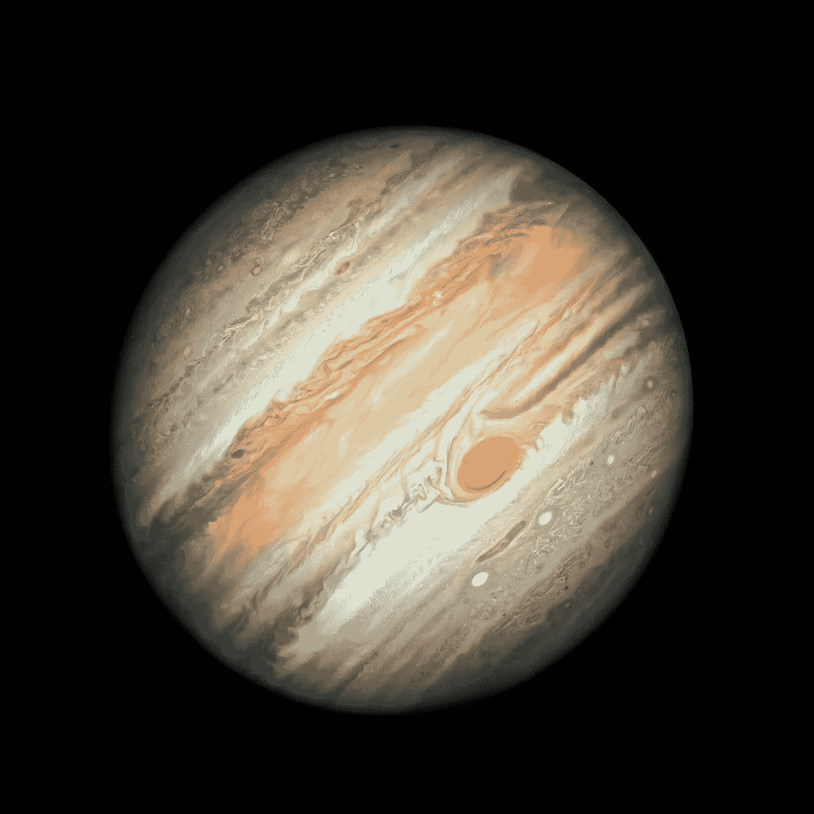
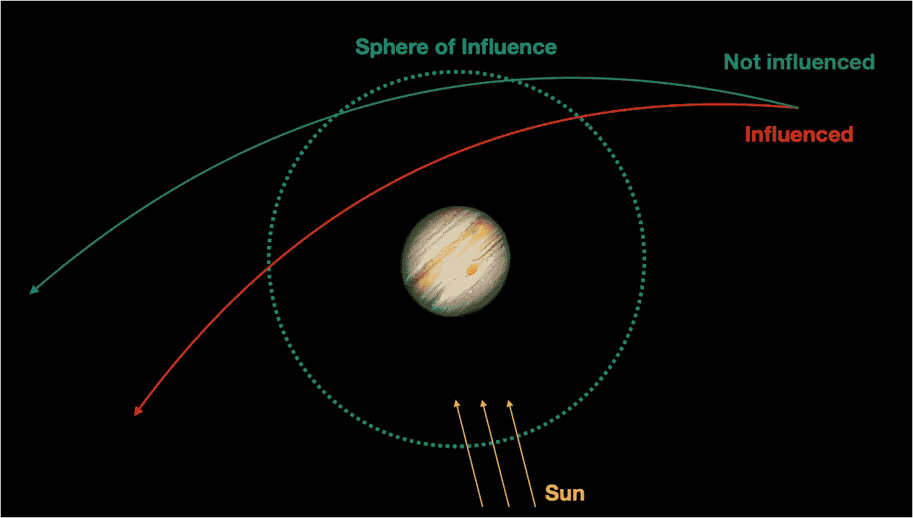

# Python 下的空间科学——一个看不见的访客

> 原文：<https://towardsdatascience.com/space-science-with-python-an-invisible-visitor-2c8d759509cd?source=collection_archive---------52----------------------->

## [用 Python 进行空间科学](https://towardsdatascience.com/tagged/space-science-with-python)

## [系列教程的第 14 部分](https://towardsdatascience.com/tagged/space-science-with-python)在“罗塞塔”和“菲莱”号宇宙飞船揭示了它的宇宙奥秘之后，让我们来看看 67P/丘留莫夫-格拉西缅科彗星。



对太阳系中较小的天体有重大影响:木星。鸣谢: [NASA，ESA，A. Simon(戈达德太空飞行中心)，M.H. Wong(加州大学柏克莱分校)](https://www.esa.int/ESA_Multimedia/Images/2019/08/Hubble_showcases_new_portrait_of_Jupiter)；许可证: [CC 乘 4.0](https://creativecommons.org/licenses/by/4.0/)

# 前言

*这是我的 Python 教程系列“用 Python 进行空间科学”的第 14 部分。这里显示的所有代码都上传到了*[*GitHub*](https://github.com/ThomasAlbin/SpaceScienceTutorial)*上。尽情享受吧！*

# 介绍

上次([彗星的乱世](/space-science-with-python-turbulent-times-of-a-comet-7fecedd78169))我们看了一下 67P/丘留莫夫-格拉西缅科彗星的轨迹(*路径*)。我们发现这颗彗星围绕着我们的中央恒星有一个动荡的旅程。轨道元素一直在显著变化，这使得很难用简单、静态的轨道元素来描述它。比如近日点的论证，几年之内可能会有几度的变化。相比之下:地球的近日点理论*以 10 万年的时间周期围绕太阳旋转*！

但是为什么呢？嗯，是这个星球的错！它们的引力导致彗星轨道的永久变化。如前所述，木星是我们宇宙邻居中的主要影响者。Maquet (2015) [1]的数值模拟显示，67P 的过去受到了严重干扰。

但是未来或者最近的时间呢？我们需要建立一个复杂的数值程序来了解轨道变化吗？幸运的是，不，我们不需要任何 GPU 优化的 C 代码来获得灵感。我们需要的是 Python、NASA 的工具包 [SPICE](https://naif.jpl.nasa.gov/naif/toolkit.html) (分别是 Python 包装器 [*spiceypy*](https://github.com/AndrewAnnex/SpiceyPy) )以及我们试图获得简化解决方案的意识！最终解决方案可能与*实际*数据不同。

所以让我们开始我们的编码部分。这一次，我们将合并编码和理论，以更好地理解计算和科学程序。

# 在木星附近

在本系列教程的第 6 部分([围绕太阳](/space-science-with-python-quite-around-the-sun-6faa206a1210))中，我介绍了一个天体动力学概念:势力范围(SOI)。太阳系中的每个天体都有这个假想的球体，它允许我们通过以下方式将 N 体问题简化为 2 体问题:

小行星或彗星以一定的轨道要素围绕太阳旋转。在这个以太阳为中心的坐标系中(较小天体的质量可以忽略不计)，不存在其他可能导致任何引力扰动的天体。然而，如果小行星或彗星进入行星的 SOI，坐标系*切换*到行星中心坐标系。这颗行星是唯一的参考点和主要的重力来源。如果物体离开了行星的 SOI，我们将坐标系统切换回以太阳为中心的系统。



木星的势力范围草图(蓝色虚线圆圈)。太阳位于底部，用三条黄色的太阳光表示。一个小天体，如彗星，在 2 体问题中不受干扰地围绕太阳旋转(绿色路径)。然而，如果考虑木星在其 SOI 内的引力，路径会相应改变(红色路径)，导致轨道改变。草图不符合比例。鸣谢:T. Albin，木星影像鸣谢:鸣谢: [NASA，ESA，A. Simon(戈达德太空飞行中心)，M.H. Wong(加州大学伯克利分校)](https://www.esa.int/ESA_Multimedia/Images/2019/08/Hubble_showcases_new_portrait_of_Jupiter)；木星图像许可: [CC BY 4.0](https://creativecommons.org/licenses/by/4.0/)

现在，这种方法可能看起来有问题，因为物体的重力没有空间限制。无论如何，这种简化将有助于我们获得一些有趣的变轨见解。

我们需要我们现在使用了几次的模块。内核元文件包含必要内核文件的各种相对路径，这些文件也上传到了 [my GitHub repository](https://github.com/ThomasAlbin/SpaceScienceTutorial) 上。除了标准的闰秒内核( *naif0012.tls* )和我们行星的 spk 内核( *de432s.bsp* )之外，我们还将使用 67P 的 spk 内核来导出轨道元素。对应的内核 *67P_CHURY_GERAS_2004_2016。BSP* 包含了这颗彗星在 2004 年到 2016 年之间的位置信息。

第 1/14 部分

我们的目标:我们想确定 67P 是否以及何时穿过木星的 SOI。为此，我们需要计算木星和 67P 的状态向量，我们需要确定 SOI 的半径！对于 SOI，我们分别需要太阳和木星的质量或 G*M (G:引力常数，M:质量)值。使用函数 [*bodvcd*](https://naif.jpl.nasa.gov/pub/naif/toolkit_docs/C/cspice/bodvcd_c.html) 我们提取太阳(第 2 行和第 3 行)和木星(第 6 行和第 7 行)的 G*M 值。两个对象的[NAIF id](https://naif.jpl.nasa.gov/pub/naif/toolkit_docs/C/req/naif_ids.html)分别为 10 和 5:

第 2/14 部分

现在，我们在第 3 行设置一个样本星历表时间(et ),并使用函数 [*spkgeo*](https://naif.jpl.nasa.gov/pub/naif/toolkit_docs/C/cspice/spkgeo_c.html) 计算从太阳看去的 ECLIPJ2000 中木星的状态向量(第 6 至 9 行)。对于 SOI 计算，我们需要木星的半长轴。用[*oscl tx*](https://naif.jpl.nasa.gov/pub/naif/toolkit_docs/C/cspice/oscltx_c.html)*可以很容易地计算出轨道元素，如第 12 到 14 行所示。得到的数组 *JUPITER_ORB_ELEM* 包含在 *sample_et* 时间的木星轨道元素，倒数第二个条目包含半长轴(第 17 行)。让我们打印 AU 中的结果，看看提取的值是否可行(使用函数 [*convrt*](https://naif.jpl.nasa.gov/pub/naif/toolkit_docs/C/cspice/convrt_c.html) ):*

*第 3/14 部分*

*5.2 AU 左右的半长轴好看！所以让我们继续计算…*

```
*Semi-major axis of Jupiter in AU: 5.2097194462305065*
```

*SOI。第 2 行使用已经提取的参数(半长轴，太阳和木星的 G*M 值)定义半径。产生的半径是…*

*第 4/14 部分*

*…大约 0.3 AU！那大约是 5000 万公里，分别是我们地球和太阳之间距离的三分之一！木星的影响确实是巨大的。*

```
*SOI of Jupiter in AU: 0.32268429545253885*
```

*我们加载的 67P SPICE 内核只在很短的时间内有效。为了扩大轨道预测范围，我们将使用函数 [*二次曲线*](https://naif.jpl.nasa.gov/pub/naif/toolkit_docs/C/cspice/conics_c.html) 根据 67P 的轨道元素计算其状态向量。为了获得 67P 的轨道元素，我们设置一个样本 et(第 6 行)并在第 9 到 12 行计算相应的状态向量。然后，我们用 [*oscelt*](https://naif.jpl.nasa.gov/pub/naif/toolkit_docs/C/cspice/oscelt_c.html) 来确定轨道根数(第 15 行到第 17 行)。*

*第 5/14 部分*

*我们现在开始确定 67P 和木星的 SOI 之间的交点。我们从 2017 年 1 月 1 日(第 3 行)开始，创建一个 while 条件(第 12 行到第 29 行)，它执行以下操作:*

*   *while 条件在每次迭代后检查 67P 和木星之间的距离是否大于 SOI 的半径(第 12 行)。*
*   *如果 67P 仍然在木星的 SOI 之外，日期时间增加 1 小时(第 15 行)并转换为 ET (16)。*
*   *用函数 [*二次曲线*](https://naif.jpl.nasa.gov/pub/naif/toolkit_docs/C/cspice/conics_c.html) 计算 67P 的 ET 对应状态向量(第 20 行)。产生的状态向量是以太阳为中心的。*
*   *另外，计算木星的状态向量(第 23 到 26 行)；也是在以太阳为中心的 ECLIPJ2000 系统中。*
*   *最后，在第 29 行使用函数 [*vnorm*](https://naif.jpl.nasa.gov/pub/naif/toolkit_docs/C/cspice/vnorm_c.html) 计算彗星和行星之间的距离。*

*第 6/14 部分*

*我们执行代码，在很短的一段时间后，while 条件不再满足。我们在 2017 年 1 月 1 日之后到达了与木星的第一个 SOI 交点。让我们看看相应的日期(第 4 行)。此外，我们还计算两个对象之间的距离，以验证我们的代码是否工作正常(第 5 行和第 6 行；我们用函数 [*convrt*](https://naif.jpl.nasa.gov/pub/naif/toolkit_docs/C/cspice/convrt_c.html) )将 km 值转换为 AU 值。*

*第 7/14 部分*

*似乎 67P 在两年前进入木星的 SOI！*

```
*67P entering Jupiter's SOI: 2018-05-20
67P distance to Jupiter at SOI crossing in AU: 0.3226421083848195*
```

*67P 在 SOI 中的旅程对它的轨迹有什么影响吗？ECLIPJ2000 中的轨道元素真的发生了变化吗？让我们来看看吧！*

*我们需要计算 67P 在以木星为中心的系统中的运动。为此，我们通过简单的矢量计算(第 3 行)来计算从木星上看到的彗星的状态矢量。得到的矢量然后被用来计算木星 SOI 中 67P 的轨道元素(第 7 到 9 行)。请注意，我们这次用的是木星的 G*M 参数(第 9 行)！*

*第 8/14 部分*

*让我们来看看以木星为中心的轨道要素的一些结果:*

*第 9/14 部分*

*近日点(也就是木星的近心点)对应于 67P 和这颗气体巨星之间的最近距离。它大约有 4150 万公里，相当于 SOI 半径的 86 %。不出所料，67P 的偏心率远远超过 1，表明彗星进行了一次无限制的飞越。*

```
*Closest distance between 67P and Jupiter in km: 41512816.418108694
Closest distance between 67P and Jupiter in SOI radius percentage: 86.0
67P's eccentricity in a Jupiter-centric system: 8.642146316093086*
```

*现在让我们计算 SOI 内的轨迹，直到 67P 再次到达球体的边界。while 循环与前面所示的相似，只是 while 条件做了相应的更改:*

*第 10/14 部分*

*一段时间后，程序退出 while 循环。让我们打印第二次穿越 SOI 的日期:*

*第 11/14 部分*

*67P 在木星附近差不多 4 个月了！*

```
*67P leaving Jupiter's SOI: 2018-09-09*
```

*第 4 行和第 5 行现在计算从太阳看到的木星的 SOI 离开时间对应的状态向量。然后，我们可以将 67P 的状态向量从以木星为中心的系统重新转换到以太阳为中心的系统。*

*第 12/14 部分*

*根据木星引力影响后的状态向量，我们可以计算出相应的轨道根数…*

*第 13/14 部分*

*…并将结果元素与 67P 进入木星 SOI 之前的轨道元素进行比较:*

*第 14/14 部分*

*正如你所看到的，在这 4 个月的时间里，67P 在木星的 SOI 中，轨道元素发生了显著的变化。近日点减少了 0.07 天文单位，轨道变得更加椭圆。倾角减少了 1.5 度，上升交点的经度以及近日点的论点移动了几十弧分。*

```
*Perihelion in AU before: 1.29, after: 1.22
Eccentricity before: 0.6318, after: 0.6463
Inclination in degrees before: 7.12, after: 5.52
Longitude of ascending node in degrees before: 50.93, after: 49.88
Argument of perihelion in degrees before: 11.41, after: 9.28*
```

*总而言之，我们基于 SPICE 的简短非数值代码让我们对近距离接触后轨道元素的变化有了一个感觉。然而，正如结论中所解释的，我们必须考虑一些限制。*

# *结论*

**没有 GPU？*没问题。*没有数值计算重码？*没问题。我已经向你们展示了一个简单的、经过深思熟虑的二体问题方法足以在近距离接触后推导出变化的轨道元素。*

*然而，在编码部分 5/14 中尝试一些其他的初始日期时间。用稍微不同的轨道元素计算 67P 在不同时间的状态向量。你会看到彗星根本没有进入木星的 SOI！轨道元素微小的初始变化会导致蝴蝶效应:微小的变化会导致未来巨大的变化。预测高度精确的轨道需要数值模拟，彗星的除气行为和其他尚未讨论的影响。然而，在短时间尺度内，这种方法足以提供第一个结果，使人们能够对较小天体的引力扰动有所印象。*

*托马斯*

# ***参考文献***

*[1]马奎特，L. (2015)。*彗星 67P/丘留莫夫-格拉西缅科*的近期动力学历史。天文学&天体物理学。第 579 卷。文章编号 A78。https://doi.org/10.1051/0004-6361/201425461。https://arxiv.org/pdf/1412.1983.pdf*