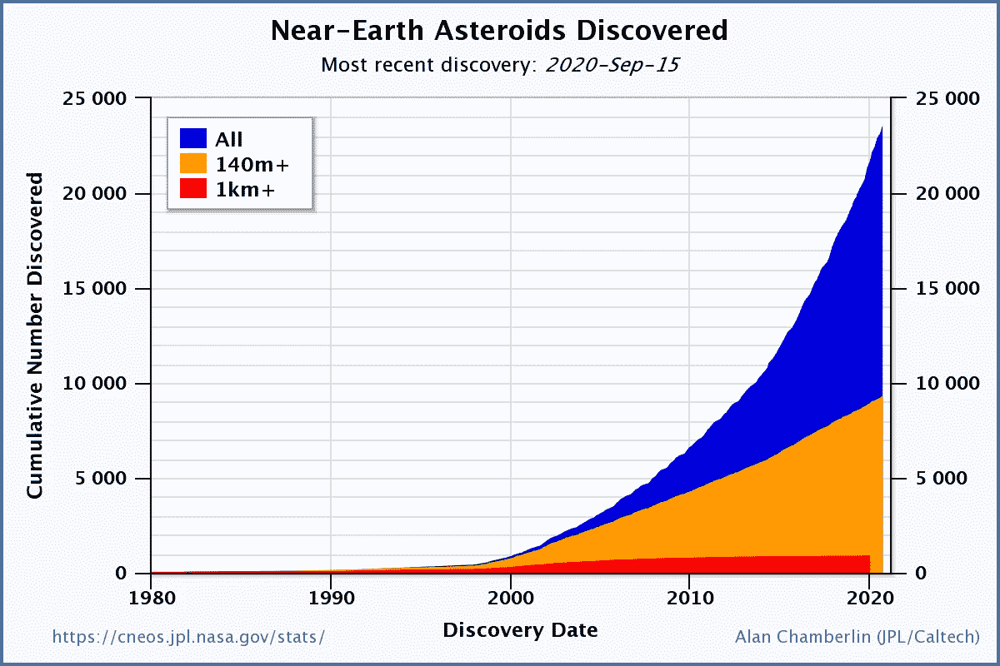

# 利用 Python 进行空间科学——小行星项目(上)

> 原文：<https://towardsdatascience.com/space-science-with-python-asteroid-project-part-1-4fa8809f8bde?source=collection_archive---------33----------------------->

## [用 Python 进行空间科学](https://towardsdatascience.com/tagged/space-science-with-python)

## [系列教程的第 21 部分](https://towardsdatascience.com/tagged/space-science-with-python)从第一个科学项目开始:所谓近地天体的可探测性。

照片由 [NASA](https://unsplash.com/@nasa?utm_source=medium&utm_medium=referral) 在 [Unsplash](https://unsplash.com?utm_source=medium&utm_medium=referral) 拍摄

# 前言

*这是我的 Python 教程系列“用 Python 进行空间科学”的第 21 部分。这里显示的所有代码都上传到了*[*GitHub*](https://github.com/ThomasAlbin/SpaceScienceTutorial)*上。尽情享受吧！*

# 动机

在我们最近的 20 个 [*使用 Python 的空间科学*](https://towardsdatascience.com/tagged/space-science-with-python) 教程中，我们学习了一些天体动力学基础知识、对空间科学家有帮助的各种 Python 库和工具，并且我们研究了一些用例(比如彗星 67P、金星在天空中的运动等等)。

我们有坚实的技能来开始第一个科学项目的工作。这个科学项目将涵盖我将在下面阐述的各种任务和想法。

请注意:我们不会写科学论文。尽管一些科学见解可以被合并并写成出版物。这个项目的目的是感受一个人如何定义和致力于一个科学目标。此外，通过开发 Python 库，我们提供了一个可持续的解决方案，我们和其他(业余)科学家可以使用它来扩展这些想法。

# 1.近地物体

今天是 2013 年 2 月 15 日。一颗公共汽车大小的小行星进入大气层，在距离地面几公里的地方爆炸，引发冲击波，在俄罗斯城市车里雅宾斯克造成财产损失和数人受伤。

为什么会发生这种情况？嗯……我们的宇宙附近居住着成千上万所谓的小天体；[小行星、彗星和流星体](https://medium.com/space-science-in-a-nutshell/rocks-in-space-78e1ad132731)。这些物体位于我们太阳系的不同区域，形成了各种各样的结构，如:

*   小行星主带
*   柯伊伯带
*   奥尔特云

…以及所谓的特洛伊人、希腊人或希尔达人等亚类型和亚群体。

我们不需要深入探究这个科学话题。然而，一种特殊的“类型”可能对我们的蓝色星球相当危险:近地天体**s，简称: **NEO** s**

近地物体的定义很简单:近日点等于/小于 1.3 天文单位的所有物体。就是这样。

因此，近地天体非常接近地球，有些穿过我们的轨道，有些如果以前没有被发现和记录，可能会进入地球大气层。如果物体足够大，产生的碰撞可能是毁灭性的，就像在车里雅宾斯克发生的那样。

然而，太空机构、天文学家和所谓的全天空巡天监测这些物体。他们扫描夜空寻找新的、未知的近地天体候选者，通过每晚的观测扩大我们对这些潜在危险天体的了解。美国宇航局…

 [## 近地天体研究中心

### 美国宇航局的近地天体网站。与地球撞击风险、近距离接触等相关的数据。

cneos.jpl.nasa.gov](https://cneos.jpl.nasa.gov/) 

…以及 ESA …

 [## ESA -欧洲航天局

### 更令人印象深刻的是，仅用两个小时收集的最终数据集足以确定…

neo.ssa.esa.int](http://neo.ssa.esa.int) 

…提供包含所有相关信息的精美公共宣传信息页面。

欧空局的一个名为 NEODYS 的网页收集了所有科学近地天体数据，如所有已知近地天体的轨道和物理参数。NEODYS 类似于[小行星中心](https://www.minorplanetcenter.net/)，但专门关注近地天体:

 [## NEODyS

### NEODyS 为所有近地小行星提供信息和服务。每个 NEA 都有自己的动态…

newton.spacedys.com](https://newton.spacedys.com/) 

如今(2020 年 9 月 18 日),数据库中有 23，662 个近地天体。

每天，越来越多的近地天体填满这些数据库。目前，平均每晚我们会发现 3 到 5 个新的物体。8 年前，当我写关于近地天体可探测性的学士论文时，大约有 9000 个天体是已知的。现在几乎增加了 3 倍。

发现近地天体的累计数量与日期。三种颜色表示 NEO 尺寸。来自:[https://cneos.jpl.nasa.gov/stats/totals.html](https://cneos.jpl.nasa.gov/stats/totals.html)

上图显示了累计发现数量与日期的关系，分为 3 个大小不同的组(直径 1 km 及以上、140 m 及以上和所有)。如你所见，千米大小的物体数量达到了一个稳定水平。希望我们发现了所有的“行星杀手”…然而大小在 100 米到 1000 米之间的物体仍然定期被发现。由于现代望远镜和望远镜调查，观测技术，数据处理管道和检测算法，我们发现越来越多。问题是: ***还剩下多少有待发现？*** 而既然我们需要操作望远镜和巡天来发现所有的天体: ***探测所有天体的最佳“策略”是什么？*** 。

这些问题甚至“可答”吗？这就是我们在这里的原因。上述科学问题相当重要，因为它们可以帮助我们和天文观测者估计正在进行的对所有天体的探测和编目工作。

之前在这方面已经做了一些工作，欧空局也发布了一个免费提供的工具包来计算观测估计值，称为*近地天体群体观测计划(NEOPOP)* 。

 [## ESA -欧洲航天局

### 在与欧空局空间态势感知方案有关的活动中，需要一个观测系统…

neo.ssa.esa.int](http://neo.ssa.esa.int/neo-population) 

然而，这项任务很有挑战性，是接下来几节课的第一个好项目。

我们对近地天体的观察可能是有偏差的，使用已知的天体来做这种工作是多余的。我们需要的是一个最新的近地天体群模型，该模型将有助于我们估计估计的所有近地天体群的可探测性。在对[天体物理数据系统](https://ui.adsabs.harvard.edu/)进行了一些文献研究后，人们很快发现了 [Granvik 等人 2018 年的最新模型:近地天体的去偏轨道和绝对星等分布](https://www.sciencedirect.com/science/article/pii/S0019103517307017)。这份报纸可以自由获取。

# 2.图书馆发展

近地物体的可探测性将是一个复杂的课题，有几个陷阱、统计和数字分析等等。想想不同类型的望远镜(大小、摄像系统、地面望远镜——太空望远镜，等等。这可能影响近地物体的可探测性。我们将选择一个更通用的方法，而不是选择一个具有某些预定义参数的望远镜:开发一个 Python 库，任何人、任何天文学家和科学家都可以使用该库，通过他们的望远镜/仪器特定设置来估计近地天体的可探测性！

因此，我们的科学项目也将是一个软件工程任务！最后，我们可以选择一些望远镜设置，并运行一些模拟来得出一些结论。最后，我们有了一个可持续和可扩展的开源工具包，它也实现了一个合理的目的！

# 3.测试驱动开发

开发人员经历了许多不同的工作环境和框架，比如瀑布或敏捷环境。目前，很多框架、工具和计划方法正在被使用(或被错误地使用),比如看板、Scrum、SAFe、LeSS……等等。

在过去的几年中，出现了一种看起来枯燥乏味的方法:测试驱动开发(TDD)。通常，或者说，大多数开发人员和自由时间编码人员*到处工作*:他们希望快速看到原型和结果，不需要任何重构、注释或编码。在开发周期的末尾，有些人甚至不实现单元测试，因为“它只是工作”。维护、扩展和理解生成的代码可能会很累，对其他人来说几乎是不可能的(甚至对开发人员自己来说，如果开发人员不经常处理代码的话)。

我们的科学项目和开发过程将包括 TDD 方法，以提供可靠、可信和可重用的产品。我们还将满足 PEP8 和 PEP257 标准，遵循 Numpy Docstring 约定，并且还将使用分析来优化代码。总之，接下来的会议将涵盖:

*   空间科学——特别是近地天体、小行星等。
*   数值模拟；使用无偏模型
*   Python 库的开发
*   测试驱动开发
*   PEP 标准
*   NumpyDoc
*   代码优化

我期待着这个项目！我花了一些时间来为我们所有人评估一个好项目——所以让我们来处理这个任务吧！

托马斯