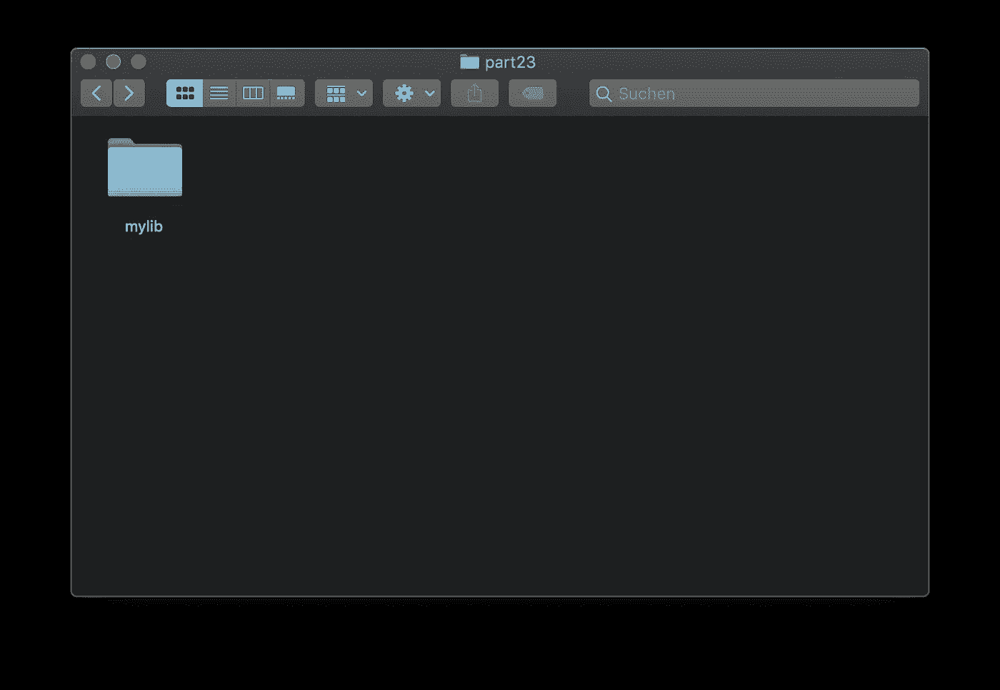
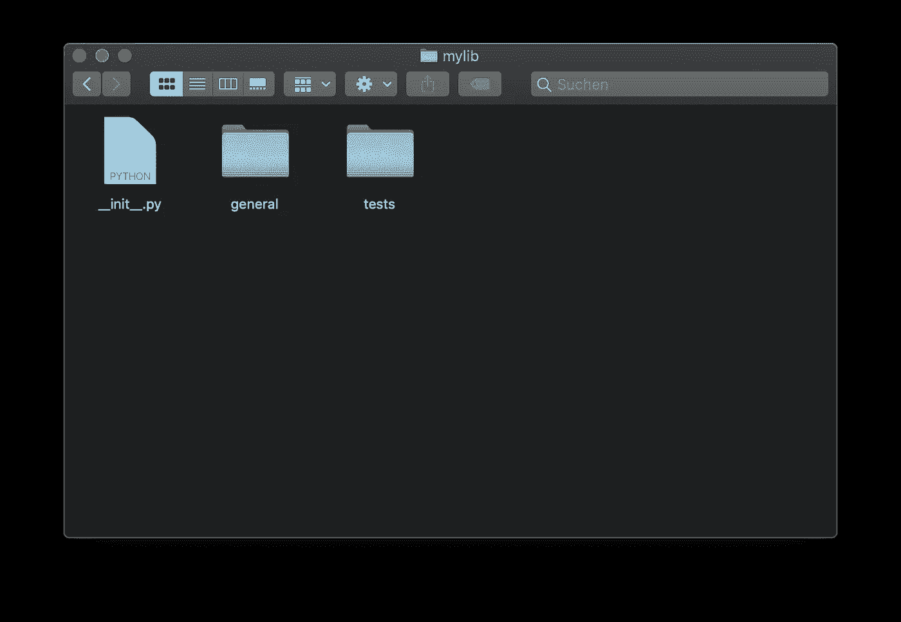
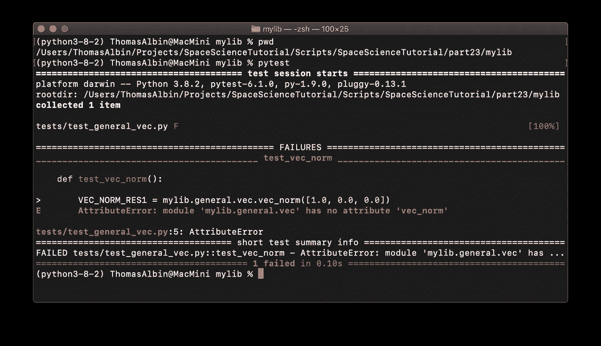
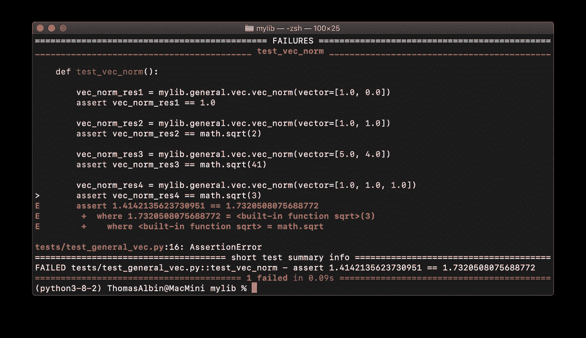
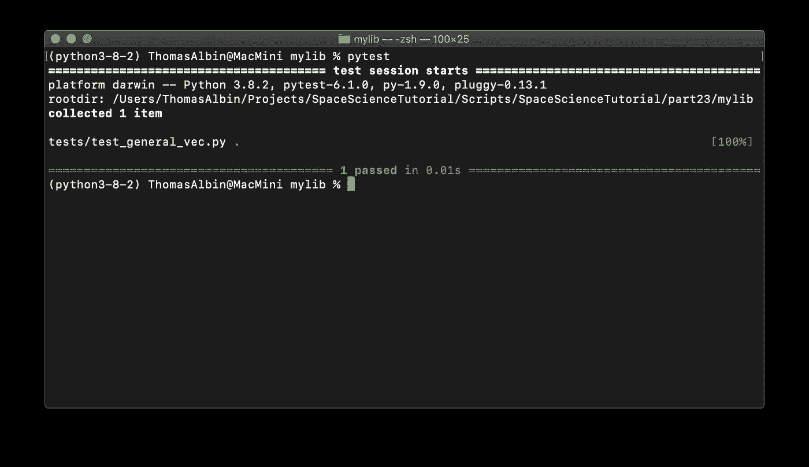
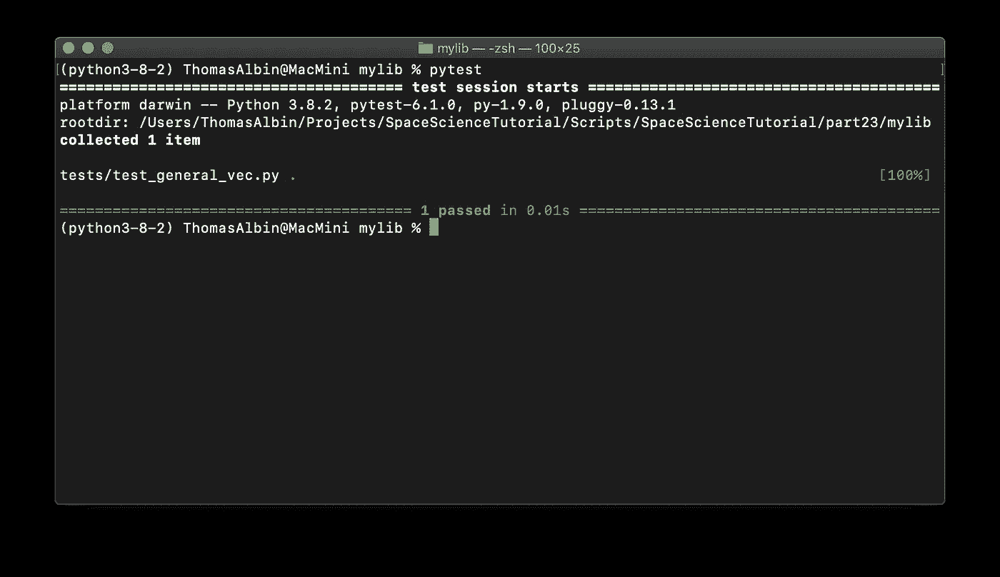
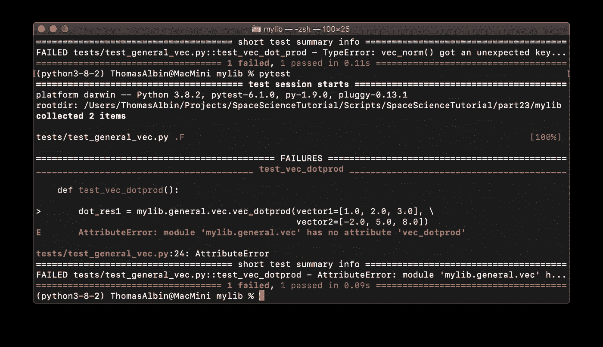
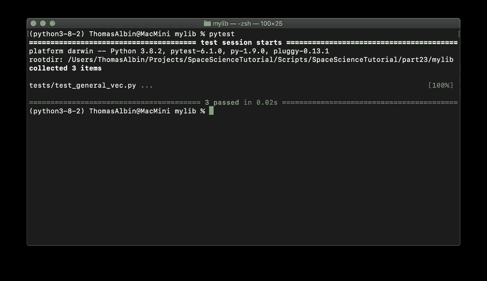
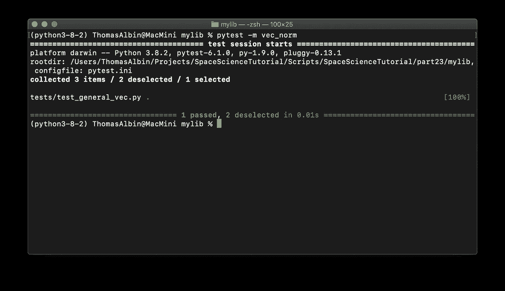

# Python 的空间科学——小行星计划(三)

> 原文：<https://towardsdatascience.com/space-science-with-python-asteroid-project-part-3-d7dc0941a717?source=collection_archive---------57----------------------->

## [用 Python 进行空间科学](https://towardsdatascience.com/tagged/space-science-with-python)

## [系列教程的第 23 部分](https://towardsdatascience.com/tagged/space-science-with-python)继续我们科学项目的第三部分。今天，我们将通过一个测试驱动的开发例子，一步一步地详细介绍。


照片由[大卫·克洛德](https://unsplash.com/@davidclode?utm_source=medium&utm_medium=referral)在 [Unsplash](https://unsplash.com?utm_source=medium&utm_medium=referral) 上拍摄

# 前言

*这是我的 Python 教程系列“用 Python 进行空间科学”的第 23 部分。教程会话中显示的所有代码都上传到*[*GitHub*](https://github.com/ThomasAlbin/SpaceScienceTutorial)*上。尽情享受吧！*

# TDD 和现在？

上次我们讨论了测试驱动开发的概念，简称:TDD。TDD 将帮助我们为我们的项目开发一个 Python 库，从一开始就确保更少的错误，更高的可靠性(和质量)和可维护性。当然，我们将开发新的数值模拟，并对复杂的“计算链”进行建模，以确定近地天体的可探测性。然而，TDD 方法可以很容易地涵盖基本功能，如将物体的视在星等转换为相应的辐照度。

[](/asteroid-project-part-2-test-driven-development-ed7af6c1820e) [## 小行星计划(第二部分)——测试驱动开发

### 教程系列的第 22 部分继续我们科学项目的第二部分。在我们深入研究 Python 之前…

towardsdatascience.com](/asteroid-project-part-2-test-driven-development-ed7af6c1820e) 

每次为每个函数和类提供一步一步的指南完全超出了本系列教程的范围。因此，在这节课中，我们将详细讨论一个例子；供您复制，也适用于任何其他编码相关的问题！

请注意:今天我们处理一个相当简单的问题，来了解一下 TDD。任何高级 Python 用户可能会感到厌烦，但是请考虑使用 TDD 的概念，并将其推广到您可能面临的其他问题！

# 让我们深入研究一下

在开始任何编码之前，请确保您有一个虚拟 Python 环境(至少 3.8 版本)。我还推荐安装一个像 [Spyder](https://www.spyder-ide.org/) 这样的 IDE，以及像 [NumPy](https://numpy.org/) 、 [Pandas](https://pandas.pydata.org/) 、 [Matplotlib](https://matplotlib.org/) 、 [scikit-learn](https://scikit-learn.org/stable/) 等科研工作常用的软件包。您可能会考虑我的第一篇关于设置和安装一些重要包的文章:

[](/space-science-with-python-setup-and-first-steps-1-8551334118f6) [## 使用 Python 的空间科学-设置和初步步骤

### 成为公民太空科学家的入门指南

towardsdatascience.com](/space-science-with-python-setup-and-first-steps-1-8551334118f6) 

最后，我们需要一个用于测试的库。 [Unittest](https://docs.python.org/3/library/unittest.html) 是在 Python 安装中注册的标准测试库。在我们的 TDD 课程中，我们将使用 *pytest* :

 [## 帮助你编写更好的程序

### pytest 和数以千计的其他软件包的维护者正在与 Tidelift 合作，以提供商业支持和…

docs.pytest.org](https://docs.pytest.org/en/stable/) 

首先，我们创建一个 Python 库文件夹，其“占位符”名为 *mylib* 。



作者图片(T. Albin)

在这个文件夹中，我们需要创建一些文件夹和文件来满足 Python 库的最低要求。

首先，我们创建一个名为 *tests* 的文件夹。 *pytest* 需要特定的文件夹和文件名来自动识别测试并执行它们。在*测试*目录中，Python 文件名必须以前缀 *test_* 开头，在这些文件中，测试例程/函数也以 *test_* 开头。这很容易记忆，也能带来一个干净的测试环境。当然，也可以设置单独的名称和约定，但是在调用 *pytest* 时需要进行不常见的修改，或者需要编写测试套件的配置文件。

添加第二个文件夹，名为*通用*。在这个目录中，我们将放置一些可用于库的不同核心功能的生产代码。现在，在这一点上没有理由添加这个文件夹，因为我们还没有进行任何测试。从技术上来说，TDD 要求我们在创建任何单元测试之前不要创建代码。创建一个原始的文件夹结构完全没问题。

最后，我们需要创建 *__init__。py* 文件，以便 Python 可以识别这个库的内容。 *mylib* 的 init 文件包含信息:

__init__。mylib 中的 py/



作者图片(T. Albin)

在*中，通用*和*测试*是相应导入/加载文件的初始化文件。我们在 *general* 中的第一个脚本应该包含简单的向量运算。文件应为 *vec.py* 。*测试*中对应的测试文件应命名为 *test_general_vec.py* 。整个目录结构如下所示:

```
mylib
+-- __init__.py
+-- general
|   +-- __init__.py
|   +-- vec.py
+-- tests
|   +-- __init__.py
|   +-- test_general_vec.py
```

我们的第一个任务:我们想要创建一个函数来计算两个向量 *a* 和 *b:* 之间的角度 *p*


计算两个向量 a 和 b 之间的角度 p 的方程。图片由作者提供(T. Albin)

我们确定了几个相当容易理解的计算步骤:

*   arccos 应用于分数
*   *分子:*两个向量的点积
*   *分母:*两个向量的长度(分别称为范数)的乘积。因为我们在几何环境中应用这个方程，所以我们使用欧几里得范数

我们没有为角度计算编写一个单独的单元测试，而是确定了几个“小步骤”,它们可以被分成单独的测试。这允许我们有更大的测试覆盖面，我们有更多的通用函数可以在以后使用！

先说范数函数。我们将其命名为 *vec_norm* ，并将其放入 *general.vec* 中。第一个测试覆盖值为[1.0，0.0]的向量。显然，这个向量的欧几里德范数是 1:

测试 _ 通用 _vec.py

我们可以在 Spyder 中使用插件( [Spyder 博客文章](https://www.spyder-ide.org/blog/introducing-unittest-plugin/))或者在终端中执行单元测试。在这次会议中，我们将继续使用终端。在 *mylib* 中，我们运行 *pytest* :



作者图片(T. Albin)

显然，单元测试失败了。这并不奇怪，因为错误消息指出 *mylib.general.vec* 中没有“vec_norm”。直到现在，我们没有实现任何东西。所以我们切换到 *mylib.general.vec* 添加函数。此外，欧几里德范数的计算是相当明显的。没必要假装:

vec . copy

现在 *pytest* 成功了！完美！*我们完成了，对吗？嗯……不。我们的实现只包括二维向量，我们没有测试不太明显的情况。因此，首先，我们添加一些不太明显的测试，并尝试以更通用的方式处理代码:*

测试 _ 通用 _vec.py

请注意:添加新测试后，需要执行 *pytest* ！所以在这种情况下，在添加第 9/10 行和第 12/13 行之后 *pytest* 被调用。

现在，我们在测试程序中添加一个三维向量:

测试 _ 通用 _vec.py

*pytest* 结果:



作者图片(T. Albin)

我们在 *vec.py* 中的方法不是最佳的，只对二维向量有效。让我们尝试一种通用的方法:

vec . copy

我们完全改变了我们的功能！该函数现在遍历向量元素并对它们的平方结果求和。但是新的重构版本提供了相同的结果吗？这就是 TDD 显示其优势之一的地方:我们已经编码了一些测试，并且还添加了一个新的测试。没必要担心。如果测试通过:很好。如果测试没有通过:嗯，我们有一个二维向量的工作版本…



作者图片(T. Albin)

成功！

对于我们的用例，我们将继续使用欧几里德范数。但是由于 TDD 方法，我们可以很容易地扩展我们的功能，以提供更多的标准功能，如:

*   最大模
*   求和范数
*   p 范数
*   诸如此类…

实际上，p=2 的 P 范数对应的是欧氏范数。因此，让我们更一般化我们的功能！我们添加另一个测试…

测试 _ 通用 _vec.py

…失败了，所以我们稍微编辑了一下我们的函数…

vec . copy

注意:由于我们的第一次测试不包括参数 *norm* ，我们需要在第 3 行定义一个默认值(这里: *p2* ),否则第一次测试将会失败。if 语句现在检查所请求的向量范数。目前，我们只执行了 P 规范。随意添加更多的范数例程，如最大范数，否则一个 if 语句似乎是不必要的。再者，P 范数不能是 p=0 或负数；大于 10 的值也会成为问题(检查第 6 行的逻辑)！尝试通过使用 TDD 方法实现逻辑来改进功能。



作者图片(T. Albin)

既然我们已经编写了第一个基于 TDD 的函数，稍微清理一下有助于我们从长远角度理解代码。 [PEP8](https://www.python.org/dev/peps/pep-0008/) 和 [Numpy Docstrings](https://numpydoc.readthedocs.io/en/latest/format.html) 是创建可理解和可持续代码的可行方法。我们的职能变成了:

vec . copy

同样的清理程序也适用于测试程序。请花一些时间让 Python 测试脚本 PEP8 和 Numpdy Docstring 兼容。

我们的下一个函数是两个向量的点积。这一次我们稍微加快了这个过程。首先，我们在第 22 到 26 行添加一个新的测试函数，并创建一个点积示例。结果由人工决定。

测试 _ 通用 _vec.py

让我们执行 *pytest* 。它失败了，因为我们还没有这个函数:



作者图片(T. Albin)

我们在 *general/vec.py* 中创建了一个名为 *vec_dotprod* 的新函数，并实现了这个例程的显而易见的解决方案(第 46 行)。 *pytest* 没有失败，两个功能都通过！我们通过第二次和第三次测试来验证该功能，并使用提到的标准来清理该功能。

第二次清理前的 vec.py

最后，我们可以定义最后一个函数来计算两个向量之间的夹角。我们调用函数 *vec_angle* 我们添加了一个测试，当然测试在第一次运行时失败了。因为我们有了等式(见上)，我们就有了显而易见的解决方案，并可以相应地实现它。然而，我们决定以弧度返回角度！

角度计算单元测试可能看起来像:

test_general_vec.py 中的第三个函数(在其他两个单元测试下面)

我们实现了函数…

vec.py 的一部分

…并且 *pytest* 不返回任何错误。随意添加更多的测试作为练习！看来我们的实现终于完成了。我们做到了，第一个基于 TDD 方法的编码会话。

但是有些东西长此以往可能会成为问题。让我们来看看我们最近的测试结果:



作者图片(T. Albin)

默认情况下， *pytest* 测试所有函数。所有测试在 0.02 秒内通过。然而，图像更广泛和复杂的功能，需要几分钟才能通过。当我们不向旧的(已经通过的)函数添加新的单元测试时，我们不希望重新测试所有的函数。那么我们如何才能只执行特定的测试例程呢？

谢天谢地， *pytest* 提供了更多的功能(我强烈推荐文档),允许我们在不执行整个测试目录的情况下测试单个功能。

 [## 完整的 pytest 文档

### 测试中断言的编写和报告

docs.pytest.org](https://docs.pytest.org/en/stable/contents.html) 

通过设置所谓的标记，我们可以对单个函数和类执行 *pytest* 。这些标记是 Python 装饰器，并且“装饰”每个测试函数。我们的测试套件变成了:

带标记的 test_general_vec.py

如您所见，我们导入了 *pytest* (第 3 行)，并分别在第 5、24 和 39 行定义了装饰器/标记。现在我们需要在名为 *pytest.ini* 的配置文件中注册这些标记，该文件存储在我们库的主目录中:

mylib/中的 pytest.ini

如果没有这个文件， *pytest* 例程将调用警告，并提示配置单独设置的标记。

现在我们只测试一个函数。比方说: *vec_norm* 。我们的 *pytest* 命令变成(其中 *-m* 表示标记的用法， *vec_norm* 是注册的标记名):

```
pytest -m vec_norm
```



作者图片(T. Albin)

根据要求，只有 1 项测试通过，2 项被取消选择。

# 结论与展望

测试驱动开发… *看起来很乏味，对吗？*嗯……是的。开始时，遵循这种方法需要大量的训练。但是从长远来看，一个人为他的项目创建的功能是一个坚实的基础。经过证明，没有错误(至少对于例子和测试来说)并且可靠。你不需要担心对你的代码可能产生的负面影响。*你改变了什么？还是添加了新的功能？你的同事是否改变了一些东西，而你对结果不确定？*没问题:只要执行已经存在的测试程序，你的直觉就会变得可以衡量。

## 那么下一步是什么？

从现在开始，我们将开发我们的 NEO Python 库。我们将从基本功能开始(星等计算、望远镜设置的实施、最新近地天体和模型数据的下载等等)。我们不会像在这个 TDD 例子中那样广泛地涵盖每个项目步骤。但是，我们将使用 TDD 来确保代码的一定质量和可靠性。

同时，我将考虑一个库名，并为它建立一个额外的 GitHub 存储库。

敬请关注，

托马斯