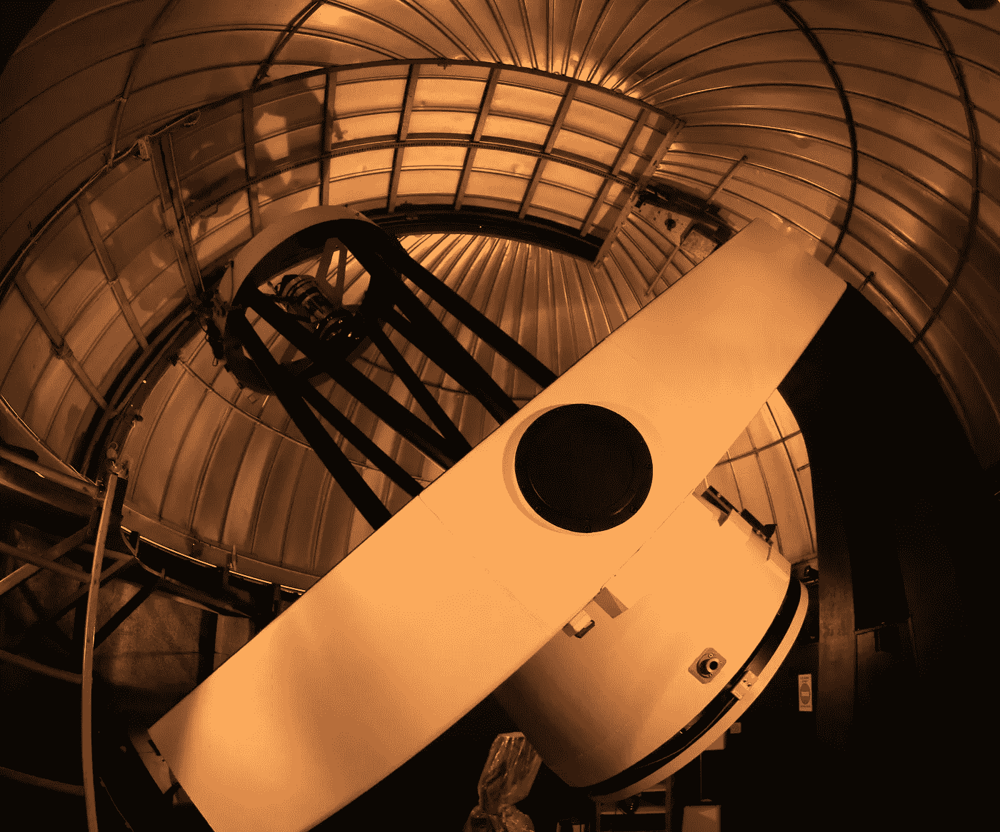

# 用 Python 进行空间科学——小行星计划(四)

> 原文：<https://towardsdatascience.com/space-science-with-python-asteroid-project-part-4-ea1361540033?source=collection_archive---------39----------------------->

## [用 Python 进行空间科学](https://towardsdatascience.com/tagged/space-science-with-python)

## [系列教程的第 24 部分](https://towardsdatascience.com/tagged/space-science-with-python)提供了当前科学项目状态的概述。我们为我们的项目创建了一个开源 Python 库，该库对于未来的科学工作应该是可持续和可扩展的。



C2PU(【https://www.oca.eu/fr/c2pu-accueil】)的两台望远镜之一。C2PU 是法国尼斯附近的一个望远镜站点，与蓝色海岸大学有关联。每个望远镜的直径为 1 米，有几个 CCD 相机，过滤器等。1 米的望远镜绝对足以进行近地天体调查和观测。作者图片(T. Albin)。

# 前言

*这是我的 Python 教程系列“用 Python 进行空间科学”的第 24 部分。教程会话中显示的所有代码都上传到*[*GitHub*](https://github.com/ThomasAlbin/SpaceScienceTutorial)*上。所示的 Python 库 SolarY 也可以在*[*GitHub*](https://github.com/ThomasAlbin/SolarY)*上找到。尽情享受吧！*

# 项目回顾和目的

上一次，我们讨论了如何开发可持续的和(相对)准确且测试良好的代码:例如，通过使用测试驱动开发(TDD)方法。

[](/asteroid-project-part-2-test-driven-development-ed7af6c1820e) [## 小行星计划(第二部分)——测试驱动开发

### 教程系列的第 22 部分继续我们科学项目的第二部分。在我们深入研究 Python 之前…

towardsdatascience.com](/asteroid-project-part-2-test-driven-development-ed7af6c1820e) [](/space-science-with-python-asteroid-project-part-3-d7dc0941a717) [## Python 的空间科学——小行星计划(三)

### 教程系列的第 23 部分继续我们科学项目的第三部分。今天我们将详细介绍…

towardsdatascience.com](/space-science-with-python-asteroid-project-part-3-d7dc0941a717) 

让我们简单回顾一下我们的项目理念和目的:

*   近地物体接近太阳的距离至少为 1.3 个天文单位。这条边界是人为设定的。
*   因此，近地天体的某一亚群体非常接近我们的地球；可能会穿越我们地球的轨道；甚至像 1908 年的通古斯事件或 2013 年的车里雅宾斯克流星那样与之相撞。
*   持续的天空调查已经发现并分类了 24，000 多个近地天体！
*   最近的近地天体群体模型表明，还有成千上万的天体有待发现。
*   由此产生的科学问题和项目理念:*我们能否优化我们望远镜的观测策略？我们应该把望远镜对准哪里？对于一次成功的观测活动，什么是理想的望远镜和照相机设置？*

# 模拟工作流程

我们如何回答这个科学/技术问题？

## 合成近地天体

首先，我们需要一个最新的近地天体群体模型，提供大小和轨道元素的公正分布。Granvik 等人(2018 年)提供了一个很好的数据集，在他们的论文中进行了描述(可在 [arXiv](https://arxiv.org/abs/1804.10265) 上免费获得):

[](https://www.sciencedirect.com/science/article/pii/S0019103517307017) [## 近地天体的去偏轨道和绝对星等分布

### 我们提供了近地天体的四维去偏轨道和绝对星等分布。*型号…

www.sciencedirect.com](https://www.sciencedirect.com/science/article/pii/S0019103517307017) 

格兰维克在自己的网站上免费提供了 80 多万个人工合成的近地天体…

 [## /home/mgranvik/data/Granvik+_ 2018 _ Icarus 的索引

### 编辑描述

www.mv.helsinki.fi](https://www.mv.helsinki.fi/home/mgranvik/data/Granvik+_2018_Icarus/) 

…这将是我们模拟任务的数据基础。

## 模拟观察/检测过程

根据近地天体数据，我们需要模拟整个物体探测流程。挑选一个 NEO，管道必须包含:

*   计算近地天体和地球的位置
*   根据近地天体的大小、反照率和到地球的距离:计算其视星等
*   (可选:考虑望远镜在地球上的位置和大气衰减)
*   将视在星等转换为相应的辐照度(瓦特/平方米)
*   模拟望远镜的光学系统，并考虑其 CCD 设置，如:焦距，孔径，像素大小，芯片的量子效率，曝光时间等。
*   基于以下因素计算信号和噪声:热量、统计散射、热/坏像素、过度曝光等。
*   最后确定近地天体的信噪比，并检查它是否可以被探测到。针对不同的时间戳重新进行模拟。

这一建模将得出结论，即在某一特定(模拟)观测夜晚是否发现了近地天体。近地天体的可探测性因视星等、其在 CCD 芯片上的移动和许多其他影响而异。最后，我们可能会得到一个多维问题的二元结果:*近地天体被探测到了吗？*

在对探测管道建模后，可以模拟各种望远镜设置、CCD 操作模式等，以确定在特定时间框架内可以探测到多少物体。毕竟，这个项目导致了一个模拟工具，但一个复杂问题的明确答案。

# 考虑产品，而不是用例或原型…

无论是在私人编码项目中，在科学和学术界，还是在工业界…一些开发人员和自由时间编码人员喜欢看到快速的结果。他们开发和部署他们称之为“速战速决”的原型。由此产生的仪表板、模拟或数据科学见解乍一看可能会给人留下深刻印象…但是由此产生的技术债务和缺少文档会导致一个“死胡同项目”,其可维护性和可扩展性很低甚至没有。

让我们避免这种**用例/原型**思维，让我们创建一个长期的**产品**，它可能会帮助我们，开源爱好者和空间科学家在未来重用通用和常用的功能。

结果:我们的小行星项目将导致一个新的 Python 库，它将成为这个和未来空间科学相关项目的主干，称为 **SolarY** 。

在过去的几天里，我已经开始建立一个仓库，一些结构元素和模块。这里显示的状态可能只在新的 git-commits 扩展库之前的几天内有效。第一个版本将于今年发布，这将有助于我们实现我们的科学目标。

[](https://github.com/ThomasAlbin/SolarY) [## 托马斯·阿尔宾/索拉瑞

### 此时您不能执行该操作。您已使用另一个标签页或窗口登录。您已在另一个选项卡中注销，或者…

github.com](https://github.com/ThomasAlbin/SolarY) 

为了避免对第三方的依赖，本库应该尽可能多地使用 Python 3 标准库。到目前为止，只有 [*pytest*](https://docs.pytest.org/en/stable/) 目前被用于 TDD 方法。

SolarY 的当前结构:

```
SolarY
+-- solary
|   +-- _config
|   |   +-- __init__.py
|   |   +-- constants.ini
|   +-- asteroid
|   |   +-- __init__.py
|   |   +-- physp.py
|   +-- general
|   |   +-- __init__.py
|   |   +-- astrodyn.py
|   |   +-- photometry.py
|   |   +-- vec.py
|   +-- neo
|   |   +-- _data
|   |   |   +-- __init__.py
|   |   +-- _databases
|   |   |   +-- __init__.py
|   |   +-- __init__.py
|   |   +-- data.py
|   +-- tests
|   |   +-- _temp
|   |   |   +-- __init__.py
|   |   +-- test_SUBMODULE_PY.py
|   |   +-- __init__.py
|   +-- __init__.py
+-- MISC
```

*   ***SolarY***GitHub 上的主存储文件夹。它包含未来的 Python 模块 ***solary*** 和杂项( ***MISC*** )辅助文件，如 license、MANIFEST.in 或 setup.py
*   ***solary*** 主 Python 库文件夹
*   ***_config*** 该文件夹包含存储常数(如引力常数、星等参考等)等信息的配置文件。)
*   ***小行星*** 该文件夹包含与小行星相关的 Python 脚本。到目前为止，已经创建了一个 Python 脚本，其中包含了推导这些对象的内在物理参数的公式

*   *****neo*** 到目前为止，该文件夹包含下载 [NEODyS-2](https://newton.spacedys.com/) 数据的功能，还应包含下载和验证模型数据的功能。数据可以存储在任何本地文件夹或库本身内( ***_data*** )。基于这些数据，可以创建一个 SQLite 数据库用于进一步的数据分析目的( ***_databases*** )**
*   *****测试*** 该文件夹包含所有基于 TDD 的脚本。每个 Python 脚本的结构:***test _ SUBMODULE _ py . py***(例如:test_general_vec.py)。数据下载测试暂时存储在 ***_temp*** 中**

**未来可以为 ***彗星*** s、 ***流星体*** s、 ***流星*** s、宇宙 ***尘埃*** 或者也可以为原位 ***航天器*** 任务和数据添加子模块。**

# **后续步骤**

**在接下来的几天和几周内，安慰期将会延长。将增加近地天体、小行星和望远镜的类别，其中包含所有相关的设置和信息。模拟管道将基于太阳能子模块。**

**近地天体模型数据包含轨道要素。然而，为了计算这些天体的视星等，需要太阳和我们的地球的状态向量。正如在*空间科学与 Python* 的第一期教程中所描述的，NASA 工具包 SPICE 和相应的 Python 包装器 *spiceypy* 是计算这些数据的最佳解决方案。应该避免添加 SPICE 依赖，因此，添加一个小的辅助项目来外包 SolarY 之外的 SPICE 例程。这个“SPICE 外包”的更多细节将在下一个教程中介绍。**

**托马斯**

**推特: [MrAstroThomas](https://twitter.com/MrAstroThomas)**