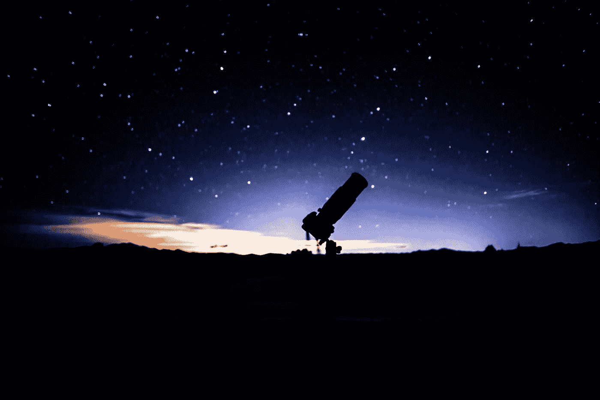
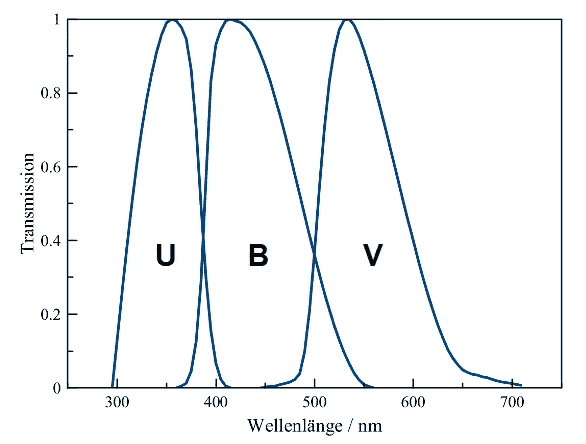
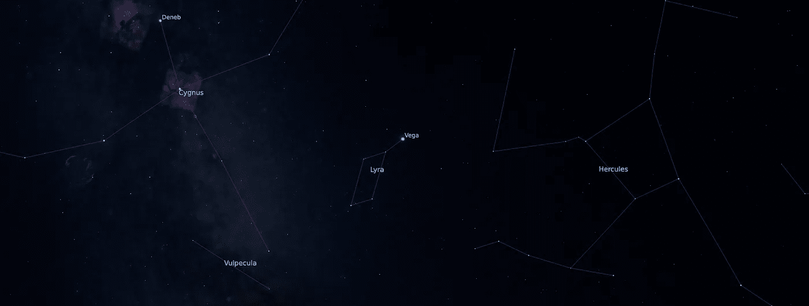
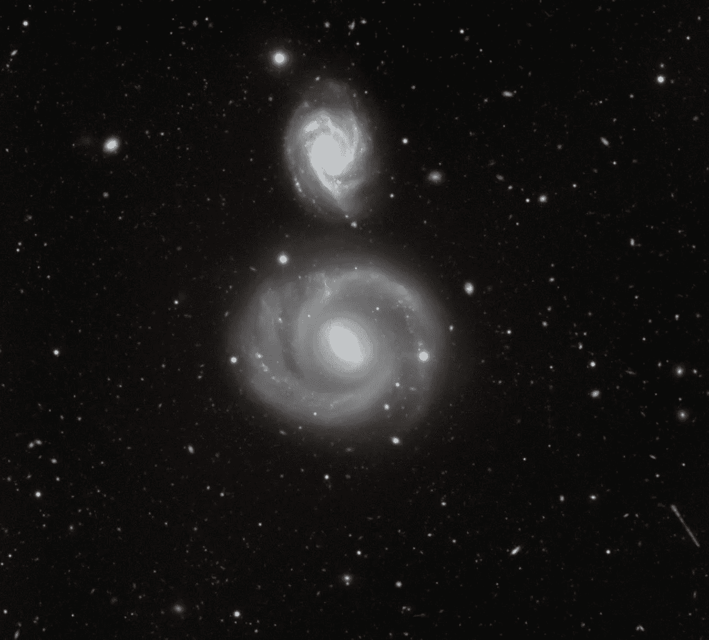

# Python 的空间科学——黑暗天空中的亮点

> 原文：<https://towardsdatascience.com/space-science-with-python-bright-dots-in-the-dark-sky-73909507a0ca?source=collection_archive---------29----------------------->

## [用 Python 进行空间科学](https://towardsdatascience.com/tagged/space-science-with-python)

## [系列教程的第 16 部分](https://towardsdatascience.com/tagged/space-science-with-python)描述了空间科学中另一个重要的基本概念:物体的亮度。



照片由[帕特里克·亨德利](https://unsplash.com/@worldsbetweenlines?utm_source=medium&utm_medium=referral)在 [Unsplash](https://unsplash.com?utm_source=medium&utm_medium=referral) 上拍摄

# 前言

*这是我的 Python 教程系列“用 Python 做空间科学”的第 16 部分。这里显示的所有代码都上传到了*[*GitHub*](https://github.com/ThomasAlbin/SpaceScienceTutorial)*上。尽情享受吧！*

# 看看

你住在哪里？在城市里？在一个乡下小镇？在山里的某个偏僻的地方？

你看了夜空吗？根据你居住的地方，夜空的外观有很大的不同。由于我们的现代生活方式，所谓的光污染抹去了夜晚的织锦:星星。

今晚看看外面。你会看到不同大小和颜色的星星。你可以通过与邻近的恒星进行比较来对恒星的亮度进行分类。哪个更亮，哪个更暗？

# 一个 2000 年前的定义…

古希腊人可能也是如此。由于星座对农业、航海甚至占星术都很重要，他们也开始对星星的亮度进行分类。想法是:最亮的恒星是 1 等星，肉眼几乎看不见的最暗的属于 6 等星。此外，1 个量级的差(短: *mag* 或ᵐ)对应于亮度差的 2 倍。

# …以及现代的重新定义

现代天文学并不局限于肉眼观察，上面的定义也不能在数学上应用，因为它高度依赖于主观感觉。人类的感官或感知大多是对数型的，遵循韦伯-费希纳定律。星等为 1 的恒星看起来比星等为 2 的恒星亮两倍。然而，相应的*实际*通量密度(单位面积功率:W/m)并不是线性比例。

物体(obj)的现代星等定义如下所示，并且总是与参考(ref)源进行比较。 *m* 代表量级，没有维度。 *I* 是对应的磁通密度。


等式 1

亮度计算可能非常复杂，并且取决于科学问题。计算可以考虑立体角、波长或不同的滤光器。

下图显示了标准的 UBV 光度系统，该系统仅显示了所有常用过滤器的一部分。所示的滤光器函数根据光的波长定义滤光器透射率:

*   **U:** 紫外线滤光器的峰值在 364 纳米
*   **B:** 蓝色滤光片的峰值在 442 纳米
*   **V:** 黄色滤光片，或 **V** 视觉滤光片在 540 纳米处达到峰值，可以被视为人类感知的粗略近似值。



UBV 光度系统。绘制了滤光器的透射率与光波长的关系。鸣谢:[迈克尔·奥斯特雷彻(维基百科)](https://commons.wikimedia.org/wiki/File:UBV-System.png)；许可:知识共享[归属-共享 4.0 国际版](https://creativecommons.org/licenses/by-sa/4.0/deed.en)

根据过滤器的不同，对象具有不同的密度通量。简单的过滤关系，如 **B** 减去 **V** 的值表示对象的颜色。负的 **B-V** 值对应于*蓝色*，正的值对应于*红色*颜色。根据这些颜色指数，科学家们可以得出恒星或小行星的基本特性。

*什么是好的参考密度通量？有实际的标准吗？历史上，织女星被定义为 m = 0 的参考星。然而，通量密度因不同的滤波器而异，由于其自然变化，织女星在 V 波段滤波器中的视在星等目前约为 0.03。*



织女星(天琴座的一部分)位于天鹅座和武仙座之间，目前可以在夜空中看到。截图自[星状细胞](https://stellarium.org/de/)。

无论如何，让我们把参考星等设为 0:


等式 2

幸运的是，0 mag 的参考密度通量是由国际天文学联合会在 2015 年定义的。在第二页上写着:

> [……]通过指定 m=0 mag 对应于以下辐照度或热通量密度，来定义表观辐射热量值标度的零点


等式 3

所以，这个值对应于从地球上看到的织女星在 V 波段的通量密度。但是你对这些小数值有*感*吗？10⁻⁸ W/m 似乎是…好吧…让我们把它和可以比较的东西比较一下:我们的太阳。太阳的通量密度(取决于纬度和时间)是每平方米几百瓦。*哇！*这是 11 个数量级(！)大于织女星的通量密度。但是我们认为织女星是夜空中最亮的星星之一。人眼及其感知性能是惊人的。

# 简化事物

让我们把方程 3 的值代入方程 2，求解方程得到物体的通量密度(obj)。我们可以将我们的解决方案近似为:


等式 4

现在，我们可以轻松地在等式中插入一个幅度值(针对 V 波段滤波器),并立即获得以 W/m 为单位的通量密度。如果您想考虑大气衰减(这实际上取决于方位角，但让我们保持简单),您可以用 18.6 代替 19.0。

另一个通量密度参数是表面亮度，单位为平方弧秒。它通常用于*非点状*物体，如星系或彗星。我们将在未来引入并与之合作。与此同时，对于我们未来的教程，我们将继续使用上面显示的等式。我们将计算小行星或流星体的亮度和可见度，以确定它们的可探测性。请考虑天文学家也根据波长计算通量！然而，我们将对 V 波段进行简化。



夜空中不出现一个“点”:星系。这些天体的亮度大多以每平方角秒的数量级给出。上面的星系是 NGC 800，下面是 NGC 799。信用:[ESO](https://www.eso.org/public/unitedkingdom/images/potw1332a/)；许可: [*知识共享署名 4.0 国际许可*](http://creativecommons.org/licenses/by/4.0/)

# 一些动手操作

今天，我们不会针对某个特定的任务。这个基础教程应该给我们一些感觉和理解这个基本的亮度概念。让我们计算并可视化一些值，并创建一个查找表。

对于这个会话，我们只需要 [*pandas*](https://pandas.pydata.org/) 和 [*numpy*](https://numpy.org/) 并创建一个空的 dataframe 来存储查找数据(第 3 行)。

第 1/6 部分

让我们创建一些函数。由于我们将在未来的教程中使用亮度计算，函数可以很容易地重用和存储在一些额外的脚本中。编码部分 2/6 是一个将量值分别转换为通量密度和辐照度(W/m)的函数。可选输入参数 *use_attn* 触发(如有要求)第 23 至 27 行中的 if-else 子句，以添加大气衰减系数。等式 4 在第 31 行给出，之后返回。

第二部分/第六部分

辐照度可以很容易地通过应用以 m 为单位给出的面积转换成功率。这样的面积可以代表望远镜的反射镜尺寸。功率在第 19 行计算。

第 3/6 部分

最后，功率乘以时间为我们提供了以焦耳为单位的能量(第 21 行)。时间可以表示照相机(如电荷耦合器件:CCD)的曝光时间。

第 4/6 部分

让我们针对-2 到+7 的星等范围(人眼可见恒星的范围，在行 2 中定义)计算示例性的查找表。幅度被添加到第 5 行的列中。第 8 行到第 9 行和第 12 行到第 13 行计算了有和没有大气衰减时相应的辐照度。最后，我们打印查找表。让我们来看看。

第 5/6 部分

大约 8 mag 的范围覆盖了辐照度的 3 个数量级。所应用的衰减因子将通量密度降低了约 40 %。

```
magnitude  irradiance [W/m^2]  irradiance attn [W/m^2]
0       -2.0        1.584893e-07             2.290868e-07
1       -1.0        6.309573e-08             9.120108e-08
2        0.0        2.511886e-08             3.630781e-08
3        1.0        1.000000e-08             1.445440e-08
4        2.0        3.981072e-09             5.754399e-09
5        3.0        1.584893e-09             2.290868e-09
6        4.0        6.309573e-10             9.120108e-10
7        5.0        2.511886e-10             3.630781e-10
8        6.0        1.000000e-10             1.445440e-10
```

在没有电脑或平板电脑的情况下，查找表有时是夜间观察的有用工具。随意添加更多的参数来创建一个更详细和复杂的列表(例如，如果你有一个望远镜，你可以考虑镜子的收集面积，或考虑某些曝光时间)。

第六部分

# 结论与展望

今天的课程是天文学和空间科学中亮度计算的基础教程。对数定义(等式 1)可能会令人困惑，但可以简化，如等式 4 所示。

在日常科学工作中，天文学家使用等式 1 来确定未知小行星的大小。他们使用巨大的星表，用不同的过滤器列出几颗恒星的星等。通过比较未知小行星的亮度和近距离出现的恒星的亮度，可以很容易地确定小行星的大小。

在未来的教程中，我们将使用我们的函数来计算小行星、彗星和流星的亮度值。我们还将对小行星的完整*探测链*进行建模(从小行星表面反射的太阳光，到连接在望远镜上的相机生成的 8 位图像)。

***别忘了:6 月 30 日是小行星日！我们将从小行星和近地天体会议开始！***

托马斯