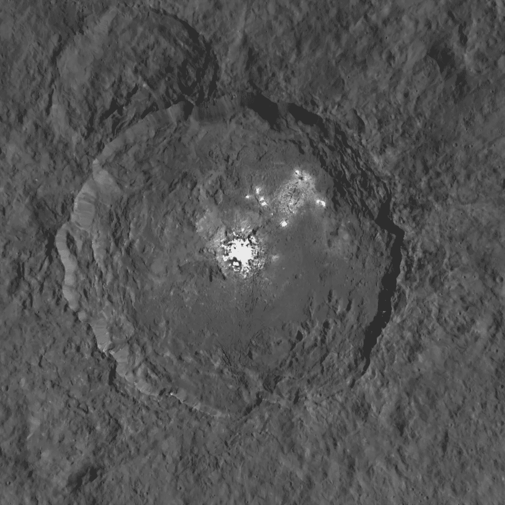
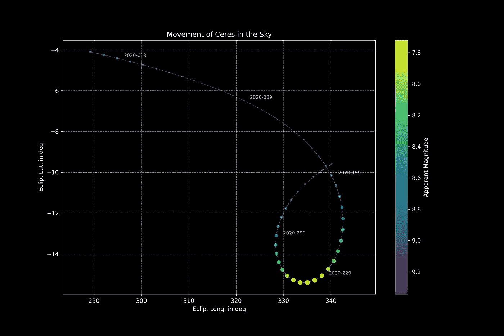

# Python 下的空间科学——天空中的谷神星

> 原文：<https://towardsdatascience.com/space-science-with-python-ceres-in-the-sky-fec20fee3f9d?source=collection_archive---------60----------------------->

## [用 Python 进行空间科学](https://towardsdatascience.com/tagged/space-science-with-python)

## [系列教程的第 20 部分](https://towardsdatascience.com/tagged/space-science-with-python)链接了上一系列教程中的各种概念来理解主带中最大的小行星的运动和亮度发展:(1)谷神星



谷神星最亮的地方，嵌入奥卡托陨石坑。黎明号飞船拍摄的图像。鸣谢:美国宇航局/JPL 加州理工学院/加州大学洛杉矶分校/MPS/德国航天中心/国际开发协会；许可: [*知识共享署名 4.0 国际许可*](http://creativecommons.org/licenses/by/4.0/)*；出自:* [*ESO*](https://www.eso.org/public/unitedkingdom/images/eso1609b/?lang)

# 前言

*这是我的 Python 教程系列“用 Python 进行空间科学”的第 20 部分。这里显示的所有代码都上传到了*[*GitHub*](https://github.com/ThomasAlbin/SpaceScienceTutorial)*上。尽情享受吧！*

# 到目前为止我们学到了什么

我希望你喜欢过去的几周，在那里你学到了在*空间科学*中使用的基本原理、方法、Python 库和理论概念。我们的总体目标是:成为一名公民太空科学家，专注于有趣的太阳系主题。

一开始，我们学习了如何设置和安装我们需要的 Python 模块；尤其是 NASA 的工具包 [SPICE](https://naif.jpl.nasa.gov/naif/) 。工程师和科学家正在使用 SPICE 来规划和预测例如航天器轨迹和仪器方向。它还可以用来确定行星、小行星等物体的位置和速度分量。

[](/space-science-with-python-setup-and-first-steps-1-8551334118f6) [## 使用 Python 的空间科学-设置和初步步骤

### 成为公民太空科学家的入门指南

towardsdatascience.com](/space-science-with-python-setup-and-first-steps-1-8551334118f6) 

科学主题也包含在文章系列中，比如几周前金星的运动和相位角计算…

[](/space-science-with-python-the-dance-of-venus-926905875afb) [## Python 下的空间科学——金星之舞

### 本系列教程的第 4 部分将介绍如何确定拍摄金星和月球照片的最佳时机

towardsdatascience.com](/space-science-with-python-the-dance-of-venus-926905875afb) 

…天空坐标的确定和可视化…

[](/space-science-with-python-space-maps-747c7d1eaf7f) [## 使用 Python 的空间科学-空间地图

### 教程系列的第 5 部分显示了如何计算和理解坐标系，用于所有即将到来的…

towardsdatascience.com](/space-science-with-python-space-maps-747c7d1eaf7f) 

…或者根据常用公式计算小行星的表观星等(亮度)。

[](/space-science-with-python-bright-dots-in-the-dark-sky-73909507a0ca) [## Python 的空间科学——黑暗天空中的亮点

### 本系列教程的第 16 部分描述了空间科学中另一个重要的基本概念:物体的亮度。

towardsdatascience.com](/space-science-with-python-bright-dots-in-the-dark-sky-73909507a0ca) 

这些方程是根据经验推导出来的。简单地“看”一下这个公式并不能得出任何东西。需要研究方程以完全理解它们所描述的效应，例如，对立效应。

[](/space-science-with-python-a-very-bright-opposition-62e248abfe62) [## Python 与空间科学——一个非常鲜明的对立

### 教程系列的第 19 部分深入小行星研究:小行星的亮度是如何变化的？什么…

towardsdatascience.com](/space-science-with-python-a-very-bright-opposition-62e248abfe62) 

我们已经涵盖了可以联系在一起的主题，使我们能够更深入地研究科学主题。今天，我们将视在星等、相角和距离计算联系在一起。我们将绘制 2020 年全年从地球上看到的谷神星运动和亮度变化的结果。

我认为，通过今天的课程，我们已经准备好了我们的第一个科学项目，这个项目将在最后简要介绍。

# 链接知识

我们开始吧。首先，我们从导入我们在上一节课中使用的所有必要模块开始。因为我们需要确定对象之间的距离和相位角，所以我们通过一个内核元文件(第 8 行)导入一些 SPICE 内核文件。视在星等的等式([参见上次](/space-science-with-python-a-very-bright-opposition-62e248abfe62)的会话)存储在第 13 行和第 14 行加载的辅助 Python 脚本中。 ***请注意:*** [***从 NAIF 页面手动下载 spk 内核代码 _300ast_20100725.bsp，保存在项目的文件夹 _kernels/spk 中。***](https://naif.jpl.nasa.gov/pub/naif/generic_kernels/spk/asteroids/)

第 1/9 部分

根据小行星 spk 内核*codes _ 300 ast _ 2010 07 25 . bsp*[文档](https://naif.jpl.nasa.gov/pub/naif/generic_kernels/spk/asteroids/aa_summaries.txt)谷神星 NAIF ID 为 200001(第 2 行)。对于视星等的计算，我们还需要谷神星的两个固有特性:

*   绝对震级(第 7 行)
*   斜率参数 G(第 8 行)

这两个参数都可以在 NASA / JPL 小天体数据库中找到:

 [## JPL 小型数据库浏览器

### 隐藏轨道图] [恢复到旧的基于 Java 的查看器]历元 2458600.5(2019-4-27.0)TDB 时的轨道要素…

ssd.jpl.nasa.gov](https://ssd.jpl.nasa.gov/sbdb.cgi?sstr=1;orb=1;old=0;cov=0;log=0;cad=0#phys_par) 

第 2/9 部分

所有结果应存储在数据帧(第 2 行)中，我们计算的时间范围应为 2020 年。让我们为一年中的每一周设置一个日期时间(第 7 行)。对于后面的绘图例程，我们将绘制正在生成并存储在第 13 行中的日期( *strftime* 函数中的 *%j* )。

最后，我们使用 SPICE 函数 [utc2et](https://naif.jpl.nasa.gov/pub/naif/toolkit_docs/C/cspice/utc2et_c.html) 将日期时间转换为第 16 行和第 17 行中相应的星历时间(ETs)。

第 3/9 部分

对于视星等的计算，我们需要谷神星和太阳/地球之间的距离，以及相位角(编码部分 5/9)。对于距离计算，我们使用 SPICE 函数[spk GPS](https://naif.jpl.nasa.gov/pub/naif/toolkit_docs/C/cspice/spkgps_c.html)；产生的位置向量在 [vnorm](https://naif.jpl.nasa.gov/pub/naif/toolkit_docs/C/cspice/vnorm_c.html) 中使用，以确定向量的范数(长度);最后， [convrt](https://naif.jpl.nasa.gov/pub/naif/toolkit_docs/C/cspice/convrt_c.html) 用于将以 km 为单位的距离转换为 AU。

我们对谷神星—太阳(第 3 行到第 11 行)和谷神星—地球(第 15 行到第 23 行)应用了两次函数。

第 4/9 部分

使用函数 [phaseq](https://naif.jpl.nasa.gov/pub/naif/toolkit_docs/C/cspice/phaseq_c.html) 可以很容易地计算出相位角。该功能需要以下输入:

*   **et** :所需计算时间的 et
*   **目标**:目标对象(这里是:Ceres ID)
*   **illmn** :照明物体(这里是太阳)
*   **obsrvr** :观测对象(此处:地球)
*   **abcorr** :任意像差校正。这里，我们不应用校正

请注意两点:首先，这次 NAIF IDs 不是整数，而是字符串。该函数不能处理任何数值。第二，输入参数*目标*、 *illmn* 和 *obsrvr* 显得有些混乱:*术语“目标”和“观察者”是如何定义的？*

SPICE 文档中的一个简单草图提供了定义的答案:

```
 ILLMN      OBS
       ILLMN as seen      ^       /
       from TARG at       |      /
       ET - LT.           |     /
                         >|..../< phase angle
                          |   /
                        . |  /
                      .   | /
                     .    |v     TARG as seen from OBS
               SEP   .   TARG    at ET
                      .  /
                        /
                       v

        PI = SEP + PHASE

        so

        PHASE = PI - SEP
```

第 10 行和第 11 行将角度从弧度转换为角度。

第 5/9 部分

我们现在有了计算谷神星视星等所需的所有参数:

*   谷神星和地球之间的距离
*   谷神星和太阳之间的距离
*   从谷神星看到的日地相角
*   谷神星的斜率参数 G
*   谷神星的绝对星等

对于每个时间步长，第 2 行到第 9 行计算视在幅度。上次介绍了功能 *app_mag* :

第 6/9 部分

相应的天空坐标应在黄道 J2000 参考坐标系中计算。因此，我们确定了谷神星在*eclipse j2000*中的位置向量，并使用 [recrad](https://naif.jpl.nasa.gov/pub/naif/toolkit_docs/C/cspice/recrad_c.html) 分别计算了第 2 行到第 7 行和第 10 行到第 15 行的经度和纬度值。最后，弧度值被转换成度数(第 18 行和第 19 行以及第 21 行和第 22 行)。

第 7/9 部分

*我们如何将数据可视化？嗯，我们有天空坐标和亮度值，可以放入一个单独的天空地图(或天空地图的一部分)。对应于亮度值的坐标可以缩放点的大小，以更好地感受视在亮度如何随时间变化。然而，较小的视星等对应着较亮的天体。用幅值来缩放点在某种程度上会有违直觉:更亮的外观会导致更小的点。让我们通过引入一个简单的缩放方法来改变这个问题。*

我们稍后将使用 [scikit-learn](https://scikit-learn.org/stable/) ，所以我们首先导入它(第 9 行)。第 13 行和第 14 行基于最小幅度值缩放幅度值。例如:最小星等 5 会变成 1，更大的星等会变得小于 1。

结果值现在在 0 和 1 之间缩放。为此，我们使用 [*最小最大缩放器*](https://scikit-learn.org/stable/modules/generated/sklearn.preprocessing.MinMaxScaler.html) (第 17 行)，拟合缩放器(第 20 行)并在第 23 行转换我们的“预缩放”值。现在，我们将得到的数组乘以一个介于 0 和 1 之间的常数，以提高点大小的可见性。结果存储在数据帧中(第 30 行)。

第 8/9 部分

我们准备好绘制结果了！使用散点图(第 12 行到第 18 行)来显示谷神星在每个时间点的位置。这些点用白色虚线连接(第 21 到 27 行)以提高可读性。现在，通过第 31 行和第 44 行之间的 for 循环，我们为每 10 个时间步长添加一个日期时间字符串。这有助于我们看到谷神星的运动方向。

由于较小的星等对应于较亮的外观，我们将散点图的彩条反转到第 56 行。在进一步格式化之后，我们存储结果图。让我们来看看:

第九部分

你可以看到一张星图的一部分，用黄道 J2000 坐标给出。黄道纬度是相对于黄道经度以度为单位绘制的。路径显示了从我们的母星看到的谷神星的轨迹，圆点代表不同的日期时间(每周一次)。点的大小与视在星等明显成比例，也用颜色编码。视星等范围从 7.6 到 9.4 mag 左右；几乎覆盖了两个数量级。

谷神星的运动在某个点出现“逆行”。同时，亮度增加，达到最大值，然后降低。这种明显的运动是物体在相对于地球的相对阶段所特有的。这种“对立循环”只是一种观察效果，并不对应任何运动变化。在以后的补充文章中，我们将更深入地描述这一运动。



谷神星在黄道坐标中的运动。该轨迹适用于 2020 年全年从地球上看到的观测。每个点代表谷神星在某一年某一周的位置。大小和颜色与物体的表观亮度相对应。贷方:T. Albin

与此同时，YouTube 频道 *Vox* 有一个关于这个话题的很好的解释视频:

# 下一步:小行星科学项目

我希望你有一些时间来消化所有的主题，方法，编程部分和来自最后 20 个教程的理论！我也希望你能像我喜欢写这些教程一样喜欢阅读它。当我在学术界、公共宣传、教育、演讲等领域工作时。太有趣了！我想继续下去。

有了你现在拥有的知识，我们可以瞄准我们的第一个空间科学项目。它将是关于小行星和近地物体。我们将在一系列链接的文章中做一些研究、编程、分析和解释。我们将共同致力于一个科学项目，评估所有潜在危险物体*的可探测性和可见性。我们将使用文献中的实际数据和模型数据来回答这个问题，有多少物体存在…*隐藏…* 但是危险？有没有一种有效的方法来提高对未知物体的探测？下一次，我们将从理论的角度开始这个话题。*

与此同时:保持好奇

托马斯