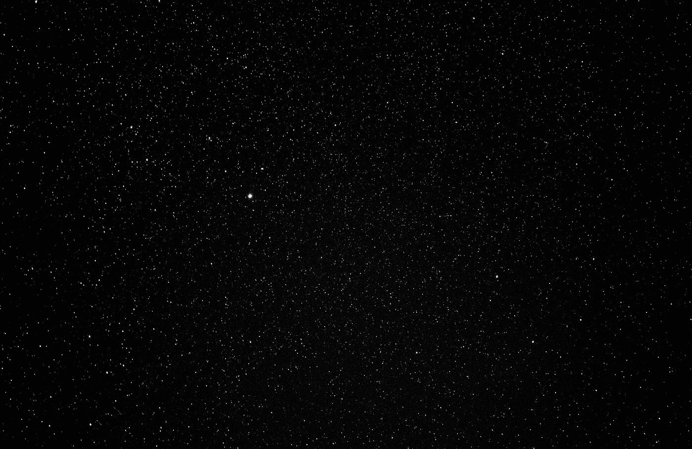
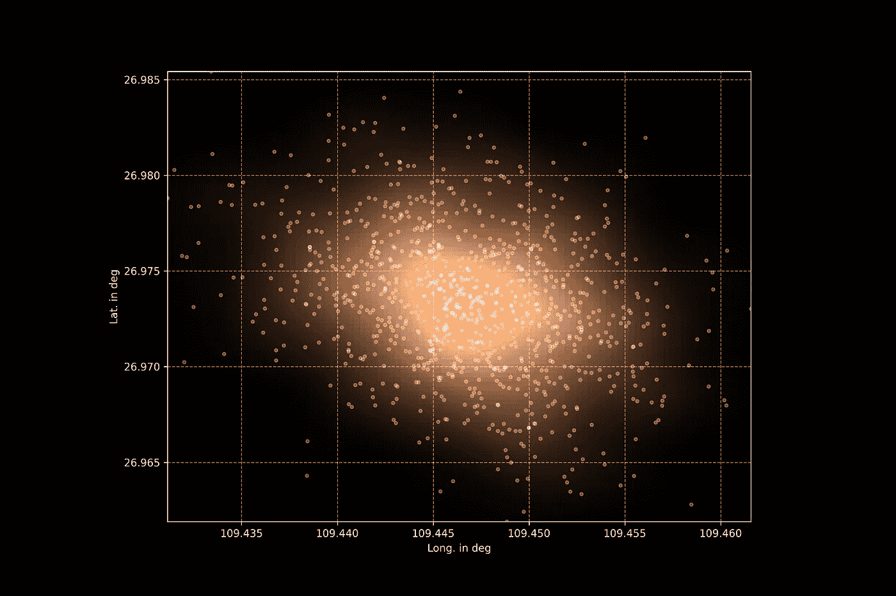

# 使用 Python 的空间科学—天空中的密度估算器

> 原文：<https://towardsdatascience.com/space-science-with-python-density-estimators-in-the-sky-87fbcfb089a6?source=collection_archive---------52----------------------->

## [用 Python 进行空间科学](https://towardsdatascience.com/tagged/space-science-with-python)

## [教程系列的第 18 部分](https://towardsdatascience.com/tagged/space-science-with-python)继续我们上次的结果。既然我们现在知道如何确定小行星位置的误差线:它如何影响天空坐标？



小行星和恒星的位置确定从来不是完美的，并且包含例如测量误差。照片由[杰里米·帕金斯](https://unsplash.com/@jeremyperkins?utm_source=medium&utm_medium=referral)在 [Unsplash](https://unsplash.com?utm_source=medium&utm_medium=referral) 上拍摄

# 上次

上周是小行星日！引入这一天是为了提醒我们，宇宙威胁是真实存在的……不仅对恐龙来说如此，近几十年来也是如此，如 1908 年的通古斯事件或 2013 年的车里雅宾斯克流星。

[](/space-science-with-python-uncertain-movements-of-an-asteroid-f651b94f7008) [## Python 的空间科学——小行星的不确定运动

### 教程系列的第 17 部分。今天(6 月 30 日)是小行星日，我们将开始深入研究…

towardsdatascience.com](/space-science-with-python-uncertain-movements-of-an-asteroid-f651b94f7008) 

观测调查、跟踪测量、模拟等等都需要对我们非常接近的宇宙进行编目和理解。目前，没有更大的物体与我们的蓝色星球发生直接碰撞。然而，观测误差通过数据传播，并不允许我们以 100 %的准确度确定一个物体的位置。误差线取决于观测次数、观测条件、总观测时间、到天体的距离、其运动和亮度以及其他因素。是多维度的误差，只能面对*越来越多甚至更多的数据*。

幸运的是，2020 JX1 是一颗*【好】*小行星，并且最近飞越期间的误差棒非常小(考虑到宇宙尺度)。

但是 X，Y 和 Z 坐标对我们没有任何帮助…我们需要为我们的望远镜设置黄道，赤道或方位角坐标。此外，我们有一个笛卡尔坐标的解空间。*如何将这个解空间平移到一个合适的黄道坐标系函数？*一起来看看吧！

[](/space-science-with-python-space-maps-747c7d1eaf7f) [## 使用 Python 的空间科学-空间地图

### 教程系列的第 5 部分显示了如何计算和理解坐标系，用于所有即将到来的…

towardsdatascience.com](/space-science-with-python-space-maps-747c7d1eaf7f) 

# 多维核密度估计量

[scikit-learn](https://scikit-learn.org/stable/) 是数据科学和机器学习算法的绝佳资源。该库包括分类、降维、特征工程和聚类方法。复杂的文档提供了各种用例的示例:一个示例涵盖了球坐标中的核密度估计器(kde)的应用。此示例使用所谓的哈弗辛度量，而不是欧几里得度量，该度量应用于以弧度表示的经度和纬度值:

[](https://scikit-learn.org/stable/auto_examples/neighbors/plot_species_kde.html) [## 物种分布的核密度估计- scikit-learn 0.23.1 文档

### sci kit-learn:Python 中的机器学习

scikit-learn.org](https://scikit-learn.org/stable/auto_examples/neighbors/plot_species_kde.html) 

黄道经纬度坐标的 KDE 似乎很合适:走吧。

对于本教程，我们使用已经引入的库 [numpy](https://numpy.org/) 、 [pandas](https://pandas.pydata.org/) 、 [tqdm](https://tqdm.github.io/) 和 [maptlotlib](https://matplotlib.org/) 。然后我们加载上次创建的数据(该文件也是 [GitHub 存储库](https://github.com/ThomasAlbin/SpaceScienceTutorial/tree/master/part17)的一部分)。

第 1/8 部分

现在，我们使用 numpy 函数 [*弧度*](https://numpy.org/doc/stable/reference/generated/numpy.radians.html) 将黄道经度和纬度值转换为弧度。

第 2/8 部分

有几种方法可以确定 KDEs 的最佳带宽:交叉验证、网格搜索或使用简单的经验法则，如 Scott 法则。我们来看看斯科特法则，它不仅与样本数量成比例，还与标准差成比例。我们计算经度和纬度值的标准偏差:

第 3/8 部分

经度值的标准偏差比纬度值高 50 %。因此，经验法则会导致两种不同的带宽。目前，scikit-learn KDE 方法没有考虑不同维度的不同带宽…

```
Standard deviation of the longitude in radians: 9.018716e-05
Standard deviation of the latitude in radians: 6.60280e-05
```

Python 中还有其他的 KDE 实现吗？很幸运，是的！ [statsmodels](https://www.statsmodels.org/stable/index.html) 提供了几个统计和统计数据探索的功能。statsmodels 的 KDE 部分提供了 KDE 的多变量版本:

 [## stats models . parameter . kernel _ density。kdemulativariate-stats 模型

### 编辑描述

www.statsmodels.org](https://www.statsmodels.org/stable/generated/statsmodels.nonparametric.kernel_density.KDEMultivariate.html) 

带宽计算可以通过一些经验法则或交叉验证来完成。然而，目前还没有实现哈弗辛度量支持。

因此，这两种方法各有利弊:

*   **scikit-learn 的 KDE** :提供不同度量的复杂输入参数；但是没有多维带宽输入
*   **statsmodel 的 KDE** :有多元备选；但是不包含其他度量。

用户需要确定它的需求和目标。*哪些权衡是可以接受的？人需要什么？*这些问题很难回答，作为一名(数据)科学家，我们必须记录每一个决定和考虑。

在我们的例子中，球面变形不会严重影响我们的结果。数据点非常接近黄道平面，解空间在几弧分之内。我们在第 5 行导入所需的 statsmodels 子模块，在第 8 行获取经度和纬度值，并在第 11 到 13 行使用正常的参考输入训练 KDE 模型。

第 4/8 部分

让我们打印带宽结果:

第 5/8 部分

```
Bandwidth longitude in radians (normal ref.): 3.02309e-05
Bandwidth latitude in radians (normal ref.): 2.21327e-05
```

*不同的带宽确定方法会得到不同的带宽结果吗？*让我们用交叉验证重新计算模型(第 4 行),并打印结果:

第 6/8 部分

事实上，由此产生的经度带宽变小，纬度带宽变大！两个值几乎相似，可以考虑 scikit-learn 的哈弗辛方法。无论如何，我们坚持正常的参考解决方案。

```
Bandwidth longitude in radians (cv_ml): 2.78430e-05
Bandwidth latitude in radians (cv_ml): 2.51614e-05
```

在最后一步中，我们希望将结果可视化在图中。statsmodels 为我们的 KDE 模型提供了预测功能。但是，我们需要 matplotlib 函数 [*imshow*](https://matplotlib.org/3.1.1/api/_as_gen/matplotlib.pyplot.imshow.html) 的某种输出格式。这个函数将允许我们可视化这个三维 KDE(经度，纬度加上概率密度函数(pdf))。

计算需要在“纬度切片”中完成。我们在 for 循环中遍历纬度解决方案空间(下面的第 8 行)，并计算整个经度解决方案空间的 pdf(第 15 到 19 行，第 22 行的计算)。最终结果存储在占位符数组中(在第 4 行定义，存储在第 25 行)。最后，该数组被转换成一个 numpy 数组(第 28 行)。在第 31 行，我们需要反转得到的数组，因为我们从最小纬度值开始:然而，matplotlib 的 *imshow* 逻辑是从上到下的。

第 7/8 部分

现在我们可以将 pdf 和原始经度/纬度数据点绘制成散点图。在第 2 行设置黑暗模式，在第 5 行定义图形。数据点的散点图在第 8 到 10 行生成，第 14 到 19 行的 *imshow* 函数绘制了基于 KDE 的 pdf。最后，我们设置一个网格(第 22 行)并去掉科学符号(第 25 和 26 行)。设置标签(第 29 行和第 30 行),得到的图存储在第 33 行。让我们来看看:

第八部分

该图显示了黄道纬度和黄道经度的度数。白点代表原始数据:它们代表小行星 2020 JX1 在 2020 年小行星日午夜可能的天空坐标。背景中的彩色地图是生成的 KDE pdf。与较暗的区域相比，较亮的颜色对应于较高的出现/检测概率。因此，后续望远镜需要在这个特定的时间覆盖这个不确定的区域，以探测小行星！



黄道纬度和黄道经度，以度为单位。白点代表小行星 2020 JX1 在 2020 年小行星日午夜可能的天空坐标！产生的不确定性区域基于多元 KDE，并在背景中进行颜色编码:明亮的颜色代表较高的概率。

# 结论

不同的 KDE 实现具有上面列出的不同优点和缺点。虽然在我们的例子中我们没有考虑哈弗辛度规，但是得到的 KDE pdf 看起来相当合适。离散解空间散点图被转换为不确定区域。在这个不确定的区域内，望远镜操作员需要识别一个移动的物体:我们的小行星 2020 JX1！考虑到小行星的速度矢量，天空中的明显运动也可以计算出来。但是这个任务是作为一个小的编程作业留给你的。

请注意，不确定性的范围相当小。还有更糟糕的情况，望远镜操作员和天文学家不得不大海捞针。我们谈论的不是几个，而是数百个物体。无论是现在还是将来，都需要持续的操作和科学工作来保护我们和我们的地球免受不必要的恒星访客的侵扰。

托马斯