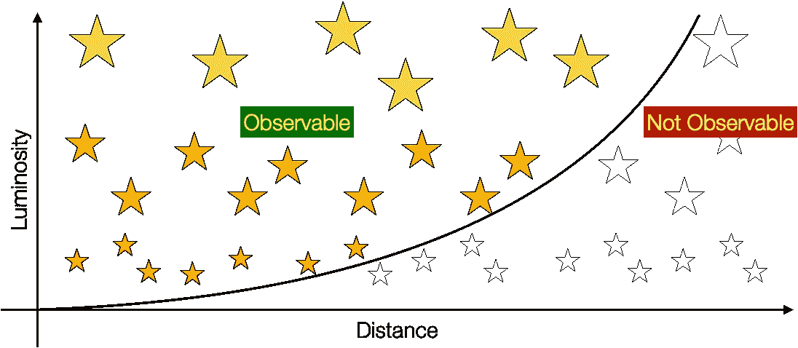
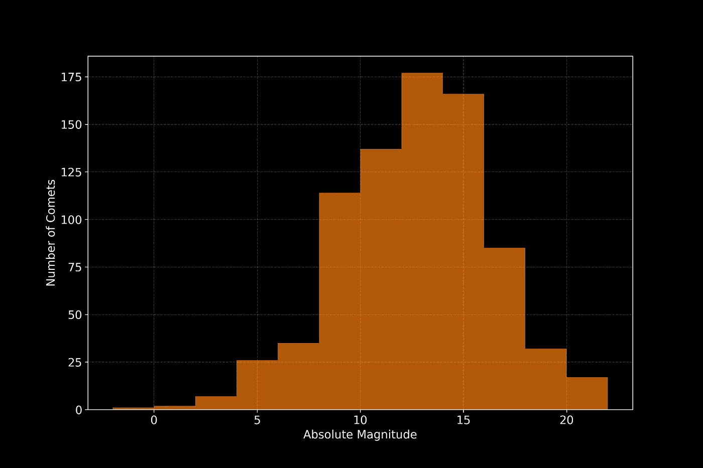
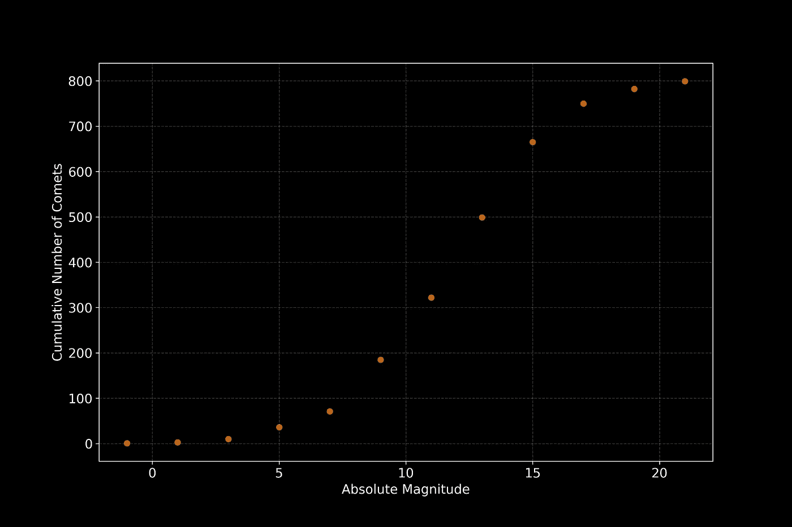
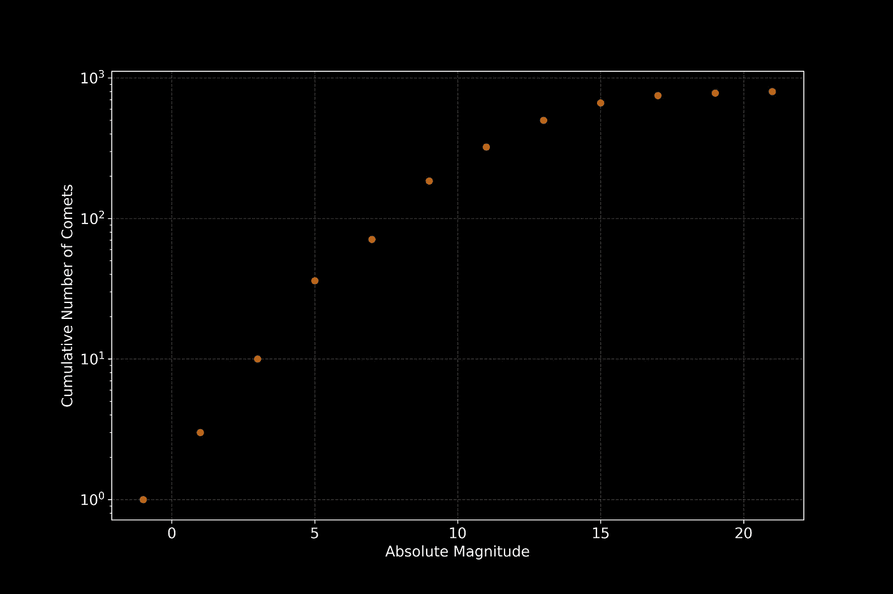
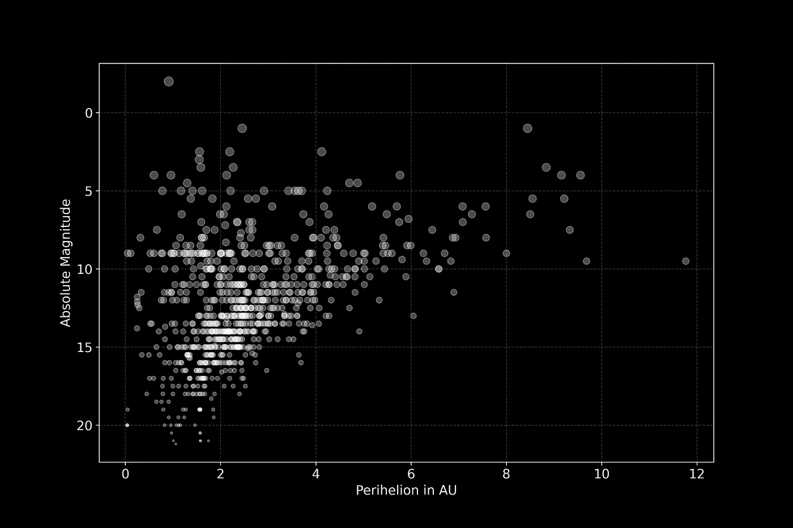

# Python 的空间科学——我们观察到一切了吗？

> 原文：<https://towardsdatascience.com/space-science-with-python-did-we-observe-everything-617a8221e750?source=collection_archive---------75----------------------->

## [用 Python 进行空间科学](https://towardsdatascience.com/tagged/space-science-with-python)

## [系列教程的第 11 部分](https://towardsdatascience.com/tagged/space-science-with-python)是关于数据科学家和空间科学家的噩梦:统计偏差！


艺术家对我们的邻居比邻星周围的尘埃和碎片盘或带的印象。我们的太阳系有主带、柯伊伯带和奥尔特云。我们观测到所有奥尔特云彗星了吗？信用:[ESO/m . Kornmesser](https://www.eso.org/public/unitedkingdom/images/eso1735a/)；许可: [*知识共享署名 4.0 国际许可*](http://creativecommons.org/licenses/by/4.0/)

# 前言

*这是我的 Python 教程系列“用 Python 进行空间科学”的第 11 部分。这里显示的所有代码都上传到了*[*GitHub*](https://github.com/ThomasAlbin/SpaceScienceTutorial)*上。尽情享受吧！*

*本教程的数据库已经在* [*上一届*](/comets-visitors-from-afar-4d432cf0f3b) *中创建，但也上传到我的* [*GitHub 资源库*](https://github.com/ThomasAlbin/SpaceScienceTutorial/tree/master/_databases/_comets) *中。*

# 介绍

生活在德国的人的平均年龄是多少？为了回答这个问题，我去了我家乡的大学，调查了所有学生的年龄分布。然后我计算平均值，就完成了。答案和结论:23 年；德国是一个令人惊讶的年轻国家！

[官方数字](https://www.destatis.de/DE/Themen/Gesellschaft-Umwelt/Bevoelkerung/Bevoelkerungsstand/Tabellen/durchschnittsalter-zensus.html)然而说平均年龄在 40 岁以上……*怎么回事？*

大概你是怀疑我的数据采集方法和分析。我想确定所有德国公民的平均年龄。我没有分析大型的随机群体或获取所有居民的官方数据，而是选择了一种完全不恰当的调查方法，扭曲了我的结果。当然，青年学生在大学的年龄分布根本不代表全国范围的年龄分布！我执行了所谓的*选择偏差*。

当您获取数据时，偏差无处不在:由于有偏差的观察、有偏差的仪器(由于它们的限制或校准)，或者由于使用错误的统计方法(例如，使用非对称分布的标准偏差)。

数据科学面临的挑战是*消除数据偏见*并得出可行的统计结果和见解。*在机器学习中也需要无偏*，例如，当分类器需要不同类别的均匀分布来进行训练和验证时。

但是在我们的彗星数据库中，我们有 T4 选择偏差吗？让我们通过一步一步的数据探索之旅来看看天文学和空间科学中的偏差效应！

# Malmquist 偏差


你看见多少颗星星？什么样的明星？照片由[杰瑞米·托马斯](https://unsplash.com/@jeremythomasphoto?utm_source=medium&utm_medium=referral)在 [Unsplash](https://unsplash.com?utm_source=medium&utm_medium=referral) 上拍摄

看夜空。你看到了什么？行星，我们的银河系，有时是一颗流星，当然还有真正的恒星。这些星星位于不同的距离。例如，我们最近的邻居比邻星距离我们大约 4.2 光年。

恒星的表观亮度(即从地球上看到的亮度)取决于距离以及恒星本身的内在光度。这种内在亮度被称为绝对星等，描述了一颗恒星在 10 秒差距(约 32.5 光年)距离内的光度。因此，绝对星等将恒星的亮度与特定距离归一化，并允许天文学家在光度尺度上比较恒星。在我们的宇宙附近，有更小、更暗以及更大、更亮的恒星。

重新考虑我们和恒星之间的距离意味着，在一定距离内，亮度较暗的恒星比亮度较亮的恒星更难被探测到。这造成了观测偏差，可能导致错误的结论，即宇宙中有更多更亮的物体。

瑞典天文学家 Gunnar Malmquist 在 1922 年首次描述了这个想法[1]。观测结果必须是无偏见的，以防止这种对较亮物体的高估。



Malmquist 偏差的可视化示意图。这张草图显示了恒星的内在光度与它们到观察者的距离。较大的距离导致较暗恒星的可探测性较差。观察偏差导致“可观察”和“不可观察”的物体。贷方:T. Albin

这是否也适用于太阳系天体，比如彗星？如果是，这种偏差的关键参数是什么？让我们来了解一下。

# 我们的彗星数据集有偏差吗？

我们今天的课将使用已经 knwon 模块。稍后，我们需要可以通过 *pip* 轻松安装的包[*scikit-learn*](https://scikit-learn.org/stable/)*:*

```
*pip3 install scikit-learn*
```

*不要担心，我们将从这个强大的数据科学包轻松开始。目前，我们只需要一个简单的线性回归模型来帮助我们揭示一些重要的见解。*

*但是首先要做的是…*

*第 1/9 部分*

*那么在我们的彗星数据集中，什么样的偏差可以对应于恒星物体的 Malmquist 偏差呢？Malmquist 用一个内在光度，即绝对星等来描述和比较这些恒星。*彗星有对等物吗？**

*您可能已经注意到，我们的 comet 数据库中确实有一个列包含了所需的绝对星等。然而，这些数值对彗星和恒星的定义是不同的！为了计算一颗彗星的视星等(亮度),我们使用了一个取决于彗星活动(除气作用、尘埃产生)、到我们地球的距离以及到太阳的距离的方程。此外，需要考虑从地球上看到的太阳和彗星之间的相位角。绝对星等只是一个与彗星大小相关的偏移参数(*)。假设所有的彗星都有相同的反射率，那么绝对星等就可以用来比较大小。重要:大小和绝对星等负相关；较大的数字对应较小的彗星，反之亦然。*

*我们用 [*pandas*](https://pandas.pydata.org/) 的 [*read_sql*](https://pandas.pydata.org/pandas-docs/stable/reference/api/pandas.read_sql.html) 命令从数据库(第 3 行)的第 7 行到第 9 行提取绝对星等(为了后面的目的也包括近日点)。*

*第 2/9 部分*

*做科学意味着，探索数据:所以让我们先通过打印一些描述性统计数据和创建一些数据探索图来获得对数据的感觉。*

*第 3/9 部分*

*我们太阳系有 799 颗绕日彗星(我们知道的那些！).中值绝对星等约为 13 mag，星等在-2 和 21 (*)之间变化。*

```
*Descriptive Statistics of the Absolute Magnitude of Comets
count    799.000000
mean      12.414894
std        3.597028
min       -2.000000
25%       10.000000
50%       12.900000
75%       15.000000
max       21.200000
Name: ABSOLUTE_MAGNITUDE, dtype: float64*
```

*我们创建一个简单的直方图来可视化分布。*也许我们已经可以看到一些偏差效应了？*在一些教程中，我们一直在使用核密度估计器(kde)来创建平滑分布。这里，让我们简单地使用直方图，定义 2 mag 的仓宽(第 2 行)。代码随后创建一个图形(第 11 行)和直方图本身(第 14 和 15 行)。设置一些标签(第 18 行和第 19 行)，激活一个网格以获得更好的可读性(第 22 行)，结果图保存在第 25 行。*

*第 4/9 部分*

*让我们看看下面显示的结果分布。我们在宽度为 2 mag 的柱状图中看到了彗星的数量。到目前为止，我们只观察到了少数绝对星等较小而体积较大的彗星。随着绝对星等的增大，已知彗星的数量会增加到 12 到 14 mag，之后会减少。在我们的太阳系中，较小的彗星是否较少？还是对更小物体的观察更困难，造成了观察偏差？*

**

*彗星数量与绝对星等。贷方:T. Albin*

*让我们重新安排一下显示的情节。我们计算绝对星等的累积分布。我们使用[*numpy*](https://numpy.org/)*[*直方图*](https://numpy.org/doc/stable/reference/generated/numpy.histogram.html) 函数来计算直方图，如上所示(第 9 行和第 10 行)，并应用函数[*【cumsum】*](https://numpy.org/doc/stable/reference/generated/numpy.cumsum.html)来计算累积分布。我们没有制作条形图，而是用散点图来显示结果。这样，可能的趋势更容易确定(第 18 行和第 19 行)。请注意，数组 *BINS_EDGE* 只包含条形边缘的位置。因此，我们在第 18 行的阵列中添加半个箱宽(1 mag ),用于将被放置在边缘之间的散射点。**

**第 5/9 部分**

**嗯……曲线的形状让数据科学家想起了逻辑回归？！但不知何故，这并没有帮助，不是吗？**

****

**作为散点图的绝对震级的累积分布。贷方:T. Albin**

**微小的变化，包括我们今天进行的数据探索，可能会产生巨大的影响！让我们再看一遍同样的代码，添加一行简单的代码。第 18 行对数地缩放 y 轴，并且…**

**第 6/9 部分**

**…结果图如下所示。可以看到，对于较小的绝对量值，累积分布遵循幂律。在 8 mag 左右，幂律“弯曲”,累积分布逐渐接近最终的 799 颗彗星。**

****

**作为散点图的绝对震级的累积分布(y 轴为对数标度)。贷方:T. Albin**

**这对我们有帮助吗？让我们再想想可能的观察偏差。大彗星的绝对星等较小。从地球上看，它们的表观亮度更高；与同样距离的较小彗星相比。因此，类似于 Malmquist 的想法，更难发现较小的彗星。但是在我们的太阳系中是否有更少的小彗星？**

**大概不会。无论是彗星、小行星、流星体还是所谓的近地天体。在我们的宇宙附近，宏观物体的数量遵循一定的幂定律。结果是:在我们的太阳系中，小天体比大天体多得多。无论是通过观察数据的复杂无偏性，还是通过数值模拟，人们都可以得出这种科学见解[2，3]。**

***那么已知和未知彗星之间的差距“大”吗？*我们很容易产生一种*的快而脏*的洞察力*。***

**科学通常是关于假设和实验或理论概念的理想化。让我们假设我们知道所有(或大量)更大的彗星，比如 7.5 mag。我们声明这种分布只适用于内太阳系，因为我们无法观察到像奥尔特云那样的大彗星。我们从累积分布(第 7 行和第 11 行)中提取前 5 个数据点，并在对数域中计算简单的线性回归模型。为此，我们从 [*scikit-learn*](https://scikit-learn.org/stable/) 库中导入类 [*LinearRegression*](https://scikit-learn.org/stable/modules/generated/sklearn.linear_model.LinearRegression.html) (第 14 和 15 行)。我们在第 18 行拟合模型，并在第 21 行计算整个绝对幅度域的结果。**

**第 7/9 部分**

**现在，我们可以绘制最终的线性模型。第 2 行创建了图形。第 5 行和第 6 行用不同于第 9 行和第 10 行的整个数据集的颜色绘制了用于拟合的数据点。第 13 行添加了线性回归图，然后应用我们的标准格式。**

**第 8/9 部分**

**该图显示了我们简单的幂律预期(白色虚线)和具有更大绝对星等的彗星之间的巨大差异。根据我们简单的定律，10⁵彗星在我们的太阳系中的累积数量达到 20 mag。然而，目前我们只知道 800 个(不到百分之一)。**

****

**作为散点图的绝对震级的累积分布(y 轴为对数标度)。白色虚线是前 5 个对数标度数据点的线性拟合。贷方:T. Albin**

**我们能解释这种偏见吗？首先，我们从几十年前开始观测夜空。随着时间的推移，观测技术(光学和照相机)也在不断改进。此外，C 型彗星的轨道周期很长。他们中的一些人还没有访问内太阳系，也没有在可观测的范围内到达我们。**

**然而，没有进入太阳系内部的较大彗星应该比较小的彗星更容易被探测到。我们能“看到”彗星的 Malmquist 偏差类比吗？让我们创建一个散点图，其中我们绘制了彗星的绝对星等与近日点(这可能对应于上面显示的 Malmquist 偏差图:光度与距离)。**

**我们用散点图中的数据点创建一个图(第 3 行)。此外，根据绝对星等，散点将缩放。然而，较大的绝对量值应该对应于较小的标记尺寸。这是在第 9 到 14 行完成的。首先，绝对值减去最大值(-1，否则最大值变为 0)。然后，我们将这些值标准化并缩放它们(分别是第 13 行和第 14 行)。这些标记大小用于散点图的第 18 行和第 19 行。我们在第 23 行反转 y 轴。这样，较大的彗星就在图的上部。**

**第九部分**

**我们可以看到从 0 天文单位到 12 天文单位的散射云，绝对星等从 20 天文单位到大约 0 天文单位不等。我们可以清楚地看到，较小的彗星(分别是较高的绝对星等)比较大的彗星对应着较小的近日点。小彗星需要进入太阳系内部才能被我们探测到。重新考虑开始时显示的 Malmquist 偏差数字。展示的散点图提醒了我们这种观察偏差。**

****

**AU 中彗星绝对星等与近日点的散点图。较大的绝对星等对应较小的彗星。不同的标记大小表明了这一点(不按比例)。贷方:T. Albin**

# **结论**

**外面有很多彗星！数百万，如果你考虑奥尔特云的话，可能是数十亿。观测的局限性造成了一种偏差，这种偏差可能会导致对我们太阳系的彗星群得出错误的结论。数值模拟是天文学和空间科学中的一个关键要素，是揭示我们周围宇宙的真实性质所必需的。**

**要知道，无论是在空间科学，还是任何其他科学或数据科学领域:偏见无处不在！探索、描述和理解它。否则，人们会陷入统计陷阱，导致错误的结论。**

# **观点**

**目前，我们使用了整个彗星数据集。接下来的辅导课将集中在一颗特殊的彗星上:67P/Churyumov–Gerasimenko。首先，我们将对这颗彗星进行 3 D 观察，之后，我们将返回到 [SPICE](https://naif.jpl.nasa.gov/naif/toolkit.html) 并研究深潜数值方法。**

**托马斯**

# **参考**

**[1] Malmquist，K. G. (1922)，*论恒星统计学中的一些关系*，Meddelanden Fran Lunds Astronomiska observatory Series I，Vol. 100，p . 1–52，bib code:[1922 meluf . 100…1m](https://ui.adsabs.harvard.edu/#abs/1922MeLuF.100....1M/abstract)**

**[2] William F. Bottke，Alessandro Morbidelli，Robert Jedicke，Jean-Marc Petit，Harold F. Levison，Patrick Michel，Travis S. Metcalfe，*近地天体的去偏轨道和绝对星等分布*，Icarus，第 156 卷，2002 年第 2 期，第 399-433 页，ISSN 0019-1035，[https://doi.org/10.1006/icar.2001.6788](https://doi.org/10.1006/icar.2001.6788)。**

**[3] James M. Bauer，Tommy Grav，Yanga R. Fernández，A. K. Mainzer，Emily A. Kramer，Joseph R .马谢罗，Timothy Spahr，C. R. Nugent，Rachel A. Stevenson，Karen J. Meech， *Debiasing the NEOWISE 低温任务彗星群*，2017，天文杂志，第 154 卷，第 2 号。**

# **脚注**

**(*)天文学中的星等是常用的，解释基础知识的附加教程将详细解释它。**