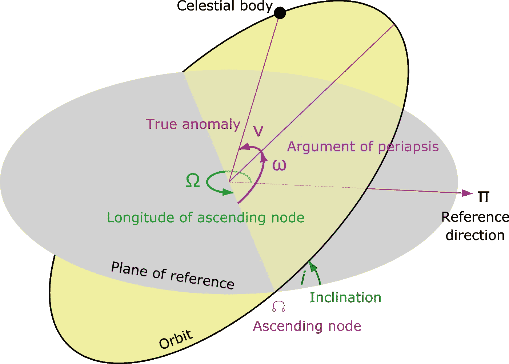
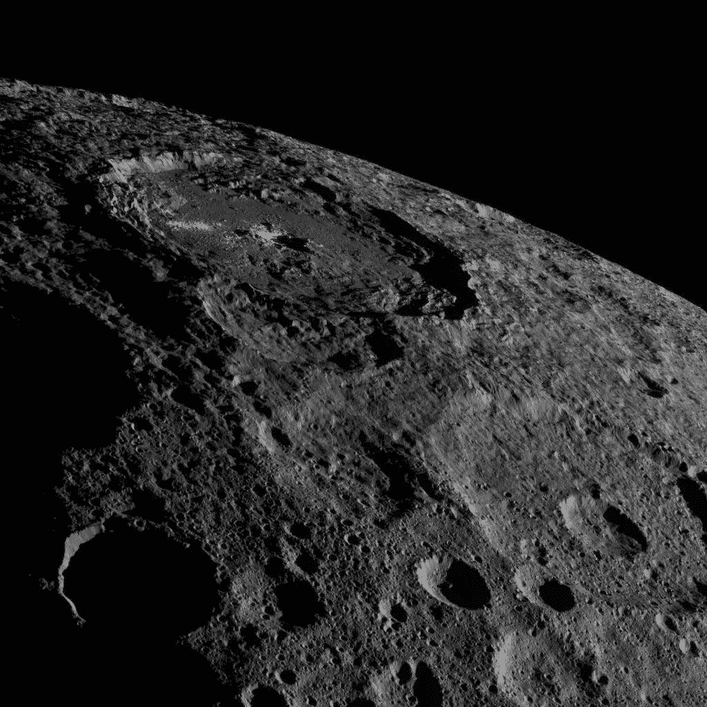

# 用 Python 研究空间科学——围绕太阳

> 原文：<https://towardsdatascience.com/space-science-with-python-quite-around-the-sun-6faa206a1210?source=collection_archive---------26----------------------->

## [用 Python 进行空间科学](https://towardsdatascience.com/tagged/space-science-with-python)

## 本系列教程的第 6 部分将更深入地研究轨道力学。我们如何计算到潜在危险小行星的距离？


由 [SpaceX](https://unsplash.com/@spacex?utm_source=medium&utm_medium=referral) 在 [Unsplash](https://unsplash.com?utm_source=medium&utm_medium=referral) 上拍摄的照片

# 前言

这是我的 Python 教程系列“Python 的空间科学”的第 6 部分。这里显示的所有代码都上传到了[*GitHub*](https://github.com/ThomasAlbin/SpaceScienceTutorial)*上。尽情享受吧！*

# 介绍

*空间可以暴力*。你可能听说过超新星、胃口无穷的黑洞，或者大规模的天体碰撞(即使是一颗小行星也能对我们地球这样的生物圈造成严重影响)。

*空间也可以平静*。就像我们的宇宙邻居:太阳系。我们有一颗恒星、4 颗内行星、4 颗外气态巨行星(它们在一定程度上保护我们免受更大的小行星的伤害)、彗星、小行星和尘埃。当然有碰撞和其他事件，但总的来说，这是相当的，我们可以假设所有的物体都在所谓的 2 体问题中围绕太阳旋转:一个大质量的物体被一个小得多的质量的物体围绕着旋转。我们可以假设在所有情况下，下列不等式都适用:*M<M*。由此产生的问题变得更加简单。

由于这个假设，我们可以应用来自 [SPICE 库](https://naif.jpl.nasa.gov/naif/toolkit.html)的函数，用 Python 计算简单的轨道力学和位置。今天，我们将计算和使用所谓的轨道元素。不要担心，我们将与 Python 紧密合作，并在编程部分开始之前上一堂简短的理论课！

# 轨道

我们的母星绕太阳一周 365.25 天。在一年中，地球和太阳之间的距离变化很小:大约在 1.47 亿到 1.52 亿公里之间；只有百分之几的变化。我们的星球几乎在一个完美的圆周上围绕太阳旋转，没有任何极端的变化，导致了数百万年来友好的气候和生物圈。

*这个“近乎完美的圆”是什么？*它是一个椭圆，由不同的参数描述，如下所述。我们将不处理基本方程的理论推导，因为这超出了本教程的目标。一般来说，数学基础是牛顿运动力学。例如，半长轴(见下文)可以从 Vis-Viva 方程中推导出来[Murray 和 Dermott，2000，第 30–31 页]。第 3.1.1 章。[Albin 2019]简要总结了所有参数的推导过程。在下方一点的地方，您可以看到一张草图，上面显示了解释过的参数:

*   **半长轴( *a* )** 该参数描述了椭圆的“最长半径”。最小半径称为半短轴( *b* )，大多不用于轨道动力学。
*   **偏心率( *e* )** 偏心率描述的是轨道偏离正圆的程度。 *e* 具有以下定义限制:

***e = 0*** (圆圈)

***0<e<1***(椭圆)

**e = 1T25【抛物线】**

***e > 1*** (双曲线)

大于或等于 1 的偏心率表示开放轨道。例如，这适用于星际起源的物体，如 1I/ʻOumuamua [Meech 等人，2017 年 micheli 等人，2018 年]。

*   **倾角( *i* )** 倾角是轨道平面与参考坐标系之间的夹角，比如黄道坐标系中的黄道平面(*eclipse j2000*)。 *i* 描述不同的轨道情况:

***0 ≤i < 90*** (前进轨道。例子:在*日蚀 2000* 中，地球在顺行轨道上围绕太阳旋转

***i=90*** (极轨。例如:气象卫星、地球观测卫星或侦察卫星在极地轨道上围绕地球旋转。这允许卫星在由于地球自转而变化的经度上扫描地球)。

***90 < i≤180*** (逆行轨道。例子:一些起源于彗星的流星体流正在围绕太阳逆行。这些流星进入地球大气层的速度比前进的速度要快。

*   **升交点经度(*ω，☊* )** 该角度参数描述了上升轨道相对于参考点(在*eclipse j2000*中:春分方向)穿过参考平面的位置。在这个节点上，物体从参考坐标系的南半球移动到北半球。
*   **近点辐角( *⍵* )** 近点辐角描述了近点(从焦点看)与升交点经度之间的角距离。最近点是围绕较大中心质量的最近点，可以用 *(1-e)a* 计算。对应的，远点，可以用 *(1+e)a* 计算。
*   **真异常( *v，ν* )** 真异常是身体的位置(从焦点看)w.r.t .近心点的论点之间的角度。这个参数并不需要描述轨道的形状，而是确定物体在某一时刻的实际位置，称为…
*   **历元( *t* )**
*   **均值异常( *M* )** 均值异常的概念似乎令人困惑，它是一个参数，例如由 SPICE 库使用(而不是真正的异常)。真实异常的角速度(每秒度数)随时间变化(近点处较高，远点处较低)。平均异常 *M* 描述了在围绕椭圆焦点的假想圆上绘制的物体的虚拟位置。想法是:与真实异常相反，平均异常的角速度是恒定的。



轨道要素草图。由 Lasunncty 在英文维基百科，CC BY-SA 3.0，[https://commons.wikimedia.org/w/index.php?curid=8971052](https://commons.wikimedia.org/w/index.php?curid=8971052)

最后，在我们深入一些用例之前，我们需要知道不同的系统有不同的后缀。例如，近点是椭圆的通称。在我们的太阳系中，后缀-apsis 被替换为:

*   **-helion** (围绕太阳旋转的物体)
*   **-啧啧**(物体，像我们的月亮绕着地球转)
*   **-木星**(围绕木星旋转的物体，如木卫三)
*   **-克朗**或**-土星**(围绕土星旋转的物体，如泰坦)
*   **-astron** (围绕其恒星的系外行星)

# 矮行星谷神星



矮行星谷神星北半球的一部分。这张照片是黎明任务在大约 1480 公里处拍摄的。分辨率为每像素 140 米。你可以看到所谓的奥卡托陨石坑，在它的中央有一个更小更亮的陨石坑。致谢:[美国宇航局/JPL 加州理工学院/加州大学洛杉矶分校/MPS/德国航天中心/国际开发协会](https://images.nasa.gov/details-PIA21078)

现在让我们从一些编程乐趣开始。今天，我们将使用 SPICE spk 内核的数据来推导轨道元素，反之亦然。我们从矮行星/小行星 *(1)谷神星*开始。谷神星的家是小行星主带，直径超过 900 公里，是这个拥挤区域的最大代表。2015 年至 2018 年间[美国宇航局的黎明任务](https://www.nasa.gov/mission_pages/dawn/main/index.html)探索了这个世界(见上图)。

*谷神星的轨道元素是什么？我们能得出与文献可比的值吗？*让我们看看:

首先，像往常一样，我们需要导入所有必要的 Python 包，如 [*datetime*](https://docs.python.org/3/library/datetime.html) ， [*numpy*](https://numpy.org/) 和 [*spiceypy*](https://github.com/AndrewAnnex/SpiceyPy) 。从现在开始需要几个额外的包( [*pathlib*](https://docs.python.org/3/library/pathlib.html) 、 [*urllib*](https://docs.python.org/3/library/urllib.html) 、 [*os*](https://docs.python.org/3/library/os.html) )来创建一个辅助下载功能。

第 1/15 部分

上一个教程需要的 SPICE 内核文件已经上传到我的 [GitHub 库](https://github.com/ThomasAlbin/SpaceScienceTutorial)上。在未来的教程中，我们需要越来越多的内核，这取决于教程的任务。由于 GitHub 存储空间有限，我们创建了一个助手函数来下载 *_kernels* 目录中的所有未来内核。我们在下面的部分定义了函数 *download_kernel* 。首先，我们的函数需要 2 个输入变量，一个本地存储路径( *dl_path* )和内核的 URL ( *dl_url* )(第 5 行)。第 6 行到第 18 行是函数的 docstring。URL 包含内核的文件名。为了获得名称，第 23 行在“/”处分割 URL。因此，结果列表的最后一项具有文件名。现在，本地下载(子目录)目录被创建，如果它还不存在的话(第 27 行)。如果内核文件不在这个子目录中(第 30 行)，则内核被下载并存储在那里(33)。

第 2/15 部分

对于我们的 Ceres 项目，我们需要在 [NAIF SPICE 存储库](https://naif.jpl.nasa.gov/pub/naif/)中搜索所需的 spk 内核。一些小行星数据存储在[generic _ kernels/spk/asteroids](https://naif.jpl.nasa.gov/pub/naif/generic_kernels/spk/asteroids/)下。在那里你可以找到一个名为 [aa_summaries.txt](https://naif.jpl.nasa.gov/pub/naif/generic_kernels/spk/asteroids/aa_summaries.txt) 的自述文件。它列出了存储在 spk 文件*codes _ 300 ast _ 2010 07 25 . bsp*中的所有 spk 小行星数据和 NAIF IDs。

*但是这个数据从何而来？他们可靠吗？既然有成千上万的小行星，其他的在哪里？*要回答这个问题，让我们看看另一个自述文件*AAREADME _ Asteroids _ spks . txt*。在那里你可以读到:

```
[...]We have left here a single SPK containing orbits for a set of 300 asteroids, the orbits for which were produced by Jim Baer in 2010 using his own CODES software. Some of these data may also be not very accurate. But the convenience of having data for 300 objects in a single SPK file could be useful for some purposes where high accuracy is not important. Read the *.cmt" file for details about this collection.[...]
```

所以内核为我们提供了 spk 信息*，“用于一些高精度不重要的目的”*。我们假设精确度足够好，可以与文献进行比较。此外，该文件说明了 *"*。cmt 文件"*包含更多的*"关于此集合的详细信息"*。我们来看看*codes _ 300 ast _ 2010 07 25 . CMT*。在那里，您可以找到计算 spk 文件的底层代码的细节和其他元信息。做科学意味着做文献研究和阅读，cmt 文件中的一个细节非常重要:

```
Usage
--------------------------------------------------------

     This file should be used together with the DE405 planetary
     ephemeris since the integration was done using the DE405
     ephemeris and with the frames kernel defining the 
     ``ECLIPJ2000_DE405'' frame.
```

坚持住！另一个参照系叫*eclipse j2000 _ de 405*？这个框架是怎么定义的？这些文件指出:

```
This frames kernel defines the Ecliptic and Equinox of the J2000 frame using the DE405 obliquity angle value (84381.412 arcseconds).
[...]
```

对应的帧内核定义为(详细解释将在以后的教程中给出):

```
\begindata

      FRAME_ECLIPJ2000_DE405        = 1900017
      FRAME_1900017_NAME            = 'ECLIPJ2000_DE405'
      FRAME_1900017_CLASS           = 4
      FRAME_1900017_CLASS_ID        = 1900017
      FRAME_1900017_CENTER          = 0
      TKFRAME_1900017_SPEC          = 'ANGLES'
      TKFRAME_1900017_RELATIVE      = 'J2000'
      TKFRAME_1900017_ANGLES        = ( 0.0, 0.0, -84381.412 )
      TKFRAME_1900017_AXES          = ( 1,   3,        1     )
      TKFRAME_1900017_UNITS         = 'ARCSECONDS'
```

这似乎是一个基于赤道 J2000 系统的参考框架，一个轴倾斜 84381.412 弧秒，分别为 23.4。这是地球自转轴相对于黄道面的倾斜！*eclipse 2000*和*eclipse 2000 _ de 405*是同一个参照系吗？我们一会儿就会知道了。首先，我们下载。bsp 内核和内核*codes _ 300 ast _ 2010 07 25 . TF*。这个内核还包含参考框架，以及具有相应名称的 NAIF ID 代码。因为它包含各种各样的信息，我们创建了一个名为 *_kernels/_misc* 的新子目录。

第 3/15 部分

SPICE 元文件已经包含了下载内核的相对路径名，以及闰秒内核和行星 spk 内核。我们用[](https://naif.jpl.nasa.gov/pub/naif/toolkit_docs/C/cspice/furnsh_c.html)*加载元文件。我们的计算将基于今天的日期和当前时间(第 5 行、第 8 行使用 SPICE 函数 [*utc2et*](https://naif.jpl.nasa.gov/pub/naif/toolkit_docs/C/cspice/utc2et_c.html) )将 UTC 日期时间转换为星历时间)。*

*第 4/15 部分*

*下面我们来看看*eclipse j2000 _ de 405*和*eclipse j2000*的区别。我们在第 4 行到第 6 行中计算一个 6x6 的转换矩阵，该矩阵转换在当前日期时间的*eclipse j2000 _ de 405*到*eclipse j2000*中给出的状态向量(SPICE 函数 [*sxform*](https://naif.jpl.nasa.gov/pub/naif/toolkit_docs/C/cspice/sxform_c.html) )。我们的理论:两个系统之间没有区别，所以我们打印(第 10 行到第 12 行)矩阵，并期望单位矩阵(单位矩阵乘以一个向量得到相同的向量):*

*第 5/15 部分*

*输出如下所示。这是一个标识矩阵，对角线上是 1，其他地方是 0。所以两个参考帧名称代表同一个帧。*

```
*Transformation matrix between ECLIPJ2000_DE405 and ECLIPJ2000
[1\. 0\. 0\. 0\. 0\. 0.]
[0\. 1\. 0\. 0\. 0\. 0.]
[0\. 0\. 1\. 0\. 0\. 0.]
[0\. 0\. 0\. 1\. 0\. 0.]
[0\. 0\. 0\. 0\. 1\. 0.]
[0\. 0\. 0\. 0\. 0\. 1.]*
```

*现在让我们计算谷神星在*eclipse j2000*中的状态向量。根据……Ceres 的 NAIF ID 是 2000001。我们将太阳(10)设定为观察者。由于我们没有应用任何光照时间修正，我们可以简单地使用函数 [*spkgeo*](https://naif.jpl.nasa.gov/pub/naif/toolkit_docs/C/cspice/spkgeo_c.html) 。*

*第 6/15 部分*

*为了计算相应的轨道元素，我们需要设定引力参数( *G* )乘以太阳质量( *M* )。第 2 行使用函数 [*bodvcd*](https://naif.jpl.nasa.gov/pub/naif/toolkit_docs/C/cspice/bodvcd_c.html) 从所需内核中提取 *G*M* 值。该函数需要太阳的 NAIF ID(10)、请求的参数(GM)和预期返回的数目(1)。返回值存储在一个数组中，需要在第 4 行提取。*

*第 7/15 部分*

*SPICE 提供了两种功能来根据状态向量确定轨道要素:*

*   *[*oscelt*](https://naif.jpl.nasa.gov/pub/naif/toolkit_docs/C/cspice/oscelt_c.html)*
*   *[*OSC ltx*](https://naif.jpl.nasa.gov/pub/naif/toolkit_docs/C/cspice/oscltx_c.html)*

*[*oscltx*](https://naif.jpl.nasa.gov/pub/naif/toolkit_docs/C/cspice/oscltx_c.html) 需要与[*OSC ELT*](https://naif.jpl.nasa.gov/pub/naif/toolkit_docs/C/cspice/oscelt_c.html)*相同的输入参数，返回相同的值+ 2 个附加参数。输入是:**

*   ****状态**物体的状态向量(以 km 为单位的空间分量 x，y，z 和以 km/s 为单位的相应速度分量 vx，vy，vz)**
*   ****et** 星历时间**
*   ****μ**太阳的引力参数(这里: *G*M***

**输出是包含以下参数的单个数组:**

*   ****最近点**公里**
*   ****偏心率****
*   ****上升节点**的经度，单位为弧度**
*   ****近点的自变量**以弧度表示**
*   ****历元平均异常****
*   ****纪元****
*   ****重力参数**(与输入值相同)**

**以及 [*oscltx*](https://naif.jpl.nasa.gov/pub/naif/toolkit_docs/C/cspice/oscltx_c.html) 附加组件:**

*   ****以公里为单位的半长轴****
*   ****轨道周期**以秒为单位**

**第 2–4 行计算元素，第 7 到 24 行将元素分配给单独的常量名称，其中 km 转换为 AU(使用函数[*【conv rt】*](https://naif.jpl.nasa.gov/pub/naif/toolkit_docs/C/cspice/convrt_c.html))，弧度转换为度(使用函数*numpy*numpy[*numpy . degrees*](https://numpy.org/doc/stable/reference/generated/numpy.degrees.html))。最后一行把以秒为单位的轨道周期转换成了年。**

**第 8/15 部分**

**与结果进行比较的可靠来源或参考是什么？是(国际天文学联合会)[小行星中心](https://minorplanetcenter.net/)(简称:MPC)。小行星中心收集所有关于太阳系小天体的信息(主带小行星、彗星、柯伊伯带天体等等)。其中一个部分提供了一些矮行星的一般信息: [MPC 矮行星](https://www.minorplanetcenter.net/dwarf_planets)。在那里我们找到了一些轨道元素的数据，并在下面的编码部分将它们与我们的结果进行了比较。**

**第 9/15 部分**

**结果是:**

```
**Ceres' Orbital Elements
Semi-major axis in AU: 2.77 (MPC: 2.77)
Perihelion in AU: 2.55 (MPC: 2.56)
Eccentricity: 0.08 (MPC: 0.08)
Inclination in degrees: 10.6 (MPC: 10.6)
Long. of. asc. node in degrees: 80.3 (MPC: 80.3)
Argument of perih. in degrees: 73.7 (MPC: 73.6)
Orbit period in years: 4.61 (MPC: 4.61)**
```

**总而言之，spk 内核文件中的轨道元素似乎是可行的。只能看到微小的差异，如半长轴的 0.01 AU 差异。**

**我们能把轨道元素转换回状态向量吗？当然！为此，SPICE 提供了一个名为 [*圆锥曲线*](https://naif.jpl.nasa.gov/pub/naif/toolkit_docs/C/cspice/conics_c.html) 的函数。该功能需要两个输入:一个轨道元素阵列和要求的 ET。轨道元素的顺序是…**

*   ****最近点**公里**
*   ****偏心率****
*   ****上升节点**的经度，单位为弧度**
*   ****近点的自变量**以弧度表示**
*   ****指异常**出现的时期**
*   ****纪元****
*   ****重力参数****

**…所以基本上函数 [*oscelt*](https://naif.jpl.nasa.gov/pub/naif/toolkit_docs/C/cspice/oscelt_c.html) 的输出顺序。第 2 至 9 行将轨道元素转换为状态向量，第 11 至 14 行打印来自 [*圆锥*](https://naif.jpl.nasa.gov/pub/naif/toolkit_docs/C/cspice/conics_c.html) 和 [*spkgeo*](https://naif.jpl.nasa.gov/pub/naif/toolkit_docs/C/cspice/spkgeo_c.html) 的状态向量。**

**第 10/15 部分**

**输出如下所示，您可以看到状态向量是相似的！**

```
**State vector of Ceres from the kernel:
[ 3.07867363e+08 -3.13068701e+08 -6.66012287e+07  1.19236526e+01
  1.14721598e+01 -1.83537545e+00]
State vector of Ceres based on the determined orbital elements:
[ 3.07867363e+08 -3.13068701e+08 -6.66012287e+07  1.19236526e+01
  1.14721598e+01 -1.83537545e+00]**
```

# **小行星 1997BQ**

****

**由[奥斯汀人类](https://unsplash.com/@xohumanox?utm_source=medium&utm_medium=referral)在 [Unsplash](https://unsplash.com?utm_source=medium&utm_medium=referral) 上拍摄的照片**

**你见过流星吗？流星？大概吧。人们可以观察到所谓的流星雨或流星流(就像八月的英仙座流星雨)。这些是以高速进入地球大气层的小尘埃颗粒。大气摩擦和电离造成了一个很好的发光效果。这些粒子的来源:彗星、小行星、小天体碰撞等。但是也有更大的粒子穿过我们地球围绕太阳的路径(或者至少它们非常接近):近地物体(NEOs)。**

**在 Spaceweather.com 的[上](https://spaceweather.com/)你可以看到一个列表(网页底部),上面列出了将与地球亲密接触的物体。今天(2020 年 5 月初)我们可以看到几个物体。所以让我们选一个大一点的，比如:**

```
**Asteroid | Date(UT)    | Miss Distance | Diameter (m)
---------|-------------|---------------|-------------             [136795](https://ssd.jpl.nasa.gov/sbdb.cgi?sstr=136795&orb=1)   | 2020-May-21 | 16.1 LD       | 892**
```

**那是一颗巨大的小行星！直径差不多 1 公里。这样的撞击对我们的地球将是毁灭性的。但幸运的是，地球和 136795，1997 BQ 之间的最小距离大约是 16.1 个月球距离(LD；1 LD = 384401 km)。**

**在我们计算这个物体的轨道元素之前，让我们快速看一下我们星球的引力是否会严重改变这个物体的轨道。**

**人们现在可以开发一种考虑所有扰动效应的多体数值模拟器。或者，在应用任何数学“过度杀伤”之前，我们可以先做一个简单的方法。对于这种方法，我们使用一个简单的天体动力学概念:势力范围(SOI)。我们太阳系中的每个物体都有一个 SOI:地球、月球、每个小行星和行星。在每个物体的 SOI 中，物体本身是主要的引力因素。这意味着对于简单的计算，例如在地球的 SOI 中，我们可以忽略像太阳这样的较大物体的引力。SOI 理论上是椭球体，但可以近似为球体。一个质量 *m* (例如地球)的 SOI 半径 *r* 取决于它的半长轴 *a* 和更大质量 *M* (例如太阳):**

****

**影响范围的半径(SOI)。贷方:T. Albin**

**首先，我们可以计算地球的 SOI 来确定我们的星球是否会改变轨道。我们设 1 AU 为半长轴。第 10 行将 1 AU 转换为 km (SPICE 函数 [*convrt*](https://naif.jpl.nasa.gov/pub/naif/toolkit_docs/C/cspice/convrt_c.html) )。在第 13 行和第 14 行，我们使用 [*bodvcd*](https://naif.jpl.nasa.gov/pub/naif/toolkit_docs/C/cspice/bodvcd_c.html) 提取地球的 *G*M* 值。最后，第 17 行以千米为单位计算地球的 SOI。我们在第 20 行设置 1 LD 为 384401 km，并在第 22 行打印结果。**

**第 11/15 部分**

**地球的 SOI 大约是 2.4 LD。因此，1997 BQ 的轨道不会因为与我们的母星相遇而改变太多。**

```
**SOI of the Earth in LD: 2.4054224328225597**
```

**JPL 的小天体数据库提供了某一时期的轨道要素。然而，我们需要考虑提供的值的误差(1 sigma 偏差)。在科学中，人们必须根据测量误差的前两位有效数字对数值、结果或测量值进行四舍五入。例如:误差为 xerr = 0.035 的 x = 123.98765 变成 x = 123.987 +/- 0.035。**

**JPL 数据库提供了错误的几个数字。因此，我们构建了一个小的 lambda 函数，它基于前两个错误数字的位置对值进行舍入。首先，取误差的 log10 值。举例: *0.035* 变成 *-1.4559* 。然后应用 floor 函数: *-1.4559* 变成 *-2* 。我们将该值乘以-1，最后加上+1。结果是 *3* 。这就是我们所需要的:我们希望根据误差 0.035 在第三个位置舍入 123.98765！**

**第 12/15 部分**

**让我们用 [*数据库*](https://ssd.jpl.nasa.gov/sbdb.cgi?sstr=136795&orb=1) 中的数据定义所有轨道要素。请注意:数据库提供纪元 2459000.5(儒略日)。由于强大的 [*utc2et*](https://naif.jpl.nasa.gov/pub/naif/toolkit_docs/C/cspice/utc2et_c.html) 函数，这可以很容易地转换成使用字符串格式“2459000.5 JD”的 et。**

**第 13/15 部分**

**现在，在我们创建了一个包含轨道元素的数组之后，我们可以计算小行星的状态向量了(第 2 行到第 9 行)。我们使用函数 [*圆锥曲线*](https://naif.jpl.nasa.gov/pub/naif/toolkit_docs/C/cspice/conics_c.html) 来确定当前日期-时间的状态向量(第 12 行)。最后，结果打印在第 14+15 行。**

**第 14/15 部分**

```
**Current state vector of 1997BQ in km and km/s (2020-05-08T15:29:48):
[-1.01302335e+08 -9.80403762e+07  2.92324589e+06  2.10287249e+01
 -2.97600309e+01 -6.83829911e+00]**
```

**目前 1997 BQ 与地球的距离是多少？为了找到答案，我们也计算地球的状态向量(使用 [*spkgeo*](https://naif.jpl.nasa.gov/pub/naif/toolkit_docs/C/cspice/spkgeo_c.html) )。我们星球的 NAIF ID 是 399，观测者是太阳(10)。我们使用同一个 ET ( *DATETIME_ET* )，设置参考系*eclipse j2000*。然后，两个状态向量的空间分量被用于确定地球和 1997 BQ 之间的结果向量的长度(第 8+9 行，函数 [*vnorm*](https://naif.jpl.nasa.gov/pub/naif/toolkit_docs/C/cspice/vnorm_c.html) )。**

**第 15 部分**

**对于我们的时间戳，距离大约是 38.69 LD。**

```
**Current distance between the Earth and 1997BQ in LD (2020-05-08T15:29:48):
38.69205689796575**
```

# **结论**

**需要消化的内容太多了！慢慢来，使用我的 [GitHub](https://github.com/ThomasAlbin/SpaceScienceTutorial) 资源库中提供的 Jupyter 笔记本和 Python 脚本来浏览本教程。在以后的教程中会用到上两个教程中显示的参考系和轨道力学。不要担心。接下来的教程会比较小，给你一些时间来熟悉一切。有许多 Python 函数、概念和技术术语需要理解。如果您需要支持或有任何问题，请不要犹豫。**

**托马斯**

# **参考**

*   **t .阿尔宾(2019)。宇宙尘埃研究中基于机器学习和蒙特卡罗的数据分析方法。斯图加特大学。**
*   **米契，k .，韦雷克，r .，米凯利，M. *等*一颗红色极度拉长的星际小行星的短暂造访。*自然* **552，**378–381(2017)。[https://doi.org/10.1038/nature25020](https://doi.org/10.1038/nature25020)**
*   **Micheli，m .，Farnocchia，d .，Meech，K.J. *等*1I/2017 U1 轨迹中的非重力加速度(Oumuamua)。*性质* **559，**223–226(2018)。[https://doi.org/10.1038/s41586-018-0254-4](https://doi.org/10.1038/s41586-018-0254-4)**
*   **卡尔·d·默里和斯坦利·德莫特。太阳系动力学。剑桥大学出版社，2000 年。ISBN 978–0–521–57597–3。**