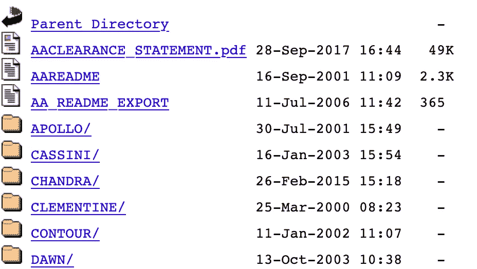
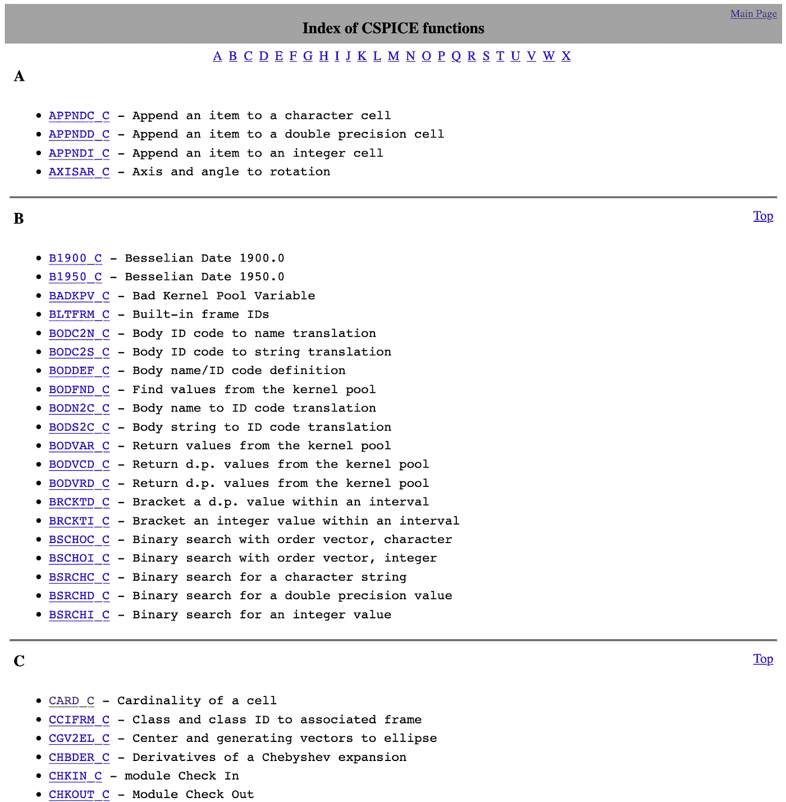
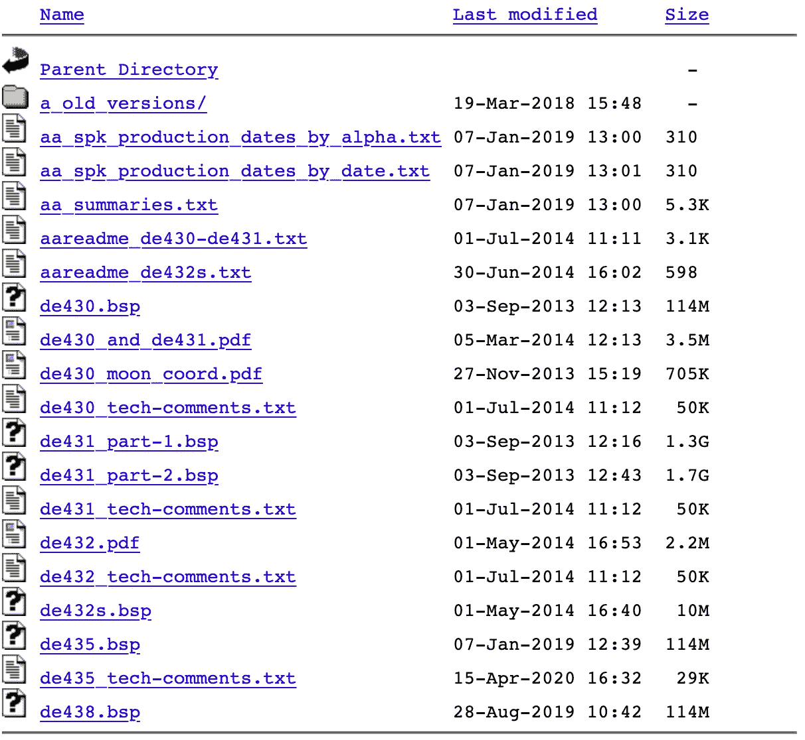
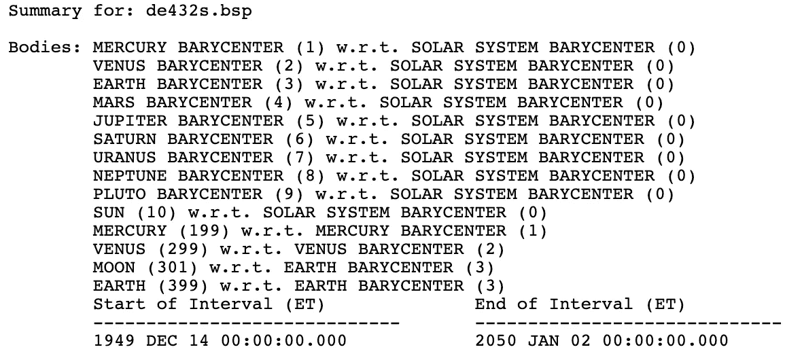

# 使用 Python 的空间科学-设置和初步步骤

> 原文：<https://towardsdatascience.com/space-science-with-python-setup-and-first-steps-1-8551334118f6?source=collection_archive---------10----------------------->

## [https://towards data science . com/tagged/space-science-with-python](https://towardsdatascience.com/tagged/space-science-with-python)

## 成为一名公民太空科学家的入门指南—第 1 部分


由 [SpaceX](https://unsplash.com/@spacex?utm_source=medium&utm_medium=referral) 在 [Unsplash](https://unsplash.com?utm_source=medium&utm_medium=referral) 上拍摄的照片

用 Python 研究空间科学。这听起来可能很有挑战性，复杂而宽泛。在大学期间，我在不同的空间科学相关领域获得了一些经验，我将这些经验与数据科学和机器学习方法联系起来。在我的教程系列的第 1 部分，我想与社区分享我的经验和知识:与所有的开发者、制造者、学生或热情的空间和编程爱好者。

我在开始时提供了很多细节，这样每个人都能够了解教程和库的内容。一段时间后，当我们对一切都更加熟悉时，我们可以专注于基础知识以外的科学任务。

## 先决条件

为了跟踪和理解教程，我建议你具备扎实的 Python 基础知识。我们将使用 Python 3，并且我建议在你的机器上建立一个虚拟环境，在那里你可以安装所有必要的包，并且你可以“到处玩”。下面，你会发现如何建立一个虚拟环境的简要说明。所有脚本都上传到我的公共 GitHub([https://github.com/ThomasAlbin/SpaceScienceTutorial](https://github.com/ThomasAlbin/SpaceScienceTutorial))库，你可以在那里找到 Jupyter 笔记本和独立的 Python 脚本。我建议克隆这个存储库。所有显示的库的安装已经在 Linux (Ubuntu 和 Debian)以及 Mac OS 上进行了测试。如果你在 Windows 上遇到任何问题，让我们一起努力解决它，例如在相应的 Reddit 帖子上把你带到这里。

对太阳系及其天体的一些基本知识是一个小优势，但还是那句话:别担心。我们从基本概念开始，在教程之间，您将有一些时间阅读这些主题。如果你想在这方面有更多的解释，请告诉我。

## **Python 设置**

首先，我们需要建立一个虚拟环境来安装我们的软件包。打开终端并切换到您想要安装环境的目录。假设您已经安装了 Python 3，您可以通过执行以下命令来设置环境。 *pythonenv* 将环境的名称:

```
python3 -m venv pythonenv
```

现在，您可以通过执行以下命令来激活虚拟环境:

```
source pythonenv/bin/activate
```

在终端中，在你的用户名旁边，环境的名称应该像 *(pythonenv)一样显示在圆括号中。*

有了 Python 包管理器 *pip3* ，你可以很容易地安装任何 Python 库。对于初学者，我建议安装经常使用的 SciPy 套件。它还包含 Jupyter(它可以通过执行 *jupyter notebook* 在克隆的 Git 项目中启动):

```
pip3 install numpy scipy matplotlib ipython jupyter pandas sympy nose
```

## SPICE 安装

在接下来的几周里，我们将一起关注太阳系、它的天体、宇宙飞船任务和科学成果。我们将学习各种方法、数据科学方法和库。在我的第一篇文章中，我提到了一个叫做 SPICE 的 NASA 工具包(*航天器行星仪器 C 矩阵事件*)。这个工具包将是我们第一次会议的核心。SPICE 是一个巨大的工具包，被太阳系科学界用来确定，例如，行星的位置，天空中小行星的坐标，或者航天器相机的视野是否对准天体的表面(以及更多)。

美国宇航局在其网站上提供了一个复杂的概述，包括文档和演示。该工具包以 C、Fortran、IDL、Matlab 和 Java 语言提供。感谢社区成员 *AndrewAnnex* ，一个使用 C 版本 SPICE 的 Python 包装器可用:[https://github.com/AndrewAnnex/SpiceyPy](https://github.com/AndrewAnnex/SpiceyPy)。

您可以通过执行以下命令来安装 Python 包装器。但是，请确保您在 Linux 上安装了类似 gcc 的 C 编译器。XCode 应该为您的 Mac 系统提供所有必要的软件要求:

```
pip3 install spiceypy
```

现在我们准备好起飞了。

## 香料介绍

在深入编程部分之前，我们先来看看 SPICE。SPICE 旨在为行星科学家和工程师提供一个通用工具包，用于计算各种空间任务相关信息，如:

*   参考框架
*   位置和速度
*   方向/指向
*   尺寸/形状/物理参数
*   时间换算

我们将针对所有这些主题来理解它们的含义以及在哪里使用它们。

SPICE 不计算计算繁重的任务，如 N 体模拟、重返场景或复杂的机动。它使用现有的数据来提供对各种各样的太阳系相关问题的共同访问(NASA 提供的简短概述可以在这里看到: [NASA Spice 概述](https://naif.jpl.nasa.gov/pub/naif/toolkit_docs/Tutorials/pdf/individual_docs/03_spice_overview.pdf))。

开箱即用，SPICE 无法计算很多。它需要辅助数据，即所谓的*内核*才能正常工作。这些内核分为不同的类别，例如:

*   **spk** 包含行星体、航天器等的轨迹信息。
*   **pck** 包含身体的物理参数，如大小或方向
*   **ik** 包含仪器特定的信息，例如安装在航天器上的信息
*   包含关于宇宙飞船在太空中方位的信息
*   **fk** 包含在不常用的参考系统中计算位置所需的参考框架信息
*   **lsk** 包含时间信息，其对于将例如 UTC 时间转换成星历时间 ET(空间科学和天文学中使用的标准时间格式)至关重要

我们将接触所有这些内核。你可能会问:为什么信息存储在附加文件中？既然我们应该*知道*某些航天器的轨迹，为什么数据不存储在一个巨大的工具箱中？嗯，你是对的，但是现在有几十个任务，很多任务正在准备中。特别是计划中的任务具有“预先计划的”或“预测的”轨迹，这些轨迹经常被更新。此外，不同的机构从事不同的任务。联系每个人以收集所有信息将是一场斗争。因此，每个任务、仪器等等都是分开的。NASA 和 ESA 提供了大量内核的存储库。这里有一个例子:[香料内核](https://naif.jpl.nasa.gov/pub/naif/)



NASA / NAIF 内核库(只有一小部分)

上面的截图显示了一些任务内核文件夹，如阿波罗任务或前往土星的卡西尼飞船。核心部分存储在 *generic_kernels* 文件夹中，其中存储了行星信息。首先，本文所需的所有内核都存储在我的 GitHub 存储库中。然而，以后我们将需要巨大的内核，需要你下载并手动存储。我们将在几周内达到这一点。正如你在下载的资源库中看到的，我准备了一个名为 *_kernels* 的内核文件夹。我们稍后将使用内核。


Python 空间科学教程的文件夹结构。可以看到有些内核已经下载准备好了。


罗斯·斯奈登在 [Unsplash](https://unsplash.com?utm_source=medium&utm_medium=referral) 上的照片

## 我们的第一步

现在我们已经设置好了，我们可以定义今天的第一个目标。让我们计算今天午夜地球的位置和速度向量(所谓的状态向量)。此外，我们将我们母星的轨道速度与理论预期进行了比较。

首先，我们导入 SPICE 包装库 *spicepy* 。如果没有错误发生，安装顺利，我们可以继续。

第 1/13 部分

我们想确定我们的母星相对于太阳的位置。我们如何用 SPICE 实现这一点？我们来看看 SPICE 的参考指南: [SPICE Docs](https://naif.jpl.nasa.gov/pub/naif/toolkit_docs/C/cspice/index.html) 。



SPICE 参考指南的屏幕截图

嗯，有很多函数(别忘了我们也需要内核)。这看起来让人不知所措，但这正是本教程的目的:在这方面支持你。

我们需要的是函数 *spkgeo* (请注意:这是 C 库的文档，因此每个函数名都有 *_C* 后缀，需要为 Python 去掉): [spkgeo doc](https://naif.jpl.nasa.gov/pub/naif/toolkit_docs/C/cspice/spkgeo_c.html) 。

文件上说:

> 摘要
> 
> 计算目标物体相对于观测物体的几何状态(位置和速度)。

这就是我们需要的。输入参数是目标体(地球)、外星人、参照系和观测者(太阳)。

因此，在第一步中，我们需要将 UTC 字符串转换为 ET。为此，我们使用函数*utc2et*:[utc2et doc](https://naif.jpl.nasa.gov/pub/naif/toolkit_docs/C/cspice/utc2et_c.html)。

我们确定今天的日期并创建一个格式为*年-月-日-小时:分:秒*的字符串。 *utc2et* 函数的文档在*示例*一节中提供了所有可能的时间格式。虽然不要求显式地为午夜写 00:00:00，但是为了完整起见，我们这样做了(剧透:下面的代码片段导致了一个错误！):

第 2/13 部分

出现了一个错误。为什么？如前所述，大多数信息存储在内核文件中。在这里，我们不能在时间之间转换，因为缺少 lsk。教程库包含了需要的文件( *naif0012.tls* )，可以在官方库这里找到: [SPICE lsk 内核](https://naif.jpl.nasa.gov/pub/naif/generic_kernels/lsk/)。内核加载了 SPICE 函数 *furnsh* 。

第 3/13 部分

我们重新执行命令…

第 4/13 部分

…并且不会出现错误。让我们看看它的价值:

第 5/13 部分

今天(2020.04.21)的结果是 64069269 . 5636363656

现在让我们尝试命令 *spkgeo* 来计算地球的状态向量。但是目标和观察者的名字是什么呢？显然是“地球”和“太阳”；但是，SPICE 使用所谓的 NAIF IDs 来标识对象。完整的名单可以在这里找到: [NAIF IDs](https://naif.jpl.nasa.gov/pub/naif/toolkit_docs/C/req/naif_ids.html) 。

搜索数字 399。那是地球！太阳的数字是 10。参考系设置为“ECLIPJ2000”，参考 J2000 时的黄道参考系(这个基本系不需要内核)。想象一张桌子，在桌子的中央，你放一些代表太阳的东西。用另一个代表地球的物体，绕太阳一圈。桌子就是我们星球所谓的“黄道面”。其他行星有它们自己的平面，并相对于地球平面略微倾斜。为什么选择 J2000？天文学家在 2000 年的某个时候为我们的星球设定了平面。由于重力扰动，我们当前的“2020 平面”相对于 J2000 平面非常非常轻微地倾斜。不是每年重新定义，而是用 2000 版(剧透:这里又出现一个错误(最后一个，我保证！)):

第 6/13 部分

另一个内核丢失。这次是 spk。让我们深入探讨一下这个问题。我们进入存储库页面(你不需要下载任何东西，因为我已经把它放在了 *_kernel* 文件夹中):[SPICE kernel](https://naif.jpl.nasa.gov/pub/naif/)

…然后转到 *generic_kernels* 。在那里，我们需要进入 *spk* ，然后进入*行星*，因为我们想要计算我们行星的状态向量。我们发现今天的状态如下:



截图:[https://naif . JPL . NASA . gov/pub/naif/generic _ kernels/spk/planets/](https://naif.jpl.nasa.gov/pub/naif/generic_kernels/spk/planets/)

每个文件夹都有 *aa_*。txt* 文件。我们来查一下 *aa_summaries.txt* 。该文件列出了各种内核的元数据。它显示了哪些对象是相对于其他实体对象计算的。注:水星的重心和金星的重心都是太阳系重心。由于简单的加法，SPICE 可以很容易地计算出两个行星重心之间的距离。最后一行显示时间范围。我们取文件 *de432s.bsp* ，因为它很小，覆盖了我们感兴趣的时间间隔:



部分[https://naif . JPL . NASA . gov/pub/naif/generic _ kernels/spk/planets/aa _ summaries . txt](https://naif.jpl.nasa.gov/pub/naif/generic_kernels/spk/planets/aa_summaries.txt)

我们加载内核:

第 7/13 部分

重新计算状态向量:

第 8/13 部分

并打印出来。我们得到:[-1.28760839e+08，-7.76110220e+07，4.32943029e+03，1.48939328e+01，-2.56361729e+01，1.00712291e-03]。前 3 个值是以 km 为单位的 x、y、z 分量。最后 3 个值是相应的速度分量，单位为千米/秒。

第 9/13 部分

我们可以通过使用美国宇航局的地平线网络界面来验证结果。

在额外的教程中，我将向你解释如何使用这个网络应用程序，因为它允许你调整很多参数。经过一些点击后，我得到了以下结果:[-1.287618689589618E+08，-7.760924828577068E+07，4.329366157151759E，1.48935 8282611586 我们比较 x 位置分量，注意到大约 1000 km 的偏差。那不是很多，但是理论上应该是 0 km？！在这种情况下，HORIZONS 使用了一个名为 *DE431mx* 的内核。不同的内核可能具有不同的精确值。

检查我们的结果是否有意义的另一个简单方法是确定太阳和地球之间的距离。应该在 1 天文单位(1 AU)左右。首先，我们以千米为单位计算距离:

第 10/13 部分

使用 SPICE 函数 *convrt* ( [convrt doc](https://naif.jpl.nasa.gov/pub/naif/toolkit_docs/C/cspice/convrt_c.html) )我们可以将 km 值更改为 AU(不需要内核)。结果接近 1 AU。

第 11/13 部分

让我们做最后一项任务。我们用千米/秒来计算地球的轨道速度:

第 12/13 部分

数值接近 30 km/s 但是有意义吗？轨道速度的理论期望值可以用下面的等式来近似，其中 ***G*** 是引力常数， ***M*** 是太阳的质量， ***r*** 是地球和太阳之间的距离:


我们使用来自 *generic_kernels* 目录(pck)的内核 *gm_de431.tpc* 并加载它。使用函数 *bodvcd* 我们得到太阳的 ***G*M*** 值( [bodvcd doc](https://naif.jpl.nasa.gov/pub/naif/toolkit_docs/C/cspice/bodvcd_c.html) )。 *bodyid* 又是 10，必需的*项*是 ***GM*** ， *maxn* 是一个输入参数，设置期望收益的个数(这里是 1):

第 13/13 部分

同样，我们得到的值接近 30 千米/秒！

## 结论

我希望你喜欢第一个教程，并对 SPICE 如何“思考”和如何使用它有了一个印象。我们将使用这个库，并在接下来的教程中探索更多的特性，以获得更多的实践经验。SPICE 介绍将为后面的科学教程打下坚实的基础。

请让我知道(在这里或在 Reddit:[https://www.reddit.com/user/MrAstroThomas](https://www.reddit.com/user/MrAstroThomas))，如果你喜欢它，你错过了什么或任何其他问题。我尽量多回答。

下一个教程将在周六(2020.04.25)发布，希望有 GitHub Gist 集成。我们将分析开普勒定律的第一定律:

> 行星的轨道是一个椭圆，太阳位于两个[焦点](https://en.wikipedia.org/wiki/Focus_(geometry))之一

这种说法 100 %正确吗？我们会看到的。

在这个充满挑战的时刻，我祝你一切顺利，

托马斯