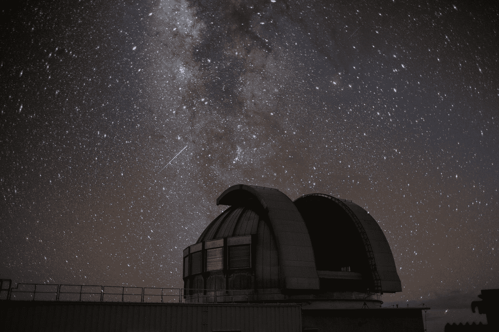
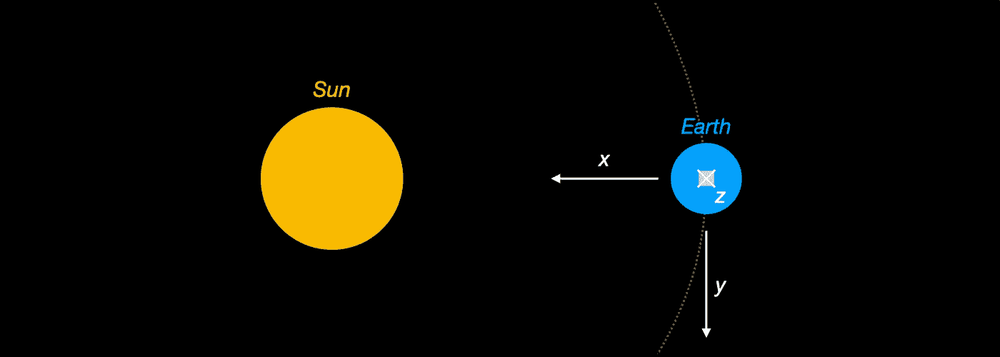
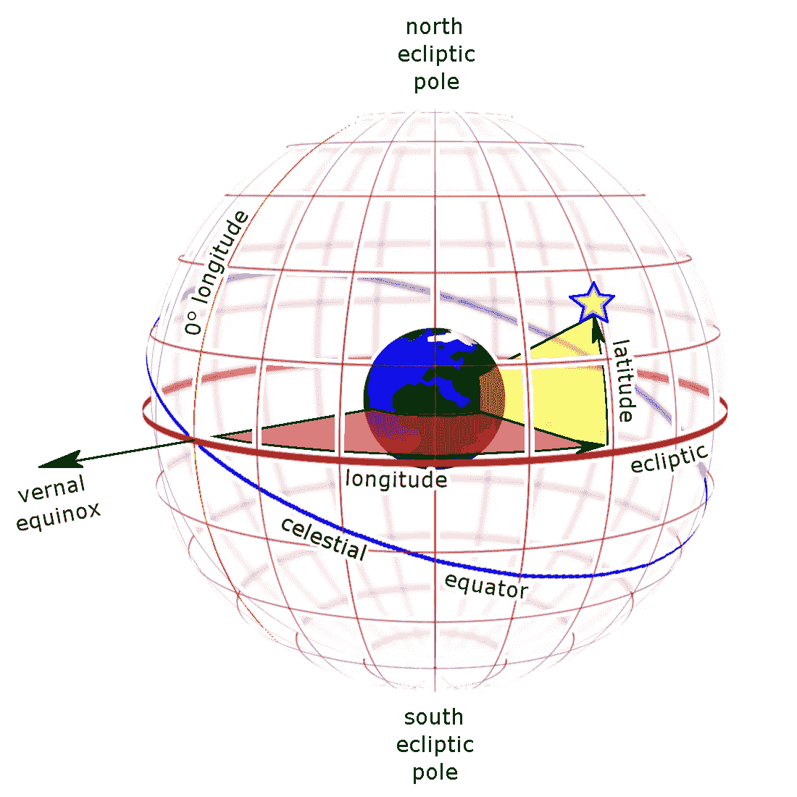
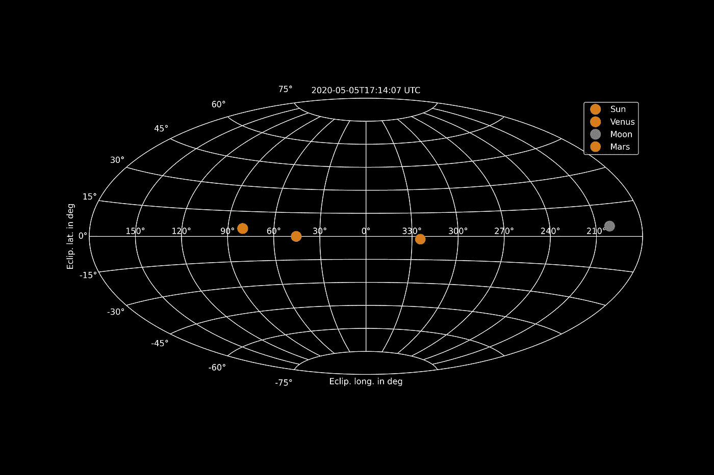
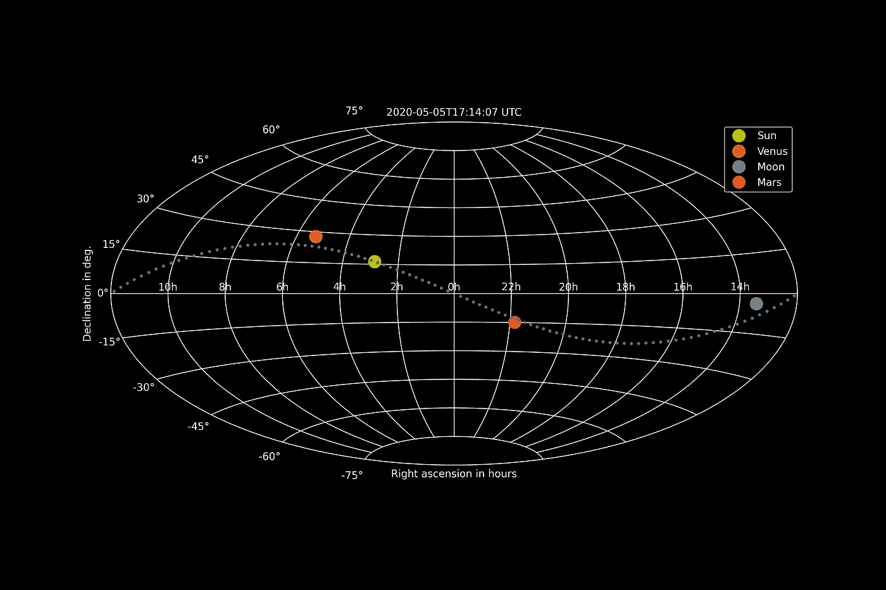

# 使用 Python 的空间科学-空间地图

> 原文：<https://towardsdatascience.com/space-science-with-python-space-maps-747c7d1eaf7f?source=collection_archive---------17----------------------->

## [用 Python 进行空间科学](https://towardsdatascience.com/tagged/space-science-with-python)

## 教程系列的第 5 部分展示了如何计算和理解用于所有未来科学主题的坐标系



由[康纳·贝克](https://unsplash.com/@connerbaker?utm_source=medium&utm_medium=referral)在 [Unsplash](https://unsplash.com?utm_source=medium&utm_medium=referral) 上拍摄的照片

## 前言

这是我的 Python 教程系列“Python 的空间科学”的第 5 部分。这里显示的所有代码都上传到了[*GitHub*](https://github.com/ThomasAlbin/SpaceScienceTutorial)*上。尽情享受吧！*

## 介绍

在上一课中，我们计算了不同天体的位置和速度矢量。我们确定了物体之间的表观角距离(所谓的相位角)，并使用 Python 和 NASA 库 [SPICE](https://naif.jpl.nasa.gov/naif/toolkit.html) 进行了一些小项目(使用 SPICE 包装器 [*spiceypy*](https://github.com/AndrewAnnex/SpiceyPy) )。

在接下来的几周里，我们将一起学习和研究(科学)数据和更大的项目，包括:

*   小行星、近地物体和流星
*   罗塞塔任务和菲莱在 67P/丘留莫夫-格拉西缅科的下降
*   卡西尼任务，特别是宇宙尘埃分析仪，我们也将应用机器学习算法进行数据简化和分析

在我们开始科学深度潜水之前，我们需要了解两个基本主题:

*   坐标系/参考系
*   轨道力学

这听起来可能像枯燥的理论，但是我们将紧密结合 Python 例子。凭借扎实的知识基础和对这两个主题的理解，结合 SPICE 和随后的其他工具，您将准备好实现伟大的科学见解！

## 黄道坐标系

三维坐标系有一个 x、y 和 z 分量。所有三个组件都正交对齐，因此所有组件之间的角度为 90 度。组件的方向符合所谓的右手定则:

*握拳。用右手(x 轴)做一个“竖起大拇指”的动作。将食指(y 轴)指向前方(做出“手枪”手势)。现在，中指远离手掌(z 轴)。*

现在我们来看看第一个坐标系:黄道坐标系。它广泛用于空间科学和星际飞行任务，并可应用于以太阳系为中心的任务或行星任务。在我们上一个教程中，我已经将这个系统称为*eclipse j2000*(SPICE 命名约定)。

让我们看看地球。我们的星球在一个假想的平面上围绕太阳旋转，这个平面就是所谓的黄道面。现在，对于一个坐标系，我们需要定义 2 个轴；第三个是右手定则的结果。x 轴是所谓的春分点:在春天开始的时候，我们看着太阳。相应的方向定义为 x 轴(见下图)。此时此刻，基于太阳的方向和地球的速度矢量，我们得到了黄道平面。z 轴垂直于这个平面(黄道北)，y 轴是右手定则的结果。



黄道坐标系定义的简单俯视图。x 轴指向初春的太阳。考虑到地球的速度矢量，由此产生的黄道平面允许人们定义垂直于该平面的 z 轴(z 轴指向读者)。y 轴是右手定则的结果。在这幅草图中，地球逆时针旋转。贷方:T. Albin

任何三维矢量都可以转换成球坐标，球坐标可以用三个参数来描述:半径、方位角和倾角。将这些值投影到一个单位球体(半径= 1 的球体)上会产生一个天空贴图。以下坐标描述了该地图上的位置:

*   **经度** (l):从 0°到 360°定义。对于黄道坐标系，经度为 0 表示春分线。所有其它的经度值都是相对于这条线(一条从一个极点到另一个极点的假想线)来确定的。
*   **纬度** (b):定义从-90°(球面南极)到+90°(球面北极)。纬度为 0 的值位于赤道上；分别在黄道平面上为黄道坐标系。

这意味着 l=0，b=0 (x 轴)就是春分点。



黄道坐标系及其围绕地球的投影球的可视化。红色粗圆表示黄道平面，蓝色粗圆表示我们星球的赤道线。黄道面和赤道之间的角度大约是 23 度。信用:[维基百科/维基媒体共享；](https://upload.wikimedia.org/wikipedia/commons/5/50/Ecliptic_grid_globe.png)许可证: [CC BY-SA 3.0](https://creativecommons.org/licenses/by-sa/3.0/)

现在 J2000 意味着什么？由于其他行星的引力扰动，我们地球的轨道有点“摇晃”。因此，黄道平面会随着时间而轻微改变。为了避免每年甚至每天的参考框架更新，通常使用在日期 j 2000(2000 年 1 月 1 日中午)定义的黄道平面。

好了，理论到此为止。我们来看看编程部分。*我们如何利用这些参照系工作？我们如何计算天空中的位置？那么* [*香料*](https://naif.jpl.nasa.gov/naif/toolkit.html) *如何帮助我们呢？*

让我们用太阳、金星、火星和月球的坐标来计算并绘制一张星图。首先，我们需要导入之前教程中已经介绍和使用的所有必要模块: [*datetime*](https://docs.python.org/3/library/datetime.html) ，[*spiceypy*](https://github.com/AndrewAnnex/SpiceyPy)(SPICE wrapper)， [*numpy*](https://numpy.org/) ， [*pandas*](https://pandas.pydata.org/) 和 [*matplotlib*](https://matplotlib.org/) (绘图)。在计算任何位置之前，我们需要包含相关内核的相对路径的 SPICE 内核元文件。它包含用于行星位置的 spk 内核 *de432s.bsp* 和用于时间转换和闰秒的 *naif0012.tls* 。使用 [*furnsh*](https://naif.jpl.nasa.gov/pub/naif/toolkit_docs/C/cspice/furnsh_c.html) 加载元文件。我们将这个时刻([*datetime . datetime . now()*](https://docs.python.org/3/library/datetime.html#datetime.datetime.now))设置为日期-时间对象，并将其直接转换为相应的字符串(第 12 行)。如果您正在使用*，请考虑以下来自官方*日期时间*文档的警告。现在()*:

```
Because naive datetime objects are treated by many datetime methods as local times, it is preferred to use aware datetimes to represent times in UTC. As such, the recommended way to create an object representing the current time in UTC is by calling datetime.now(timezone.utc).
```

第 15 行使用 SPICE 函数 [*utc2et*](https://naif.jpl.nasa.gov/pub/naif/toolkit_docs/C/cspice/utc2et_c.html) 将 UTC 字符串转换为相应的星历时间(ET)。

第 1/10 部分

为了计算，定义了一个 [*熊猫*数据帧](https://pandas.pydata.org/pandas-docs/stable/reference/api/pandas.DataFrame.html)。该数据帧将包含所有产生的东部时间坐标和世界协调时坐标(第 7+8 行)。位置是在一个 for 循环中计算的，该循环遍历一个字典，其中包含所有需要的天体及其 [NAIF ID 代码](https://naif.jpl.nasa.gov/pub/naif/toolkit_docs/C/req/naif_ids.html)(在第 13 行定义)。因为加载的 spk 内核不包含火星的行星中心，所以使用重心(ID: 4)。

第 2/10 部分

现在，for 循环遍历字典，计算从地球上看到的每个天体的方向向量(第 8–13 行)。SPICE 函数 [*spkezp*](https://naif.jpl.nasa.gov/pub/naif/toolkit_docs/C/cspice/spkezp_c.html) 用于此目的，输入参数如下:

*   **targ** :需要观察的对象的 NAIF ID
*   **et** :开始时计算的 et
*   **参考**:参考框架。这里是黄道坐标系*eclipse j2000*
*   **abcorr** :上次描述的光时修正( [NAIF 详细文档](https://naif.jpl.nasa.gov/pub/naif/toolkit_docs/C/req/abcorr.html)，欲知详情)。这里，输入 *LT+S* 表示从观察者(地球)的角度来看，位置确定考虑了物体的速度和光的传播时间。
*   obs :观察者的 NAIF ID，这里是:我们的母星(399)

由于 SPICE 函数 [*recrad*](https://naif.jpl.nasa.gov/pub/naif/toolkit_docs/C/cspice/recrad_c.html) ，方向向量可以很容易地转换成球坐标。经度和纬度值分别是第二个和第三个输出值。第一个输出值是向量的长度(范数),在我们的例子中不需要。

第 3/10 部分

现在我们有了物体的坐标。*出图应该挺容易的吧*？我们可以创建一个简单的 *matplotlib* 图，我们就完成了。

没那么快…矩形图会很快而且脏，有更好的方法来绘制天空坐标。如果您“切割一个球体”并尝试以二维方式投影其表面，则有几个投影选项，例如:

*   **艾托夫**
*   **锤子**
*   **莫尔韦德**

每种投影类型都有其优点和缺点，如表示等面积地图，但不提供正确的角度测量(Mollweide)。Aitoff 投影仅提供了长度精度以及分别围绕子午线和赤道的相等面积。Hammer 补偿了这些 Aitoff 问题。在美国宇航局的 GISS 网站上可以找到一份详尽的计划清单。让我们来看一张带有艾托夫投影的空地图。以下 Python 代码创建了下图:

第 4/10 部分


使用默认 matplotlib 设置的空 Aitoff 投影。纬度范围从-90 到+90，经度默认定义为从-180 到+180(从左向右计数)。贷方:T. Albin

您可以看到纬度值在-90°到+90°之间，经度值在-180°到+180°之间。然而，如前所述，黄道坐标系中的经度值范围是从 0°到 360°。此外，经度的值从右向左计数。 *matplotlib* 不允许用户重新定义投影属性，也不允许用户使用格式化功能轻松反转 x 轴。因此，我们需要创建一个小的变通办法，并有点创意。以下代码部分显示了一个 for 循环，该循环遍历所有经度值，并创建一个经度为“用于绘图”的新列:

所有角度都以弧度表示。大于 pi (180)的值超过了 *matplotlib 的绘图范围。*模运算符应用了 pi ( *% np.pi* )。余数因此在 0 和 pi 之间，应该在投影图的“左侧”(-180 到 0)，所以我们需要减去 pi。最后，我们将结果乘以-1 来反演 x 轴值。

```
*-1*((x % np.pi) — np.pi)* applies only if x is larger than pi*-1*x* applies else (x is smaller than pi)
```

第 5/10 部分

现在我们可以在黄道坐标上画出天体的坐标。首先设置一个黑暗的背景(第 4 行),因为…空间是黑暗的！第 7 行定义了图形和设置投影后的行。我们使用 UTC 时间戳作为标题(第 11 行),一个简单的数组定义了一些颜色(第 14 行),用于遍历所有天体的 for 循环(第 17 到 24 行)。第 27 到 30 行重新定义了 x 刻度，并用黄道经度替换了 matplotlib 的刻度。最后，设置标签，创建图例和网格，并保存绘图。最终的天空图可以在下面看到。

第 6/10 部分



黄道坐标系的天图(艾托夫投影)。太阳、金星、火星和月亮以不同的颜色显示(右上方的图例)。这些物体的角宽不成比例。贷方:T. Albin

这张星图显示了 2020 年 5 月 5 日下午 5 点左右的黄道坐标系以及太阳、金星、火星和月球的位置。你可以看到行星位于黄道面附近。月亮离太阳差不多有 180 度。晚上看看外面:快满月了。

## 赤道坐标系

你考虑过买望远镜吗？这是一种平静而鼓舞人心的爱好。无论是集体还是单独，你都可以在你的后院探索行星、星系和其他宇宙奇观(如果不是太光污染的话)。但是有很多不同的望远镜类型和支架。一种常见的安装类型是所谓的赤道安装。这个坐骑与地球的旋转轴对齐，“随天旋转”。长时间曝光的图像，或者不需要不断重新调整的视觉观察，都可以使用这些支架。现代坐骑有一个内置时钟和一个电动马达来补偿旋转。

对应的坐标系是所谓的赤道坐标系(在 SPICE 中简称为 *J2000 …* 有点混乱，考虑到 J2000 是时间戳)，其中 x 轴指向春分方向，z 轴是地球的旋转轴。地球赤道相对于黄道平面倾斜(大约 23°，见开头第二张草图)，不与黄道坐标系“重叠”。

赤道坐标中的经度和纬度描述为:

*   **赤经**:这是赤道坐标系的经度，用小时(h)定义，不用度，范围从 0h 到 24h (1h 对应 15 度)。
*   **赤纬**:这是纬度，范围从-90°到+90°。0 对应赤道线。

现在，让我们计算我们感兴趣的天体的赤道坐标。我们再次应用遍历所有物体的 for 循环，并且我们应用与前面相同的函数来计算方向向量和赤道坐标系中的坐标。

第 7/10 部分

为了形象化黄道和赤道坐标系之间的扭曲，我们在计算中加入了黄道平面。为此，创建了一个额外的*熊猫*数据帧(第 6 行)。第 11 行添加了在*eclipse j2000*中的经度坐标，从 0 到 2*pi (360)，作为一个数组。第 12 行添加了纬度值。实际上，坐标应该是 0，在这种情况下，我们需要球坐标惯例。第 18 到 23 行使用 SPICE 函数 [*sphrec*](https://naif.jpl.nasa.gov/pub/naif/toolkit_docs/C/cspice/sphrec_c.html) 将球面黄道坐标转换成方向向量。该函数需要距离 *r* (这里:半径为 1 的单位球)、纬度( *colat* )和经度( *lon* )值。返回的向量是矢量黄道坐标系中黄道平面的方向向量(x，y，z 分量)。

第 8/10 部分

下一步，我们需要将这些矢量转换到矢量赤道坐标系(x，y，z 分量)。我们使用 SPICE 函数 [*pxform*](https://naif.jpl.nasa.gov/pub/naif/toolkit_docs/C/cspice/pxform_c.html) 来计算两个坐标系之间的 3x3 变换矩阵。该函数需要以下输入:

*   **fromstr** :(注意:后缀 **str** 仅适用于 *spiceypy* 库)要转换的坐标系名称(此处为:ECLIPJ2000)
*   **tostr** :(注:后缀 **str** 仅适用于 *spiceypy* 库)要转换到的坐标系名称(此处: *J2000* )
*   **et** :两次变换之间的 et。对于惯性坐标系，该值可以是不随时间改变其方向/定义的任何 ET(系统。在未来的教程中，我们将会遇到旋转坐标系，其中必须考虑此输入参数)

使用转换矩阵，我们可以将向量从*eclipse J2000*转换到 *J2000* ，如第 10 行和第 11 行所示。矩阵在向量上应用点积。之后(第 15–24 行),可以使用 SPICE 函数 [*recrad*](https://naif.jpl.nasa.gov/pub/naif/toolkit_docs/C/cspice/recrad_c.html) 将矢量化赤道坐标系中的矢量转换为赤经和赤纬值。

第 9/10 部分

现在，我们可以绘制天体，并将赤道坐标中的黄道平面(第 17–19 行)添加为蓝色虚线。与前面类似，我们设置一些格式属性，并将 x 刻度改为赤经小时(第 22–25 行)。结果如下图所示。

第 10/10 部分



赤道坐标系的天图(艾托夫投影)。太阳、金星、火星和月亮以不同的颜色显示(图例右上角)。这些物体的角宽不成比例。蓝色虚线代表这个坐标系中的黄道平面。贷方:T. Albin

可以看到黄道面在赤道坐标系上描绘了一条正弦曲线。太阳和行星再次靠近黄道面。太阳在 3 小时左右，赤纬超过 15 度。一年中，太阳沿着蓝色虚线从右向左“移动”。你可以看到季节变化:太阳已经越过了 0h / 0 春分点，赤纬向“更高”移动。这意味着生活在北半球的读者们将会有更长的白昼，直到夏季开始。之后，太阳向下移动，白天变短。

## 结论

今天我们学习了如何计算不同坐标系下天体的坐标。这些知识将会在以后的教程中用到，我们将在这些教程中制定观测计划和小行星追踪。

天文学家和射电望远镜操作员需要精确计算这些坐标，例如，为了发现物体、确定小行星轨道或跟踪卫星和航天器飞行任务并与之通信。如果你想通过更多的灵活性和可视化(但用更少的 Python 计算)对这个主题有“更好的感觉”，看看开源天文馆软件 [*Stellarium*](https://stellarium.org/de/) 。

托马斯