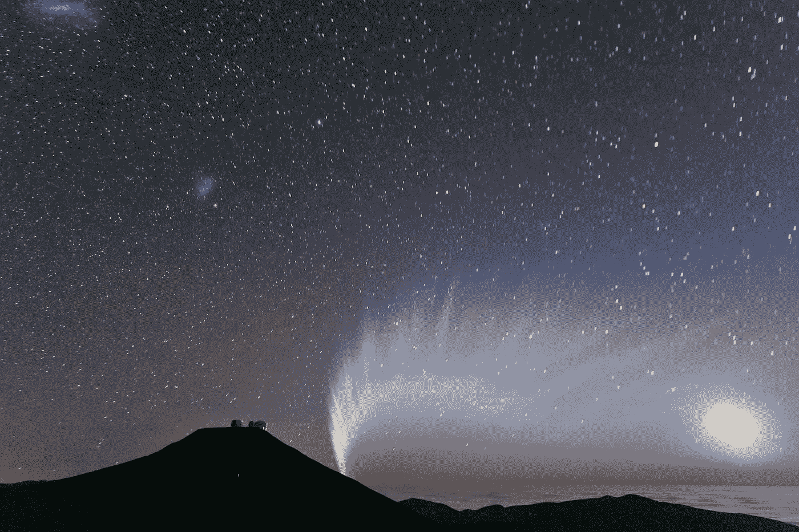
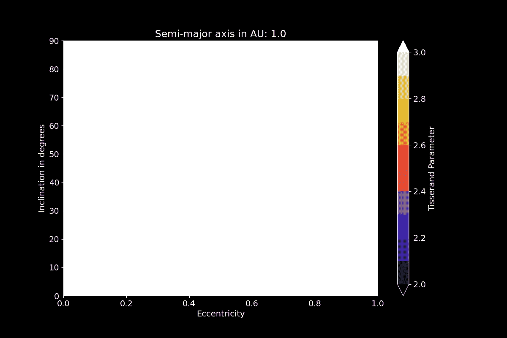

# Python 在空间科学中的应用——论文增刊

> 原文：<https://towardsdatascience.com/space-science-with-python-supplements-for-papers-4876ec46b418?source=collection_archive---------59----------------------->

## [用 Python 进行空间科学](https://towardsdatascience.com/tagged/space-science-with-python)

## [教程系列](https://towardsdatascience.com/tagged/space-science-with-python)的第 10 部分是关于辅助材料的补充文章。我们怎样才能恰当地形象化多维函数？



2007 年麦克诺特彗星及其尾巴。前面有望远镜圆顶的山是智利的帕拉纳尔山。信用:[s . Deiries/ESO](https://www.eso.org/public/unitedkingdom/images/mc_naught42/)；许可: [*知识共享署名 4.0 国际许可*](http://creativecommons.org/licenses/by/4.0/)

# 前言

*这是我的 Python 教程系列“用 Python 进行空间科学”的第 10 部分。这里显示的所有代码都上传到了*[*GitHub*](https://github.com/ThomasAlbin/SpaceScienceTutorial)*上。尽情享受吧！*

今天的课程是一篇“补充文章”,讲述如何为论文制作“补充材料”。补充材料可以是表格、数据集等任何东西。科学论文里写不下的东西。在这里，我们将看看 Tisserand 参数以及如何创建一个多维函数的动画。

# 介绍

在上一节课中，我们学习了彗星，它们的起源和轨道属性。上次我们发现费利克斯·蒂瑟朗[1]在 19 世纪提出的天体动力学理论有助于我们描述和解释周期性(P 型)彗星和木星之间的动力学联系。该等式返回所谓的相对于木星( *JUP* )的 Tisserand 参数 *T* ，该参数取决于彗星的半长轴 *a* 、倾角 *i* 和偏心率 *e* 。结果参数没有单位，介于 2 和 3 之间的值表示过去曾与木星有过近距离接触。这颗彗星变成了木星家族彗星(JFC)。


想象一下在论文或研究论文(或媒体文章)中使用和描述多输入参数方程。对于一直在这一特定研究领域工作的你来说，方程、结果和图表都是微不足道的。但是科学见解和结果需要对其他人来说是可解释的和可获得的。否则，你无法让别人相信你的想法。事情变得太复杂，你的想法无法实现。每天都有数十篇研究论文发表。*什么是好？有什么值得读的？我应该相信研究人员的说法吗？*

情节，表格和图像帮助我们和读者理解研究结果的复杂性，创造有趣的情节可以成为一门手艺。但是有一些限制:

1.  一些研究活动会产生大量无法打印或显示的数据
2.  研究论文是“二维的”

这两个问题都可以通过一个额外的*补充材料*在线部分轻松解决。例如，*科学*为这些不能发表在论文印刷版的材料提供了[指南](https://www.sciencemag.org/authors/instructions-preparing-initial-manuscript)。代码可以在 GitHub 上推送，数据可以存储在云端，多媒体信息可以帮助读者提高对发布内容的理解。

在我们的例子中:我们有一个依赖于 3 个输入参数的函数。*你知道 Tisserand 参数的解空间是什么样的吗？我也没有。因此，让我们通过创建一个包含所有输入参数的动画来加深对 Tisserand 参数的理解。*

# Python 的支持

对于这一课，首先，我们需要我们已知的库。后来引入了新的模块用于新的目的和功能。创建文件夹结构需要[](https://docs.python.org/3/library/pathlib.html)*(第 1 行)；我们再次用 [*spiceypy*](https://github.com/AndrewAnnex/SpiceyPy) 来计算木星的半长轴(第 5 行)；第 8 行 [*导入*](https://naif.jpl.nasa.gov/pub/naif/toolkit_docs/C/cspice/furnsh_c.html) 包含所有所需内核路径的元内核文件，数据处理和绘图分别需要[*【numpy】*](https://numpy.org/)(第 11 行)和 [*matplotlib*](https://matplotlib.org/) (第 14 行)。*

*第 1/7 部分*

*对于 Tisserand 参数，我们需要木星的半长轴。我们通过将一个 UTC 字符串转换成 et(用 [*utc2et*](https://naif.jpl.nasa.gov/pub/naif/toolkit_docs/C/cspice/utc2et_c.html) )在第 2 行设置一个星历时间(ET)。然后(第 6 行到第 9 行)，我们用函数 [*spkgeo*](https://naif.jpl.nasa.gov/pub/naif/toolkit_docs/C/cspice/spkgeo_c.html) 确定从太阳( [NAIF ID: 10](https://naif.jpl.nasa.gov/pub/naif/toolkit_docs/C/req/naif_ids.html) )看到的 ECLIPJ2000 中的木星重心( [NAIF ID: 5](https://naif.jpl.nasa.gov/pub/naif/toolkit_docs/C/req/naif_ids.html) )状态向量。在第 12 行和第 13 行(用函数 [*bodvcd*](https://naif.jpl.nasa.gov/pub/naif/toolkit_docs/C/cspice/bodvcd_c.html) )提取出太阳的 G*M(引力常数乘以质量)值后，我们在第 16 行确定木星的轨道根数。函数 [*oscltx*](https://naif.jpl.nasa.gov/pub/naif/toolkit_docs/C/cspice/oscltx_c.html) 需要木星的状态向量、ET 和太阳的 G*M 值作为输入。结果数组*的倒数第二个条目 ORB _ ELEM _ 木星*包含以千米为单位的半长轴(第 19 行)。第 20 行使用 SPICE 函数 [*convrt*](https://naif.jpl.nasa.gov/pub/naif/toolkit_docs/C/cspice/convrt_c.html) 将值从 km 转换为 AU。*

*第 2/7 部分*

**我们如何可视化需要 3 个不同输入参数的 Tisserand 参数？一个建议:我们创建一个二维图，x 轴是偏心率，y 轴是倾斜度。彩色等值线图代表 Tisserand 值。然后，我们可以为不同的半长轴值创建几个彩色等值线图。生成的图像然后被合并成电影或动画 GIF。**

*我们将使用 [*maplotlib contourf 函数*](https://matplotlib.org/3.1.1/api/_as_gen/matplotlib.pyplot.contourf.html) 来创建这些地块。首先，用[*numpy mesh grid*](https://numpy.org/doc/stable/reference/generated/numpy.meshgrid.html)*(第 17 行)我们设置一个倾角网格(第 3 行和第 4 行以角度和弧度定义倾角)和偏心率网格(第 7 行)。第 12 到 14 行将 Tisserand 参数定义为 lambda 函数。**

**第 3/7 部分**

**现在我们为即将到来的情节设置一些通用格式。对于颜色轮廓图，我们需要一些[颜色映射](https://matplotlib.org/3.2.1/tutorials/colors/colormaps.html)。这样，我们在第 2 行导入 [*matplotlib cm*](https://matplotlib.org/3.2.1/api/cm_api.html) 。黑暗模式的图看起来很好，所以我们在第 5 行设置了 *dark_background* 布局，并在第 8 行增加了默认字体大小，以获得更好的可读性。**

**每个等高线图将代表特定半长轴的解空间。这些值的范围在第 12 行和第 13 行的末尾定义。动画应在 1.0 AU 到 8.0 AU 之间创建，步长为 0.1 AU。**

**第 4/7 部分**

**现在我们为每个半长轴步长创建等高线图。所有的图都应该存储在一个额外的文件夹中，以防止文件淹没在我们的主教程文件夹中。如果目录还不存在，第 2 行创建文件夹 *temp/* 。总共将创建 71 个图像。这可能需要一些时间，并且在即将到来的 for 循环中打印每一步会使终端输出变得垃圾。为了获得一个干净和动态的工作状态，我们安装了模块[*【tqdm】*](https://github.com/tqdm/tqdm)*，使人们能够在终端或 Jupyter 笔记本中创建巨大的进度条:***

```
***pip3 install tqdm***
```

***第 5 行导入了第 12 行 for 循环语句中使用的 tqdm。在代码下面，您可以看到结果进度条。第 8 行创建了一个初始图形，用于下面的循环。***

***for 循环遍历半长轴值( *A_ARRAY* )。首先，清除绘图(第 15 行)，设置 x 和 y 极限(第 18 和 19 行)，并计算半长轴、偏心率和倾斜度对应的 Tisserand 参数矩阵(第 22 行)。设置标题(显示半长轴)和标签(第 25–27 行)后，等高线图创建完成(第 30–33 行)。我们想清楚地区分小于 2 的 Tisserand 值、介于 2 和 3 (JFCs)之间的值以及大于 3 的值。因此，我们用 *vmin* 和 *vmax* 为色彩映射设置限制。2 和 3 之间的值分 10 步(结束行 32)。***

**然后，绘制一个带有描述的颜色条(第 35 和 36 行),生成的图像存储在 *temp/* 文件夹中。选择了 100 的 dpi 值，因为最终的 GIF 不应超过 25 MB(介质上的最大文件大小)。**

**第 5/7 部分**

****

**for 循环的 tqdm 输出。贷方:T. Albin**

**[Matplotlib 提供原生动画支持](https://matplotlib.org/3.1.1/api/animation_api.html)。然而，我们选择了一种先存储所有图的方法。通过这种方式，人们可以将个别地块重新用于其他目的。为了将这些图合并到一个 GIF 中，我们需要定义一个数组来包含这些图的路径顺序。首先，我们导入库 [*glob*](https://docs.python.org/3/library/glob.html) ，它允许我们获得已创建地块的路径列表(第 4 行和第 5 行)。在第 13 行，创建了一个包含路径升序的列表。我们通过添加 25 倍于最后一个图像(第 16 行)的内容，在动画中添加一个短暂的休息。添加了一个路径名称的倒排列表，以创建一个“来回”动画，其中包含第一个图像的 25 个图像的另一个中断(第 20 和 23 行)。**

**第 6/7 部分**

**使用库[*imageio*](http://imageio.github.io/)*我们现在可以创建 GIF。如果您尚未安装该库，请执行以下 pip 命令进行安装:***

```
***pip3 install imageio***
```

***导入库(第 2 行)并创建一个包含所有绘图信息的空列表(第 5 行)。第 9 到 10 行中的 for 循环遍历所有路径名，并将读取的图像(带有[*imageio im read*](https://imageio.readthedocs.io/en/stable/userapi.html#imageio.imread))追加到原来的空列表中。***

**现在，在第 14 行，用函数 *mimsave* 创建动画 GIF。每个图像的持续时间设置为 0.04 秒，从而产生每秒 25 帧的动画。**

**第 7/7 部分**

**下面你可以看到 Tisserand 参数解空间的 GIF 结果，它是半长轴、倾斜度和偏心率的函数。这类动画有助于掌握复杂的功能。**

****

**Tisserand 参数作为半长轴、倾斜度和偏心率的函数的动画。彩色地图代表显示在右侧的 Tisserand 值。有色(非白、非黑)区域代表木星家族彗星(JFC)的解空间。贷方:T. Albin**

# **结论和下一步**

**[上次](/space-science-with-python-a-rendezvous-with-jupiter-55713e4ce340?source=your_stories_page---------------------------)我们学习了 Tisserand 参数及其解释(介于 2 和 3 之间的值表示彗星和木星之间的动力学联系)。然而，这一功能是多维的，难以把握。**

**补充资料，要么在这里，要么为科学论文，支持读者(有时还有自己！)来*感受一下复杂功能和依赖关系的*。**

**创建一个简单的动画可能需要花费一些时间和精力(如上图所示)，但是一张*图片胜过千言万语*，动画可能更多。**

**下次我们将回到科学的轨道上来，看看一个重要的数据科学问题:偏差效应。**

**托马斯**

# **参考**

**[1]蒂瑟朗，F.-F. (1896 年)。*东帝汶第四铁路*。巴黎高迪尔-维拉尔斯**