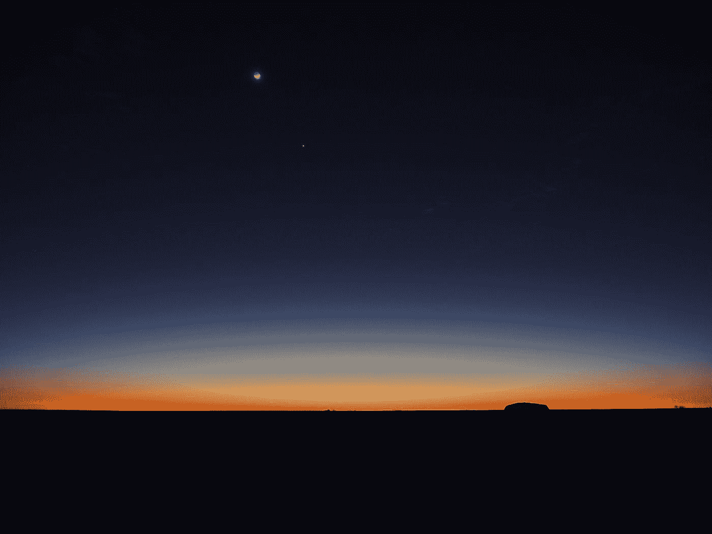
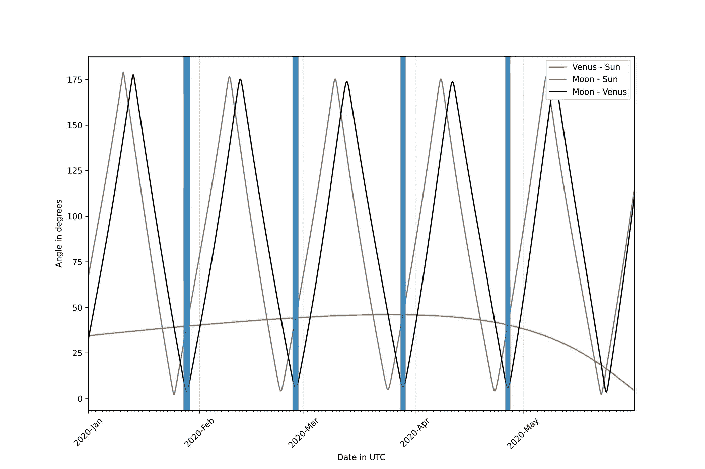
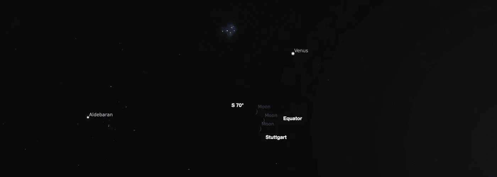

# Python 下的空间科学——金星之舞

> 原文：<https://towardsdatascience.com/space-science-with-python-the-dance-of-venus-926905875afb?source=collection_archive---------46----------------------->

## [https://towards data science . com/tagged/space-science-with-python](https://towardsdatascience.com/tagged/space-science-with-python)

## 本系列教程的第 4 部分将介绍如何确定拍摄金星和月球照片的最佳时机



照片由[格兰特·麦克弗](https://unsplash.com/@grantmciver?utm_source=medium&utm_medium=referral)在 [Unsplash](https://unsplash.com?utm_source=medium&utm_medium=referral) 上拍摄

## 前言

这是我的 Python 教程系列“Python 的空间科学”的第 4 部分。这里显示的所有代码都上传到了[*GitHub*](https://github.com/ThomasAlbin/SpaceScienceTutorial)*上。尽情享受吧！*

## 介绍

你最近晚上看天空了吗？就在日落之后？你可能已经认出了天空中这颗非常明亮的星星，在它消失在地平线下之前的几个小时里，你都可以看到它。几天后，这个点将会消失……它会在日出前的几个小时重新出现。*昏星*将变成*晨星*。

这不是一颗恒星，而是我们的邻居金星。在上面的照片中，你可以看到新月正下方的金星。这张照片和澳大利亚标志性的乌鲁鲁一起，很好地展示了我们的星球和我们的宇宙邻居的景观。

但是月亮和金星是什么时候靠近的呢？在过去的几周里，金星清晰可见，那么我们有多少机会看到(并拍摄)这个美丽的星座呢？Python + SPICE 可以回答这个问题！

*我们将把这个问题的潜在复杂性简化为几个简单的计算，这将为我们的问题提供一个简单的答案(最后的* ***结论&展望*** *部分将列出获得完整专家观点所需的额外计算步骤)。*

## 我们开始吧

我们需要什么来确定金星和月亮相互靠近的时间点？嗯，我们需要计算从我们的母星看到的月球和金星之间的相位角。相角是指指向月球和金星的两个以地球为中心的方向向量所围成的角度。

我们将计算两个物体在一定时间内的角距离。在此期间，这两个物体沿着天空移动，与太阳的角距离不断变化。我们还需要计算太阳-金星和太阳-月亮之间的最小距离。否则我们可能会计算出三个天体都靠得太近的星座(请注意:不要直视太阳；不是用你的肉眼，也不是通过任何设备，比如照相机的取景器。等待日落后，安全地观察和拍摄这两个物体。试图寻找金星或其他接近太阳的物体可能会导致失明和/或对你的眼睛造成不可修复的损害！).

对于本教程部分，我们的 SPICE 内核元文件只包含两个内核路径。 *de432s.bsp* 是天体位置计算所需要的， *naif0012.tls* 是包含闰秒等时间信息的内核。

```
\begindataKERNELS_TO_LOAD = (
 ‘../_kernels/spk/de432s.bsp’,
 ‘../_kernels/lsk/naif0012.tls’,
 )
```

用 [*furnsh*](https://naif.jpl.nasa.gov/pub/naif/toolkit_docs/C/cspice/furnsh_c.html) 加载元文件后，我们可以为我们的计算定义一个时间间隔:初始时间设置为 2020 年初，结束日期为 2020 年 6 月 1 日。使用 SPICE 函数 [*utc2et*](https://naif.jpl.nasa.gov/pub/naif/toolkit_docs/C/cspice/utc2et_c.html) 将创建的日期时间字符串转换为星历时间(ET)。数组 *TIME_INTERVAL* 包含从初始时间到结束时间的所有 et，步长为 3600 秒(1 小时)。

第 1/7 部分

为了将所有相关信息存储在一个公共位置，我们使用了一个*pandas*[*data frame*](https://pandas.pydata.org/pandas-docs/stable/reference/api/pandas.DataFrame.html)(第 3 行)。通过[应用](https://pandas.pydata.org/pandas-docs/stable/reference/api/pandas.DataFrame.apply.html)函数 *spiceypy* 函数 *et2datetime，存储 ET 数组(第 6 行)以及在第 12 +13 行计算的相应 UTC 时间戳。在第 22 到 28 行，我们计算从地球上看金星和太阳之间的相位角。为此，我们使用 SPICE 函数 [*phaseq*](https://naif.jpl.nasa.gov/pub/naif/toolkit_docs/C/cspice/phaseq_c.html) *。*该函数返回在某个星历时间 *et* 两个物体之间的角度距离，单位为弧度。该文件提供了输入参数*目标*(目标体)*照明体*(照明体)和*观察体*(观察体)的示意图:*

```
 ILLMN      OBS
       ILLMN as seen      ^       /
       from TARG at       |      /
       ET - LT.           |     /
                         >|..../< phase angle
                          |   /
                        . |  /
                      .   | /
                     .    |v     TARG as seen from OBS
               SEP   .   TARG    at ET
                      .  /
                        /
                       v
```

在我们的问题上应用 [*phaseq*](https://naif.jpl.nasa.gov/pub/naif/toolkit_docs/C/cspice/phaseq_c.html) 的函数和计算逻辑导致以下输入参数:

*   目标:地球( [NAIF ID](https://naif.jpl.nasa.gov/pub/naif/toolkit_docs/C/req/naif_ids.html) 399)
*   太阳(NAIF ID 10)
*   金星(NAIF ID 299)

此外，我们可能会注意到另一个名为 *abcorr* 的输入参数。在上一次教程中，我们在相当简单的“稳态”中计算了状态和方向向量、相角以及其他参数。这里，我们通过考虑光的时间(光的传播时间)并考虑观测速度，以更精确的方式计算距离。得到的输入参数是 *LT+S.*

[相应的 SPICE 修正文件对术语](https://naif.jpl.nasa.gov/pub/naif/toolkit_docs/C/req/abcorr.html)进行了如下描述

LT

> 使用牛顿公式校正单向光时(也称为“行星像差”)。这种校正产生了目标在发射光子到达 et 的观察者时的状态。

*LT+S*

> 使用牛顿公式校正单向光时和恒星像差。这个选项修改了用“LT”选项获得的状态，以说明观察者相对于太阳系重心的速度。结果是目标的表观状态——观察者看到的目标的位置和速度。

这些修正在我们接下来的教程中是必要的，在这些教程中，我们还将计算危险小行星的位置，正确的时间和观测计划是至关重要的。

第 2/7 部分

现在我们用同样的函数来计算月亮和太阳之间的相位角…

第 3/7 部分

…以及月球和金星之间的相位角。

第 4/7 部分

我们现在可以为一个上镜的月亮——金星星座设定我们的要求。增加了一个名为*上镜*的新列，其中一个二进制值代表“好看”(1)或“不那么好看”(0)的星座。请注意，我们为这个计算设置了一些人为的要求。(天文)摄影的品味是不同的；因此，请随意相应地更改需求。

这里，我们在 lambda 函数的 if-else 条件中应用了以下要求:

*   太阳和金星之间的角距应大于 30°
*   太阳和月亮之间的角距应大于 30°
*   月亮和金星之间的角距应小于 10°

第 5/7 部分

让我们看看结果。我们以 3649 小时(152 天)的时间间隔计算相位角。只有 143 小时(6 天)满足这一要求！

第 6/7 部分

现在，我们可以将结果显示在一个图表中，以感受不断变化的角距离和我们观察的最佳时间段。为此，我们使用 [*matplotlib*](https://matplotlib.org/) 。第 10 至 17 行绘制了三个不同的相位角与日期的关系。我们为轴设置了一些标签，为更好的可读性创建了一个垂直网格，并为 x 轴设置了限制(第 20 到 27 行)。对于 x 轴，我们将设计和定位器格式化为 little bit(第 30 到 34 行)。仅显示月初，每个较小的定位器代表一个月中的某一天。“上镜时刻”被可视化为垂直的蓝色线条，并使用函数 [*axvline*](https://matplotlib.org/api/_as_gen/matplotlib.axes.Axes.axvline.html) 在第 38+39 行的 for 循环中创建。为了提取“上镜时刻”日期，使用*熊猫*函数 [*进行过滤。loc[]*](https://pandas.pydata.org/pandas-docs/stable/reference/api/pandas.DataFrame.loc.html) :

```
INNER_SOLSYS_DF.loc[INNER_SOLSYS_DF[‘PHOTOGENIC’] == 1][‘UTC’]
```

最后，我们添加图例，稍微旋转日期并存储绘图。

第 7/7 部分

下图显示了结果图。如您所见，显示的是角度和日期。月球绕地球一周大约是 27 天，这分别导致了月球-太阳和月球-金星相位角的快速变化。金星和太阳之间的角距离在几周前达到最大值，目前距离正在迅速减小。五月底，金星将看不到，因为金星在太阳和地球之间。这个位置星座叫做“下合”。几个星期后，金星将作为晨星重新出现。

蓝线表示我们之前定义的“上镜时刻”。每次月球公转只包含 1 到 1.5 天的“完美时刻”。你在其中一个时间段拍了照片吗？



相位角与日期。橙色、灰色和黑色曲线分别显示金星-太阳、月亮-太阳和月亮-金星的相位角。蓝色竖线表示“上镜时刻”，即满足我们之前定义的特定角度要求。贷方:T. Albin

## 结论与展望

可惜没有留给梅的机会；所以我们要等待晨星(并激励自己早起)。或者我们等着…等着昏星。但是金星晚上什么时候回来？用你到目前为止学到的 SPICE 函数，你可以试着回答这个问题！尝试绘制金星和地球的轨道以及金星和太阳之间的相位角，以了解返回日期。

如果你是一个有经验的天文学家，你可能会指出我们没有计算金星在天空的位置。此外，我们从地球中心计算相位角，不考虑人类观察者的地理坐标。嗯，你完全正确！



取决于三个观察点位置的月亮天空位置的重叠模拟(这三个位置与德国城市斯图加特的地理纬度相同)。除了斯图加特，你还可以看到从赤道和南纬 70 度看月亮的位置。日期时间是世界协调时 2020 年 3 月 28 日 20:00:00。你可以很好地看到金星、昴宿星和阿鲁迪巴紧密相连的星座。这三个合并的子图是用天文馆软件 [Stellarium](https://stellarium.org/) 创建的

到目前为止，我们使用 Python 和 Jupyter 笔记本学习了一些 SPICE 函数和一些用例。在接下来的教程中，我想深入探究，从小行星和所谓的近地天体开始。但是，在此之前，我们需要讨论两个一般性话题:

*   参考框架
*   轨道力学

这两个主题对我们来说就像数学和统计学对数据科学和机器学习一样重要。别担心，我们会一起学习这些东西，用 Python。之后，你就有了坚实的知识基础，可以从事科学方面的工作，我会在之后展示给你看。

与此同时，使用目前为止您所学的函数。使用 [*散景*](https://docs.bokeh.org/en/latest/index.html) 改进 *matplotlib* 图或创建交互式版本。

托马斯