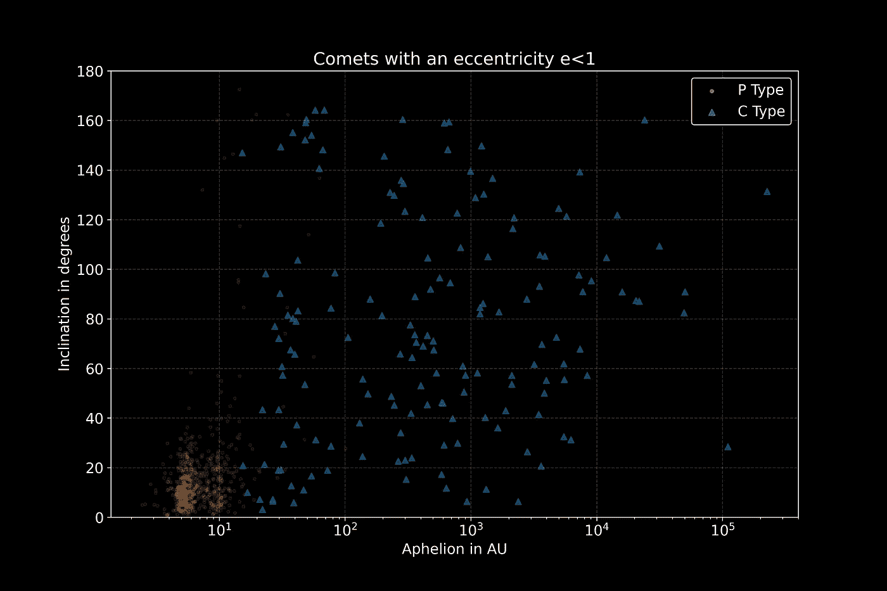
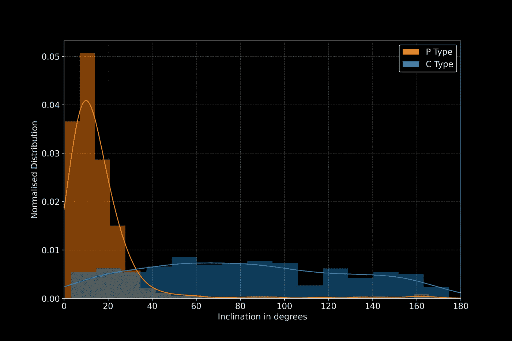

# Python 下的空间科学——彗星的起源

> 原文：<https://towardsdatascience.com/space-science-with-python-the-origin-of-comets-3b2aa57470e7?source=collection_archive---------40----------------------->

## [用 Python 进行空间科学](https://towardsdatascience.com/tagged/space-science-with-python)

## [教程系列之八](https://towardsdatascience.com/tagged/space-science-with-python)。简单的数据可视化有时足以获得令人印象深刻的科学结果


所谓柯伊伯带的艺术印象。海王星之外的一个区域，冰和岩石围绕太阳旋转。它是潜在彗星的来源，也是位于该带之外的所谓奥尔特云的来源。信用:[ESO/m . Kornmesser](https://www.eso.org/public/unitedkingdom/images/0319_kuiper_belt_1/)；许可: [*知识共享署名 4.0 国际许可*](http://creativecommons.org/licenses/by/4.0/)

# 前言

*这是我的 Python 教程系列“用 Python 进行空间科学”的第 8 部分。这里显示的所有代码都上传到了*[*GitHub*](https://github.com/ThomasAlbin/SpaceScienceTutorial)*上。尽情享受吧！*

*本教程的数据库已经在* [*上一届*](/comets-visitors-from-afar-4d432cf0f3b) *中创建，但是也上传到我的* [*GitHub 资源库*](https://github.com/ThomasAlbin/SpaceScienceTutorial/tree/master/_databases/_comets) *中。*

# 介绍

在过去的几周里，我们了解了 [SPICE](https://naif.jpl.nasa.gov/naif/toolkit.html) ，这是一个伟大的 NASA 工具包，可以帮助开发人员、科学家和工程师解决空间科学相关的问题:轨道力学、坐标确定、位置计算等等(SPICE 的 [Python 包装源代码)。目前，我们只看到了冰山一角。更多的话题将接踵而至，我们也将在那里研究宇宙飞船的数据！](https://github.com/AndrewAnnex/SpiceyPy)

[上次](/comets-visitors-from-afar-4d432cf0f3b)，我们开始下载并解析实际的科学数据:[来自小行星中心的彗星数据集](https://www.minorplanetcenter.net/data) (MPC)。我们建立了一个小型的 [SQLite](https://www.sqlite.org/index.html) 数据库，现在有一些科学问题需要回答:

*   *这些彗星来自哪里？*
*   *为什么会有不同的类型(C、P、I 型)？*
*   *我们是否观察到了全部，还是存在某种偏差？*
*   而且很重要:*下一颗大彗星什么时候来？*

我们将在接下来的教程中针对每个单独的问题。令人惊讶的是，我们不需要任何高级机器学习或数据科学方法来获得深刻的科学见解。科学是获取、清理和探索这些数据，并创建一个需要测试的模型。为了熟悉科学任务，定性方法也是可行的:描述和解释数据。

# 源区域

1950 年，荷兰天文学家简·亨德里克·奥尔特发表了一篇论文【1】:*围绕太阳系的彗星云的结构和一个关于其起源的假说*。他的论文和观点类似于 1930 年代的奥皮克的工作[2]: *围绕太阳系的彗星云的结构和关于其起源的假说*。两位科学家都在独立思考彗星从何而来。与行星或主带小行星等其他太阳系天体不同，彗星“忽略”了靠近黄道面绕太阳运行的通常和谐性。它们从任何地方随机而来，有很大的轨道和几百或几千年的循环周期！*这些尸体的来源是什么？在进行他们的研究时，皮克和奥尔特只有一些彗星的数据点。假设至今有效的理论的应用统计学考虑:皮克-奥尔特云:或者简称:奥尔特云。*

奥尔特云是一个假设的围绕太阳的球形区域，范围从大约 1000 天文单位到超过 100，000 天文单位！奥尔特云的内部可能与所谓的柯伊伯带的外部合并，柯伊伯带也包含海王星轨道以外的冰体。柯伊伯带与一个包含大量分散物体的宽阔圆盘相关联。

奥尔特云中天体之间的引力扰动或碰撞会导致轨道变化，从而导致高偏心率或朝向太阳系内部的轻微抛物线路径。例如，C/2014 S3 彗星(PANSTARRS)的理论轨道重建如下:


用库皮尔带(内盘)和奥尔特云(蓝壳/球)来显示太阳系(中间)。红线表示彗星 C/2014 S3(panstars)的计算历史，它源于奥尔特云(右上:开始)，并向太阳移动，行星飞越导致轨道元素发生变化。信用:[ESO/l . calada](https://www.eso.org/public/unitedkingdom/images/eso1614b/)，许可: [*知识共享署名 4.0 国际许可*](http://creativecommons.org/licenses/by/4.0/)

# 深潜

我们能在数据中“看到”柯伊伯带或假设的奥尔特云的某些部分吗？有没有可能得出厄皮克和奥尔特的理论？让我们看看来自实际观测彗星的纯轨道要素。上次我们创建了一个包含所有数据点的 SQLite 数据库。由于尺寸较小，[数据库](https://github.com/ThomasAlbin/SpaceScienceTutorial/tree/master/_databases/_comets)上传到[我的 GitHub 库](https://github.com/ThomasAlbin/SpaceScienceTutorial)上，还有以下代码。

我们从导入今天课程所需的所有模块开始。这一次，我们分别不需要[香料](https://naif.jpl.nasa.gov/naif/toolkit.html)和[香料](https://github.com/AndrewAnnex/SpiceyPy)。 [*sqlite3*](https://docs.python.org/3/library/sqlite3.html) 是唯一的标准库； [*numpy*](https://numpy.org/) 和 [*pandas*](https://pandas.pydata.org/) 用于数据处理，绘图例程需要 [*matplotlib*](https://matplotlib.org/) 。稍后导入一个新的库用于一些分析工作。

第 1/7 部分

在第 3 行使用*sqlite3*[*connect*](https://docs.python.org/3/library/sqlite3.html#sqlite3.connect)命令建立到数据库的连接。从数据库中提取数据需要返回的连接对象；或者使用相应的 *sqlite3* 命令，或者使用*pandas*[*read _ SQL*](https://pandas.pydata.org/pandas-docs/stable/reference/api/pandas.read_sql.html)命令，分别如第 7+8 行和第 11+12 行所示。创建了两个不同的数据框架:一个用于所有 P 型彗星，另一个用于所有 C 型彗星。这些标签代表了彗星的简单分类模式:

*   **P 型**:轨道周期小于 200 年的所谓周期性彗星。(示例:67**P**/丘留莫夫–格拉西缅科
*   **C 型**:轨道周期超过 200 年的彗星(例: **C** /1995 O1(海尔-波普))

其他类型还有 **X 型**彗星(未知轨道) **A 型**彗星(被错误归类为彗星的小行星) **D 型**彗星(丢失的彗星)和 **I 型**彗星(星际起源的天体)。

由于我们想分析彗星的空间分布，我们提取了 P 型(第 7+8 行)和 C 型(第 11+12 行)的远日点和倾角数据。由于 C 型彗星的偏心率可能超过 1，我们也提取这些彗星的偏心率来区分束缚轨道和非束缚轨道。

第 2/7 部分

*熊猫*有一些好看又快捷的统计功能，可以快速应用。其中一个是 [*形容*](https://pandas.pydata.org/pandas-docs/stable/reference/api/pandas.DataFrame.describe.html) 。该函数应用于数据框架，并返回一些常规描述性参数，如平均值、标准差、最小值和最大值，以及四分位数范围的中值(50 %)和下限(25 %)和上限(75 %)。

我们在以下部分打印了两个数据集的结果，并区分了束缚(第 8+9 行)和非束缚(第 12+13 行)C 型轨道:

第 3/7 部分

结果如下所示。我们有 627 颗周期性彗星。中值远日点约为 5.9 天文单位(木星在 5 天文单位左右绕太阳运行)，75 %的彗星倾角小于 19 度。因此，它们居住在太阳系的内部，靠近黄道面。这并没有证实厄皮克和奥尔特的理论，是吗？

```
Descriptive statistics of P comets
       APHELION_AU  INCLINATION_DEG
count   627.000000       627.000000
mean      7.793602        16.525725
std       6.567561        20.943154
min       2.440626         0.234800
25%       5.145018         7.088200
50%       5.929885        11.550400
75%       8.995666        18.868550
max     101.318552       172.527900
```

所以让我们来看看 C 型彗星。我们有 159 个束缚轨道和 67 个非束缚轨道。束缚轨道的中值远日点是 450 天文单位，超过 25 %的远日点大于 2000 天文单位！这些是令人印象深刻的长期轨道。根据数据库，一个物体的远日点超过 200，000 天文单位(请注意:数据库不包含测量误差，这颗彗星也可能是未绑定的！).倾角分布在一个更大的范围内，中值为 72 °,无约束彗星的中值倾角甚至接近 100°。看来这些彗星有随机倾向。

```
 Descriptive statistics of C comets with an eccentricity < 1
         APHELION_AU  INCLINATION_DEG  ECCENTRICITY
count     159.000000       159.000000    159.000000
mean     4766.428836        76.079123      0.946816
std     20826.176153        44.847788      0.096976
min        15.260793         3.148100      0.428280
25%        60.233850        40.870450      0.939769
50%       450.794467        72.079400      0.991066
75%      2000.520291       105.572200      0.997811
max    226057.150184       164.245500      0.999979

Descriptive statistics of C comets with an eccentricity >= 1
       APHELION_AU  INCLINATION_DEG  ECCENTRICITY
count          0.0        67.000000     67.000000
mean           NaN        96.280825      1.003104
std            NaN        44.336388      0.006557
min            NaN        11.333000      1.000000
25%            NaN        56.890150      1.000482
50%            NaN        99.442800      1.001626
75%            NaN       128.486550      1.003426
max            NaN       174.620300      1.049508
```

*一图抵千言*。这也适用于科学！因此，让我们通过绘制获得的数据来产生科学见解。首先，我们创建一个散点图，其中绘制了倾角与远日点的关系。散射标记有不同的颜色和形状来区分 P 型和 C 型。以下代码生成如下所示的散点图。格式化绘图并使其“可发布”需要一些时间和精力，正如您在各种格式化命令中看到的那样。每个评论描述了每一行的必要性。我们只画出具有束缚轨道(偏心率 e < 1)的彗星:

第 4/7 部分

请注意:x 轴(AU 中的远日点)是对数坐标。我们从描述性统计中得到的第一印象似乎和预期的一样。P 型集中在 10 天文单位内，并在接近黄道平面的轨道上移动。然而，C 型随机分布在高度逆行的轨道上。我们看到的是柯伊伯带的一部分和奥尔特云的内部，正如我们所料。



P 和 C 型彗星的倾角与远日点的散点图。远日轴是按对数标度的，只有 C 型才被认为具有有界轨道(偏心率 e<1)。贷方:T. Albin

奥尔特云呈球形，不断向太阳系内部补充新的彗星。所以，C 型的倾斜值应该是均匀分布的。散点图是获得第一印象的有用工具，但让我们创建一个更容易理解的分布可视化。

一种常见的可视化数据的方法是直方图，其中离散的数据点被汇总在不同的箱中。容器的宽度决定了分布的平滑度:太小的容器宽度会导致过采样，太大的容器宽度会导致欠采样。有许多规则或经验法则来确定正确的箱子宽度，如 to Sturge 规则、Scott 规则、Rice 规则和许多其他规则。对于完整的倾斜范围(第 11 行),我们将基于非常简单的平方根选择创建一个直方图。

第 5/7 部分

基于离散数据创建连续分布有不同的方法。除了直方图之外，可以用所谓的核函数(例如，高斯或 Epanechnikov 核)来代替数据点。重叠的内核生成最终的分布(一些例子由 [scikit-learn](https://scikit-learn.org/stable/auto_examples/neighbors/plot_kde_1d.html#sphx-glr-auto-examples-neighbors-plot-kde-1d-py) 提供)。内核宽度优化有几种实现方式，一些论文研究了各种方法。例如，Shimazaki 和 Shinomoto (2010)开发了一种自适应核宽度估计器，其根据局部密度变化计算不同核的不同宽度。

在我们的例子中，我们使用 [*scipy*](https://www.scipy.org/) 函数 [*stats.gauss_kde*](https://docs.scipy.org/doc/scipy/reference/generated/scipy.stats.gaussian_kde.html) 来应用 [Scott 规则](https://docs.scipy.org/doc/scipy/reference/generated/scipy.stats.gaussian_kde.html#ra3a8695506c7-1)来确定内核宽度。第 6 行和第 7 行计算 P 类型的核密度估计值(KDE ),并基于倾斜范围计算密度分布。第 10 行和第 11 行对 C 类型应用相同的方法(使用有界和无界轨道)。

第 6/7 部分

现在我们可以用之前显示的相同颜色绘制两种彗星类型的直方图和 kde。为了更好的可读性，对分布进行了归一化处理(否则 P 型彗星将超过 600 颗，而 C 型彗星只有 200 颗)。

第 7/7 部分

该图显示了分布与倾斜度的关系。你可以看到 P 型正在向黄道面靠近，而 C 型倾角分布几乎是平均分布的。小的变化是由观察偏差引起的，也是因为我们只有 200 个数据点用于 C 型。总之，人们可以假设 C 型的大远日点值和几乎均匀分布的倾角表明它们从任何随机方向出现。



P 型和 C 型彗星的归一化倾角分布。直方图基于平方根选择，与高斯核密度估计重叠，以揭示彗星倾斜轨道的分布。贷方:T. Albin

# 结论与展望

科学家收集和分享数据，免费下载和分析。我们已经并将继续使用自由软件解决方案来获得科学见解。谁能想到 70 年后球形彗星区的理论仍然有效？我们没有应用任何高级机器学习算法或方法。简单的数据探索和可视化是可行的，足以让我们感受到皮克和奥尔特的理论。

但是还有更多的发现。*为什么 P 型彗星如此“集中”？*既然我们发现了这么多彗星，*还有更多的有待发现吗？*

我们将在接下来的课程中回答这些话题，届时我们将看到木星是一个主要的影响因素，观测偏差效应会导致不眠之夜。

托马斯

# 参考

[1] Oort，j .“围绕太阳系的彗星云的结构及其起源的假设”。*荷兰天文研究所通报*。11，1950 年，第 91-110 页。1950 年 11 月 11 日。([打开访问链接](https://openaccess.leidenuniv.nl/bitstream/handle/1887/6036/BAN_11_91_110.pdf?sequence=1))

[2]厄皮克，e .“关于近抛物线轨道的恒星扰动的说明。”*美国艺术与科学学院学报*，第 67 卷，第 6 期，1932 年，第 169–183 页。[www.jstor.org/stable/20022899.](http://www.jstor.org/stable/20022899.)

[3 ] H. Shimazaki 和 S. Shinomoto，“尖峰率估计中的核带宽优化”，载于《计算神经科学杂志》29(1–2):171–182，2010 年[http://dx.doi.org/10.1007/s10827-009-0180-4](http://dx.doi.org/10.1007/s10827-009-0180-4)。