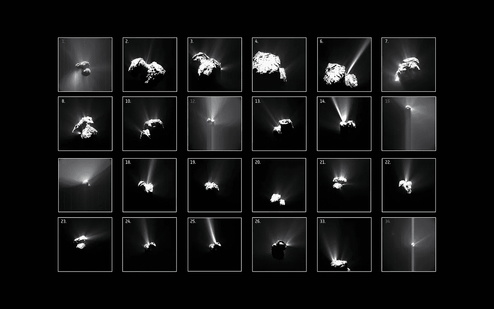
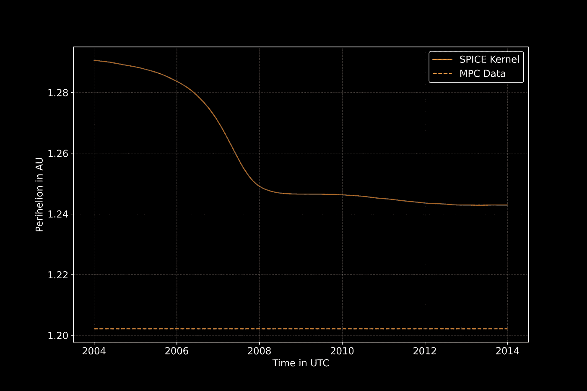
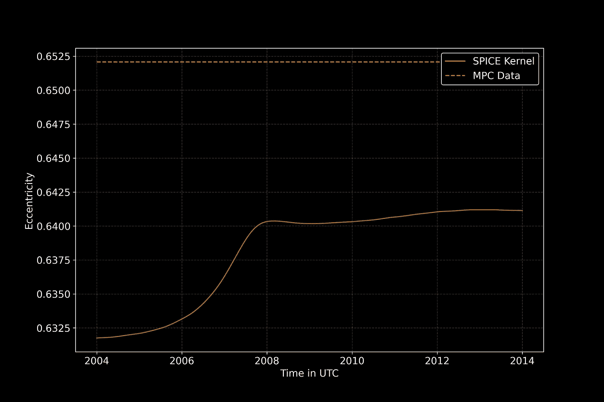
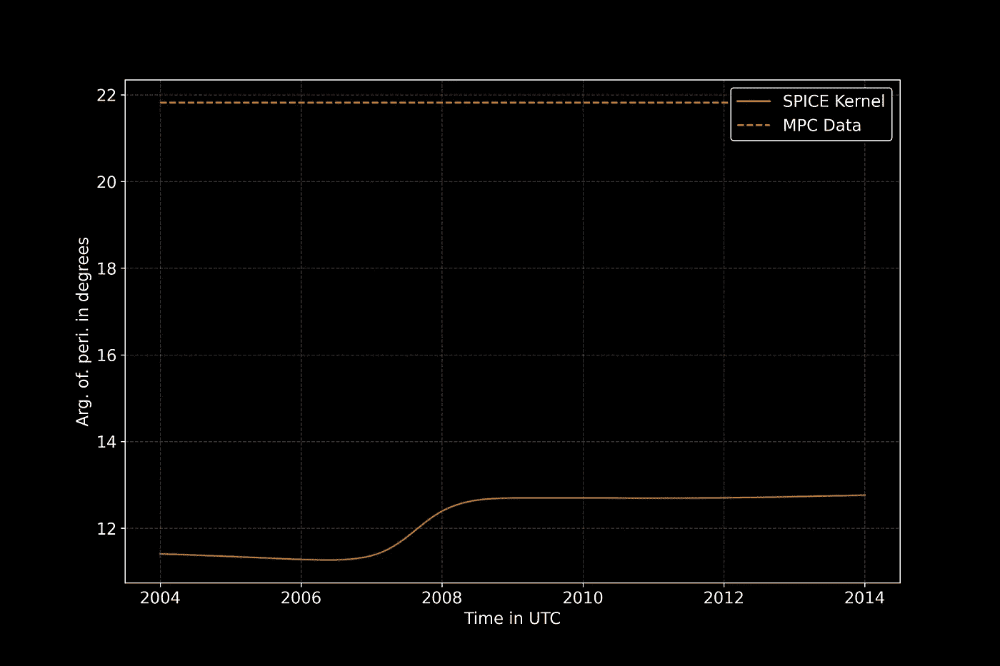

# Python 下的空间科学——彗星的动荡时代

> 原文：<https://towardsdatascience.com/space-science-with-python-turbulent-times-of-a-comet-7fecedd78169?source=collection_archive---------52----------------------->

## [用 Python 进行空间科学](https://towardsdatascience.com/tagged/space-science-with-python)

## [系列教程的第 13 部分](https://towardsdatascience.com/tagged/space-science-with-python)将介绍 67P/丘留莫夫-格拉西缅科的轨道要素。这是简单的轨道力学。对吗？



从 Rosetta 航天器上看到的 67P/Churyumov–Gerasimenko 的不同面貌。鸣谢: [ESA/Rosetta/MPS for OSIRIS 团队 MPS/UPD/LAM/IAA/SSO/INTA/UPM/DASP/IDA](https://www.esa.int/ESA_Multimedia/Images/2016/09/Comet_outbursts_annotated)；NavCam:ESA/Rosetta/NavCam；许可证: [CC BY-SA IGO 3.0](https://creativecommons.org/licenses/by-sa/3.0/de/deed.en)

# 前言

*这是我的 Python 教程系列“用 Python 进行空间科学”的第 13 部分。这里显示的所有代码都上传到了*[*GitHub*](https://github.com/ThomasAlbin/SpaceScienceTutorial)*上。尽情享受吧！*

用户建议在每个 Jupyter 笔记本的末尾添加小任务，以解决科学或编程问题。从本次会议开始，我将添加这些作业，并在一段时间后在[*GitHub*](https://github.com/ThomasAlbin/SpaceScienceTutorial)*上提供一个解决方案。玩得开心！*

# 介绍

在最后一节([Python 空间科学——3d 彗星](/space-science-with-python-a-comet-in-3-d-3774b1d71d9b))中，我们开始关注一颗非常特别的彗星:67P/Churyumov——Gerasimenko。欧空局的罗塞塔/菲莱任务访问的彗星。从 2014 年到 2016 年，轨道飞行器探索了这个冰冷的世界，并在 2014 年 11 月部署了着陆器菲莱。在接近彗星几个小时后，人类收集到的关于彗星的数据和见解比以前所有任务和观测的总和还要多。2004 年出版了一本名为《彗星 2》的书，总结了所有关于这些蒸发的世界的相关信息。现在，我们有了更多在网上部分免费获得的科学发现: [*天文学&天体物理学专刊*](https://www.aanda.org/component/toc/?task=topic&id=977) *。*


公民科学家为科学和公共社区贡献了大量内容。这张彗星表面的图片是由一位业余天文学家将几张图片合并而成的。[欧空局的官方图像描述说](https://www.esa.int/ESA_Multimedia/Images/2018/10/Comet_landscape):[……]来自西班牙的业余天文学家 Jacint Roger Perez 通过组合 Rosetta 上的 OSIRIS 窄角相机在不同波长下拍摄的三张图像，选择并处理了这张照片。[…]".学分:欧空局/Rosetta/OSIRIS 团队的 MPS/UPD/LAM/宇航科学院/SSO/INTA/UPM/DASP/国际开发协会；罗杰；许可证: [CC BY SA 4.0](https://creativecommons.org/licenses/by-sa/4.0/deed.en)

我们的最后一次会议给了我们一个详细的彗星的三维结构概述，这是由罗塞塔的相机系统之一。今天和在我们的下一次会议中，我们想更多地了解它的轨迹；它围绕太阳的运动。*彗星是如何围绕太阳旋转的？是否有不同的信息资源？又能从中得出什么样的见解呢？*

# 没什么好期待的，对吧？

考虑到简单的二体问题，轨道力学很容易理解。两个质量围绕一个共同的质心旋转。在之前的会议([空间科学与 Python:彗星——来自远方的访客](/comets-visitors-from-afar-4d432cf0f3b))中，我们创建了一个 SQLite 数据库，其中包含所有已知彗星的轨道元素。数据是从[小行星中心](https://www.minorplanetcenter.net/data)获得的。这些数据可以用来计算彗星的轨迹。*但是真的有那么简单吗？*

首先，我们导入我们需要的模块。这一次，我们将分别需要[美国宇航局的 SPICE 工具包](https://naif.jpl.nasa.gov/naif/toolkit.html)Python 包装器 [*spiceypy*](https://github.com/AndrewAnnex/SpiceyPy) 。其他模块，像[*numpy*](https://numpy.org/)[*熊猫*](https://pandas.pydata.org/) 和 [*matplotlib*](https://matplotlib.org/) 也在使用。

第 1/8 部分

我们在第 2 行建立了到数据库的连接。由于它只有 180 kB 左右的大小，这个数据库也存储在我的 [GitHub 仓库](https://github.com/ThomasAlbin/SpaceScienceTutorial)中，所以你不需要担心从零开始创建这个数据库。

*我们想用什么样的数据来描述 67P 的轨迹？*显然，我们需要轨道元素，如近日点(第 5 行)、半长轴(第 6 行)、远日点和偏心率(第 7 行)，以及近日点和倾角的自变量(第 8 行)。彗星的名字以编号和类型缩写(C，P，X 等)开头。)后跟实际名称。为了通过只提供数字来获得彗星的数据，我们使用 SQL 命令*名称，如“67P %”*。 *where* 语句搜索其字符串与附加了 any (sub)字符串(%)的 67P“相似”的名称。通过命令 [*read_sql*](https://pandas.pydata.org/pandas-docs/stable/reference/api/pandas.read_sql.html) 将数据存储在 *pandas* dataframe 中。

第 2/8 部分

让我们看看数据库中的数据。我们简单地用 f 字符串中的 [*iloc*](https://pandas.pydata.org/pandas-docs/stable/reference/api/pandas.DataFrame.iloc.html) 命令打印结果。

第 3/8 部分

输出如下所示。我们成功提取了彗星 67P 的信息。近日点在 1.2 天文单位，因此在太阳加热导致彗星蒸发的范围内。远日点在 5.7 天文单位；大约 4 度的小倾角表明这颗彗星穿过了木星的轨道平面，使其成为木星家族彗星(JFC)。

```
NAME                  67P/Churyumov-Gerasimenko
PERIHELION_AU                           1.20213
SEMI_MAJOR_AXIS_AU                      3.45513
APHELION_AU                             5.70813
ECCENTRICITY                           0.652073
ARG_OF_PERIH_DEG                        21.8178
INCLINATION_DEG                          3.8868
Name: 0, dtype: object
```

有了这些数据，我们可以很容易地观察和分析彗星的轨道。但是考虑一下关于 Tisserand 参数的文章([太空科学与 Python —与木星的一次交会](/space-science-with-python-a-rendezvous-with-jupiter-55713e4ce340)):小天体的轨道受到行星引力摄动的影响(比如木星)。扰动会改变轨道要素，然而，数据库只提供某一时期的静态结果！

那么我们应该生成复杂且计算量大的数值模拟吗？没有这个必要。重新考虑已经使用的香料核。也许我们发现一个内核已经包含了一些更复杂的考虑。让我们看一看。

[公共内核库](https://naif.jpl.nasa.gov/pub/naif/)有一个用于 *Rosetta* 任务的子文件夹。在那里我们找到了*内核*和 *spk* 子文件夹。我们深入查看子文件夹 *former_versions* 中的“旧”数据。 *aareadme.txt* 声明:

```
Name                               Comments                                    
---------------------------------  ---------------------------------   
67P_CHURY_GERAS_2004_2016.BSP      Contains ephemeris data for the
                                   Comet Churyumov-Gerasimenko/67P.
                                   This file has been originated from
                                   JPL Horizons On-Line Ephemeris          
                                   System and IT IS NOT an official  
                                   Rosetta Project SPK. It is 
                                   provided as support to study 
                                   cases until an official SPK is 
                                   released. Spans from January 2004 
                                   to January 2016.
```

虽然这不是一个官方项目 *spk* ，但是由于时间覆盖在 2004 年到 2016 年之间，所以我们使用这个内核。我们将内核的路径(以及其他一些需要的内核)添加到 *kernel_meta.txt* 中，并通过 [*furnsh*](https://naif.jpl.nasa.gov/pub/naif/toolkit_docs/C/cspice/furnsh_c.html) 加载文件。

对于之前加载的轨道元素，我们需要引力常数乘以太阳的质量。我们用命令 [*bodvcd*](https://naif.jpl.nasa.gov/pub/naif/toolkit_docs/C/cspice/bodvcd_c.html) 在第 5 行和第 6 行提取这些信息。

第 4/8 部分

我们想要实现什么？MPC 数据提供不随时间变化的轨道要素。另一方面，SPICE 内核可以包含更复杂的彗星轨迹数据集。所以让我们分析 10 年的时间范围。从 2004 年到 2014 年。首先，我们需要创建一个包含两年之间的日期时间步长的数组。第 2 行和第 3 行创建每年 1 月 1 日的*熊猫* [*时间戳*](https://pandas.pydata.org/pandas-docs/stable/reference/api/pandas.Timestamp.html) (s)。第 6 行创建了一个有 1000 个时间步长的 *numpy* *数组*，第 9 行将其转换回一个日期时间对象，并带有*pandas*[*to _ datetime*](https://pandas.pydata.org/pandas-docs/stable/reference/api/pandas.to_datetime.html)。

第 5/8 部分

现在我们根据相应的 SPICE 核，计算每个时间步的 67P 轨道元素。在第 2 行创建一个空的数据帧，它将存储所有结果。UTC 时间字符串存储在第 5 行，并通过 SPICE 函数 [*utc2et*](https://naif.jpl.nasa.gov/pub/naif/toolkit_docs/C/cspice/utc2et_c.html) 转换为第 8 至 9 行的星历时间(ET)。然后，计算从太阳看到的 67P 的状态向量(第 12 到 16 行)。对于该计算，使用函数 [*spkgeo*](https://naif.jpl.nasa.gov/pub/naif/toolkit_docs/C/cspice/spkgeo_c.html) 并将 ECLIPJ2000 设置为参考系。67P 的 [NAIF ID 代码](https://naif.jpl.nasa.gov/pub/naif/toolkit_docs/C/req/naif_ids.html)为 1000012 [*]。最后，第 19 到 23 行用函数 [*oscltx*](https://naif.jpl.nasa.gov/pub/naif/toolkit_docs/C/cspice/oscltx_c.html) 计算状态向量对应的轨道元素。

第 6/8 部分

轨道元素以数组的形式存储在列 STATE_VEC_ORB_ELEM 中。现在，我们从数组中提取所需的轨道元素，并将它们分配给各个数据帧列。阵列中轨道元素的顺序在 [*oscltx*](https://naif.jpl.nasa.gov/pub/naif/toolkit_docs/C/cspice/oscltx_c.html) 文档中有解释:

```
elts        are equivalent conic elements describing the orbit 
            of the body around its primary. The elements are, 
            in order: 

              RP      Perifocal distance. 
              ECC     Eccentricity. 
              INC     Inclination. 
              LNODE   Longitude of the ascending node. 
              ARGP    Argument of periapsis. 
              M0      Mean anomaly at epoch. 
              T0      Epoch. 
              MU      Gravitational parameter. 
              NU      True anomaly at epoch. 
              A       Semi-major axis. A is set to zero if 
                      it is not computable. 
              TAU     Orbital period. Applicable only for 
                      elliptical orbits. Set to zero otherwise.
```

空间信息以 km 给出，角度信息以弧度给出。我们将这些值分别转换为天文单位(在第 3 到 7 行和第 26 到 30 行中使用函数 [*convrt*](https://naif.jpl.nasa.gov/pub/naif/toolkit_docs/C/cspice/convrt_c.html) )和度数(在第 14–15、18–19 和 22–23 行中使用 *numpy* [*度*](https://numpy.org/doc/stable/reference/generated/numpy.degrees.html) )。在第 33 到 36 行，我们用半长轴和偏心率额外计算了远日点。

第 7/8 部分

现在可以显示来自 SPICE 内核的结果和来自 MPC 数据集的静态数据集。我们使用 [*matplotlib*](https://matplotlib.org/) 来可视化和解释结果。我们在第 4 行设置了深色主题，并在第 7 行增加了字体大小以提高可读性。一个 for 循环现在遍历 3 个不同的参数:近日点、偏心率和近日点自变量(第 11 到 50 行)。使用 *matplotlib* 函数 [*hlines*](https://matplotlib.org/api/_as_gen/matplotlib.pyplot.hlines.html) ，SPICE 数据绘制在第 22 至 24 行，MPC 数据绘制为第 28 至 29 行的水平参考线。绘图程序需要一个静态 y 值和所需的 x 轴范围(xmin 和 xmax)。设置网格(第 35 行)和轴标签(第 38 和 39 行)。第 43 行到第 47 行调整图例设置(为了更好的可读性，线条的透明度被去除了)，图形最终被存储(第 50 行)。

第八部分

让我们看看由此产生的情节。前两个数字显示了近日点和偏心率与 UTC 给出的日期时间的关系。实线表示来自 SPICE 内核的值，水平虚线是来自 MPC 数据集的参考数据。如你所见，两个结果不同。此外，SPICE 结果会随时间而变化。例如，在 2004 年和 2008 年之间，近日点从大约 1.29 天文单位变为小于 1.25 天文单位，因此大约 600 万公里！MPC 数据和 SPICE 内核结果之间的最小差异是近日点数据约 0.04 AU，偏心率约 0.0125。考虑到我们没有考虑来自 MPC 数据的误差(SPICE 内核没有为这些值提供误差),这种差异并不大。



AU 中的近日点与 UTC 中的日期时间。实线来自 SPICE 内核，虚线代表来自 MPC 数据集的静态数据。贷方:T. Albin



偏心率与 UTC 日期时间的关系。实线来自 SPICE 内核，虚线代表来自 MPC 数据集的静态数据。贷方:T. Albin

最后一张图显示了近日点与 UTC 日期时间的关系。你可以看到彗星的近日点位置在 2 年内旋转了 2 度左右。这是“很多”吗？我们的母星地球也受到重力扰动的影响。然而，由于它与其他行星的距离较大，加上它自身的质量，这种影响相当小。地球近日点 10 万年以上自转 360°的论点[3]！



以度数表示的近日点与以 UTC 表示的日期时间的争论。实线来自 SPICE 内核，虚线代表来自 MPC 数据集的静态数据。贷方:T. Albin

# 结论

如何信任数据来源？有办法得到“真实”的数据吗？这个无法回答。这总是取决于您的用例以及所需的详细程度。对所有彗星进行大群体分析([用 Python 进行空间科学——我们观察到了一切吗？](/space-science-with-python-did-we-observe-everything-617a8221e750))，MPC 数据充足。即使对于短期预测和轨迹计算，静态结果也很好。然而，航天器任务设计研究和对特定彗星的详细科学分析需要更复杂和“正确”的观点。考虑重力扰动和彗星除气作用的数值分析是最详细的。公共存储库中提供的 SPICE 内核总是获得良好数据质量的首选方法。

*但是这种扰动可以用数量来解释吗？不需要太多的计算？*是的！这将在下次进行，我们将使用 SPICE 来推导我们自己的 67P 历史的解决方案。

托马斯

# 分配

正如一些用户建议的那样，我会在每个教程的末尾添加一些小任务。这样，你就可以学以致用了。如果你有任何问题，请随时联系我。

1.  Tisserand 参数 w.r.t .木星随时间变化吗？
2.  想象在开始和结束时间之间木星和 67P 之间的距离。为此使用 [*spkgps*](https://naif.jpl.nasa.gov/pub/naif/toolkit_docs/C/cspice/spkgps_c.html) 并考虑 *targ* 和 *obs* 参数。将结果转换为单位。

# 脚注

*如何在不查看 NAIF ID 网站的情况下找到 NAIF ID？SPICE 内核的时间窗口或覆盖范围是什么？*这些问题可以用未来教程中展示的 SPICE 函数来回答，在那里我将提供一篇关于 SPICE 内核信息提取的补充文章。

# 参考

[1]米歇尔·费斯托(编辑)、赫·乌韦·凯勒(编辑)、小哈罗德·韦弗(编辑)。(2004).*彗星二号。*亚利桑那大学出版社。第 780 页。ISBN-10: 0816524505。ISBN-13:978–0816524501

[2] Combi，M. R 哈里斯；史密斯，W. H. (2004 年)。*彗星彗发中的气体动力学和动力学:理论和观测*。在:*彗星二号*【1】。第 523-552 页

[3]范登·霍伊韦尔，欧洲公共事务法院(1966 年)。*大西洋水温更新世变化的岁差原因*。国际地球物理学杂志。11: 323–336.Bibcode: [1966GeoJ…11..323V](https://ui.adsabs.harvard.edu/abs/1966GeoJ...11..323V) 。doi:[10.1111/j . 1365–246 x . 1966 . TB 03086 . x](https://doi.org/10.1111%2Fj.1365-246X.1966.tb03086.x)