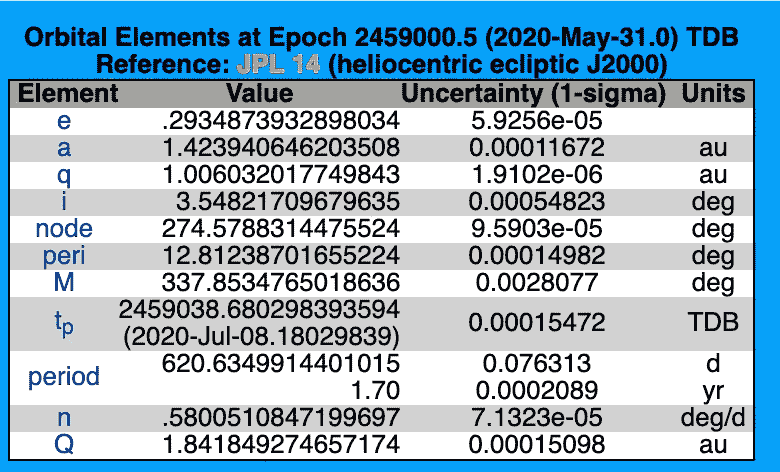
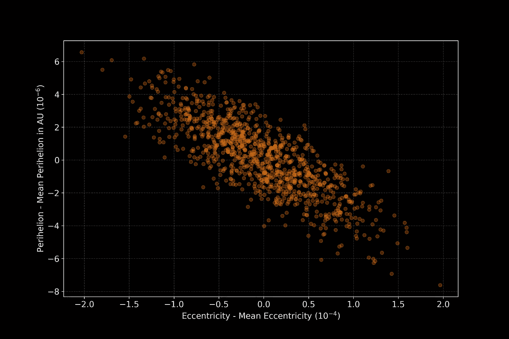

# Python 的空间科学——小行星的不确定运动

> 原文：<https://towardsdatascience.com/space-science-with-python-uncertain-movements-of-an-asteroid-f651b94f7008?source=collection_archive---------42----------------------->

## [用 Python 进行空间科学](https://towardsdatascience.com/tagged/space-science-with-python)

## [教程系列之十七](https://towardsdatascience.com/tagged/space-science-with-python)。今天(6 月 30 日)是小行星日，我们将开始深入研究小行星科学。


(21)鲁特西娅。火星和木星之间主带中的一颗大的小行星(最大直径:约 100 公里)。这张照片是由欧空局的罗塞塔号飞船在 2010 年的一次飞越中拍摄的。鸣谢: [ESA 2010 MPS for OSIRIS 团队 MPS/UPD/LAM/IAA/RSSD/INTA/UPM/DASP/IDA](https://www.eso.org/public/unitedkingdom/images/eso1144a/)；许可: [*知识共享署名 4.0 国际许可*](http://creativecommons.org/licenses/by/4.0/)

# 通古斯卡 1908

今天是 1908 年 6 月 30 日。一次巨大的爆炸在短时间内摧毁了俄罗斯通古斯地区数百平方公里的土地。在这个西伯利亚地区，数百万棵树被压弯和烧毁。对于研究人员和生活在那里的人们来说，这个所谓的通古斯事件是一个原因不明的谜。


这张彩色照片拍摄于通古斯事件 21 年后。测井曲线指向远离理论冲击波方向(从右到左)。[图片来自维基百科；](https://commons.wikimedia.org/wiki/File:Tunguska_event_fallen_trees.jpg)信用:Vokrug Sveta

*发生了什么？*嗯，有几种解释:

*   煤气爆炸。大量甲烷或其他气体点燃，引发了这起事件。
*   另一个地球物理学的解释:类似火山的爆发被误认为是爆炸，摧毁了爆发中心周围的一切
*   一颗小行星或彗星进入地球大气层，并在到达地球表面的途中爆炸。类似于 2013 年车里雅宾斯克的流星，直径只有 20 米

俄罗斯车里雅宾斯克流星的镜头。离地面几公里处的一次爆炸引起了冲击波，摧毁了门、大门和窗户。数百人受伤，但幸运的是没有人死亡。

最后一种选择是目前最被接受的理论。有人认为这颗小行星的直径在 30 到 70 米之间。它表明，即使是小天体也可能对我们的地球产生灾难性的环境影响。

为了提醒我们宇宙的危险，小行星日在几年前被引入。日期:6 月 30 日——通古斯事件的日子。

# 掠过的小行星

那么我们能做些什么呢？我们会派遣*布鲁斯·威利斯——像电影*中的*一样的*宇航员去执行对抗这些物体的英雄任务吗？嗯，第一步是发现、观察和分类这些物体！由于现代望远镜系统和专门的小行星和彗星调查，我们已经确定了数百个所谓的潜在危险的小行星。不过不要担心:所有已知的天体目前都不会与我们的地球发生碰撞。然而，我们仍然需要继续我们的观测活动，因为正如我在以前关于彗星的文章中所描述的，许多天体可能还是未知的。

[](/space-science-with-python-did-we-observe-everything-617a8221e750) [## Python 的空间科学——我们观察到一切了吗？

### 本系列教程的第 11 部分是关于数据科学家和空间科学家的噩梦:统计偏差！

towardsdatascience.com](/space-science-with-python-did-we-observe-everything-617a8221e750) 

那么 2020 年小行星日的现状如何呢？快速浏览 spaceweather.com 网站。嗯…不是今天，但至少在昨天，一个直径 62 米的物体从地球旁边经过，距离大约是地月距离的 3 倍。其名称: [2020 JX1](https://ssd.jpl.nasa.gov/sbdb.cgi?sstr=2020%20JX1&orb=1) 。

但是我们为什么要关心那些已经被发现、分析过并且轨道已知的物体呢？我们已经有了轨道元素，不需要更多了，对吗？

首先，这些物体受到重力扰动影响。它们的轨道一直在变。第二，我们无法 100 %准确地观察物体。总会有测量误差。这些误差会影响物体的轨道要素。

今天，我们将看看这些误差，并看到我们总是需要所谓的*后续*观测来优化对小行星运动的预测，以保护我们的家园免受不速之客的袭击。

# 小行星 2020 JX1

对于本教程，我们将从 NASA / JPL 小天体数据库系统(稍后)获取小行星数据，以及我们已经介绍的包 [*【熊猫】*](https://pandas.pydata.org/)[*numpy*](https://numpy.org/)和 [*spiceypy*](https://github.com/AndrewAnnex/SpiceyPy) (稍后我们还需要 [*scipy*](https://www.scipy.org/) 和 [*matplotlib*](https://matplotlib.org/) )。我们在第 7 行加载一个 SPICE 内核元文件，并在第 10 行和第 11 行使用函数 [bodvcd](https://naif.jpl.nasa.gov/pub/naif/toolkit_docs/C/cspice/bodvcd_c.html) 提取太阳的引力常数乘以质量。这个数值后来被用来确定绕太阳运行的小行星 2020 JX1 的位置。

第 1/12 部分

现在我们来获取小行星 2020 JX1 的轨道要素。NASA / JPL 小天体数据库提供了小天体的详细信息。在这里，我们发现了以下轨道元素和相应的 1-sigma 不确定性:



轨道元素及其 1-sigma 不确定性。截图来自 [NASA/JPL 小天体数据库](https://ssd.jpl.nasa.gov/sbdb.cgi?sstr=2020%20JX1;orb=1;old=0;cov=0;log=0;cad=0#elem)

参数有: ***e*** (偏心距) ***a*** (半长轴) ***q*** (近日点) ***i*** (倾角) ***节点*** (升节点自变量) ***近点*** (近点/近日点自变量)请注意，历元对应于 0 度的平均异常(通过近日点)。

让我们将所有必要的参数设置为常量:

第 2/12 部分

数据库表提供了轨道确定的 1-sigma 不确定性。因此，我们简单地重新采样一组元素(基于不确定性)并计算几个位置向量，对吗？

不完全是。显示的参数是相关的！比如:大的偏心率不一定对应大的近日点。我们需要的是轨道要素的所谓 ***协方差矩阵*** ，以确定关联的不确定性。


一些轨道要素的协方差矩阵(考虑同样的维数:AU、度数等。).截图来自 [NASA/JPL 小天体数据库](https://ssd.jpl.nasa.gov/sbdb.cgi?sstr=2020%20JX1;orb=1;old=0;cov=1;log=0;cad=0#elem)

我们在下面的编码部分对轨道元素进行硬编码，但是，我们只考虑前 2 个有效数字。请注意:根据 [PEP8](https://www.python.org/dev/peps/pep-0008/) 编码指南，逗号后只允许有一个空格。为了提高可读性，我故意违反了这条规则:

第 3/12 部分

现在，我们可以使用 *numpy* 的函数[multivarial _ normal](https://numpy.org/doc/stable/reference/random/generated/numpy.random.multivariate_normal.html)根据提供的平均值和协方差矩阵计算轨道元素的样本集。我们重新采样 1000 个子集。

第 4/12 部分

在我们继续处理 1000 个轨道元素集的解空间之前，数据被移入 *pandas* 数据帧。元素的顺序对应于协方差矩阵的列/行顺序。例如，第 6 行从第 0 列开始分配偏心率列。在第 9 到 10 行，SPICE 函数 [convrt](https://naif.jpl.nasa.gov/pub/naif/toolkit_docs/C/cspice/convrt_c.html) 用于将近日点值(单位为 AU)转换为 km。在第 16 到 18 行，儒略日(JD)中给出的历元使用 [utc2et](https://naif.jpl.nasa.gov/pub/naif/toolkit_docs/C/cspice/utc2et_c.html) 转换为星历时间(ET)。最后，所有角度值都转换为弧度(第 22 行到第 24 行)，最后一列存储太阳的 G*M 值。

第 5/12 部分

因为协方差矩阵不是单位矩阵，轨道元素是相关的。下面的代码片段创建了一个散点图，其中绘制了近日点与偏心率的关系(第 15 到 17 行)。将这些值移动相应的平均值，并进行缩放以获得更好的可读性。下面你可以看到结果图。

第 6/12 部分

不相关的值会导致类似球形的分布。在这里，散点图清楚地表明，较大的偏心率与较小的近日点相关。如果我们对每个轨道元素单独使用 1-sigma 不确定性，那么得到的分布将完全有偏差，并且不代表实际的解空间。



移位和缩放的近日点与重新采样的小行星数据的偏心率。贷方:T. Albin

在下一步中，我们最终可以为每个重新采样的轨道元素集计算小行星的状态向量。感兴趣的日期时间:小行星日(第 2 行)。我们在第 5 行设置相应的 et，并在第 6 行添加 0 度平均异常。第 9 行到第 19 行现在使用 SPICE 函数[conis](https://naif.jpl.nasa.gov/pub/naif/toolkit_docs/C/cspice/conics_c.html)来确定每个重采样集合的状态向量。所得到的状态向量提供了 x、y 和 z 位置信息以及相应的速度；分别以千米和千米/秒给出。由于轨道元素是相对于太阳提供的，因此产生的状态向量的原点是我们太阳系的恒星。在第 22 和 23 行提取位置向量。

第 7/12 部分

我们现在有 1000 个位置向量。*所有距离组合中最大的距离是多少？*让我们来找出答案(给你的任务:你可以创建一个所有距离的核密度估计图，以获得更多的统计见解)。我们使用 *scipy* 函数 [cdist](https://docs.scipy.org/doc/scipy/reference/generated/scipy.spatial.distance.cdist.html) 。距离计算在第 5 行和第 6 行执行。然后，最大距离以 f 字符串的形式打印在末尾。

第 8/12 部分

由此产生的最大位置变化是 1800 公里。2020 JX1 在大约 3 个月球距离(1 LD 大约是 300，000 km)处经过我们的母星；因此，1800 公里并不算多。然而，让我们检查从地球上看到的解空间的黄道经度和纬度值。

```
Maximum distance of the predicted positions of 2020 JX1 in km: 1824.7702017441325
```

为此，我们需要从太阳上看到的我们的母星的位置矢量。我们应用 SPICE 函数 [spkgps](https://docs.scipy.org/doc/scipy/reference/generated/scipy.spatial.distance.cdist.html) 来确定 km 中的 x、y 和 z 分量…

第 9/12 部分

…并应用向量加法将以太阳为中心的小行星向量转换为以地球为中心的向量:

第 10/12 部分

最后，我们可以使用 SPICE 函数 [recrad](https://naif.jpl.nasa.gov/pub/naif/toolkit_docs/C/cspice/recrad_c.html) (第 2 到 4 行和第 5 到 7 行)计算黄道经度和纬度值。第 10 到 14 行打印了这些值的一些一般统计数据。

第 11/12 部分

黄道经度的最小值和最大值分别为 109.43 度和 109.47 度。纬度变化在 26.96 到 26.98 度之间。这两个坐标变化不大，看来小行星的协方差矩阵足够好，可以在与地球近距离相遇时正确跟踪小行星！

```
Statistics for the Ecliptic Longitude: 
count    1000.000000
mean      109.446769
std         0.005369
min       109.431791
25%       109.443078
50%       109.446638
75%       109.450644
max       109.466238
Name: ECLIP_LONG_DEG, dtype: float64 Statistics for the Ecliptic Latitude: 
count    1000.000000
mean       26.973368
std         0.003825
min        26.962614
25%        26.970686
50%        26.973686
75%        26.975981
max        26.982502
Name: ECLIP_LAT_DEG, dtype: float64
```

# 结论

计算小天体的状态向量并不像教程开始时那样简单:

1.  重力扰动一直在改变轨道
2.  测量误差导致轨道要素不确定

我们有几种可能性来处理这个问题:用复杂的模型和连续的调查和跟踪观察。每天我们都会发现越来越多的小行星，其中一些具有潜在的危险。我们不能简单地填充数据库并把它留在那里。我们需要积极努力，尽快发现和识别宇宙危害。

在此期间:祝**过得愉快*小行星日 2020***

托马斯

[](https://asteroidday.org/) [## 看

### 保护地球免受小行星撞击的全球意识运动

asteroidday.org](https://asteroidday.org/) 

# 分配

脚本中的最后一个代码块为您提供了两个任务。玩得开心！

第 12/12 部分