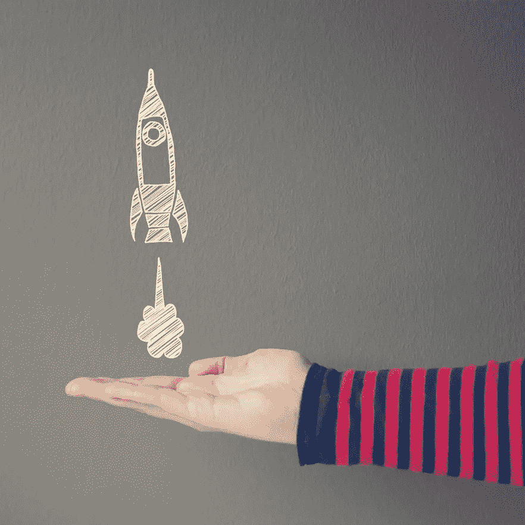
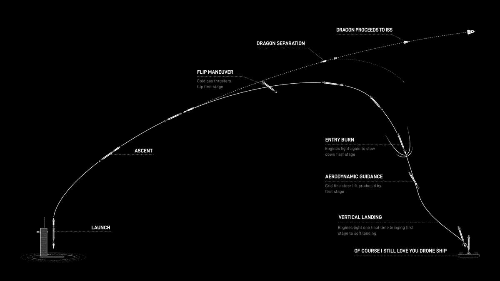
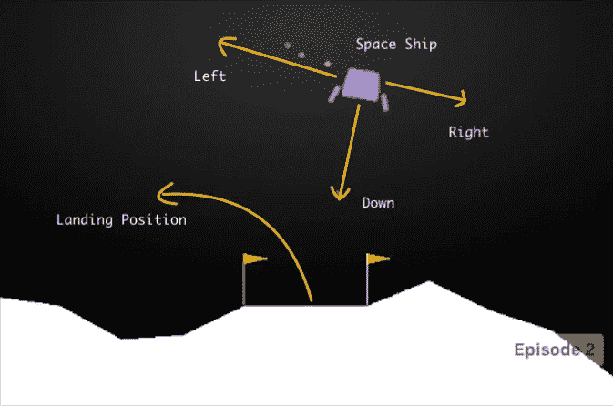
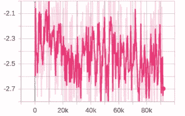
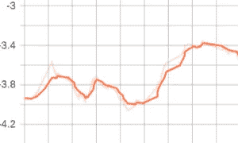

# SpaceX 猎鹰 9 号与 RL 一起着陆

> 原文：<https://towardsdatascience.com/spacex-falcon-9-landing-with-rl-7dde2374eb71?source=collection_archive---------18----------------------->

## 可重复使用的火箭



[cosmosmagazine.com](https://cosmosmagazine.com/space/launch-land-repeat-reusable-rockets-explained/#:~:text=The%20Falcon%209%20first%2Dstage,Fuel%20tanks%3A&text=These%20engines%20fire%20again%20as%20the%20rocket%20nears%20the%20landing%20platform.)了解更多关于火箭的信息

由航天公司 SpaceX 开发的猎鹰 9 号意味着现在可以通过安全返回地球来重复使用火箭的第一级。

一项曾经看起来如此不可能的成就导致了多个“假 SpaceX 着陆视频-解释”的创建，现在人们普遍同意相关技术背后的惊人之处。

虽然今天我不在这里，也不能给你们讲火箭工程课程，但我只想展示一下来自 SpaceX 的这个小图表，以便更好地理解。



[你可以在这里查看更多关于 https://www.youtube.com/watch?v=Wn5HxXKQOjw](https://www.inverse.com/article/33904-how-spacex-lands-a-falcon-9-rocket-in-6-steps)的视频

虽然没有任何人工智能技术被部署到任何一个 **SpaceX** 技术管道中(他们正在使用经典的机器人/控制理论方式的[路径规划](https://en.wikipedia.org/wiki/Motion_planning)算法)，但如果我们试图用*最先进的* [***强化学习***](https://en.wikipedia.org/wiki/Reinforcement_learning)*算法来解决这个问题，那将会发生什么。*

# *环境*

*如果你是 RL 新手，我建议你去看看其他的教程、书籍和资源，这些都是为初学者准备的，是关于学习更多关于 RL 的基础知识和数学知识的。*

*亲爱的斯文·尼德伯格( *@EmbersArc on GitHub* )前段时间创造了这个艰苦的强化学习环境。虽然在创作中，它的主要目的是利用 LunarLander envs 的想法创建一个漂亮的有吸引力/炒作的健身房一样的环境，但人们很快意识到，就 RL 而言，解决它比它的灵感要困难得多。*

**

*LunarLander 是如何工作的， [ref mc.ai](https://mc.ai/solving-lunar-lander-openaigym-reinforcement-learning/)*

*LunarLander 有两个版本。一个为**设计的离散动作空间***

*   *0–什么都不做*
*   *`1`–点燃左侧发动机*
*   *`2`–关闭发动机*
*   *`3`–右引擎点火*

*其他为**连续动作空间***

*作用是从-1 到+1 的两个实值向量。*

*   *首先控制主发动机，-1..0 关闭，0..+1 从 50%到 100%功率节流。低于 50%的功率，发动机无法工作。*
*   *第二个值-1.0..-0.5 火左引擎，+0.5..+1.0 点火右发动机，-0.5..0.5 折。*

*虽然离散动作 1 可以很容易地用基于值的方法加上非线性函数近似来解决，如 DQN、彩虹 DQN 或大猩猩 DQN，但连续动作问题需要某种基于演员-评论家的算法才能工作，因为普通 DQN 方法的回报少、探索难且不稳定。*

***PPO+LSTM +平行培养**(上策，集群式培养)**软演员评论** (SAC，关策)****D4PG**(关策-混合演员评论法)可以用来解决这个问题。特别是如果你想了解政策方法，我强烈建议你看一看并行化和 LSTMs(或者成为 SOTA 的注意机制？)与 RL 的一般情况，但这是另一天的主题。***

***我们的火箭健身房也使用了 LunarLander 设置中的大部分东西，并且它的结构高度可定制。它使用 Box2D 作为物理后端，openGL 用于环境的光照渲染(图像不用于观察，只是为了检查你的进度)***

## ***状态变量***

***状态由以下变量组成:***

*   ***x 位置***
*   ***y 位置***
*   ***角***
*   ***第一腿地面接触指示器***
*   ***第二腿地面接触指示器***
*   ***喉咙***
*   ***发动机万向节***

***如果 **VEL 状态**(代码中)设置为真，速度包括:***

*   ***x 速度***
*   ***y 速度***
*   ***角速度***

*****观察**非常有用 ***从物理模拟中提取特征*** 这样你就不会浪费你大部分的计算能力在 *CNN 的*上来提取它们，因此我们的目的是创造一个有意义的 ***机器人/控制算法替代*** 而不是一个完全成熟的系统。***

***我已经尝试了这两个选项，虽然没有很大的区别，我建议你打开速度状态以获得更多信息，这有助于代理学习，因此 ***更多相关信息更好的心态*** 。请注意，为了训练过程的顺利进行，所有值都已标准化。***

*****奖励计算**在这一小段代码中有解释。基本上需要燃料成本和你与地面的相对位置以及火箭的重量来了解你的着陆在控制力学和物理学方面有多正确。因为你可能不会因为随机产卵而得到一个轻松的局面，但是如果你仍然从那个状态中恢复过来，你应该会得到一个不错的奖励信号***

```
***# state variables for reward
 distance = np.linalg.norm((3 * x_distance, y_distance)) # weight x position more
 speed = np.linalg.norm(vel_l)
 groundcontact = self.legs[0].ground_contact or self.legs[1].ground_contact
 brokenleg = (self.legs[0].joint.angle < 0 or self.legs[1].joint.angle > -0) and groundcontact
 outside = abs(pos.x — W / 2) > W / 2 or pos.y > H
 fuelcost = 0.1 * (0 * self.power + abs(self.force_dir)) / FPS
 landed = self.legs[0].ground_contact and self.legs[1].ground_contact and speed < 0.1
 done = Falsereward = -fuelcostif outside or brokenleg:
 self.game_over = Trueif self.game_over:
 done = True
 else:
 # reward shaping
 shaping = -0.5 * (distance + speed + abs(angle) ** 2)
 shaping += 0.1 * (self.legs[0].ground_contact + self.legs[1].ground_contact)
 if self.prev_shaping is not None:
 reward += shaping — self.prev_shaping
 self.prev_shaping = shapingif landed:
 self.landed_ticks += 1
 else:
 self.landed_ticks = 0
 if self.landed_ticks == FPS:
 reward = 1.0
 done = Trueif done:
 reward += max(-1, 0–2 * (speed + distance + abs(angle) + abs(vel_a)))
 elif not groundcontact:
 reward -= 0.25 / FPSreward = np.clip(reward, -1, 1)***
```

## ***控制输入***

****离散控制输入*是:***

*   ***万向节向左***
*   ***万向节向右***
*   ***加大油门***
*   ***节流***
*   ***使用第一控制推进器***
*   ***使用第二控制推进器***
*   ***没有行动***

****连续控制输入*为:***

*   ***万向节(左/右)***
*   ***油门(开/关)***
*   ***控制推进器(左/右)***

# ***代理的创建***

***这个问题我试过 3 种算法。 **D4PG、SAC 和 PPO** 做了一些修改。我将简要地谈谈每一次经历和它们的结果，你将能够在资源库中找到所有 3 个的完整代码。我的所有代理都完成了连续控制输入，也可以随时检查离散情况***

***对于所有的代理，我使用了 PTAN py torch 的 RL 库，它简化了代理的设置处理过程，如日志，网络创建，设置和收集轨迹等等。我鼓励你去看看，因为大部分浪费在样板代码上的时间都是浪费时间，而且容易产生错误代码。虽然 PTan 不是即插即用，但培训有助于实现它的目标。***

***https://github.com/Shmuma/ptan py torch agent net =***

## ***D4PG(分布式深度确定性策略梯度)***

***DDPG 和 D4PG 的一个小区别来自于动作探索。我们不使用**奥恩斯坦-乌伦贝克过程**噪声，而是使用来自正态(高斯)分布*的更加**简单的随机噪声。*** 计算 OU 噪声似乎没有提供太多，但它补充了代码，所以我更喜欢 D4PG。***

```
***GAMMA = 0.99
BATCH_SIZE = 64
LEARNING_RATE = 1e-4
REPLAY_SIZE = 100000
REPLAY_INITIAL = 10000
REWARD_STEPS = 5
TEST_ITERS = 1000
Vmax = 10
Vmin = -10
N_ATOMS = 51
Hyper Parameters for D4PG***
```

***虽然我不小心删除了这次跑步的 TensorBoard 日志，但我实际上训练了 100 万步 D4PG，它似乎没有从失败中收敛，而是停留在一些局部最优值上。我还有一些视频。我仍然包括了它的代码，也许有不同的批量大小和随机种子，你可以更有效地训练。***

***上尉，这是个陷阱！阿克巴上将***

*****软演员评论家(SAC)*****

***SAC 仍然是无模型强化学习中的 SOTA 算法之一。简而言之，它的差异可以表述为***

******熵正则化*** =在每个时间戳获得更多与当前步骤策略熵成比例的奖励***

******双 Q 绝招*** =你有 2 个预测 Q 值的网络，选择其中的最小值进行贝尔曼逼近会使你的训练过程更加平稳。***

***该算法仍然建立在保守策略迭代(TRPO、PPO 等)的基础上。不仅仅是最大化终身奖励，它还试图最大化熵(外行人眼中的不确定性)。因此，您可以两全其美，能够从过去的经验中有效地学习(经验回放)和从基于策略的方法中建立更稳定的策略学习。***

******

***随机化在训练开始时的低回报中扮演了重要角色。***

*****火箭环境**由于随机性，与真实世界的情况相比非常复杂，在每个时间点，火箭都可能处于即使在现实生活中也很难恢复的状态。因此，在评估这种环境时，您应该始终牢记这一点。你可以修改环境，使其更加“*”也就是一个与现实生活相似的着陆过程，它不会紧急着陆，但我使用了默认着陆。过了一段时间，回报开始增加，代理人在大多数情况下都表现良好。这次训练用特斯拉 P100 走了 100 万步(16GB VRAM 和 21 TFlops 的 16 位性能)。****

```
****GAMMA = 0.99
BATCH_SIZE = 64
LR_ACTS = 1e-4
LR_VALS = 1e-4
REPLAY_SIZE = 100000
REPLAY_INITIAL = 10000
SAC_ENTROPY_ALPHA = 0.1
TEST_ITERS = 10000
Hyper parameters for Soft Actor Critic**** 
```

## ****PPO —策略近似优化****

****PPO 虽然被一些 SOTA(最先进的)超越，但仍然是非常有用的算法，用于尝试连续控制问题，因为与其他算法相比，它易于实现并且需要改变的超参数非常少。****

```
****GAMMA = 0.99
GAE_LAMBDA = 0.95
TRAJECTORY_SIZE = 4097
LEARNING_RATE_ACTOR = 1e-5
LEARNING_RATE_CRITIC = 1e-4
PPO_EPS = 0.2
PPO_EPOCHES = 10
PPO_BATCH_SIZE = 256
TEST_ITERS = 100000
Hyper Parameters for PPO****
```

****这一次我走了一条更大的轨迹，并希望尽可能多地提升我的计算能力。我训练了这个网络六百万步。****

********

****它可以根据卵的轨迹做很好的着陆。****

# ****结论和想法****

****我建议你熟悉一下 **PTan** 以便在不同的算法上进行非常简单的实验，它允许你跟踪回报(即使在多个 env 设置上也相当容易地处理终端状态等),因为代码大量使用它们。当然，你也可以在我的 hyper params 中使用你自己的代码。****

****这是一个有趣的经历，这是一个很难的动态问题，加入了随机因素，你可以修改它，使其不那么随机，更容易解决，显然你也可以让它变得更难。我发现 PPO 在训练中最稳定，但 SAC 在 PPO 之前取得了很好的结果，而 D4PG 在我身上失败了，这可能是由于我的参数选择，请随意尝试您自己的版本并写下结果。****

****您可以访问我的存储库，其中包含准备训练谷歌 Colab 笔记本，本地训练代码和保存的模型/日志。我也强烈建议你去看看 Colab Pro，它可以让你在快速训练机上进行 24 小时训练。在 repository README 中，您可以找到有关如何运行代码的更多信息。****

****[](https://github.com/ugurkanates/SpaceXReinforcementLearning) [## ugurkanates/spacex 强化学习

### 由于这似乎得到了更多的关注，我已经把它更新到最新版本的健身房。我希望一切…

github.com](https://github.com/ugurkanates/SpaceXReinforcementLearning)****