# 西班牙严格的 COVID 锁定通过 Folium 地图、移动 GPS 数据和 Geo JSON 可视化

> 原文：<https://towardsdatascience.com/spains-strict-covid-lockdown-visualized-with-folium-maps-mobile-gps-data-gpx-tracks-and-geo-9628e39bfa0e?source=collection_archive---------63----------------------->

# 封锁前的生活

冠状病毒的抱怨始于 2019 年 12 月的某个时候，但当我浏览日常新闻网站，看到越来越多关于亚洲新病毒的令人担忧的文章时，这只是我脑海中一闪而过的想法。这件事上了头版，看起来很严重，但在中国却是个问题。这不是我想太多或担心的事情。它很遥远，不适用于我的世界，不重要。我最近搬到了瓦伦西亚市，并专注于探索我的新家，体验这个美妙的城市所提供的一切。

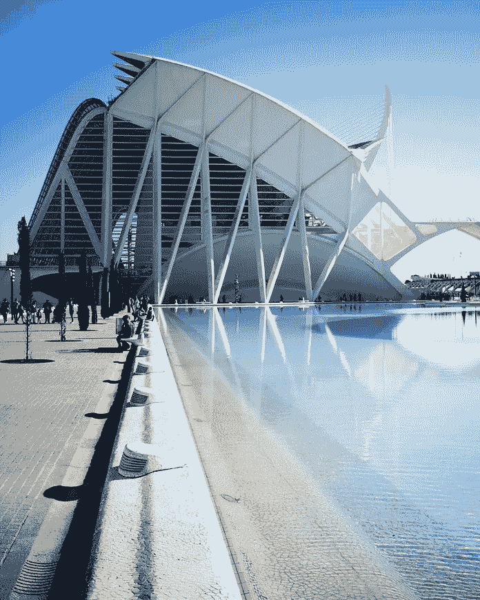

在阳光明媚的西班牙巴伦西亚，COVID 之前的生活。(摄影:帕特里克·努南)

几个月过去了，冠状病毒威胁性的嗡嗡声慢慢增加了音量。巴伦西亚的大型节日 Las Fallas，包括精心制作的彩车，最后以焚烧一切达到高潮，刚刚被取消。危机开始达到白热化——意大利已经完全关闭，美国宣布全国进入紧急状态，西班牙即将被隔离。

3 月 15 日周日，我去骑了封锁前的最后一次自行车——这将是 45 天里的最后一次户外锻炼。街道和自行车道空得吓人。第二天，随着西班牙的 COVID 死亡人数迅速上升，官方封锁开始了。政府宣布进入紧急状态，赋予他们实施隔离的特别权力。规则将是严格的:除非绝对必要，否则不得离开房子。我们只能在街上购买食品杂货、购买药物或去工作(对于授权的个人)。任何违反规则的行为都会被处以高额罚款——便衣警察要求任何在街上被抓的人出示收据和居住证明是每天的现实。与意大利和中国一样，它是世界上最严格的隔离区之一。


困在里面:担心冠状病毒，搞艺术，做写这篇文章的白日梦。(帕特里克·努南拍摄的照片)

# 封锁显现出来了

在我被国家强制软禁的 45 天里，我想出了一个主意，用谷歌的 GPS 数据和 Garmin 的 GPX 轨迹来可视化封锁。这场危机的一线希望是，它提供了大量的时间来从事副业项目(如破解 Jupyter 笔记本和试验地图)。

利用我的全球定位系统坐标和一些魔法叶，我能够创造出以下封锁前后的生活画面。请继续阅读如何制作这些地图的技术细节。

这个动画展示了我的 Android GPS 数据在 3 个不同阶段的每周快照。每一帧都是所有 GPS 数据的每周混搭。

1.  **预先封锁。**COVID 之前 10 周的正常生活。
2.  **严格的禁闭。** 7 周居家隔离。
3.  **用运动锁住。**早上 6-10 点或晚上 8-11 点，允许在离家 1 公里范围内散步。

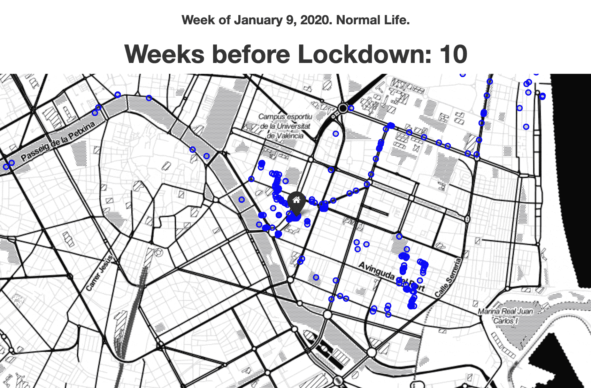

可视化为静态图，并排，我们可以看到 3 个阶段的另一个视图。前两个地图代表相同的时间量(45 天)；可以清楚地看到一级防范禁闭有多严格。

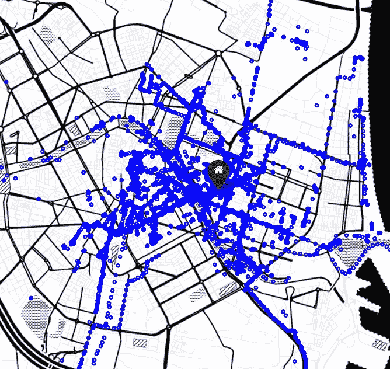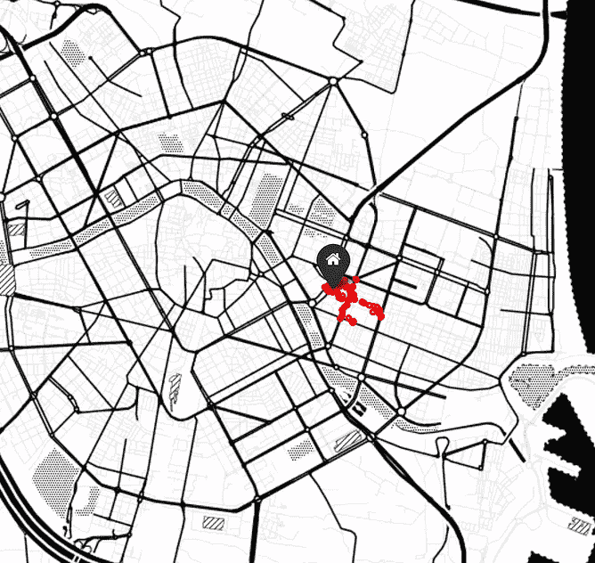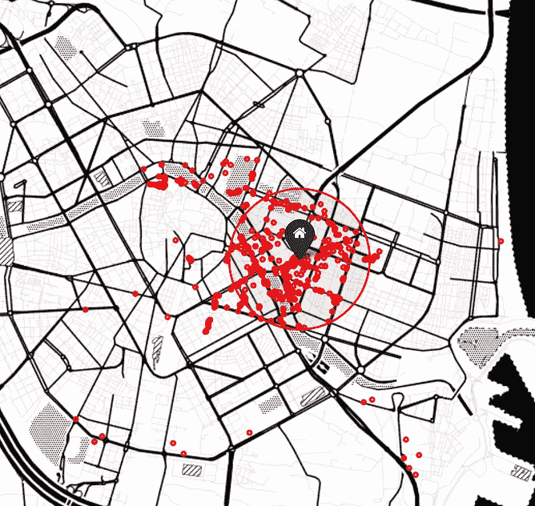

**1)** 正常的生活。45 天的预锁定 GPS 活动)。 **2)** 为期 45 天的严格禁闭。基本上是软禁。 **3)** 允许在离家 1 公里半径内行走。

从 2020 年 5 月 2 日开始，我们被允许在早上 6 点到 10 点或晚上 8 点到 11 点离开我们的房子去锻炼(65 岁以下的成年人)。新规则发布的方式有点模棱两可和令人困惑；最初对该规则的解释是，步行者被要求呆在离家 1 公里的范围内，但骑自行车的人被允许冒险到你所居住城市的边界。

在 45 天不能在户外运动后，我兴奋和期待都要爆炸了。我就像平安夜上的一个孩子，为第二天的大量礼物而欣喜若狂。在我获得自由的第一天，我 5:30 起床，6:00 准时出门。鸟儿的声音从未如此美妙，空气从未如此清新，自由的感觉从未如此深刻。如果说有什么不同的话，那就是这场危机教会了我对生活中的小事心存感激。

我从散步中导入了 GPX·加明的轨迹，以便更好地观察 1 公里半径内的运动。世界突然变大了 10 倍！如你所见，我们的目标是走过半径范围内所有可能的街道；有很多值得探索的地方:新的社区、街头艺术和随机广场已经被发现。在自家后院的微型冒险和穿越世界到异国目的地旅行一样令人兴奋。

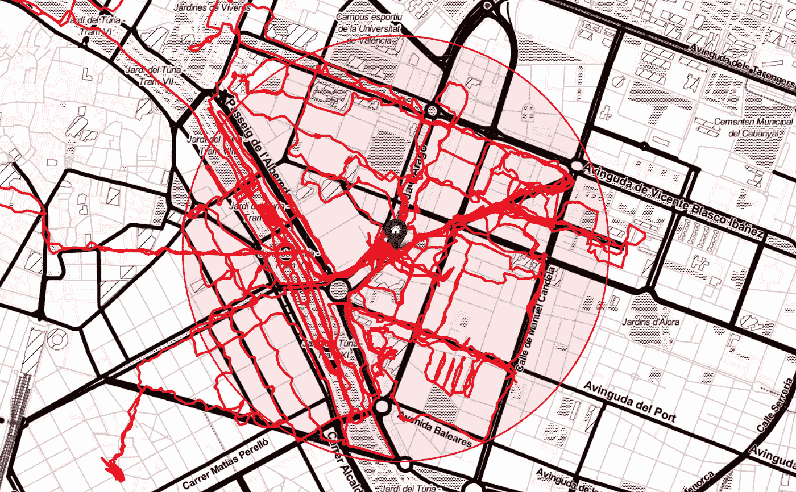

使用 Garmin GPX 数据的步行路线。

事实证明，1 公里规则只适用于随意散步的人。如果你在“做运动”,比如跑步、散步、骑自行车或滑旱冰，你可以冒险到城市的边界(不要越过边界)。你可以看到，随着时间的推移，我开始不太关注 1 公里规则。然而，我们的目标仍然是步行 1 公里半径内的每一条街道(这是一种有趣的方式来使早晨的 Caminos 游戏化)。

正如我之前提到的，骑自行车的人被允许超出他们居住地 1 公里——只要他们呆在他们居住的城市范围内。我住在瓦伦西亚自治区，如下图所示。对我来说幸运的是，这包括城市南部美丽的沿海地区——一个名为 L'albufera 的大型湿地区域和大量废弃的沿海道路、海滩、小径和野生动物。早上 6 点至 7 点之间是田园般的、荒芜的、宁静的、祥和的。然而，到了早上 8 点，感觉就像环法自行车赛一样；一群骑自行车的人出来充分利用他们允许的 4 小时晨练时间。

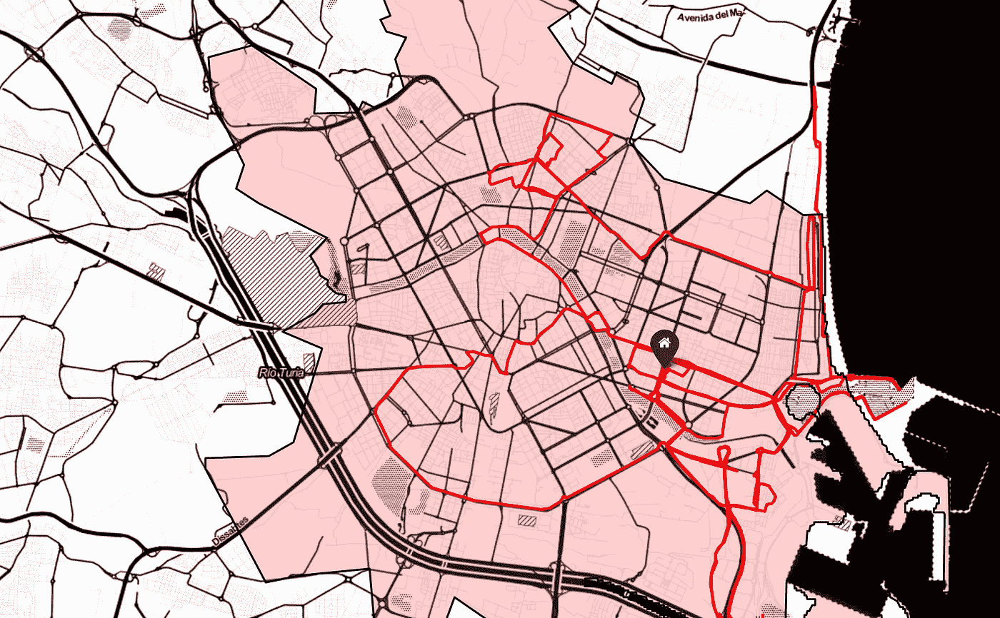

2020 年 5 月 2 日——发布时间:巴伦西亚市内允许骑自行车。(“西班牙降级计划的第 0 阶段”)

缩小图像可以让我们看到巴伦西亚这个“自治市”有多不稳定。只要我呆在红色区域，我就不会因为违反紧急状态封锁条例而被罚款 600 欧元！

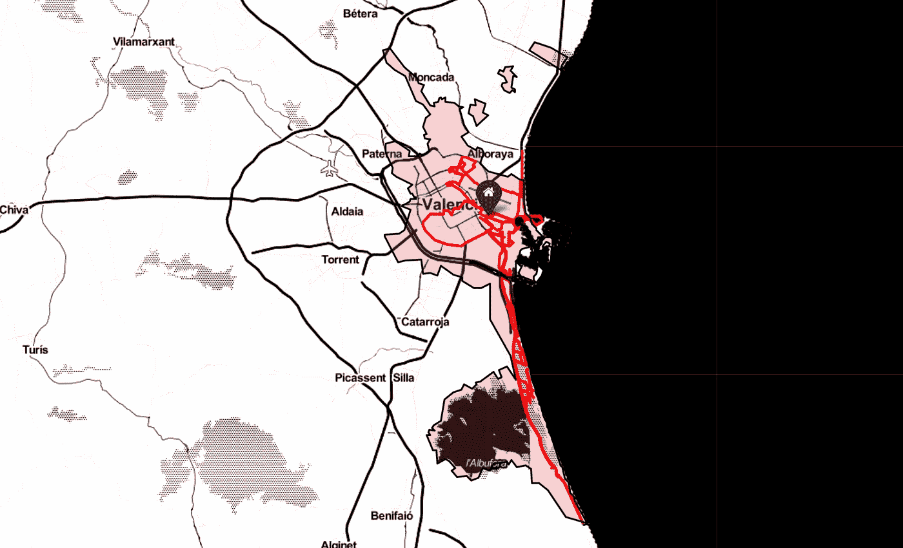

感谢古代政治家们将南部海岸纳入城市范围！

# 技术方面的东西

下一节概述了创建这些地图的技术方面。这个项目中使用的所有代码都可以在我的 [Git 库](https://github.com/datachico/lockdown_maps_GPS_GPX/blob/master/lockdown_maps_GPS_GPX.ipynb)中获得。

# 数据采集

按照这些[指令](https://vwo.com/blog/google-maps-heatmap/)，一个人 GPS 数据的全部历史可以很容易地从谷歌上下载。我推荐使用 JSON 格式。下一步是解析 JSON，并将数据转换成可以在 Pandas 中轻松操作的数据帧。这篇[博客文章](https://geoffboeing.com/2016/06/mapping-google-location-history-python/)以一种非常直截了当的方式展示了方向。

众所周知，大公司本质上拥有我们和我们的数据；在过去的 9 年里，谷歌几乎每隔几秒钟就会记录我手机的 GPS 坐标。理智上，我意识到了这一点，但看到原始数据时仍然感到震惊。我的个人数据集中有 140 万个 GPS 坐标。哎呀，谷歌肯定知道很多关于我的事情。

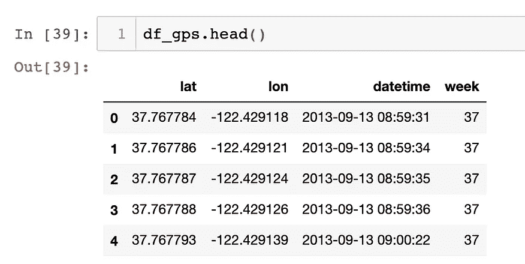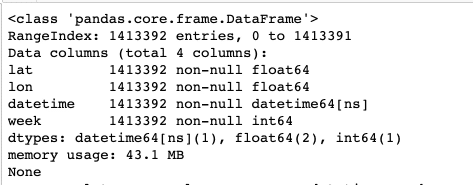

# 动画地图

这个项目最具挑战性的一个方面是创建每周 GPS 快照的动画 GIF。根据我的研究，leav 本身没有提供直接将地图导出到图像的方法。黑客的解决方法是像往常一样导出到 HTML 文件，然后使用无头浏览器如 [selenium](https://www.selenium.dev/) 打开 HTML 文件，然后保存结果的图像截图。注意:指定‘executable _ path’——需要手动下载的' [geckodriver](https://github.com/mozilla/geckodriver/releases) '的位置很重要(除了简单的导入 selenium)。

```
from selenium import webdriverdelay=5
tmpurl=’file://{path}/{mapfile}’.format(path=os.getcwd(),mapfile=map_name)
 browser = webdriver.Firefox(executable_path=r’/Users/patricknoonan/geckodriver’)
 browser.maximize_window()
 browser.get(tmpurl)
 time.sleep(delay)
 png_map_name = map_name + ‘.png’
 browser.save_screenshot(png_map_name)
 browser.quit()
```

下一步是使用保存的 png 文件和一个简单的 GIF 库 imageio 自动创建 GIF。

```
import imageioimages = []
for filename in filenames:
    images.append(imageio.imread(filename)) 
    imageio.mimsave(gif_name, images, duration=duration)
```

在弄清楚这两个难题之后，很容易编写一些代码来循环数据并创建按周动画。创建函数和尽可能自动化一切有助于快速生成完整的 gif，以允许快速迭代和测试颜色布局、大小等。关于从叶地图创建 GIF 的更详细解释，请查看这篇非常有用的[文章](https://medium.com/@rajat.mca.du.2015/creating-gifs-of-choropleth-maps-75ee47d60710)。


# 佳明·GPX 曲目

关于如何从头开始创建 leav 地图的详细说明，请查看我的帖子: [*使用 leav*](/build-interactive-gps-activity-maps-from-gpx-files-using-folium-cf9eebba1fe7)*从 GPX 文件中创建交互式 GPS 活动地图。*然而，这个项目有一些值得分享的花絮:独特的平铺层的创建，使用 vector_layers.circle 的 1 公里半径，以及漂亮的“home”图标。

```
#Tile name
folium.TileLayer(‘Stamen Toner’, name=’Stamen Toner’).add_to(mymap)

#create 1 KM radius
folium.vector_layers.Circle(location=[39.470460, -0.357680], radius=1000, color=’red’, fill_color=’red’, weight=2, fill_opacity=0.1).add_to(mymap)#Create ‘home’ icon
folium.Marker([39.4639845, -0.3517744], popup=’Home’, icon=folium.Icon(color=’black’, opacity=0.2, icon_color=’white’, icon=’home’, prefix=’fa’)).add_to(mymap)
```


# 巴伦西亚市的 Choropleth 地图

[Choropleth 地图](https://en.wikipedia.org/wiki/Choropleth_map)广泛用于数据可视化，以表示与地理边界相关的特定统计数据，如国家的 GDP、各州的财富不平等或各县的平均年龄。为了这个项目的目的，choropleth 地图只是用来指定巴伦西亚市的官方边界。具体的文件类型是 Geo JSON:幸运的是，这个信息很容易从 [Open Data Soft](https://data.opendatasoft.com/explore/dataset/espana-municipios%40public/export/?q=valencia) 访问[，这是一个开源的数据集存储库。](https://data.opendatasoft.com/explore/dataset/espana-municipios%40public/export/?q=valencia)

找到正确的 Geo JSON 文件后，我们需要将它添加到我们的 lyum 地图中:

```
espana_municipios_geo = r’municipio_valencia.geojson’
with open(espana_municipios_geo) as geo_json_file:
    espana_municipios_file = json.load(geo_json_file)
 folium.Choropleth(
 geo_data=espana_municipios_file,
 fill_color=’red’,
 fill_opacity=0.2,
 line_weight=2,
 overlay = True, #another layer as opposed to it’s on tile
 highlight=False, #changes color as you hover over it
 name=’Municipio De Valencia’,
 show=True,
 ).add_to(mymap)
```

关于 choropleth 地图和一些潜在应用的更详细描述，我强烈推荐以下文章: [*Choropleth 地图与*](/choropleth-maps-with-folium-1a5b8bcdd392) *。*

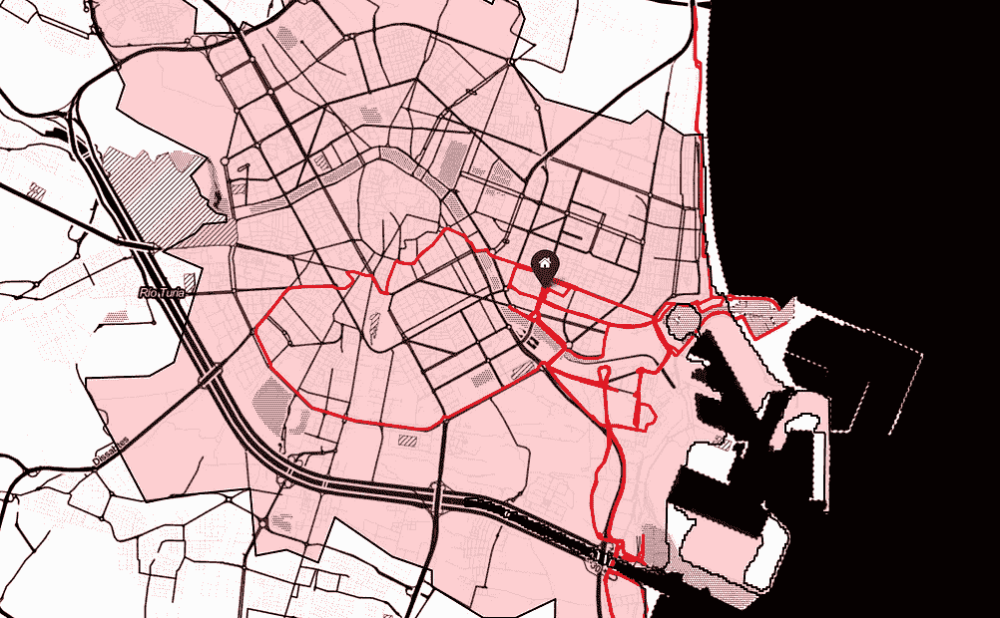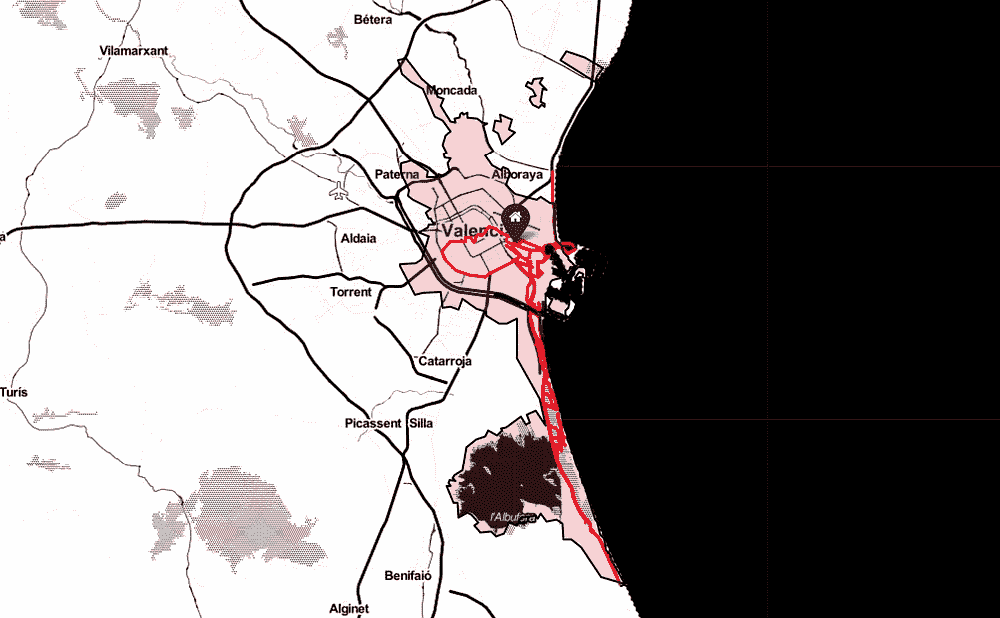

同样，这个项目的所有代码都可以在我的 [Git 库](https://github.com/datachico/lockdown_maps_GPS_GPX/blob/master/lockdown_maps_GPS_GPX.ipynb)中公开获得。

***编者按:*** [*走向数据科学*](http://towardsdatascience.com/) *是一份以数据科学和机器学习研究为主的中型刊物。我们不是健康专家或流行病学家，本文的观点不应被解释为专业建议。想了解更多关于疫情冠状病毒的信息，可以点击* [*这里*](https://www.who.int/emergencies/diseases/novel-coronavirus-2019/situation-reports) *。*