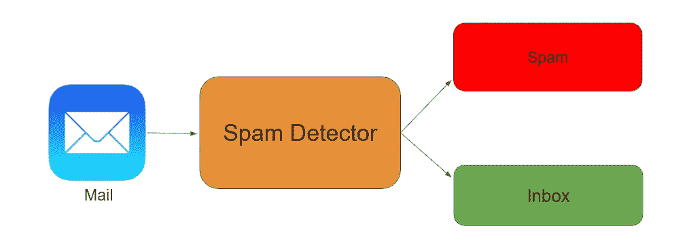
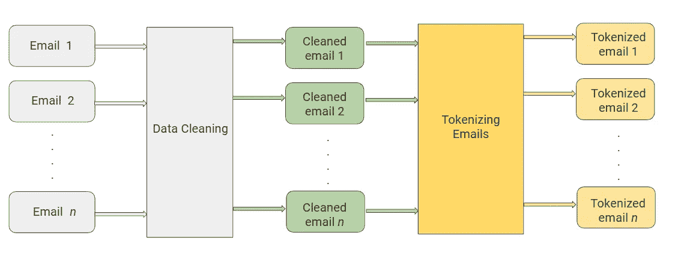
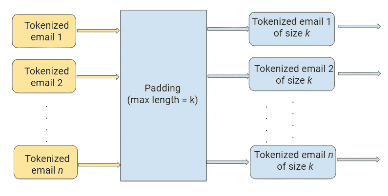
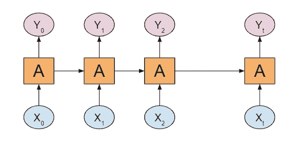
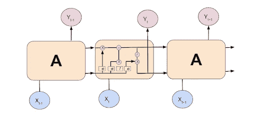
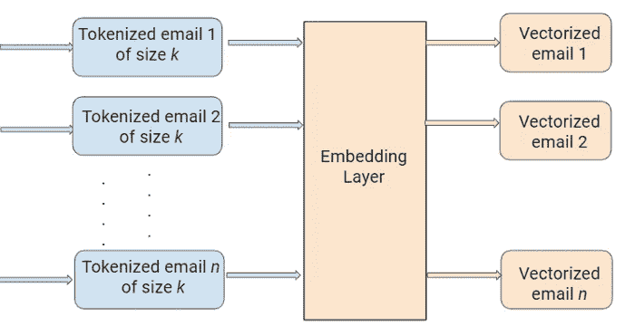
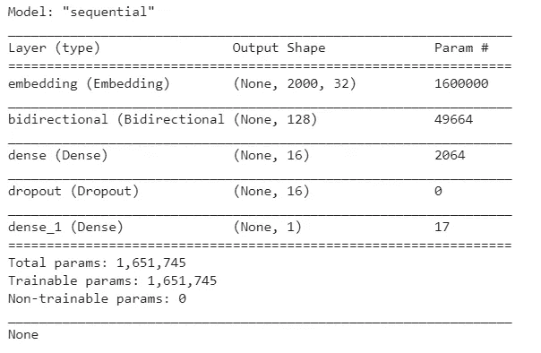
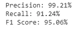
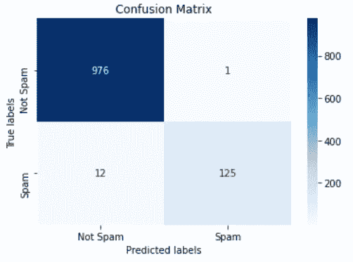

# 检测电子邮件中的垃圾邮件

> 原文：<https://towardsdatascience.com/spam-detection-in-emails-de0398ea3b48?source=collection_archive---------6----------------------->


图片来自 [Pixabay](https://pixabay.com/illustrations/ransomware-wannacry-malware-2318381/)

## [动手教程](https://towardsdatascience.com/tagged/hands-on-tutorials)，深度学习项目

## 应用自然语言处理和深度学习进行垃圾邮件检测

你有没有想过机器是如何翻译语言的？或者语音助手如何回复问题？或者邮件如何自动分类为垃圾邮件或不是垃圾邮件？

所有这些任务都是通过自然语言处理(NLP)来完成的，*将文本处理成有用的见解*，这些见解可以应用于未来的数据。在人工智能领域，由于文本数据是上下文相关的，NLP 是最复杂的研究领域之一。它需要修改以使其能够被机器解释，并且需要多个处理阶段来进行特征提取。

分类问题可以大致分为两类:二元分类问题和多类分类问题。二元分类意味着只有两种可能的标签类别，例如，患者的状况是癌症还是非癌症，或者金融交易是欺诈性的还是非欺诈性的。多类分类是指有两个以上标签类的情况。这方面的一个例子是将电影评论的情绪分为正面、负面或中性。

NLP 问题有很多种类型，其中最常见的一种类型是字符串的*分类。这方面的例子包括将电影/新闻文章分类为不同的类型，以及将电子邮件自动分类为垃圾邮件或非垃圾邮件。在本文中，我将更详细地研究最后一个例子。*

# 问题描述

理解问题是解决任何机器学习问题的关键的第一步。在本文中，我们将探索和理解将电子邮件分类为垃圾邮件或非垃圾邮件的过程。这就是所谓的垃圾邮件检测，是一个二元分类问题。

这样做的原因很简单:通过检测未经请求和不想要的电子邮件，我们可以防止垃圾邮件悄悄进入用户的收件箱，从而改善用户体验。



*电子邮件通过垃圾邮件检测器发送。如果电子邮件被检测为垃圾邮件，它将被发送到垃圾邮件文件夹，否则将被发送到收件箱。(图片由作者提供)*

# 资料组

让我们从垃圾邮件检测数据开始。我们将使用来自 UCI 机器学习知识库的开源垃圾邮件数据集，该数据集包含 5569 封电子邮件，其中 745 封是垃圾邮件。

该数据集的目标变量是“spam ”,其中一封*垃圾邮件被映射到 1* ,其他任何邮件被映射到 0。目标变量可以被认为是你试图预测的。在机器学习问题中，这个变量的值会被其他变量建模和预测。

图 1 显示了数据的快照。


*图 1:文本列包含电子邮件，垃圾邮件列包含目标变量(图片由作者提供)*

任务:将电子邮件分类为垃圾邮件或非垃圾邮件。

为了得到我们的解决方案，我们需要理解下面的四个处理概念。请注意，这里讨论的概念也可以应用于其他文本分类问题。

1.  文本处理
2.  文本排序
3.  型号选择
4.  履行


# 1.文本处理

数据通常来自各种来源，格式也各不相同。因此，转换原始数据至关重要。然而，这种转换不是一个简单的过程，因为文本数据通常包含冗余和重复的单词。这意味着处理文本数据是我们解决方案的第一步。

文本预处理的基本步骤包括

A.清洗原始数据
B .对清洗后的数据进行标记

# A.清理原始数据

这个阶段包括删除对文本意义没有价值的单词或字符。下面列出了一些标准的清洁步骤:

*   下降箱
*   特殊字符的删除
*   停用词的删除
*   移除超链接
*   数字的删除
*   删除空白

## 下降箱

降低文本的大小写非常重要，原因如下:

*   单词“文本”、“文本”、“文本”都给句子增加了相同的值
*   降低所有单词的大小写对于通过减少词汇表的大小来降低维数非常有帮助

```
def to_lower(word):
    result = word.lower()
    return result
```

## 特殊字符的删除

这是另一种文本处理技术，将有助于处理像“万岁”和“万岁！”同理。

```
def remove_special_characters(word):
    result=
word.translate(str.maketrans(dict.fromkeys(string.punctuation)))
    return result
```

## 停用词的删除

停用词是语言中常见的词，如“the”、“a”等。大多数时候，它们可以从文本中删除，因为它们没有提供有价值的信息。

```
def remove_stop_words(words):
    result = [i for i in words if i not in ENGLISH_STOP_WORDS]
    return result
```

## 移除超链接

接下来，我们删除数据中的所有 URL。电子邮件中很有可能会有一些网址。我们不需要它们来做进一步的分析，因为它们不会给结果增加任何价值。

```
def remove_hyperlink(word):
    return re.sub(r"http\S+", "", word)
```

有关文本预处理技术的更多细节，请查看下面的文章。

[](/a-handbook-to-text-preprocessing-890f73fd28f8) [## 文本预处理手册

### 自然语言处理的第一步

towardsdatascience.com](/a-handbook-to-text-preprocessing-890f73fd28f8) 

# B.对清理的数据进行标记

标记化是将文本分割成更小的块(称为标记)的过程。每个标记都是作为特征的机器学习算法的输入。

`keras.preprocessing.text.Tokenizer`是一个实用函数，它将文本标记为标记，同时只保留文本语料库中出现次数最多的单词。当我们对文本进行标记时，我们最终会得到一个庞大的单词词典，而它们并不都是必不可少的。我们可以设置“ *max_features* 来选择我们要考虑的最常用的词。

```
max_feature = 50000 #number of unique words to considerfrom keras.preprocessing.text import Tokenizer
tokenizer = Tokenizer(num_words=max_feature)
tokenizer.fit_on_texts(x_train)
x_train_features = np.array(tokenizer.texts_to_sequences(x_train))
x_test_features = np.array(tokenizer.texts_to_sequences(x_test))
```



*图 2:文本处理的数据清理和标记阶段。(图片由作者提供)*


# 2.文本排序

# a.填料

让所有电子邮件的令牌大小相等被称为*填充*。

我们批量发送数据点输入。当输入大小不同时，信息可能会丢失。因此，我们使用填充使它们大小相同，这样便于批量更新。

使用' *max_len* '设置所有标记化电子邮件后填充的长度。



*图 3:在“填充”阶段，所有标记化的电子邮件都被转换为相同的大小。(图片由作者提供)*

填充的代码段:

```
from keras.preprocessing.sequence import pad_sequences
x_train_features = pad_sequences(x_train_features,maxlen=max_len)
x_test_features = pad_sequences(x_test_features,maxlen=max_len)
```

# b.标记编码目标变量

模型期望目标变量是一个数字，而不是一个字符串。我们可以使用来自`sklearn,`的标签编码器来转换我们的目标变量，如下所示。

```
from sklearn.preprocessing import LabelEncoder
le = LabelEncoder()
train_y = le.fit_transform(target_train.values)
test_y = le.transform(target_test.values)
```


# 3.型号选择

一部电影由一系列场景组成。当我们观看一个特定的场景时，我们不会试图孤立地理解它，而是联系以前的场景来理解。以类似的方式，机器学习模型必须通过利用已经学习的文本来理解文本，就像人类神经网络一样。

在传统的机器学习模型中，我们无法存储模型的先前阶段。然而，递归神经网络(通常称为 RNN)可以为我们做到这一点。下面我们来仔细看看 RNNs。



*图 4:基本 RNN 的工作原理(图片由作者提供)*

RNN 有一个重复模块，它接收前一级的输入，并将其输出作为下一级的输入。然而，在 RNNs 中，我们只能保留最近阶段的信息。为了了解长期依赖关系，我们的网络需要记忆能力。这就是长短期记忆网络(LSTMs)来拯救我们的地方。

LSTMs 是 RNNs 的特例，它们具有与 RNNs 相同的链状结构，但是具有不同的重复模块结构。



*图 5:基本 LSTM 的工作原理(图片由作者提供)*

为了以相反的顺序执行 LSTM，我们将使用双向 LSTM。


# 4.履行

# 把...嵌入

文本数据很容易被人类理解。但是对于机器来说，阅读和分析是一项非常复杂的任务。为了完成这项任务，我们需要将文本转换成机器可以理解的格式。

嵌入是将格式化的文本数据转换成机器可以解释的数值/向量的过程。



*图 6:在嵌入阶段，所有标记化的电子邮件都被转换成向量(图片由作者提供)*

```
import tensorflow as tf
from keras.layers import Dense,LSTM, Embedding, Dropout, Activation, Bidirectional#size of the output vector from each layer
embedding_vector_length = 32#Creating a sequential model
model = tf.keras.Sequential()#Creating an embedding layer to vectorize
model.add(Embedding(max_feature, embedding_vector_length, input_length=max_len))#Addding Bi-directional LSTM
model.add(Bidirectional(tf.keras.layers.LSTM(64)))#Relu allows converging quickly and allows backpropagation
model.add(Dense(16, activation='relu'))#Deep Learninng models can be overfit easily, to avoid this, we add randomization using drop out
model.add(Dropout(0.1))#Adding sigmoid activation function to normalize the output
model.add(Dense(1, activation='sigmoid'))model.compile(loss='binary_crossentropy', optimizer='adam', metrics=['accuracy'])print(model.summary())
```



*双向 LSTM 模型摘要(图片由作者提供)*

```
history = model.fit(x_train_features, train_y, batch_size=512, epochs=20, validation_data=(x_test_features, test_y))y_predict = [1 if o>0.5 else 0 for o in model.predict(x_test_features)]
```


通过以上所述，我们已经成功地将双向 LSTM 模型应用于我们的电子邮件数据，并在 1114 封电子邮件中检测出 125 封是垃圾邮件。

由于垃圾邮件在数据中所占的百分比通常很低，因此不建议仅通过准确性来衡量模型的性能。我们还需要使用其他性能指标来评估它，我们将在下面看到。


# 性能指标

精确度和召回率是分类问题中最广泛使用的两个性能度量，用于更好地理解问题。精度是所有检索实例中相关实例的分数。精确度有助于我们理解结果有多有用。召回率是所有相关实例中相关实例的分数。回忆帮助我们理解结果有多完整。

F1 分数是精确度和召回率的调和平均值。

例如，考虑搜索查询产生 30 个页面，其中 20 个是相关的，但是结果未能显示 40 个其他相关的结果。在这种情况下，精度是 20/30，召回率是 20/60。所以，我们的 F1 成绩是 4/9。

使用 F1 分数作为垃圾邮件检测问题的性能指标是一个不错的选择。

```
from sklearn.metrics import confusion_matrix,f1_score, precision_score,recall_scorecf_matrix =confusion_matrix(test_y,y_predict)tn, fp, fn, tp = confusion_matrix(test_y,y_predict).ravel()print("Precision: {:.2f}%".format(100 * precision_score(test_y, y_predict)))
print("Recall: {:.2f}%".format(100 * recall_score(test_y, y_predict)))
print("F1 Score: {:.2f}%".format(100 * f1_score(test_y,y_predict)))
```



*精确率、召回率、F1 分数的结果(图片由作者提供)*

```
import seaborn as sns
import matplotlib.pyplot as pltax= plt.subplot()
#annot=True to annotate cells
sns.heatmap(cf_matrix, annot=True, ax = ax,cmap='Blues',fmt='');# labels, title and ticks
ax.set_xlabel('Predicted labels');
ax.set_ylabel('True labels');
ax.set_title('Confusion Matrix');
ax.xaxis.set_ticklabels(['Not Spam', 'Spam']); ax.yaxis.set_ticklabels(['Not Spam', 'Spam']);
```



*混乱矩阵热图(图片由作者提供)*

F1 分数为 95%的车型是一款不错的车型。但是，请记住，这些结果是基于我们使用的训练数据。当将这样的模型应用于真实世界的数据时，我们仍然需要随着时间的推移主动监控模型的性能。我们还可以通过添加功能和删除拼写错误的单词来响应结果和反馈，从而继续改进模型。


# 摘要

在本文中，我们创建了一个垃圾邮件检测模型，方法是将文本数据转换为向量，创建一个 BiLSTM 模型，并用向量拟合该模型。我们还探索了各种文本处理技术、文本排序技术和深度学习模型，即 RNN、LSTM、比尔斯特姆。

本文中学习的概念和技术可以应用于各种自然语言处理问题，如构建聊天机器人、文本摘要、语言翻译模型。


如果你想自己尝试定制数据集，你可以在 [UCI 机器学习库](http://archive.ics.uci.edu/ml/datasets/Spambase/)下载带注释的数据，在 [Github](https://github.com/RamyaVidiyala/SpamDetectionInEmails) 下载代码。本文原载于 [Lionbridge.ai](https://lionbridge.ai/articles/using-natural-language-processing-for-spam-detection-in-emails/) 。

谢谢你的阅读。我也将在未来写更多初学者友好的帖子。请在[媒体](https://medium.com/@ramyavidiyala)上关注我，以便了解他们。我欢迎反馈，可以通过 Twitter [ramya_vidiyala](https://twitter.com/ramya_vidiyala) 和 LinkedIn [RamyaVidiyala](https://www.linkedin.com/in/ramya-vidiyala-308ba6139/) 联系我。快乐学习！