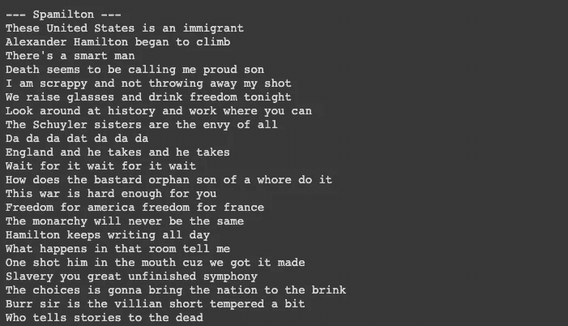

# Spamilton:带 LSTMs 和 Hamilton 歌词的文本生成

> 原文：<https://towardsdatascience.com/spamilton-text-generation-with-lstms-and-hamilton-lyrics-ec7938ae830c?source=collection_archive---------50----------------------->

## 使用 Tensorflow 和 Keras 的简单文本生成教程


苏丹欧阳在 [Unsplash](https://unsplash.com?utm_source=medium&utm_medium=referral) 上的照片

文本生成是计算语言学和自动生成自然语言文本的 AI 之间的桥梁。在深度学习中，rnn 已经被证明可以非常好地处理文本等序列数据。在这个例子中，我将演示应用 LSTMs 和单词嵌入来生成 Hamilton 歌词。许多想法来自卡帕西和班萨尔。所有的代码都可以在我的 [GitHub](https://github.com/perkdrew/text-generation) 上找到。

让我们从 Tensorflow 和 Keras 导入所需的库:

```
from **keras.preprocessing.sequence** import **pad_sequences** 
from **keras.models** import **Sequential**
from **keras.layers** import **Embedding, LSTM, Bidirectional, Dense, Dropout**
from **keras.preprocessing.text** import **Tokenizer** 
from **keras.callbacks** import **EarlyStopping**
import **keras.utils** as **ku**
import **numpy** as **np**
```

现在我们提供一条通向单词嵌入的路径:

```
glove_path = 'glove.twitter.27B/glove.twitter.27B.200d.txt'
```

歌词是从网上搜集来的，放在一个纯文本文件中:

```
text = open('ham_lyrics.txt', encoding='latin1').read()
```

语料库被小写化和标记化。输入序列是使用标记列表创建的，并被填充以匹配最大序列长度:

```
tokenizer = Tokenizer()
corpus = text.lower().split("\n") 
tokenizer.fit_on_texts(corpus) 
total_words = len(tokenizer.word_index) + 1 
input_seq = [] 
for line in corpus:  
  token_list = tokenizer.texts_to_sequences([line])[0]  
  for i in range(1, len(token_list)):   
    n_gram_seq = token_list[:i+1]   
    input_seq.append(n_gram_seq)
```

然后，我们将输入序列分成预测器和标签，用于我们的学习算法。这被视为分类任务，类别的数量反映了记号赋予器识别的单词总数:

```
max_seq_len = max([len(x) for x in input_seq]) 
input_seq = np.array(pad_sequences(input_seq, maxlen=max_seq_len, padding='pre')) 
predictors, label = input_seq[:,:-1],input_seq[:,-1] 
label = ku.to_categorical(label, num_classes=total_words)
```

我们需要打开我们的 word 嵌入文件，以便可以在我们的嵌入层中正确访问。嵌入索引是嵌入矩阵的预备步骤。这里应用了手套嵌入:

```
embeddings_index = dict()
with open(glove_path, encoding="utf8") as glove:  
  for line in glove:    
    values = line.split()    
    word = values[0]    
    coefs = np.asarray(values[1:], dtype='float32') 
    embeddings_index[word] = coefs  
glove.close()
```

嵌入矩阵是我们将实际输入到网络中的内容:

```
embedding_matrix = np.zeros((total_words, 200))
for word, index in tokenizer.word_index.items():    
  if index > total_words - 1:        
    break    
  else:        
    embedding_vector = embeddings_index.get(word)        
    if embedding_vector is not None:   
      embedding_matrix[index] = embedding_vector
```

既然数据和单词嵌入已经准备好了，我们可以开始设置 RNN 的图层了。我们首先添加嵌入层，然后添加 256 个单位的双向 LSTM 和 128 个单位的 LSTM:

```
model = Sequential() 
model.add(Embedding(total_words, 200, weights = [embedding_matrix],                     input_length=max_seq_len-1)) 
model.add(Bidirectional(LSTM(256, dropout=0.2,recurrent_dropout=0.2, return_sequences = True))) 
model.add(LSTM(128, dropout=0.2, recurrent_dropout=0.2))
```

接下来，我们用一个丢弃层来移除一次性神经元，防止过度拟合，而不会降低我们任务的性能；经常性断开“断开”经常性单元之间的连接，而常规断开“断开”到一般输入/输出的连接。激活 softmax 后的最终致密层会关闭模型。如果损失函数开始膨胀，我们称之为提前止损。由于运行时间可能会很长，因此将时期设置得比较低:

```
model.add(Dropout(0.2)) 
model.add(Dense(total_words, activation=’softmax’)) model.compile(loss=’categorical_crossentropy’, optimizer=’adam’, metrics=[‘accuracy’]) 
earlystop = EarlyStopping(monitor=’val_loss’, min_delta=0, patience=5, verbose=0, mode=’auto’) 
model.fit(predictors, label, epochs=25, verbose=1, callbacks=[earlystop])
model.save('hamilton_model.h5')
```

最后，添加了一个助手函数来显示生成的文本:

```
def generate_text(seed_text, next_words, max_seq_len):
  for _ in range(next_words):  
    token_list = tokenizer.texts_to_sequences([seed_text])[0] 
    token_list = pad_sequences([token_list], maxlen=max_seq_len-1, padding='pre')  
    predicted = model.predict_classes(token_list, verbose=0)  
    output_word = ""  
    for word, index in tokenizer.word_index.items():   
      if index == predicted:    
        output_word = word    
        break  
    seed_text += " " + output_word
```

该函数将种子文本、后续单词的数量和最大序列长度作为参数。种子文本是我们使用的文本，作为我们的学习算法进行预测的基础，我们选择希望跟随文本的单词数。

我们运行管道并打印结果:

```
print(generate_text("These United States", 3, max_seq_len))
```

生成几行文本后，我们可以预期如下结果:



通过更多的文本预处理、特征工程和健壮的建模，我们可以期望减轻上面的语法和句法错误。LSTMs 可以用 GRUs 替换，以获得更快的运行时间，代价是在较长的文本序列中精度较低。带有字符嵌入或值的文本生成也值得探索。正如 Aaron Burr 所指出的，对于不同的建模方法来说，世界是足够广阔的。

[1]:安德烈·卡帕西。(2015 年 5 月 21 日)。*递归神经网络的不合理有效性*【http://karpathy.github.io/2015/05/21/rnn-effectiveness/ 

[2]:希瓦姆·班萨尔。(2018 年 3 月 26 日)。*使用 LSTMs 的语言建模文本生成—用于 NLP 的深度学习*[https://MC . ai/Language-modeling-Text-Generation-using-lst ms-Deep-Learning-for-NLP/？FB clid = iwar 2 Mr 7 qkpnwzczzwn 1 moxuwhbhigotfvxga 4 aaps 52 rjzw 6 wspkhcki 1 hy](https://mc.ai/language-modelling-text-generation-using-lstms-deep-learning-for-nlp/?fbclid=IwAR2mR7QkpnwzCzszwN1mOXUWHBhIGOtfvxGA4AapS52RJZW6wSpKhckI1HY)