# 免去您的头痛——在 Windows 10 上使用 CUDA 设置 tensorflow

> 原文：<https://towardsdatascience.com/spare-your-headache-setting-up-tensorflow-with-cuda-on-windows-10-in-10-simple-steps-a6989e538a9f?source=collection_archive---------29----------------------->

## 10 个简单的步骤，包括演示

凯文·Ku 在 Unsplash[上的照片](https://unsplash.com/s/photos/machine-learning?utm_source=unsplash&utm_medium=referral&utm_content=creditCopyText)

2015 年 11 月 9 日，谷歌开源了一个名为`TensorFlow`的软件库。TensorFlow 是一个软件库，用于使用数据流图进行数值计算的机器学习和深度学习。它可以在多个 CPU 和 GPU 上运行

*由于机器算法在巨大的数据集上运行，在支持 CUDA 的 Nvidia GPUs 上运行这些算法非常有利于实现更快的执行速度，因为有数千个计算核心。*

让一个快速且稳定的数据科学环境运行起来总是有点烦人且耗时的。这是一个循序渐进的指南，帮助您在 jupyter 笔记本中安装一个具有可运行 GPU 内核的 Anaconda 环境。还有其他方法可以让你的 GPU 用于数据科学，但这是初学者和 Windows 用户的一个非常好的选择。
数据科学中为什么要用我的 GPU 来计算？如果你还不知道，请阅读这篇文章。

**检查当前硬件要求**

我们必须从你的硬件开始。这很重要，因为你需要一个 CUDA 工具包兼容的图形处理卡，比如 Nvidia GPU。要检查您的 GPU 是否受支持，请点击此链接:[https://developer.nvidia.com/cuda-gpus](https://developer.nvidia.com/cuda-gpus)并查看您的 GPU 是否在列表中。如果您不确定您的系统中安装了什么样的 GPU，请遵循以下步骤:

1.  右键单击桌面
2.  如果您在弹出窗口中看到“NVIDIA 控制面板”或“NVIDIA 显示器”,则您拥有 NVIDIA GPU
3.  点击弹出窗口中的“NVIDIA 控制面板”或“NVIDIA 显示器”
4.  看“显卡信息”
5.  您将看到您的 NVIDIA GPU 的名称

**检查当前的驱动程序和软件要求**

在确定你的 GPU 支持 CUDA 工具包后，我们必须安装一些工具，以便让 GPU 运行 tensorflow。随着这些工具的快速发展，几乎不可能保持博客文章的最新版本。所以，我试图尽可能详细地解释它，而不是专注于一个特定的版本。听起来很复杂，但并不复杂。
我们硬件检查后的第二步是打开 [tensorflow gpu 网站](https://www.tensorflow.org/install/gpu)。

向下滚动几页，你会发现一个软件需求列表。在撰写本文时，要求如下:

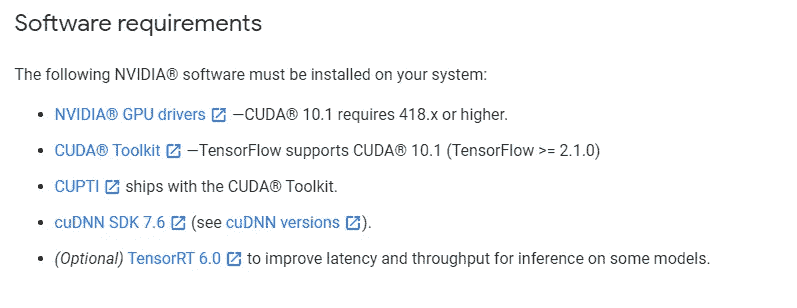

作者截图

**安装 GPU 驱动**

现在，打开最新 [Nvidia GPU 驱动程序](https://www.nvidia.com/download/index.aspx?lang=en-us)的链接，并在表格中填写您的 GPU 规格，如下例所示:

作者截图

然后点击“搜索”,该页面将打开:

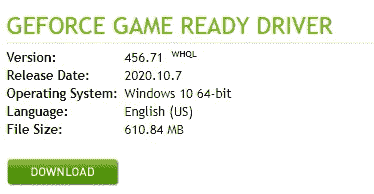

作者截图

现在只需下载驱动程序，并在指导安装过程中使用标准设置进行安装。

**安装 CUDA 工具包**

现在，您的 GPU 驱动程序是最新的，我们可以继续 tensorflow 网站上的列表。下一步是安装 CUDA 工具包。在我写这篇博客的时候，这是 10.1 版本，但是如前所述，总是安装网站显示的版本。

要安装 CUDA 工具包，请点击此[链接](https://developer.nvidia.com/cuda-toolkit-archive)，将会打开一个工具包版本列表，如下所示:

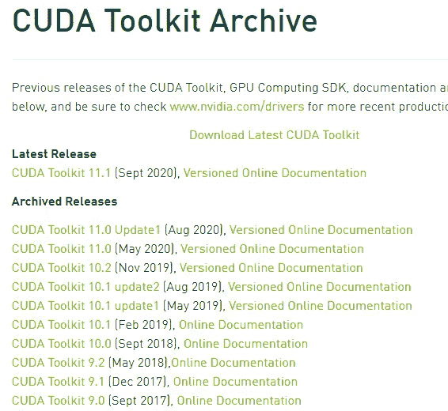

作者截图

现在选择 tensorflow 网站显示的版本，在我的情况下是工具包 10.1。在屏幕截图中，您可以看到有 CUA 工具包 10.1、CUDA 工具包 10.1 更新版 1 和 CUDA 工具包 10.1 更新版 2。由于网站显示 CUDA 工具包 10.1，我们安装的正是这个版本，而不是更新之一。一旦您选择了版本，将显示以下页面:

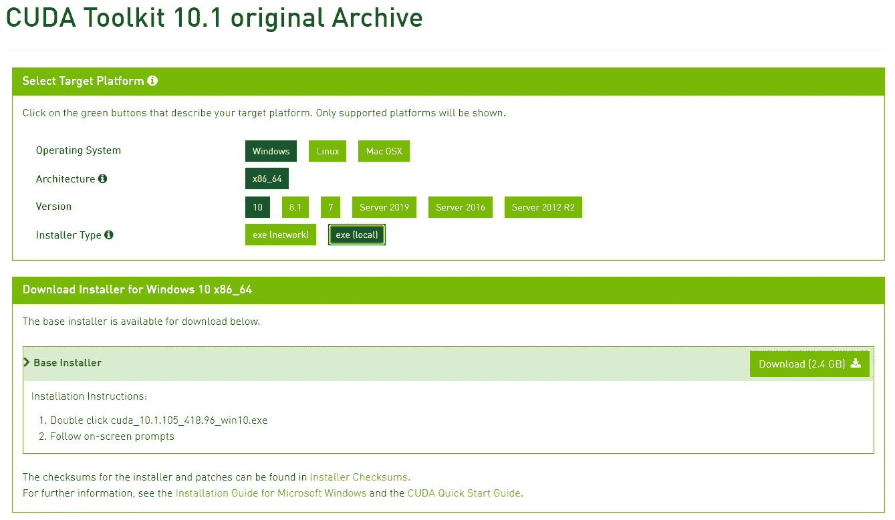

作者截图

选择屏幕截图上显示的参数。操作系统= Windows 10，架构= x86_64，版本= 10，安装程序类型= exe(本地)。然后点击“下载”。

**安装 cuDNN**

由于 CUPTI 包含在 CUDA 工具包中，我们可以忽略这个链接，直接跳到 cuDNN。如前所述，请安装 TensorFlow 网站上显示的版本，在我的情况下是 cuDNN SDK 7.6。点击此[链接](https://developer.nvidia.com/cudnn)进入 cuDNN 网站，点击“下载 cuDNN”。

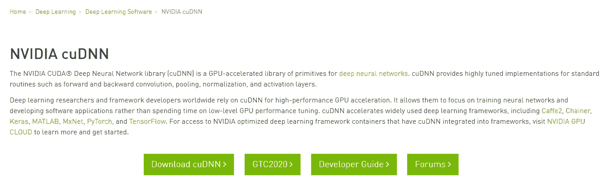

作者截图

为了能够下载 CuDNN，你必须使用 Nvidia 帐户登录。如果您已经有，只需登录，如果没有，请单击“立即加入”创建。它完全免费。

作者截图

登录后，该页面将会打开:

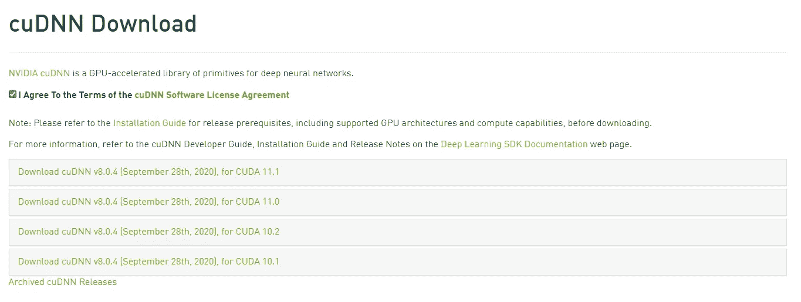

作者截图

同意条款，如果需要的版本不像我的情况那样显示，单击“存档的 cuDNN 版本”,将显示包含所有 cuDNN 版本的页面:

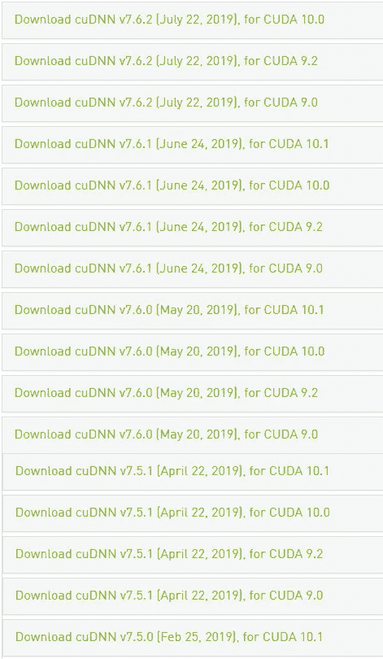

作者截图

正如 TensorFlow 网站所说，我必须安装 cuDNN SDK 7.6，所以我正在下载 CUDA 10.1 的 7.6.5 版本，因为这是我必须安装的 CUDA 工具包版本。

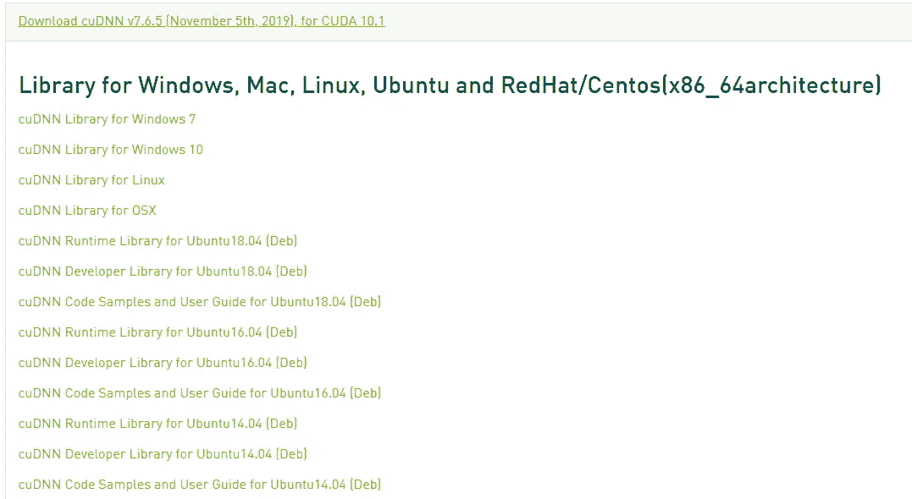

作者截图

点击“cuDNN Library for Windows 10”开始下载。要安装 cuDNN，首先返回 Tensorflow 网站并检查页面底部的路径:

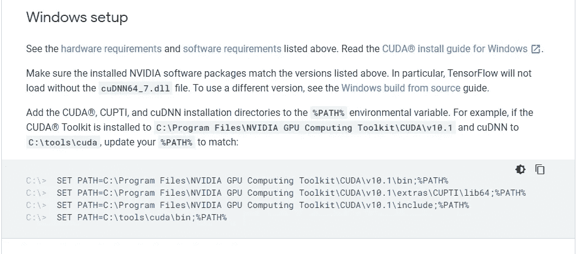

作者截图

最后一个节目是安装 cuDNN。在我的例子中是 C:\tools\cuda。首先，我在 c 盘上创建一个文件夹工具，方法是右键单击->新建->文件夹，或者使用快捷键 CTRL+SHIFT+N，并将其命名为“工具”:

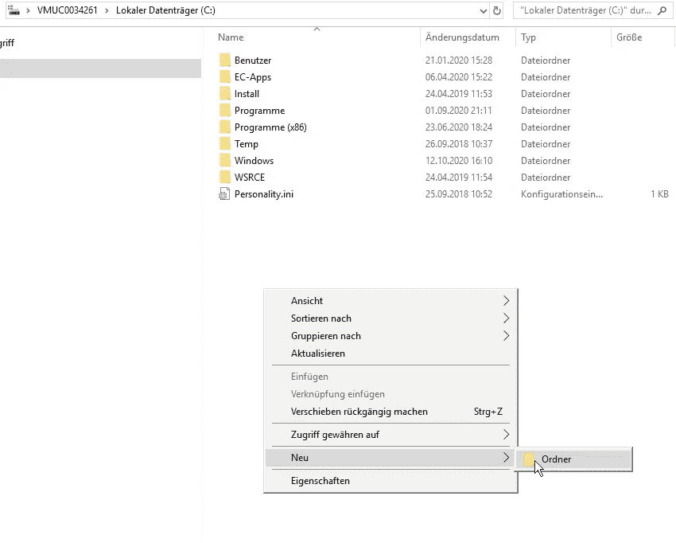

作者截图

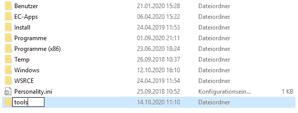

作者截图

然后，我们用 cuDNN 打开 zip 文件，这显示了一个文件夹“cuda ”,我们只需拖动到 c 盘上新的“tools”文件夹中，cuDNN 安装就完成了:

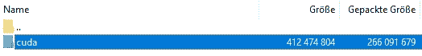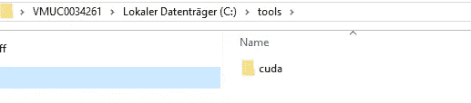

作者截图

**安装 tensort**

现在这已经完成了，Tensorflow 网站上列表中的最后一个工具是 Tensor RT，在我的情况下是 6.0 版本，我们也将安装这个工具，尽管它被标记为可选。当打开[链接](https://docs.nvidia.com/deeplearning/tensorrt/install-guide/index.html)时，我们会看到这个页面:

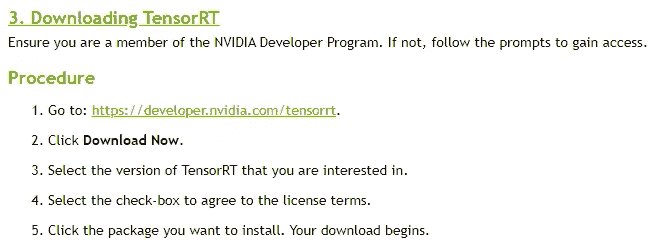

作者截图

向下滚动到第 3 点。下载并遵循显示的说明。我将选择 TensorRT 6，特别是 Windows 10 和 CUDA 10.1 的版本。

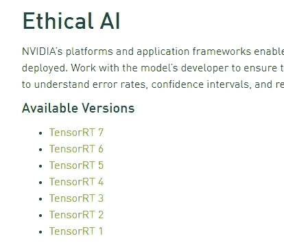

作者截图

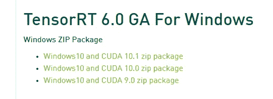

作者截图

下载完成后，将其解压缩，并像之前的 cuDNN 文件夹一样，将该文件夹拖到 c 盘上相同的“tools”文件夹中:

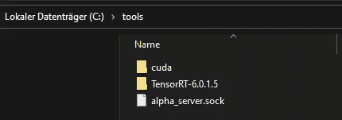

作者截图

**更新路径变量**

现在，要完成 Tensorflow 网站上显示的所有工具的安装，我们必须将路径变量更新为网站底部显示的路径变量:

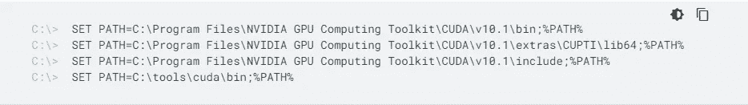

作者截图

要做到这一点，打开你的浏览器，到“你的电脑”和右键单击某处，并打开“属性”。

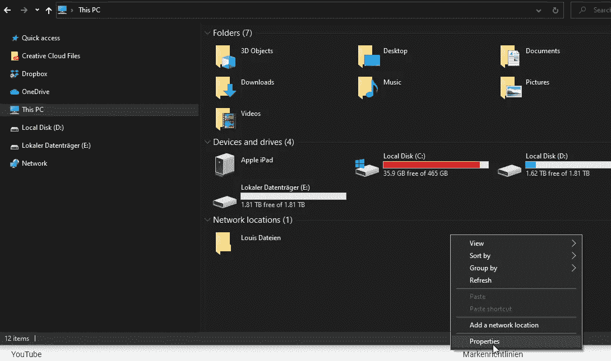

作者截图

然后打开“高级系统设置”，然后打开“环境变量”:

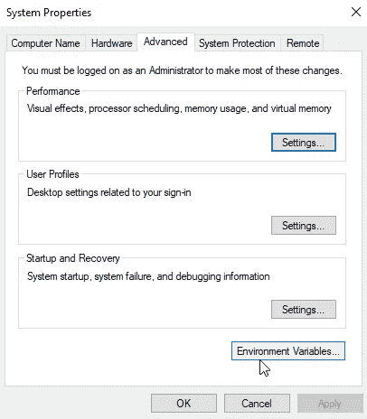

作者截图

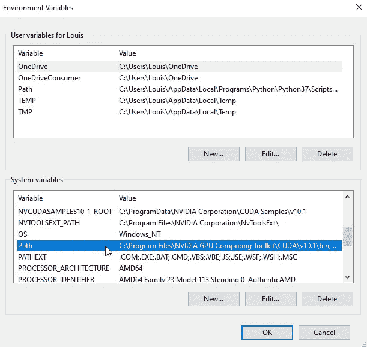

作者截图

向下滚动到“路径”并编辑它。点击“新建”,从 TensorFlow 网站复制/粘贴我在下面标记的内容，从 C 到分号。对其他三条路径也重复这个步骤。

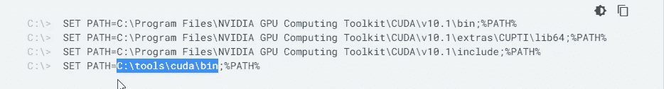

作者截图

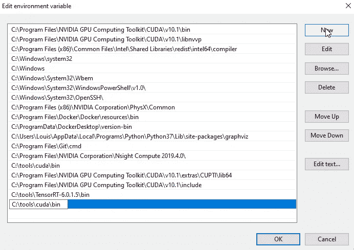

作者截图

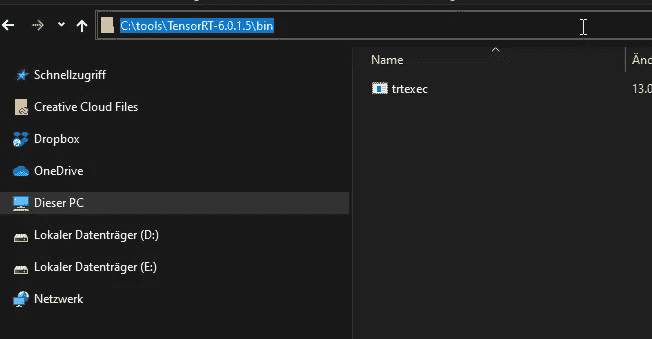

作者截图

我们也必须使用 TensorRT 工具来完成这项工作，要获得该工具的路径，只需打开您的浏览器。转到 C-Drive，tools，TensorRT 和 bin，然后在路径栏中单击并复制/粘贴该路径链接之前的其他四个路径。然后点击“确定”并通过点击“确定”关闭你的窗口。

**安装蟒蛇**

这是 Tensorflow 网站上说明的最后一步。现在还有一个工具需要安装，如果您还没有安装的话，这是 anaconda 或 miniconda。我个人更喜欢 Anaconda，所以我们将通过这个[链接](https://www.anaconda.com/products/individual)来安装它。

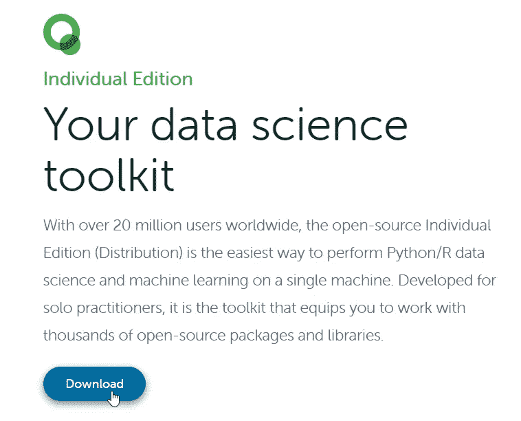

作者截图

点击下载，页面将向下滚动。选择用于 Windows 的 64 位图形安装程序:

作者截图

并使用标准设置安装 Anaconda。

**设置 Conda 环境—步骤 1**

现在所有的手动安装工作都完成了，我们可以继续第三步，设置我们的 conda 环境来运行带有 GPU 加速的 jupyter notebook。因此，点击窗口按钮，输入“anaconda promt ”,启动提示符。

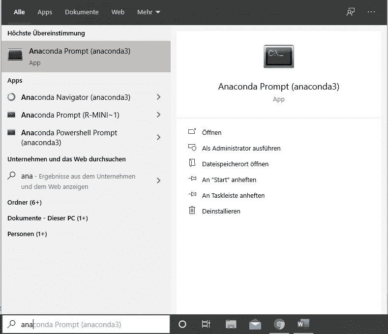

作者截图

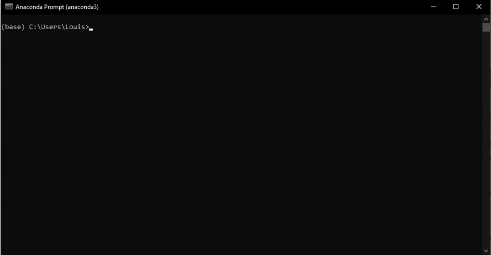

作者截图

键入命令“conda ”,按 Enter 键运行它，您将得到一个包含更多命令的列表:

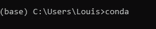

作者截图

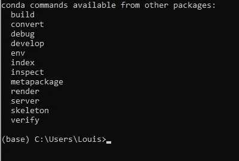

作者截图

但是现在让我们通过输入“conda install jupyter”来安装 jupyter，并使用 Enter 运行它。键入“y”确认，然后按 Enter 键再次运行。

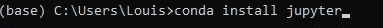

作者截图

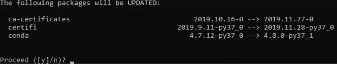

作者截图

**设置 Conda 环境—步骤 2**

下载[这个文件](https://github.com/LuijiDarkSia/tensorflow_gpu_setup_win10/blob/main/tensorflow-gpu.yml)并保存在你的用户目录下。因此，点击“原始”，右键单击并“另存为”。在 windows 资源管理器窗口中选择所有数据类型，保存为“tensorflow-gpu.yml”。

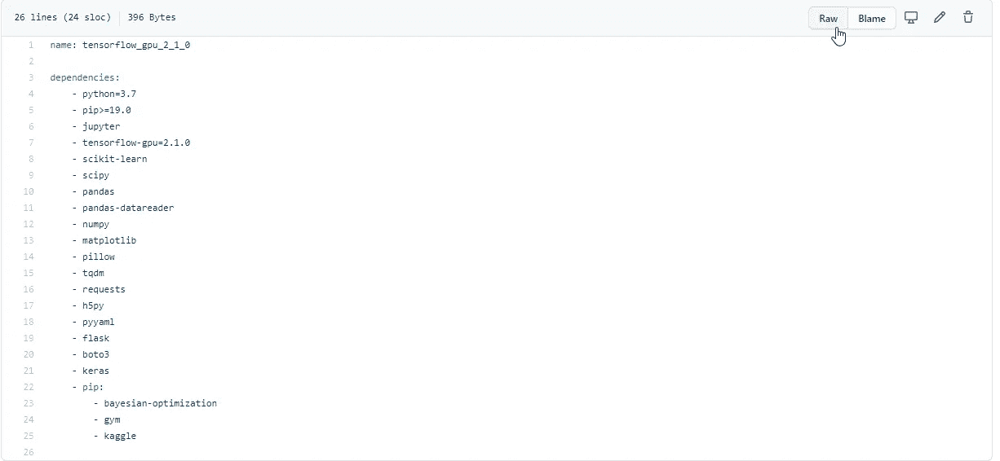

作者截图

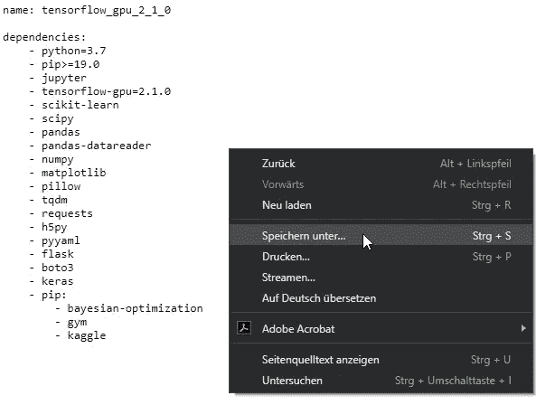

作者截图

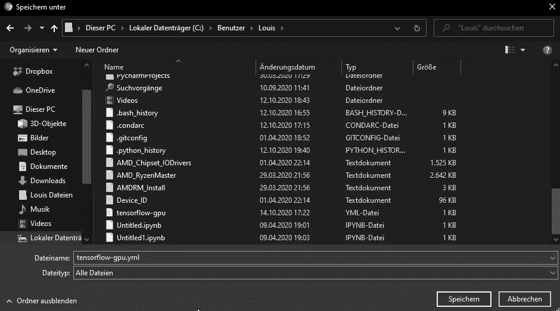

作者截图

现在返回到 anaconda 提示符窗口，键入以下命令，创建一个 Anaconda 虚拟环境，其中包含文件中列出的所有必要的 python 包。如果您需要更多的包或其他包，您可以编辑。yml 文件或稍后在 jupyter 笔记本中安装它们。

*conda env create-v-f tensor flow-GPU . yml*

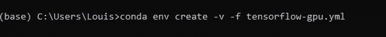

作者截图

在该命令之后，您应该得到以下响应:

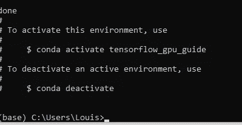

作者截图

键入“conda env list”以获得您所有 conda 环境的列表:

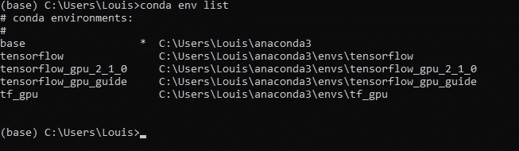

作者截图

要选择我们已经创建的一个，只需键入以下命令:

*康达激活 tensorflow_gpu_2_1_0*

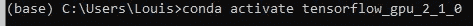

作者截图

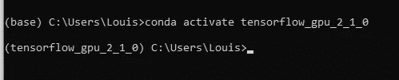

作者截图

最后，复制以下很长的命令，启动 jupyter 服务器:

*python -m ipykernel 安装—用户名 tensorflow —显示名称" tensorflow_gpu_python_3_7"*

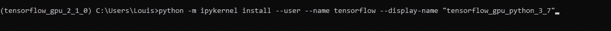

作者截图

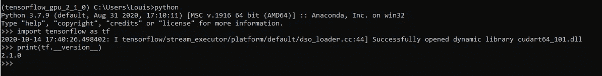

作者截图

**TL；DR:** **测试您的环境和 GPU 性能**

现在，您可以通过命令“jupyter lab”启动 jupyter lab，并选择 tensorflow gpu 内核。如果你想测试你的 GPU 与 CPU 的速度，只需下载[这款笔记本](https://github.com/LuijiDarkSia/tensorflow_gpu_setup_win10/blob/main/GPU_vs_CPU.ipynb)。

非常感谢你阅读这篇博文！如果您有任何更新或建议，请随时在下面发布。