# Spark 3.0 SQL 功能更新| ANSI SQL 合规性、存储分配策略、升级的查询语义、功能升级

> 原文：<https://towardsdatascience.com/spark-3-0-sql-feature-update-ansi-sql-compliance-store-assignment-policy-upgraded-query-94d8d8618ddf?source=collection_archive---------36----------------------->

Spark 通过 Spark SQL 增加了许多显著的特性。有些会对数据质量和数据验证等检查产生巨大影响。尽管有很多升级的特性，我还是列出了其中的几个，因为它们会在最常见的情况下使用。

## ANSI SQL 投诉功能

对于刚刚开始学习 SQL 命令的 Spark 开发人员来说，查询标识符验证可能会有所帮助。他们可能会使用不应该使用的关键字作为标识符。即使它在 spark 上完全正常工作，这也会使将来使用该代码的其他人感到困惑。

Spark 将允许某些不寻常的情况，比如使用一些保留的关键字作为标识符。大概是这样的:

```
select * from table_1 create where create.column_1= 1
```

这个查询将在 spark **中运行，没有任何问题。create** 是最常见的保留关键字，用于使用 SQL 创建表，但是它可以在 spark 中用作标识符，没有任何问题。

为了克服这个问题，并在运行时进行查询验证，Spark 现在符合 ANSI SQL 标准。catalyst 解析器级别增加了验证。要启用 ANSI 模式查询验证，请将属性 **spark.sql.ansi.enabled** 切换为 **true。**对于上面显示的相同查询，Spark 现在将抛出异常。

```
Error in SQL statement: ParseException:  no viable alternative at input 'create'(line 1, pos 38)== SQL == 
select * from table_1 create  where create.column_1= 1 
----------------------^^^com.databricks.backend.common.rpc.DatabricksExceptions$SQLExecutionException: org.apache.spark.sql.catalyst.parser.ParseException:
```

以下是 Spark 3.0 中标准化的关键字:

要禁用 ANSI 标准验证，伪造 **spark.sql.ansi.enabled.**

## **店铺分配政策**

引入该特性是为了在从 SQL 类环境迁移的过程中进行严格的数据质量检查。在 Spark 2.4 和更低版本中，Below Insert table 语句(将字符串摄取到整数列中)将在没有任何运行时异常的情况下执行。

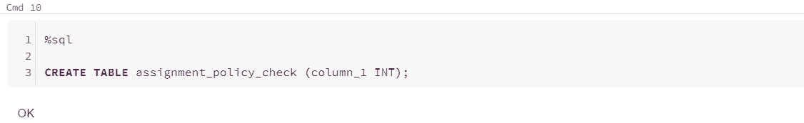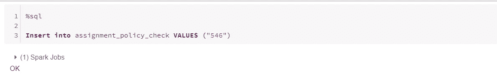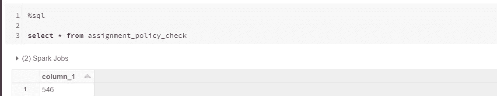

这在 Spark 3.0 中也能很好地工作。但是通过将属性"**spark . SQL . storeasignmentpolicy "**设置为 **'ANSI '，** casting 异常被抛出。

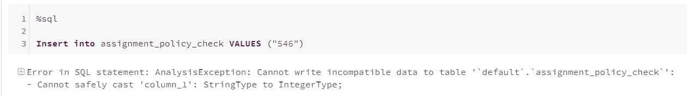

这无疑改善了迁移过程中的数据质量检查。

## “from_json”(失败 _ 快速/许可)中的可选模式

from_json 方法用于解析列中的 json 类型值。在 Spark 3.0 中，它支持类似 spark.read.json 的 PERMISSIVE/FAIL_FAST 模式。因此，如果 json 值无法解析或格式错误，它将引发如下异常:

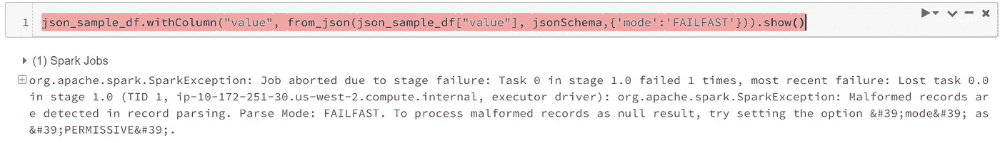

## 指数符号

在 Spark 3.0 中，用科学记数法写的数字(例如，1E11 )将被解析为 Double。在 Spark 及以下版本中，它们被解析为十进制。要恢复 Spark 3.0 之前的行为，可以将**Spark . SQL . legacy . exponentliteralasdecimal . enabled**设置为 **false** 。

在 Spark 2.4 中，

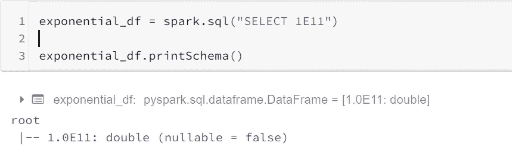

在 Spark 3.0 中，将*' Spark . SQL . legacy . exponentliteralasdecimal . enabled '*设置为 *true* 。


## 负十进制零

在 Spark 版和更低版本中，float/double -0.0 在语义上等同于 0.0，但是在聚合分组键、窗口分区键和连接键中使用时，将-0.0 和 0.0 视为不同的值。这是一个 Bug，在 Spark 3.0 中已经修复。现在，Distinct of (-0.0，0.0)将给出(0.0)。

**样本数据集**

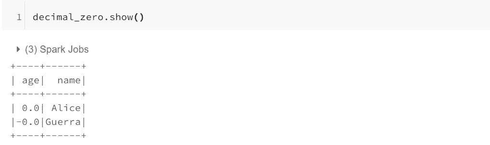

使用 Spark 2.4，您将获得如下内容:

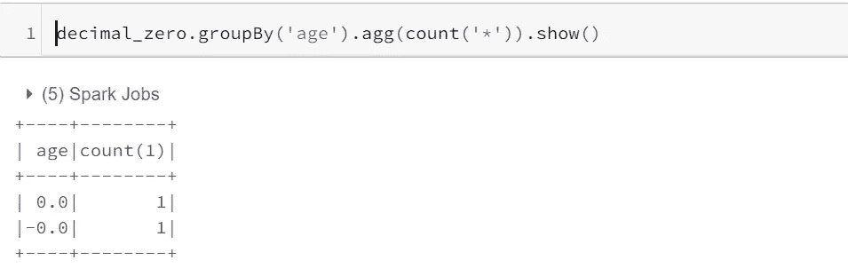

而在 Spark 3.0 中，没有设置额外的属性，考虑因素将是相同的，无论是正面还是负面。

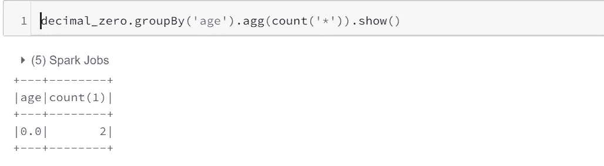

## “日期”和“时间戳”的关键字字符串

在 Spark 3.0 中，某些关键字支持将字符串转换为日期。

要从字符串生成“日期”,以下是关键字。

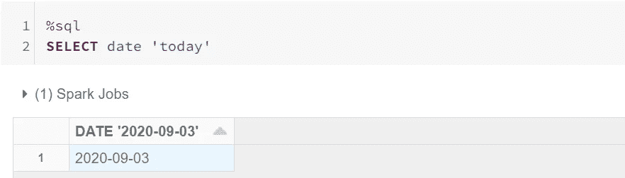

> 可能的关键字:

```
**select date 'x'***'x' can have following values:*> **epoch** -> *1970-01-01 (minimum date)*> **today** -> *the current date in the time zone specified by* *spark.sql.session.timeZone*> **yesterday** -> *the current date - 1*> **tomorrow** -> *the current date + 1*> **now**-> *the date of running the current query. It has the same notion as today*
```

类似地，我们有一个从字符串获取时间戳的选项。

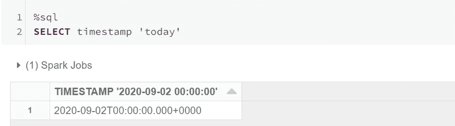

> 可能的关键字:

```
**select timestamp 'x'***'x' can have following values*> **epoch** -> *1970-01-01 00:00:00+00 (Unix system time zero)*> **today** -> *midnight today*> **yesterday** -> *midnight yesterday*> **tomorrow** -> *midnight tomorrow*> **now**-> *current query start time*
```

在 3.0 中，一些 SQL 函数也得到了更新/添加，这有利于数据聚合和以更简单的方式从中获得洞察力。在下面找到其中的一些。

## 用于以下部分的数据集

## Max_By()，Min_By()

这些功能是我提到的重要特征之一。这将得到一列的值，相对于其他列的最大值/最小值。

*用法:* **max_by(x，y)** / **min_by(x，y)**

→ x =从中提取值的列。

→ y =获得最大值/最小值的列。

从以上数据来看，整体最高价 2.598，整体最低价 2.514。

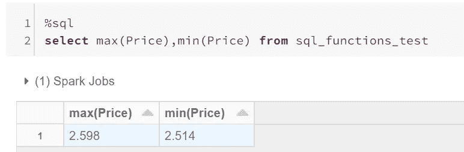

但是对于 Max_by/Min_by，最大值= 2.572，这是针对最大订单编号 6，最小值= 2.548，这是针对最小订单编号 1。

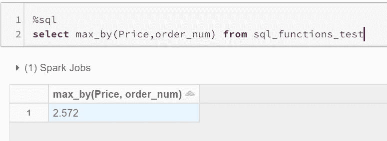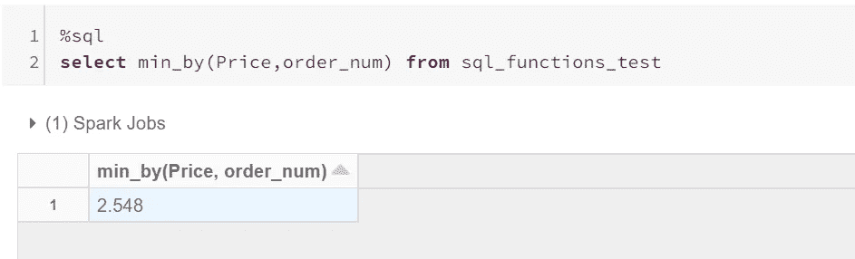

## 子查询中的 WITH 子句

使用 with 子句的 CTE 现在可以在子查询中使用。这将提高查询的可读性，并且在使用多个 CTE 时很有意义。

```
select * from 
(with inner_cte as (select * from sql_functions_test where order_num = 5)
select order_num from inner_cte);
```

## 过滤器(在哪里…)

此功能仅对基于条件筛选的一组行的聚合有帮助。

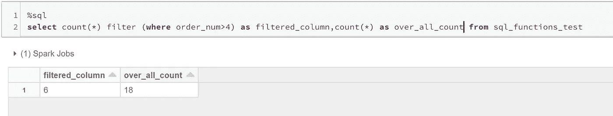

## 覆盖()

这是“替换”功能的替代功能。但是，它确实比 replace 有一些优势。

*用途:*叠加(*input _ string*placement*replace _ string*from*start _ position*for*number _ of _ positions _ to _ be _ replaced*

*注意:*输入列应该是字符串。

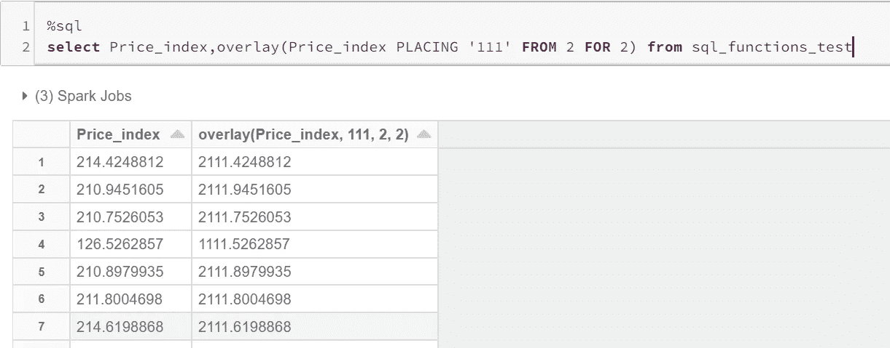

## Any ()— Every() — Some()

这是为了根据提供的条件表达式验证列。

*用法:* Any(expr)，Every(expr)，Some(expr)

*EVERY:* 将返回 true，仅当所有列值都返回 true 时。

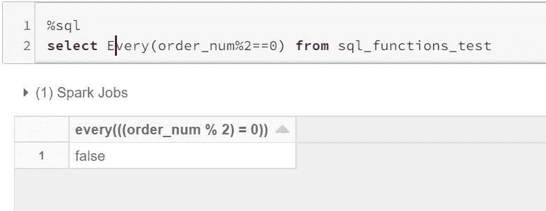

*ANY/SOME:* 将返回 true，即使有一个值返回 true。

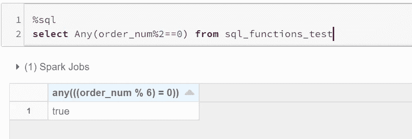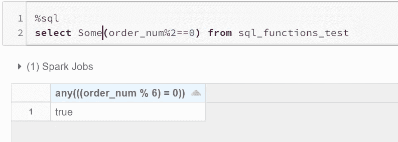

## Count_if()

这类似于过滤(其中..)，这将给出满足所提供条件的列记录的非唯一计数。

*用法:* count_if(expr)

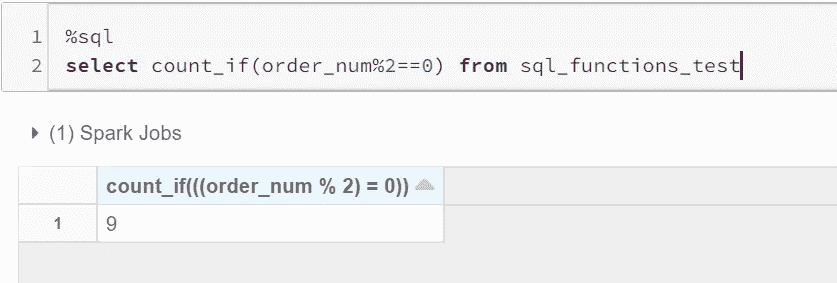

## Bool_and() — Bool_or()

这是为了验证布尔列，模拟 AND /OR 操作。

*用法:* bool_and( *列值*)，bool_or( *列值*)

考虑样本表，有一个布尔列。

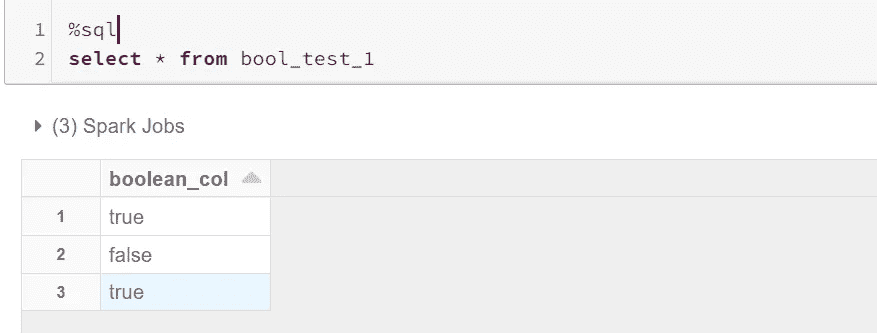

仅当所有值都为真时，应用 *BOOL_AND:* 才返回真。

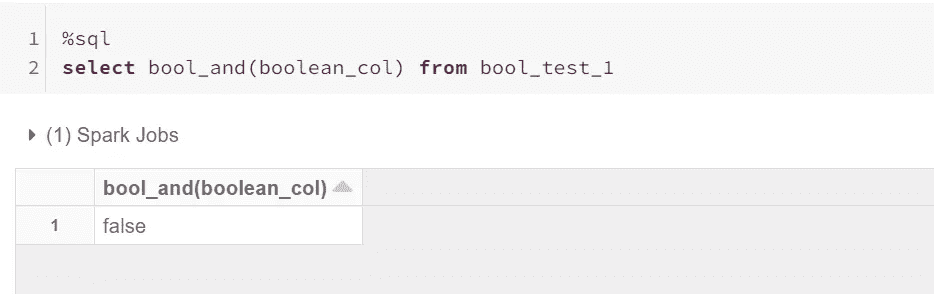

应用 *BOOL_OR:* 即使一个值为真也返回真。

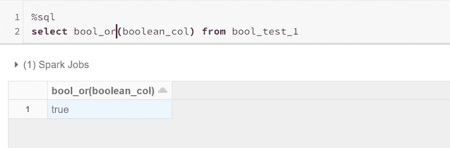

## 包扎

Spark 不仅增加了新功能，还修复了早期版本的一些错误。验证和质量检查比以前更容易了。像 count with filter、max_by 和 min_by 这样的函数将降低执行多个子查询的复杂性。

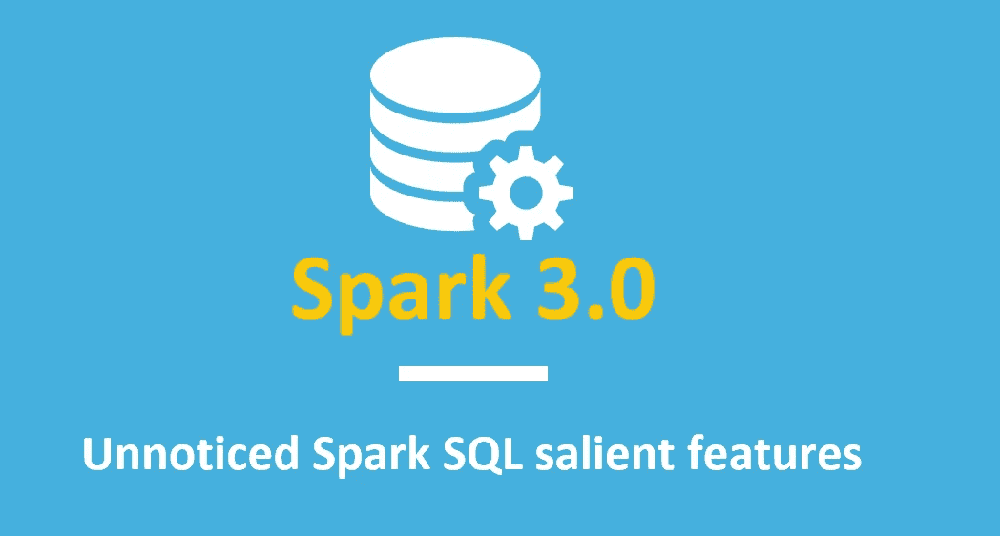