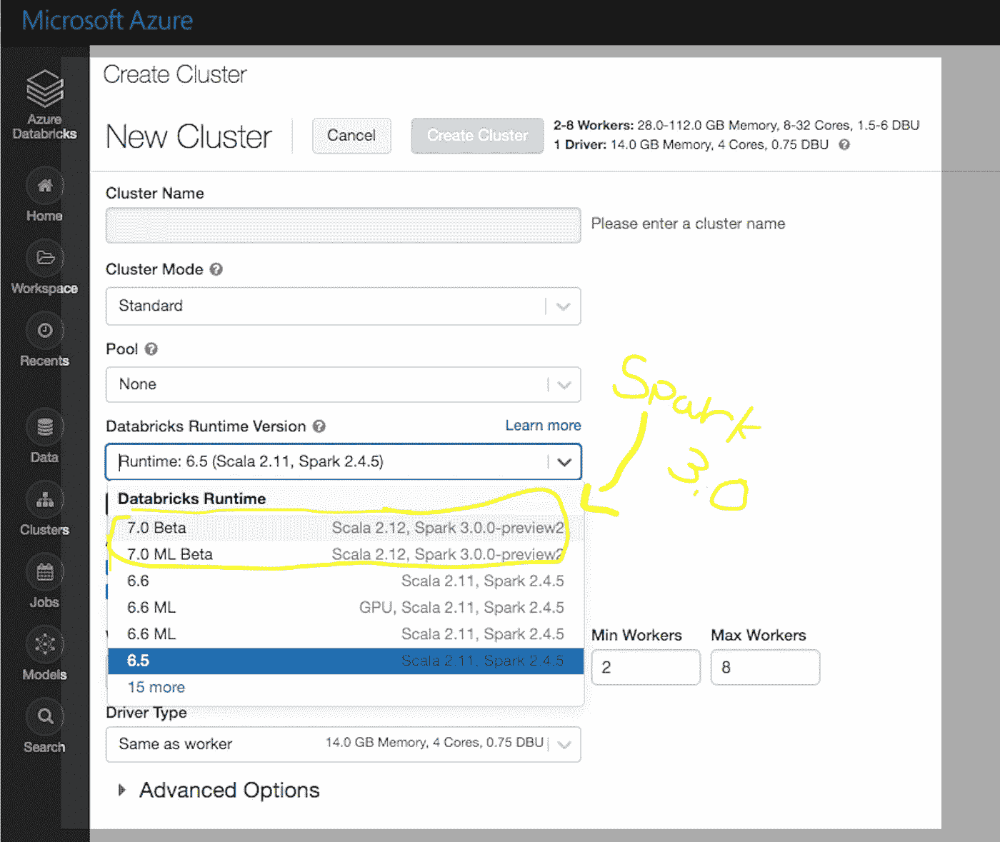
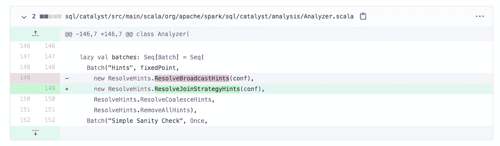
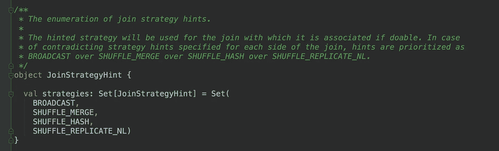

# Spark & AI 峰会暨 Spark 3.0 一瞥

> 原文：<https://towardsdatascience.com/spark-ai-summit-and-a-glimpse-of-spark-3-0-5fe0775386de?source=collection_archive---------52----------------------->

如果说有一个框架超级让我兴奋，那就是 Apache Spark。
如果有一个会议让我兴奋，那就是 Spark & AI 峰会。

今年，随着当前的新冠肺炎疫情，北美版的 Spark & AI 峰会在线并且[免费](https://databricks.com/sparkaisummit)。不用出差，不用买昂贵的机票，不用付住宿费和会议费。都是免费在线的。

**一个警告**，现在是太平洋时区(PDT)友好时间。我有点希望组织者能采取更全球化的方法。

说到这里，议程和内容看起来很有希望！

为了为会议做好准备并了解 Spark 3.0
我决定用 [Azure Databricks](https://docs.microsoft.com/azure/azure-databricks/quickstart-create-databricks-workspace-portal?WT.mc_id=blog-spark3-adpolak) 构建一个 Spark 3.0 集群，你可以做同样的事情或者使用 [Databricks 社区版](https://community.cloud.databricks.com/login.html)。
请注意，在 community edition 中，没有 workers 节点。

# 工作区:

*   [Azure 数据块](https://docs.microsoft.com/azure/azure-databricks/quickstart-create-databricks-workspace-portal?WT.mc_id=blog-spark3-adpolak)
*   [Databricks 社区版](https://community.cloud.databricks.com/login.html)

# 许多令人兴奋的特性，让我们简单看一下其中的两个

*   **Pandas UDF 和 Python 类型提示**
    可能主要由数据科学和 Python 开发人员社区使用。这个特性允许我们创建一个可读性更好的代码，并支持 ide 进行代码静态分析，比如 [PyCharm](https://www.jetbrains.com/help/pycharm/quick-start-guide.html) 。
    看这里[看这里](https://databricks.com/blog/2020/05/20/new-pandas-udfs-and-python-type-hints-in-the-upcoming-release-of-apache-spark-3-0.html)。
*   在这次改变之前，我们已经广播了散列连接提示。
    也就是说，如果有一个连接操作，并且其中一个表可以放在内存中，Spark 将广播它来执行一个更快的连接。负责它的班级被命名为`ResolveBroadcastHints`。换成了`ResolveJoinStrategyHints`。要了解更多，请查看 JIRA 门票: [SPARK-27225](https://issues.apache.org/jira/browse/SPARK-27225) 。

可用提示列表:

为了更好地理解它们是如何工作的，我推荐查看 Apache Spark 开源代码，特别是这个文件:
`sql/catalyst/src/main/scala/org/apache/spark/sql/catalyst/plans/logical/hints.scala`

如果你有兴趣了解更多关于 Spark SQL 优化引擎——**催化剂**的信息，请阅读我对它的深入研究，这里是。

# 推荐的前 4 个会议

## -1-在 Apache Spark 上使用 Horovod 进行端到端深度学习

在过去的几个月里，我一直在研究各种涉及大量数据的自动驾驶汽车场景。我面临的挑战之一是让数据科学大规模运行深度学习。深入研究之后，我发现了 Horovod 的框架和 HorovodEstimator。我很高兴能参加这次会议并了解更多！你对它感到好奇吗？点击了解更多[。](https://docs.microsoft.com/en-us/azure/databricks/applications/deep-learning/distributed-training/horovod-estimator?WT.mc_id=blog-spark3-adpolak)

[会话链接](https://databricks.com/session_na20/end-to-end-deep-learning-with-horovod-on-apache-spark)。

## -2-使用 MLflow 构建可靠的 ML 管道

如果你现在跟踪我一段时间，你就会知道我正在深入研究如何大规模地建立机器学习管道。
这里有一个 [GitHub repo](https://github.com/adipola/ms-build-e2e-ml-bigdata) 描述了我为微软 Build 2020 会话构建的端到端平台。该平台包括 MLFlow、Azure Databricks、Azure 机器学习和带有 Scikit learn 的社交媒体文本分类。该存储库包括数据流、架构、教程和代码。

[会话链接](https://databricks.com/session_na20/building-reliable-ml-pipelines-with-mlflow)。

## -3-网飞个性化系统的数据质量方法

如果您看过我关于大数据和 ML 的会议，我总是会提到:

> ***你只有和你的数据一样好***

当然，我这里指的是机器学习模型。由于不平衡的数据和误用/缺乏评估数据质量的工具，我们看到许多有偏见的机器学习模型。很多时候在数据质量过程中，我们需要过滤掉数据；这就是拥有大量数据有所帮助的地方。然而，它也带来了挑战。

这就是为什么我很高兴听到网飞是如何应对这些挑战的。

顺便说一句，如果你想熟悉数据偏见的挑战，我推荐这篇来自微软研究博客的[短文](https://www.microsoft.com/en-us/research/blog/what-are-the-biases-in-my-data?WT.mc_id=blog-spark3-adpolak)。

[会话链接](https://databricks.com/session_na20/an-approach-to-data-quality-for-netflix-personalization-systems)。

## -4-Apache Spark 文件格式生态系统

**Veraset** 软件开发团队密切参与开源 Spark 计划，如
Datasource V2 和外部 Shuffle 服务，听到他们如何使用正确的文件格式来提高性能是很有趣的。以及允许[谓词下推](https://medium.com/microsoftazure/data-at-scale-learn-how-predicate-pushdown-will-save-you-money-7063b80878d7)。

[会话链接](https://databricks.com/session_na20/the-apache-spark-file-format-ecosystem)。

# 暂时就这样吧！

感谢您阅读至此。

这些是我对峰会的个人看法。
如果你喜欢阅读，请在 [dev.to](https://dev.to/adipolak) 、 [Twitter](https://twitter.com/AdiPolak) 和 [LinkedIn](https://www.linkedin.com/in/adi-polak-68548365/) 上关注我。

总是乐意接受你的想法和意见。

# 💡你迫不及待想参加哪一届？Apache Spark 有哪些让你兴奋的地方？

*原载于 2020 年 6 月 2 日*[*https://dev . to*](https://dev.to/adipolak/spark-ai-summit-and-a-glimpse-of-spark-3-0-342)*。*