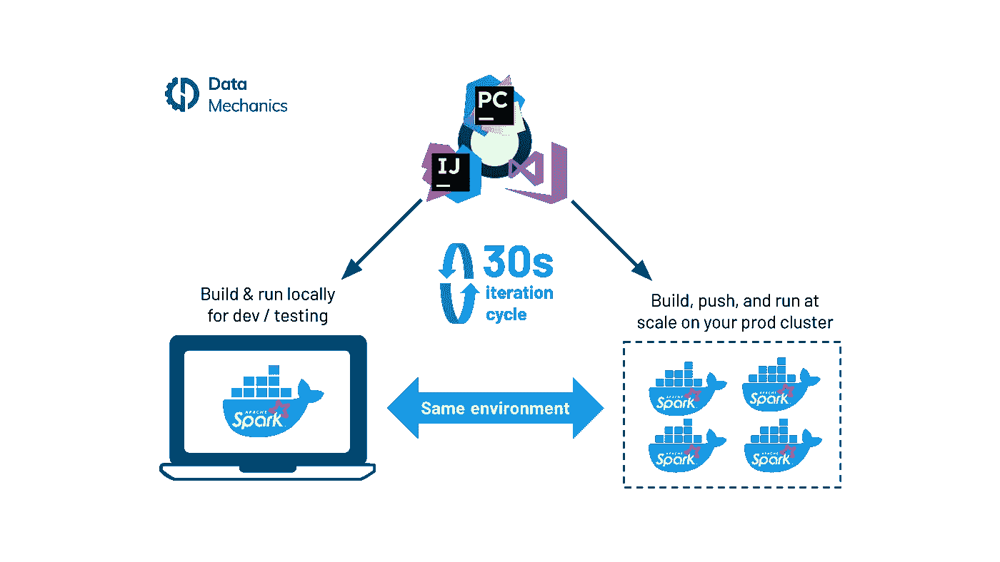
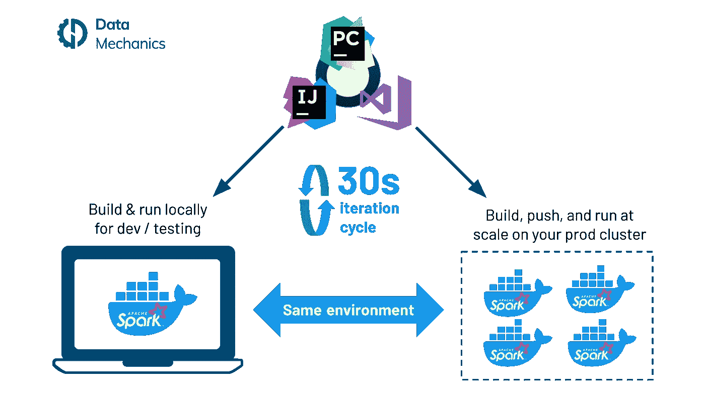
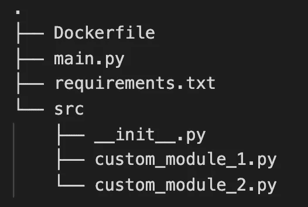
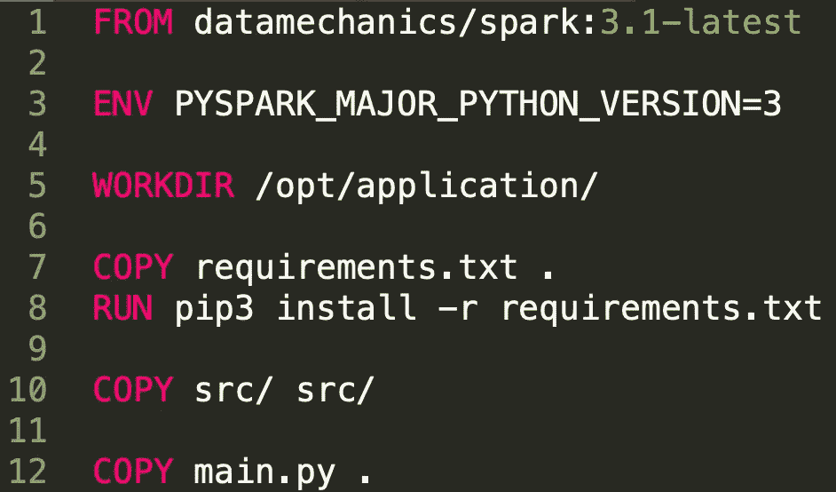
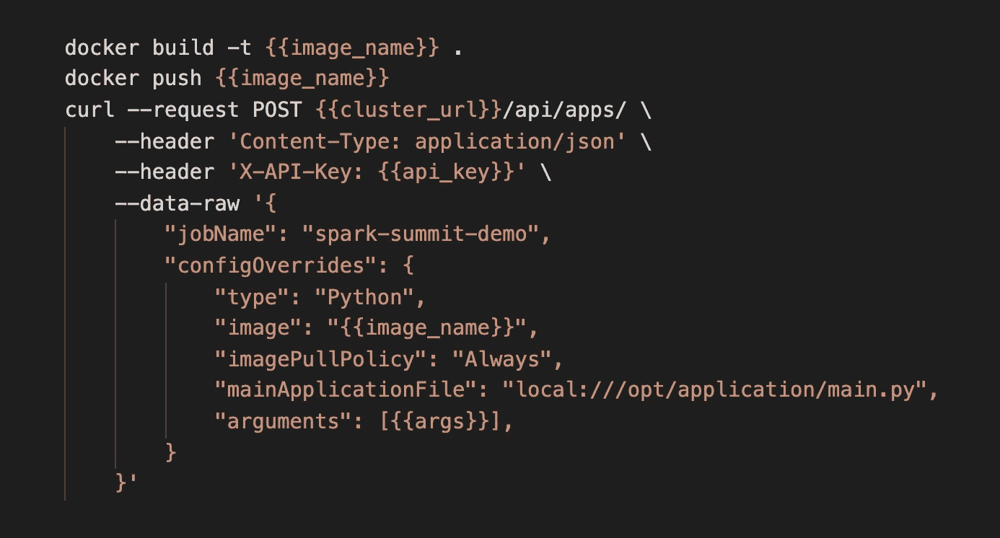
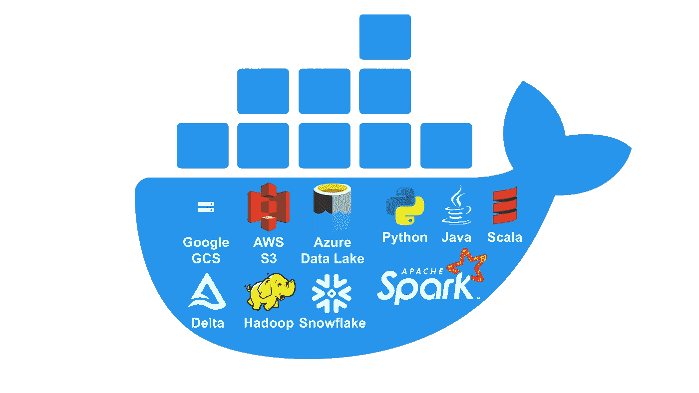

# Spark 和 Docker:您的 Spark 开发周期刚刚快了 10 倍！

> 原文：<https://towardsdatascience.com/spark-and-docker-your-spark-development-cycle-just-got-10x-faster-f41ed50c67fd?source=collection_archive---------7----------------------->

Spark & Docker 开发迭代周期。图片作者。

使用 Docker 容器的好处是众所周知的:它们提供了一致和隔离的环境，因此应用程序可以以可重复的方式部署在任何地方——本地、开发/测试/生产环境、所有云提供商和内部。

软件工程界已经完全采用了 Docker，围绕 Docker 的许多工具已经改变了我们构建和部署软件的方式——测试、CI/CD、依赖管理、版本控制、监控、安全。Kubernetes 作为容器编排和基础设施管理的新标准的流行源于 T2 Docker 的流行。

在大数据和 [Apache Spark](https://www.datamechanics.co/apache-spark) 场景中，大多数应用程序仍然直接运行在虚拟机上，没有受益于容器化。Spark 的主流集群管理器 Hadoop YARN 直到最近的(Hadoop 3.1 版本)才支持 Docker 容器，甚至今天对 Docker 的支持仍然是“实验性的和不完整的”。

对 Docker 的本地支持实际上是公司选择在 Kubernetes 上部署 [Spark 而不是 YARN](https://www.datamechanics.co/blog-post/pros-and-cons-of-running-apache-spark-on-kubernetes) 的主要原因之一。Spark-on-Kubernetes 项目得到了社区的大力支持，直到 2021 年 3 月 Apache Spark 3.1 宣布[全面可用并准备好生产。](https://datamechanics.co/blog-post/apache-spark-3-1-release-spark-on-kubernetes-is-now-ga)

在本文中，我们将通过在 [Data Mechanics](https://www.datamechanics.co/blog-post/video-tour-of-data-mechanics-the-serverless-spark-platform) 的许多用户使用的端到端开发周期来说明 [Apache Spark](https://www.datamechanics.co/apache-spark) 的 Docker 的好处。

# Docker 为 Apache Spark 带来的好处

## 1.一次构建您的依赖项，随处运行

无论在哪里运行，您的应用程序都将以相同的方式运行:在用于开发/测试的笔记本电脑上，或者在您的任何生产环境中。在您的 Docker 映像中，您将:

*   打包您的应用程序代码
*   打包你所有的依赖(python: pypi，eggs，conda，scala / java: jars，maven 系统依赖性)
*   定义环境变量来调整运行时的行为
*   按照您想要的方式定制您的操作系统
*   如果在 Kubernetes 上运行:你可以为每个单独的 Docker 图像自由选择你的 Spark 版本！这与 YARN 不同，YARN 必须为整个集群使用相同的全局 Spark 版本。

## 2.使 Spark 在生产中更可靠、更具成本效益。

由于您可以在构建 Docker 映像时控制整个环境，这意味着您不需要在运行时执行任何 init 脚本/引导操作。

这些脚本有几个问题:

*   它们并不可靠——库安装可能会由于虚假的网络故障而失败，并对生产中的 Spark 管道故障负责。
*   它们很慢——这些运行时脚本会给每个 Spark 节点增加几分钟的设置时间，从而增加成本。
*   它们很难开发、维护和调试。

## 3.加快你的迭代周期。

在 Data Mechanics，我们的用户享受 20-30 秒的迭代周期，从他们在 IDE 中进行代码更改到这一更改在我们的平台上作为 Spark 应用程序运行。

这主要是因为 Docker 缓存了以前构建的层，而且 Kubernetes 启动/重启 Docker 容器的速度非常快。

Spark & Docker 开发迭代周期。图片作者。

# 教程:如何使用 Docker 将您的 Spark 开发周期加快 10 倍

在这一节中，我们将逐步向您展示如何使用 Spark 和 Docker。示例截屏和代码样本取自在 Data Mechanics 平台上运行 PySpark 应用程序，但是这个示例可以简单地进行修改以在其他环境中工作。

## 1.建立码头工人形象

我们将从一个包含一些依赖项的本地 PySpark 项目和一个解释如何为这个项目构建 Docker 映像的 Docker 文件开始。一旦构建了 Docker 映像，我们可以直接在本地运行它，或者先推送至 Docker 注册表，然后在 Data Mechanics 集群上运行它。

多亏了 Docker，不需要在脆弱的 zip 文件中打包第三方依赖项和定制模块。您可以将主脚本及其依赖项放在同一位置。

在这个例子中，我们采用了大多数 Python 开发人员应该熟悉的项目布局:一个主脚本、一个需求文件和定制模块。

图片作者。

让我们看看 docker 文件。在本例中:

1.  我们从 Data Mechanics 发布的基本图像开始。该图像对应于主火花图像(此处为 3.0)。我们将在本文末尾详细讨论这一选择。
2.  然后我们安装我们的依赖项。我们在这里使用了 pip，但是我们也可以使用 conda。
3.  我们最后复制我们自己的代码和主文件。因为这是我们将主要迭代的代码，所以建议在最后这样做，这样当我们更改代码时，Docker 就不需要从头开始重建映像。
4.  在这一步设置环境变量也很容易。

示例 Dockerfile 文件。图片作者。

## 2.本地运行

图片作者。

然后，您可以构建这个映像并在本地运行它。这意味着 Spark 将以本地模式运行；作为笔记本电脑上的一个单独的容器。您将不能处理大量的数据，但是如果您只想测试您的代码正确性(可能使用真实数据的一个小的子集)，或者运行单元测试，这是有用的。

图片作者。

在普通的笔记本电脑上，这需要 15 秒。如果你打算在这个阶段进行大量迭代，并希望进一步优化速度；然后，您可以简单地将本地文件(从笔记本电脑上的工作目录)挂载到映像中的工作目录，而不是重新构建映像。

## 3.规模化经营

代码看起来是正确的，我们现在想要在完整的数据集上运行这个图像。我们将把图像推送到 Docker 注册中心，然后在 [REST API 调用](https://docs.datamechanics.co/docs/first-application)中提供图像名称作为参数，将这个 Spark 应用程序提交给数据机制。

图片作者。

在这个阶段拥有一个快速的迭代周期也很重要——即使您在本地运行了映像——因为您需要在整个数据集上验证管道的正确性和稳定性。很可能你需要不断迭代你的代码和你的基础设施配置。

在一台普通的笔记本电脑上，完成这一步需要 20 秒钟:10 秒钟构建和推送映像，10 秒钟应用程序启动数据机制——这意味着 Spark 驱动程序开始执行我们的 **main.py** 代码。

在不到 30 秒的时间内，您就可以迭代您的 Spark 代码，并在生产数据上运行它！并且您可以在不离开 IDE 的情况下做到这一点(您不需要将代码粘贴到笔记本或交互式 shell 中)。对于 Spark 开发者来说，这是一个游戏规则的改变，比行业平均速度快 10 倍。

> “我真的很高兴我们可以使用 Docker 来打包我们的数据机制代码。这是简化 PySpark 部署的巨大胜利。根据我完成的迭代，部署和运行该应用不到 30 秒”
> 
> — Max，Weather2020 的数据工程师。

这种快速的迭代周期得益于 Docker 缓存了图像的前几层，以及 Data Mechanics 平台(部署在 Kubernetes 上)优化了快速容器启动和应用程序重启。

# 如何选择你的火花基地码头形象

自 2021 年 4 月以来， [Data Mechanics 维护着一个 Docker 映像的公共舰队](https://www.datamechanics.co/blog-post/optimized-spark-docker-images-now-available)，这些映像内置了 Spark、Java、Scala、Python、Hadoop，以及与 S3、GCS、Azure Data Lake、Delta Lake 等公共数据源的连接器。每当发布新版本的 Spark 或其中一个包含的依赖项时，我们都会定期向这些映像推送更新，并在各种工作负载和虚拟环境中测试它们。

因此，我们希望它们能为您服务，开箱即用，让您摆脱复杂的依赖问题。要找到适合你的图像:

*   如果你是数据力学的客户，请参考我们的[文档](https://docs.datamechanics.co/docs/docker-images)。我们的平台映像具有更高的可用性保证，以及一些独有的平台改进(如 Jupyter 笔记本支持)。
*   对于非数据力学客户，我们的优化图像现在可以在我们的[公共 DockerHub 库](https://hub.docker.com/r/datamechanics/spark)上免费获得。你可以让他们在本地、Kubernetes 或其他架构上运行 Spark。

# 结论

*   以简单的方式打包您的依赖项并控制您的环境。
*   通过在本地或大规模快速运行 Spark，在 IDE 中迭代您的代码
*   使 Spark 在生产中更可靠、更具成本效益。最后，您可以告别缓慢和古怪的引导脚本和运行时下载！

我们已经展示了 Docker 如何帮助您:

如果这听起来像是您想在数据机制平台上尝试的东西，[向我们的团队预订一个演示](https://calendly.com/datamechanics/demo)来开始数据机制的试用——我们将帮助您采用这个基于 Docker 的开发工作流，作为我们入职的第一步。

以 Docker 原生和云不可知的方式在 Kubernetes 上运行 Spark 还有许多其他好处。例如，您可以使用上面的步骤构建一个 CI/CD 管道，每当您提交一个 pull 请求来修改您的一个生产管道时，它就会自动构建和部署 Spark 测试应用程序。我们将在未来的博客文章中对此进行报道，敬请关注！