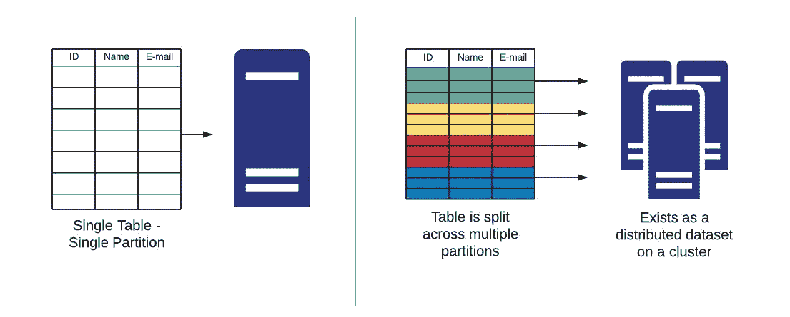
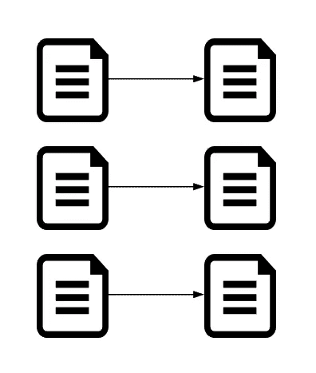
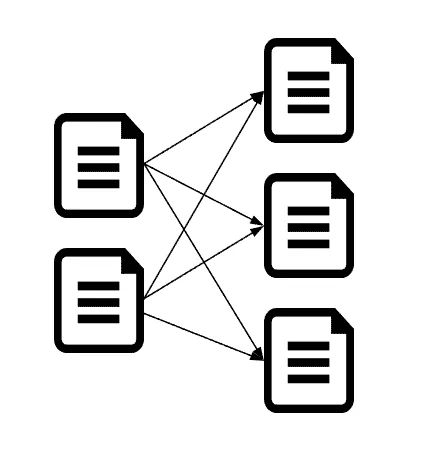
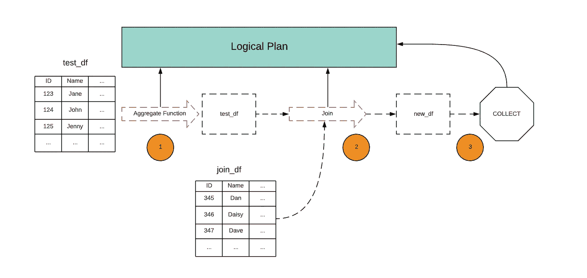

# Spark & Databricks:我前六个月的重要经验

> 原文：<https://towardsdatascience.com/spark-databricks-important-lessons-from-my-first-six-months-d9b26847f45d?source=collection_archive---------6----------------------->

## [入门](https://towardsdatascience.com/tagged/getting-started)

照片由[克里斯多佛罗拉](https://unsplash.com/@krisroller?utm_source=unsplash&utm_medium=referral&utm_content=creditCopyText)在 [Unsplash](https://unsplash.com/s/photos/spark?utm_source=unsplash&utm_medium=referral&utm_content=creditCopyText) 拍摄

如果你正在阅读这篇文章，那么你可能和我一样，刚刚开始一份新的技术工作，并试图利用 Spark & Databricks 进行大数据操作。虽然 Databricks 的用户界面看起来很友好，但不要被 Spark 复杂的内部工作方式所迷惑；新用户会发现自己陷入了许多陷阱。这些会导致非常低效的编码实践，导致“挂起”操作或令人费解的错误，让你挠头。

在我使用 Spark 的前六个月，我学到了两个非常重要的经验，它们极大地提高了我的代码的性能，并帮助我以面向分布式计算的思维方式进行编程。我想与你分享这些经验，以帮助你发展自己的理解，并可能帮助你快速解决你目前在工作中可能面临的一些问题。

我将通过造成的问题、背后的一些理论以及一些实际使用的例子来说明这些教训，这些例子可以帮助理解这些常见的 Spark 问题。

# 1.了解分区

***1.1 问题***

也许 Spark 对于数据处理最重要的特性是它的数据帧结构。例如，这些结构可以以类似于 Pandas 数据帧的方式访问，并支持 Pyspark API 接口，使您能够执行大多数相同的转换和功能。

然而，像对待熊猫数据帧一样对待 Spark 数据帧是一个常见的错误，因为这意味着 Spark 强大的并行性没有得到充分利用。虽然您可能正在与 Databricks 笔记本中的 DataFrame 变量进行交互，但这并不作为单个对象存在于单个机器中，事实上，数据的物理结构在表面之下有着巨大的差异。

当你第一次开始使用 Spark 时，你可能会发现一些操作花费了过多的时间，而你却觉得应用了一个非常简单的操作或转换。帮助解决这个问题和认真理解 Spark 的一个关键经验是了解数据的**分区**以及这些分区在物理领域中是如何存在的，以及如何对它们应用操作。

***1.2 理论***

Databricks 下面是 Apache Spark，这是一个统一的分析引擎，专为大规模数据处理而设计，其性能比现在有些过时的 Hadoop 高 100 倍。它利用集群计算框架，使工作负载能够跨多台机器分布并并行执行，与使用单台机器进行数据处理相比，速度大大提高。

> 分布式计算是数据处理领域最大的突破，因为单台机器计算能力的限制迫使我们向外扩展，而不是向上扩展。

然而，尽管 Spark 非常强大，但必须正确使用它，才能从大数据处理中获得最大收益。这意味着改变你的思维模式，从你可能在一台机器上处理单个文件中的单个表，到这种大规模分布式框架，在这种框架中并行性是你的超能力。

在 Spark 中，您将经常处理数据帧形式的数据，这是一种直观且易于访问的结构化 API，位于 Spark 的核心专业和基本数据结构(称为 RDDs(弹性分布式数据集))之上。这些是跨机器划分的数据的逻辑集合(**分布式**)，并且可以从一组逻辑操作中重新生成，即使集群中的一台机器出现故障(**弹性**)。Spark SQL 和 PySpark APIs 使得对这些语言有经验的开发人员非常容易与这些底层数据结构进行交互，但是，这可能会导致一种错误的熟悉感，因为底层数据结构本身是如此不同。

Spark 中常见的分布式数据集并不存在于单个机器上，而是以分区的形式作为 rdd 跨多个机器存在。因此，尽管您可能正在与 Databricks UI 中的数据帧进行交互，但这实际上代表了跨多台机器的 RDD。随后，当您调用转换时，关键是要记住这些不是全部本地应用于单个文件的指令，而是在后台，Spark 正在优化您的查询，以便这些操作可以在所有分区上以最有效的方式执行([解释 Spark 的 catalyst 优化器](https://blog.bi-geek.com/en/spark-sql-optimizador-catalyst/))。

图 1 —分区数据集(图片由作者提供)

以图 1*中的分区表为例，如果在这个表上调用了一个过滤器，驱动程序实际上会向每个工作器发送指令，在将结果组合在一起形成最终结果之前，并行地对每个彩色分区执行过滤。正如您所看到的，对于一个划分为 200 多个分区的巨大表，与过滤单个表相比，速度优势将是巨大的。*

*RDD 拥有的分区数量决定了 Spark 在处理它时能够达到的并行度。这意味着 Spark 可以为 RDD 拥有的每个分区运行一个并发任务。虽然您可能正在使用一个 20 核集群，但是如果您的数据帧只作为一个分区存在，那么您的处理速度将不会比由单台机器执行的处理速度更快，并且 Spark 的速度优势也不会被观察到。*

****1.3 实际用法****

*这种想法一开始可能会令人困惑，需要将思维模式转变为分布式计算。通过转换你的思维模式，你就可以很容易地明白为什么有些手术会比平时花费更长的时间。一个很好的例子就是**窄**和**宽**变换之间的差异。窄转换是一种单个输入分区映射到单个输出分区的转换，例如在`.filter()/.where()`中，根据给定标准搜索每个分区，最多输出一个分区。*

**

*图 2 —窄转换映射(图片由作者提供)*

*宽变换是一种代价更高的操作，在 Spark 中有时被称为**洗牌**。洗牌违背了 Spark 的精神，即应该不惜一切代价避免移动数据，因为这是任何数据处理中最耗时和最昂贵的方面。然而，对于许多实例来说，显然有必要进行大范围的转换，比如在执行`.groupBy()`或 join 时。*

**

*图 3—广泛的转换映射(图片由作者提供)*

*在狭义转换中，Spark 将执行所谓的流水线操作，这意味着如果对数据帧应用多个过滤器，那么这些操作都将在内存中执行。这对于大范围转换来说是不可能的，这意味着结果将被写入磁盘，导致操作速度大大降低。*

*这个概念迫使您仔细考虑如何使用您正在处理的数据实现不同的结果，以及如何在不增加不必要开销的情况下最有效地转换数据。*

*也有一些实用的方法可以让您利用分区为自己带来好处。其中包括`.partitionBy()`和`.repartition()` ( [这篇](https://mungingdata.com/apache-spark/partitionby/)文章解释了这两者)。通过控制表中使用的分区的大小和形式，操作速度可以呈指数级增长(想想 SQL 中的索引)。这两种操作都会增加进程的开销，但是通过对给定的一列或一组列进行分区，过滤器会变得更快。如果您知道某个列将被广泛用于过滤，这将是非常有益的。*

# *2.火花懒…真的懒！*

**2.1 问题**

*作为一个新用户，Spark 最令人沮丧的特性无疑是 Spark 的懒惰评估，因为它违背了你以前在编程中认为理所当然的一切。许多开发人员花了很多时间在代码编辑器中，设置断点并单步调试代码，以了解随着代码逻辑顺序的进展，每一步发生了什么。类似地，在 Jupyter 笔记本中，很容易运行每个单元格，了解变量的确切状态以及过程是否成功。*

*这样做的问题是，当你在 Jupyter 中调用 Pandas 数据帧上的某个转换时，这是即时执行的，转换后的变量位于内存中，用户可以随时访问。相反，在 Spark 中，转换不是一被调用就被应用的；相反，转换被保存，并且一个转换的*计划被建立起来，只在需要的时候才被应用。**

*对于新用户来说，这可能会导致以下令人困惑的情况:*

*   *DataBricks 单元中的复杂操作只需几毫秒。*
*   *代码在意外点退出并出现错误。*

**2.2 理论**

*这一特性被称为**惰性评估**，虽然 Spark 的这一特性很难适应，但它实际上是使 Spark 如此快速的关键设计特性之一，并号称比 Hadoop 等技术快 100 倍。移动数据的计算开销很大，如果每次转换后都必须将中间表写入磁盘，那么整个过程将会花费很长时间——尤其是对于大型表。*

*在 Spark 中，有两种不同类型的操作可以调用:**转换**和**动作。**转换顾名思义，可以应用于数据帧的任何转换，以某种方式修改数据帧，从而以不同的形式呈现数据。Spark 的不同之处在于，当这些转换发生时，Spark 不是实际应用必要的计算，而是建立一个优化的物理计划，准备在调用**动作**时执行您的代码。动作是一个命令，如`.count(), .collect() or .save()`，它实际上需要计算数据。*

*流程如下:*

> *1.编写数据帧/数据集/SQL 代码。*
> 
> *2.如果该代码有效，则代码被转换成一个**逻辑计划**(逻辑操作)**。***
> 
> *3.Spark 将这个逻辑计划转换为物理计划(这些操作将如何在集群上执行)**。***
> 
> *4.Spark 然后在集群上执行这个物理计划(RDD 操作)(当调用**动作**时)。*

*这个过程允许 Spark 在实际运行任何代码之前在计划中执行优化。这包括诸如**谓词下推**之类的操作，其中在代码中的一组转换的末尾应用的过滤器被推到物理计划的前面，以确保转换被应用于更小的数据集，因此更快。*

**2.3 实际用法**

*在实践中，这个问题经常在简单的操作中表现出来，通常在对数据帧或 RDD 应用了一长串转换之后，在运行时导致大的难以消化的错误。这使得 Spark 对于新用户来说很难调试，因为很难确定哪个确切的操作导致了操作管道的失败，因为典型的调试方法，如打印语句和断点，在它们相交的代码没有实际执行时就失去了所有意义。*

**

*图 4 —示例流程(图片由作者提供)*

*以*图 4* 为例。在这个简单的管道中，在调用 collect **动作**之前，将一个聚合函数应用于 test_df，然后连接到第二个 df ( **转换**)。如前所述，转换将用于生成逻辑(然后是物理)计划，该计划将在需要时执行。然而，在阶段 1，转换后的数据帧并不存在——它仅仅是您希望数据看起来像什么的一个想法；这意味着在这个阶段应用的任何打印或成功检查实际上并不是测试代码是否成功，它们只是断言逻辑计划已经被创建。*

*对于 *new_df* 也是如此，因为这个表的连接只是逻辑计划中的另一个步骤——所以在这个阶段，您不能肯定地说代码是否成功，尽管它可能在数据块中显示为成功。这个想法也解释了为什么在 Databricks 单元格中联接两个有数百万(或更多)行的表只需要一秒钟:因为它只是将这一步添加到计划中。*

*但是，当我们进入阶段 3 并调用 collect 时，创建的物理计划将在集群上执行，所有需要的操作都将发生。在这一点上，如果任何实际操作无效，就会抛出错误。*

> *记住，逻辑计划只检查代码是否有效，物理计划的执行将揭示操作中的错误。*

*在上面的简单示例中，您可能会看到追溯错误的源头是多么容易，但是，在长管道中，这可能会变得非常复杂，尤其是当物理计划可能不遵循与逻辑计划相同的顺序时。*

*为了克服这个问题并有效地调试，有必要在创建巨大的管道之前隔离操作并进行彻底的测试，因为这只会在您开始读写数据时导致问题。除此之外，生成小的测试数据集来测试函数和操作的预期行为是非常有益的。如果为了测试你的功能，你不得不读入大量的表格并将它们收集到驱动程序中，这将大大增加你的调试时间。*

# *结论*

*总之，Spark 是一个了不起的工具，它使大规模数据处理比以往任何时候都更快、更简单。尽管它需要改变思维方式才能恰当地利用它，但如果没有其他原因，只是为了实现其巧妙的设计，它绝对值得更深入地了解其内部工作方式。*

*对于 Spark 来说，理解它是如何在引擎盖下工作的肯定是有用的，因为它与正在使用的任何其他技术都是如此不同。在使用 Spark 时，由于 Databricks 提供了如此低的准入门槛，很容易在早期就开始使用不良实践，从而导致大量集群账单和长运行时间。但是，通过一些教育，它的潜力可以被真正地开发出来，并将导致效率和性能的巨大改善。*