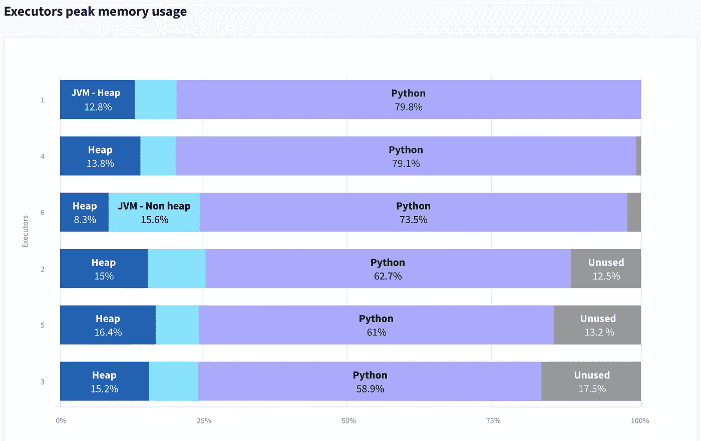

# 数据力学的喜悦——我们正在构建一个更好的 Spark UI

> 原文：<https://towardsdatascience.com/spark-delight-were-building-a-better-spark-ui-1b463840e243?source=collection_archive---------35----------------------->

## “Spark UI 是我最喜欢的监控工具”——从来没有人这么说过。

我们的 Spark UI 替代原型正在运行。

Apache[Spark UI](https://spark.apache.org/docs/3.0.0-preview/web-ui.html),[Apache Spark](https://www.datamechanics.co/apache-spark)附带的开源监控工具是 Spark 开发者用来了解他们的应用性能的主要界面。然而，它也产生了许多挫折。我们不断从 Apache Spark 初学者和专家那里听到这样的话:

*   *《很难理解是怎么回事》*
*   *“即使有关键信息，它也隐藏在许多只有专家才知道如何导航的嘈杂信息后面”*
*   *“这涉及到很多部落知识”*
*   *“Spark 历史服务器很难安装”*

因此，我们的团队已经开始用一些令人愉快的东西取代 Spark UI 和 Spark History Server，这是一个免费的、跨平台和部分开源的工具，名为[**Data Mechanics Delight**](https://www.datamechanics.co/delight)。

**更新(2021 年 4 月):** [**Delight 已经正式发布！**](https://www.datamechanics.co/blog-post/delight-the-new-improved-spark-ui-spark-history-server-is-now-ga) 它可以在任何 Spark 平台上工作:Databricks、EMR、Dataproc、HDInsight、CDH/HDP、Kubernetes 开源上的 Spark、Spark-on-Kubernetes operator、开源 spark-submit 等。
******】**[**在 Github 上查看或开源代理**](https://github.com/datamechanics/delight)**】******

# ****现在的 Spark UI 有什么问题？****

********

****熟悉的 Spark 用户界面(工作页面)****

****很难鸟瞰正在发生的事情。****

*   ****哪些工作/阶段花费了大部分时间？它们如何与我的代码匹配？****
*   ****是否有稳定性或性能问题很重要？****
*   ****我的应用程序的瓶颈是什么(I/O 限制、CPU 限制、内存限制)？****

******Spark UI 缺乏基本的节点指标(CPU、内存和 I/O 使用)。******

*   ****你可以不带他们去，但你会走在黑暗中。改变一个实例类型将是一个信念的飞跃。****
*   ****或者你需要建立一个独立的指标监控系统:Ganglia、Prometheus + Grafana、StackDriver (GCP)或 CloudWatch (AWS)。您需要在这个监控系统和 Spark UI 之间来回切换，试图匹配两者之间的时间戳(通常在 UTC 和您的本地时区之间切换，以增加乐趣)。****

******Spark 历史服务器(在应用程序完成后呈现 Spark UI)很难设置。******

*   ****您需要将 Spark 事件日志保存到长期存储中，并经常自己运行它，这会产生成本和维护负担。****
*   ****加载时间很长，有时会崩溃。****

# ****数据力学的喜悦会是什么样子？****

****一张图胜过千言万语:****

********

****我们的 Spark UI 替代品的原型。让我们知道您的反馈！****

****那么它有什么新鲜之处呢？主屏幕(概览)有许多新的信息和视觉效果。****

******汇总统计******

********

****应用程序的持续时间是多少，使用的资源量(CPU 正常运行时间)，所有 Spark 任务的持续时间(应该接近您的 CPU 正常运行时间，除非您遇到了糟糕的并行性或长时间的纯驱动程序工作/空闲)。****

******建议******

********

****本节从高层次上指出了稳定性和性能问题，以帮助开发人员解决这些问题。示例:****

*   ****"与可用的 CPU 核心数(400)相比，默认的任务数(200)太小。将***spark . SQL . shuffle . partitions***增加到 1200。”****
*   ****“作业 4 遭受输入数据偏斜。请考虑对您的数据进行重新分区或对分区键加盐”。****
*   ****在 Python 使用了 85%的内存的情况下，由于阶段 7 中的内存不足错误，执行器崩溃，请考虑增加每个执行器的可用内存或设置***spark . executor . py spark . memory***。****

****本节基于 Data Mechanics 平台的功能，根据其历史自动调整基础架构参数和 Spark 配置(例如，实例类型、内存/cpu 分配、并行性配置、shuffle、I/O)。这种高层次的反馈将通过帮助开发人员理解和优化他们的应用程序代码来补充平台的无服务器特性。****

******执行器 CPU 使用率******

********

******‍** 你的 executor CPU 内核平均在做什么？如果有大量未使用的时间，可能是你的应用过度配置了。如果他们花费大量时间进行洗牌(所有对所有的数据通信)，那么值得看看是否可以避免一些洗牌，或者调整洗牌阶段的性能。此屏幕应能让您快速了解您的应用是受 I/O 限制还是受 CPU 限制，并相应地做出更智能的基础架构更改(例如，使用具有更多 CPU 或更快磁盘的实例类型)。****

****这个屏幕的伟大之处在于，你可以直观地将这些信息与你的应用程序的不同火花阶段对应起来。如果你的应用程序大部分时间花在单一洗牌阶段，你可以在一秒钟内发现这一点，只需点击一下就可以进入特定阶段。****

******执行者峰值内存使用量******

********

****这个屏幕显示了总内存消耗达到峰值时每个执行器的内存使用情况。您将立即看到您是否接近了内存限制(勉强避免了内存不足的错误)，或者您是否有足够的腿部空间。Data Mechanics Delight 为您提供了 JVM 使用的不同类型的内存和 python 内存使用的划分。这些数据是至关重要的，但据我们所知，Spark 开发人员目前还没有获得这些数据的简单方法。‍****

******阶段和执行者页面******

********

****然后，您可以在 Spark stage 页面或 executor 页面上以更精细的粒度找到类似的信息。例如，在一个特定的阶段页面上，您将看到显示该阶段中所有任务的指标分布(例如，持续时间或输入大小)的图表，因此您可以立即直观地注意到是否存在偏差。查看动画 GIF 以获得完整的游览。****

## ****有什么不新鲜的？****

****Spark UI 也有许多视觉效果非常好。我们的目标是不要放弃一切。相反，我们希望 Data Mechanics 包含与当前 Spark UI 一样多的信息。我们计划重用许多元素，比如作业、阶段和任务的列表、说明在一个阶段内跨执行者调度的任务的甘特图、DAG 视图等等。****

# ****在实践中，如何使用数据机制来调试？****

****我们将使用我们最近遇到的一些客户的两个具体场景。****

## ****并行性问题****

****我们的一个客户正在运行一个有 10 个执行器的应用程序，每个执行器有 8 个 CPU 内核，这样这个应用程序可以并行运行 80 个 Spark 任务。但是一名开发人员将***spark . SQL . shuffle . partitions***配置设置为 8，因此在洗牌期间只生成了 8 个任务，这意味着 90%的应用资源未被使用。这种配置是一个错误(可能是在本地开发期间设置的)，但事实是，这个关键问题在当前的 Spark UI 中完全没有出现，除非您非常清楚在哪里可以找到它。从数据力学的角度来看，问题是显而易见的:****

********

****这张图表显示了一段时间内平均执行器 CPU 使用率，显示了由于糟糕的并行性，存在大量未使用的容量，尤其是在应用程序的最后几个作业和阶段。****

****这个并行性示例可能看起来像是故意的，但请注意，它比您想象的更常见——当默认值(200)与总应用程序容量相比太小时，或者当输入数据被错误分区时(这需要进行更多的配置更改才能修复)，也会发生这种情况。****

## ****记忆问题****

****在 Apache Spark 中，内存错误是最常见的崩溃来源，但它们有不同的种类。JVM 可以得到一个 OutOfMemory 错误(意味着堆达到了它的最大大小，需要分配更多的空间，但即使在 GC 找不到任何空间之后)，这可能由于许多原因而发生，例如不平衡的洗牌、高并发性或缓存的不当使用。另一个常见的内存问题是当一个 Spark 执行器由于超出内存限制而被杀死时(被 Kubernetes 或 YARN 杀死)。这在使用 PySpark 时经常发生，因为 Spark 执行器将为每个正在运行的任务生成一个 python 进程。****

********

****这个峰值使用时的执行器内存分解图显示 Python 进程使用了大部分分配的容器内存。****

****很少有监控工具可以让您看到 JVM(堆和非堆)和 Python 的内存使用情况，但是这些信息对于稳定性是至关重要的。在这个截图中，我们可以看到内存使用率最高的执行器非常接近极限。****

****PySpark 用户在监控内存使用时经常一无所知，我们希望这个新界面对他们有用，并避免可怕的 OOM-kills。****

# ****数据力学快乐是如何工作的？****

****Data Mechanics Delight 由两个主要部分组成:****

*   ****一个运行在你的 Spark 应用程序内部的[开源](https://github.com/datamechanics/delight)代理。这个代理将把 Spark 事件日志从您的 Spark 应用程序传输到我们的后端。****
*   ****一个闭源后端，由实时日志接收管道、存储服务、web 应用程序和身份验证层组成，以确保其安全性。****

# ****我该如何开始？****

****Data Mechanics 是一个云原生 Spark 平台，致力于为数据工程师提供易于使用且经济高效的 Spark。了解更多关于[的信息，我们的平台以开源方式](https://www.datamechanics.co/blog-post/spark-on-kubernetes-made-easy-how-data-mechanics-improves-on-spark-on-k8s-open-source)在 Kubernetes 上运行 Spark 的基础上增加了什么。我们的核心特性之一是，我们的平台自动调整基础设施参数和 Spark 配置，使 Spark 管道更加稳定和高效。****

****Data Mechanics Delight 通过向 Spark 开发人员提供他们在应用程序代码级别开发、生产和维护稳定且高性能的应用程序所需的高级反馈，补充了我们的平台，例如，了解何时使用缓存，了解何时对输入数据进行重新分区，因为您会遇到偏差等问题。****

******更新(2021 年 4 月):** [**Delight 已经正式发布！**](https://www.datamechanics.co/blog-post/delight-the-new-improved-spark-ui-spark-history-server-is-now-ga) 它可以在任何 Spark 平台之上工作:Databricks、EMR、Dataproc、HDInsight、CDH/HDP、Kubernetes 开源上的 Spark、Spark-on-Kubernetes operator、开源 spark-submit 等。
******】**[**在 Github 上查看或开源代理**](https://github.com/datamechanics/delight)**】**********

*****这篇博文原载于* [*数据力学博客*](https://www.datamechanics.co/blog-post/building-a-better-spark-ui-data-mechanics-delight) *。*****