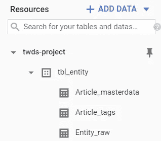

# Kubernetes Docker 中的 Spark:一种可扩展 NLP 的实用方法

> 原文：<https://towardsdatascience.com/spark-in-docker-in-kubernetes-a-practical-approach-for-scalable-nlp-9dd6ef47c31e?source=collection_archive---------12----------------------->

## 使用谷歌云平台的 Kubernetes 引擎的自然语言处理


图片由 Free 提供-照片来自 Pixabay

本文是一个更大项目的一部分。如果您也对可伸缩的 web 抓取或构建高度可伸缩的仪表板感兴趣，您会在本文末尾找到相应的链接。

# 目录

1.  [读者必备](#fff0)
2.  [简介](#30a0)
    [2.1 本项目目的](#30a0)
    [2.2 可扩展 NLP 简介](#bbe0)
3.  [架构](#61f5)
4.  [设置](#27dd)
5.  [如何在 Python 中使用 Spark-NLP](#0f7a)
    [5.1 概述](#0f7a)
    [5.2 Spark-NLP](#038f)
    [5.3 构建 Docker](#18aa)
6.  [部署到 Kubernetes](#9960)
    [6.1 设置 Kubernetes 集群](#9960)
    [6.2 设置 Redis 为 kubernetseservice](#ca50)
    [6.3 用任务填充 Redis 队列](#55e6)
    [6.4 部署 Docker 容器](#f59a)
    [6.5 检查结果](#9e45)

# 1.读者的先决条件

该项目是在谷歌云平台上开发的，建议也在那里做教程。然而，您可以在本地机器上运行它，但是您需要修改代码并替换一些已使用的资源。

本文的目标读者是已经对 Google 云平台和 Linux shell 有所了解的读者。为了帮助新读者入门，可以在本文中找到其他资源的链接。如果你没有使用过 Google Cloud Plattform，你可以使用 Google 的免费试用程序。

# 2.介绍

## 2.1 本项目的目的

本文的目标是展示实体(例如 Docker、Hadoop 等)如何。)可以使用 NLP 以可扩展的方式从文章中提取(基于 TowardsDatascience 的结构)。我们还将看看如何使用其他自然语言处理方法，如词性标注。

## 2.2 可扩展自然语言处理简介

**自然语言处理(NLP)** 自然语言处理使机器能够理解自然语言的结构和意义，并允许它们识别文本中的模式和关系。

为什么它应该是可扩展的？
书面语言的处理可能非常复杂，如果没有可扩展的架构，可能需要很长时间。当然，您可以升级任何系统并使用更快的处理器，但这样做的成本增加与实现的效率收益不成比例。最好选择一种能够将计算负载分布在几台机器上的体系结构。

**Apache Spark**
Spark 是一个让数据处理和机器学习可扩展的好方法。它可以在本地或集群上运行，使用分布式数据集和处理管道。关于 Spark 的更多信息可以在这里找到:

[](/introduction-to-apache-spark-207a479c3001) [## Apache Spark 简介

### MapReduce 和 Spark 都用于大规模数据处理。然而，MapReduce 有一些缺点…

towardsdatascience.com](/introduction-to-apache-spark-207a479c3001) 

Spark-NLP 是一个 Python 和 Scala 的库，允许用 Spark 处理书面语言。这将在后面的章节中介绍。更多信息可在此处找到:

[](/introduction-to-spark-nlp-foundations-and-basic-components-part-i-c83b7629ed59) [## Spark NLP 简介:基础和基本组件

### 为什么我们需要另一个 NLP 库？

towardsdatascience.com](/introduction-to-spark-nlp-foundations-and-basic-components-part-i-c83b7629ed59) 

**Redis** Redis 是一个键值存储，我们将使用它来构建任务队列。

**Docker 和 Kubernetes** Docker 容器可以想象成一个盒子里的完整系统。如果代码在容器中运行，它就独立于宿主的操作系统。这限制了 Spark 的可伸缩性，但可以通过使用 Kubernetes 集群来弥补。这些集群可以通过容器的数量快速轻松地扩展。如果您想了解更多信息，请访问:

[](https://blog.containership.io/k8svsdocker/) [## Kubernetes？码头工人？有什么区别？

### 从远处看，Docker 和 Kubernetes 可以看起来是类似的技术；它们都可以帮助您运行应用程序…

blog.containership.io](https://blog.containership.io/k8svsdocker/) 

# 3.体系结构

首先，这是我们的架构的样子:


用于可伸缩文本处理的体系结构

如您所见，这种方法是批处理架构。Python 脚本处理存储在 Google Datastore 中的文本，并创建一个作业队列。这个队列将由 Kubernetes pods 处理，结果将被写入 BigQuery。

为了使本教程尽可能简短，只对计算量更大的语言处理部分进行缩放。任务队列创建器是一个简单的 Python 脚本(也可以在 Docker 中运行)。

# 4.设置

## 启动谷歌云外壳

我们将与谷歌的云控制台合作。要打开它，您需要创建一个项目并激活计费。

然后你应该会看到右上角的云壳按钮。

点击后，外壳应该在窗口的下半部分打开(如果遇到麻烦，使用 Chrome 浏览器)。为了更好地使用 shell，我建议启动编辑器:


## 获取存储库

您可以使用以下命令下载[存储库](https://github.com/Juergen-Schmidl/TWD-01-2020):

```
git clone [https://github.com/Juergen-Schmidl/TWD-01-2020.git](https://github.com/Juergen-Schmidl/TWD-01-2020.git)
```

和必要的模型模板:

```
$cd TWD-01-2020/5_NLP$bash get_model.sh &
*Your Cloud Shell may freeze, try reconnecting after a few minutes*
```

## 将项目 ID 设置为环境变量

由于我们在很多情况下都需要项目 ID，因此将其设置为环境变量更容易。请注意，如果您在本教程中中断了 shell，您必须再次设置它。您可以使用以下方式查找 ID 为的项目:

```
$gcloud projects list
```

请运行:

```
$export Project="yourprojectID"
```

## **获取您的服务账户**

您经常需要服务帐户的密钥。要了解如何创建一个，你可以阅读[这个](https://cloud.google.com/iam/docs/creating-managing-service-account-keys?hl=en#iam-service-account-keys-create-console)。我更喜欢使用 IAM web 界面的方法，但是还有很多方法。为了简单起见，它应该被赋予“编辑器”的角色，但是从长远来看，建议进行更精细的调整。之后，执行以下步骤:

*   以 JSON 文件的形式下载密钥
*   将您的密钥重命名为 sa.json
*   在每个目录中放置一个副本(4_Setup，5_NLP，6_Scheduler)

您的目录现在应该如下所示:


**设置输入-数据:**
(如果你已经完成了项目的[第一部分，可以跳过这个。)](https://medium.com/@Postiii/9c0c23e3ebe5)

我们在数据存储模式下使用 Google Cloud Datastore 来提供源数据。为了准备数据存储，您必须将其置于数据存储模式。为此，只需在云平台中搜索数据存储，然后单击“选择数据存储模式”。(如果需要，也选择一个位置)

之后，将目录更改为 4_Setup 并运行:

```
$cd .. ; cd 4_Setup
*(You may have to enter this command manually)*$python3 Create_Samples.py
```

如果您看到“Samples generated”，那么您的云数据存储中有 20 个样本条目。

**设置输出表** 为了存储处理后的数据，我们创建了几个 BigQuery 表。我们使用下面的 bash 脚本来实现这一点:

```
$bash Create_BQ_Tables.sh
```

如果创建了所有的表，我们就成功地创建了所有需要的资源。

# 5.如何使用 Spark-NLP

## 5.1 概述

NLP 模块位于存储库文件夹“5_NLP”中。请移动到这个目录(使用 shell)。文件夹中应包含以下文件:

*   [**explainer . py**](https://github.com/Juergen-Schmidl/TWD-01-2020/blob/master/5_NLP/Explainer.py)主脚本。在这里，Spark 将被启动，管道将被创建并用管道模型填充。文本处理也在这里进行。
*   [**Model _ template . zip**](https://drive.google.com/open?id=1l_ZZMfZpe1YdLMDkgaLJ9ZTEhQ8086oP)
    从文本中提取实体，即专有名称的示例模型。
*   **sa.json**
    你的谷歌云服务账户。如果遇到 404 或 403 错误，请检查 IAM 中为此服务帐户授予的权限。
*   [**Dockerfile**](https://github.com/Juergen-Schmidl/TWD-01-2020/blob/master/5_NLP/Dockerfile)
    这个文件包含了为环境设置的脚本。确切的设置解释如下。
*   [**requirements . txt**](https://github.com/Juergen-Schmidl/TWD-01-2020/blob/master/5_NLP/requirements.txt)
    该文件包含所需的 Python 库，这些库是在创建 Docker 映像的过程中安装的。
*   [**explainer . YAML**](https://github.com/Juergen-Schmidl/TWD-01-2020/blob/master/5_NLP/Explainer.yaml)
    这个文件包含了 Kubernetes 应该如何处理 Docker 图像的信息。

## Python 中的 5.2 Spark-NLP

如上所述，spark-nlp 是一个允许我们在 spark 中处理文本的库。为此，我们将该库与 Python 脚本“Explainer.py”一起使用。我对代码做了大量的注释，所以我在这里只讨论几个部分:

首先，您可能需要指定您的服务帐户文件的名称(如果您还没有坚持 sa.json):

脚本的入口点使用 [Peter Hoffmann 的](http://peter-hoffmann.com/2012/python-simple-queue-redis-queue.html) Redis 类定期向 Redis 实例查询任务队列中的新条目。我们还没有设置实例，所以脚本还不能工作。

一旦任务到达任务队列，就调用“解释”函数，在那里进行处理。

正如您所看到的，实际的逻辑位于存储在(self)中的模型中。型号)。这个模型包含了自然语言处理的所有重要步骤，比如标记化、词汇化或者实体标注，并且是用函数 Load_Model()从一个 ZIP 文件中解压出来的。自己搭建模型，请参考本[笔记本](https://colab.research.google.com/drive/1QlHLvO2tLY-MXS5MxBPs_ahm6vgtO_LC):

## 5.3 建造码头

Python 文件需要一个工作的 Spark 环境。为了提供这种环境，使用 docker 文件创建 docker 容器。我们的 docker 文件如下所示:

docker 文件允许我们使用一个文件创建一个完整的系统。最重要的命令是:

**从:**设置基础图像。基本映像可以是本机操作系统，但可能已经安装了其他程序。

Spark 需要一些环境变量来工作。使用 ENV 命令，这些是为 Docker 容器设置的。

**COPY and WORKDIR** : COPY 将 docker 文件的整个父目录复制到容器中，WORKDIR 将该目录设置为工作目录。

**运行:**调用在 Docker 容器外壳中执行的命令。通常用于安装应用程序。

**CMD:** 一个 docker 文件只能有一个 CMD，这里调用实际的 Python 脚本。u 操作符对于从容器中获取日志非常重要。

要构建 Docker 文件，请将目录切换到“5_NLP”并执行以下命令:

```
$docker build --tag explainer_img .
*(You may have to enter this command manually)*
```

这个命令从这个目录中的 Docker 文件构建 Docker 映像。我们还不能启动它，因为 Redis 实例没有运行，但是我们已经成功地创建了映像。

为了稍后在 Kubernetes 集群上运行它，我们必须将映像推入容器注册中心。为此，请使用 Google 云平台激活 API，并搜索“容器注册表”。然后，运行以下命令:

```
$docker tag explainer_img gcr.io/$Project/nlp_explainer:latest$docker push gcr.io/$Project/nlp_explainer:latest
```

现在，您应该能够在容器注册表中看到您的文件了:


如果到目前为止这是有效的，那么我们现在可以转移到 Kubernetes 集群，让这个项目发挥作用。

# 6 次部署到 Kubernetes

## 6.1 建立 Kubernetes 集群

这部分非常简单，因为 Google 允许我们通过命令行创建一个 Kubernetes 集群。您可以运行这个命令来创建一个非常小的集群。

```
$bash Create_Cluster.sh
```

创建可能需要几分钟时间。如果您想创建一个更大的集群，请查看 Google Cloud Plattform 上的 Kubernetes 引擎。如果您使用 Kubernetes 引擎的 web 界面创建了集群，那么最初需要将您的控制台连接到集群。您可以通过点击“连接”来获得该声明:


## 6.2 将 Redis 设置为 Kubernetes 服务

首先，我们必须使 Redis 在 Kubernetes 集群上可用，并将其注册为服务。这是必要的，因为容器是彼此隔离运行的。如果一个容器被注册为服务，所有容器都可以连接到它。

为此，Redis 容器必须从位于“6_Scheduler”文件夹中的. yaml 文件创建。运行:

```
$kubectl create -f redis-master-service.yaml
```

并将其注册为服务(来自另一个。yaml 文件):

```
$kubectl create -f redis-master.yaml
```

如果你仔细看看。yaml 文件，您将看到您可以指定所有需要的设置。行“replicas:”特别重要，因为它的值定义了并行实例的数量，因此也定义了处理数据的能力(当然受到底层机器的限制)。

我们在一台相当小的机器上工作，所以我们不应该创建一个以上的副本。

如果创建成功，您应该会看到以下输出:

```
$kubectl get pods
```


这是包含 Redis 的豆荚

```
$kubectl get services
```


在这里，您可以看到为其他 pod 提供连接的服务

## 6.3 用任务填充 Redis 队列

现在我们已经设置了 Redis 实例，我们可以开始用任务填充它了。首先，我们需要建立与 Redis 服务的本地连接。为此需要以下命令:

```
$kubectl port-forward deployment/redis-master 6379 &
```

然后我们必须在本地机器上安装 Redis:

```
$sudo pip3 install redis
```

之后，可以调用 Python 脚本。它从云数据存储中检索数据，对其进行预处理，并将其放入 Redis 任务队列中。
您可以使用以下命令启动脚本:

```
$python3 Scheduler.py
```

该脚本已被详细注释，因此我仅提及几点:

“过程批处理”方法包含实际的逻辑。在这里，文章被成批地从云数据存储中读取，并被传递给“Send_Job”方法。

因为 Redis 不喜欢特殊字符，所以这些字符被删除以确保顺利处理。

然后，创建的作业存储在 Redis 数据库中。发布命令。

注意:检查我们是否需要调用 regex 方法比替换快 10 倍。如果在填充数据存储时已经考虑了特殊字符，那么调度器的工作速度会快得多。


执行时间的比较

您应该会看到以下输出:


任务队列已满

之后不要忘记终止端口转发:

```
$pkill kubectl -9
```

## 6.4 部署 Docker 容器

您已经在 5.3 中为 explainer 创建了 docker 容器，并将其推送到名为“`gcr/[your Project]nlp_explainer:latest`”的云容器注册表中。我们现在将在 Kubernetes 集群上部署它。

为此，将再次使用包含 Kubernetes 所有相关信息的. yaml 文件。

**请注意，你必须从注册表中插入你自己的容器(图片:)！**

来推动。yaml 文件，您只需要在“5_NLP”文件夹中执行以下命令:

```
$kubectl create -f Explainer.yaml
```

如果您使用小型集群，我建议只部署一个副本！
否则你会遇到因表现不佳而导致的问题。

之后，您可以使用以下方式查看 pod:

```
$kubectl get pods
```


根据您的 Explainer.yaml 文件，pod 的数量可能有所不同

创建容器后，您应该使用以下命令获得此结果(可能需要 2 分钟):

```
$kubectl logs [pod-name]for example:
$kubectl logs explainer-544d123125-7nzbg
```


如果出现问题，您还可以在日志中看到错误。

如果所有的事情都被处理了，那么 pod 就会保持空闲，或者被 Kubernetes 驱逐并重新创建(因为它使用了一个循环，并且没有完成)。

要删除所有没有娱乐用途的窗格:

```
$kubectl delete deployments [deployment]for example:
$kubectl delete deployments explainer
```

如果你不想再使用 Kubernetes 集群，你应该通过 web 界面或者使用下面的命令删除它，否则 Google 会继续向你收费。

```
$gcloud config set project $Project
$gcloud container clusters delete [your-clustername] --zone [Zone]for example:
$gcloud config set project $Project
$gcloud container clusters delete "your-first-cluster-1" --zone "us-central1-a"
```

## 6.5 检查结果

要查看结果，请到谷歌云平台，搜索“BigQuery”。

您应该能够在左下方看到以下表格:



“文章 _ 主数据”和“文章 _ 标签”这两个表格是由调度程序创建的，以满足连续项目的需要。但是我们希望看到“Entitiy _ raw”表的内容。

要访问它们，请单击它，然后转到“预览”:


您应该会看到实体识别的结果以及相应的文章 ID。

就这样，你完了！

> 如果您有兴趣了解如何基于这些数据创建一个高度可伸缩的仪表板，我们会很高兴您阅读下面的教程: [*构建一个高度可伸缩的仪表板，它运行在阿诺德·卢奇的 Kubernetes*](https://medium.com/@arnold.lutsch/fa2bc6271f1d) *上*
> 
> 您还可以使用本教程将示例数据替换为真实的文章: [*使用 Selenium 和 python 构建一个可伸缩的 web crawler*](https://medium.com/@Postiii/9c0c23e3ebe5)