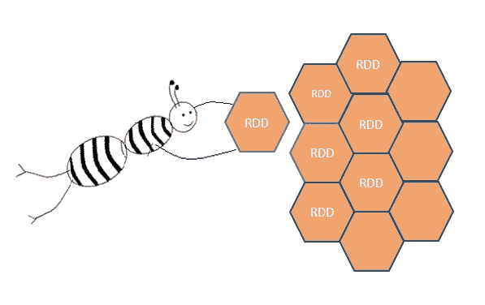
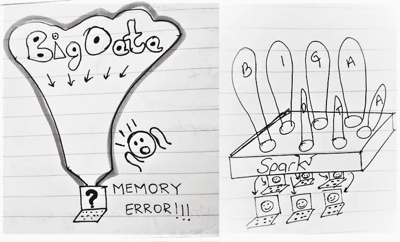
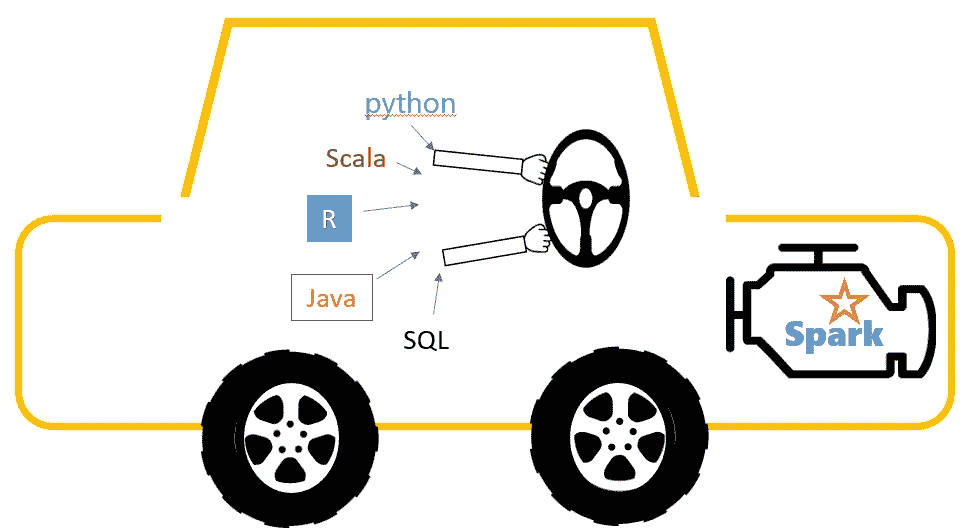
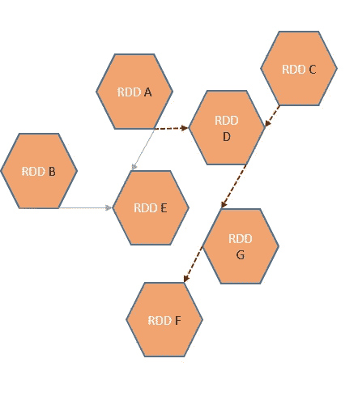
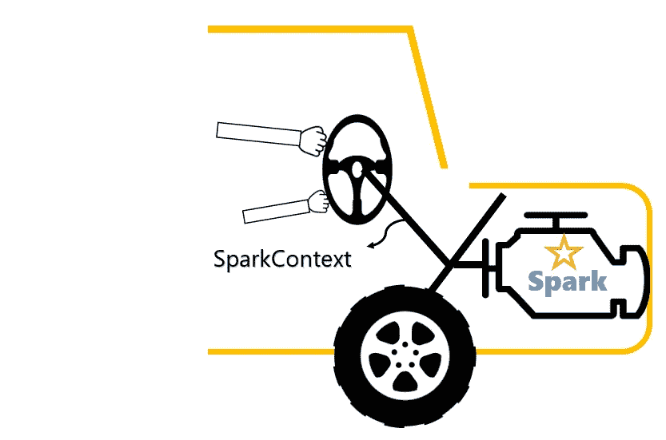

# Python 程序员的 Spark 基础

> 原文：<https://towardsdatascience.com/spark-jargon-for-babies-and-python-programmers-5ccba2c60f68?source=collection_archive---------32----------------------->

## 入门指南

## 你的第一个星火计划需要的一切



作者图片:火花蜜蜂

我是一名 python 程序员，几个月前开始使用 PySpark，并意识到这是一件相当“大”的事情。为了用 spark 编写我的第一个程序，我真的必须努力收集和理解一些基本术语。因此，我决定为我的同龄人编写这个指南。

如果您要从 Python 开始，这是一篇从 PySpark 开始的浓缩文章。它旨在回答初学者的问题，并清除一些行话。

# Spark 基础知识—什么是 Spark？

***Spark 是一款软件应用，通过允许您从多台计算机访问计算资源，使您能够处理大数据。***

**关键词:** *大数据* ***，*** *并行计算，集群计算，分布式计算，容错。*

你可以使用本地计算机和 python(或 excel)来计划你的假期。但是如果你要管理和处理你要去度假的整个国家的火车时刻表，你需要更大的东西。为了做更大的任务，你还需要更大的计算能力。Spark 正好可以做到这一点。它**是一个完整的框架**(不仅仅是一种语言或服务器)，允许你在多台计算机上分布你的数据和处理。



作者图片:火花涂鸦

有了数据、查询语言和一台计算机，作为一名数据科学家，您不得不有效地对数据进行采样，使其在您的处理能力范围内。然后，您会得到“尽可能代表”整个数据集的解决方案。借助基于 Spark 的软件，您可以使用整个有意义的数据集进行分析。这基本上就是为什么整个事情被发明出来——因为*数据，无处不在的数据，而不是一台计算机来处理！*

可供使用的整个计算机网络称为**集群**，网络中的每台计算机称为**节点**。有了 Spark，您不必费心决定哪个节点处理您的处理需求的哪一部分。Spark 隐式地这样做，因此您不必为线程化您的流程流而烦恼。

在 Spark 之前，一个流行的开源库叫做 **Hadoop** 是大数据处理的核心库。由于 Hadoop 的 MapReduce 并行计算编程模型不具备容错能力，并且在并行处理方面有其自身的局限性，因此 Spark 被开发出来，并一直是首选解决方案。

Spark 是一个引擎，可以让你用很多语言编程，比如 R，Python，Scala，Java，SQL 等等。这就是 pySpark 的用武之地。PySpark 使您能够使用 python 语言的 Spark 框架。



作者图解:如果火花是一辆汽车

# 火花行话

**关键词:** *RDD，转换，动作，沿袭，懒惰执行，容错，数据帧，Hadoop 文件系统，Spark 会话，Spark 上下文。*

## RDD:数据框架的构建模块


作者图解:又是火花蜜蜂

rdd 是 Spark 所基于的数据的核心**元素。RDD 的架构赋予 spark 跨多台机器处理它们的能力。**

RDD 代表弹性分布式数据集。它们没有模式(也就是说，不要把它们想象成行列表)。RDD 是分布在不同节点上的一组数据元素。RDD 的名字就是它的定义:

1.  **有弹性:**一旦产生就能抵抗外部变化。这意味着您可以在 RDD 上执行转换来创建新的 RDD，但是原始的 RDD 保持不变。如果您有数据元素 RDD 1 和 RDD 2，并使用两者执行转换，您将得到结果元素 RDD3，而没有更改 1 和 2。注意这与你的熊猫的执行风格有什么不同。在 pandas 中，你可以修改现有的数据帧，然后继续生活。pySpark 不支持这一点。
2.  **分布式:**rdd 被设计成能够分布到多个节点上进行并行数据处理。
3.  **数据集:**它们以列表、元组等形式保存数据。

## 创建 RDD

您可以通过在 Spark 驱动程序中并行化原始数据，或者从外部存储(如)加载数据来创建 RDD。镶木地板、Avro 等。*现在，不要担心示例中的 spark 上下文语句。我们将在以后讨论它。*

*通过并行化原始数据创建 RDD:示例*

```
from pyspark.context import SparkContextsc = sparkContext.getOrCreate( )parallelData = sc.parallelize([1,2,3,4])
```

*从现有文件系统创建 RDD:示例*

您可以从现有文件格式加载 rdd，如 Parquet、Avro、序列文件或纯文本存储(例如。txt，。csv)

```
parallelData = sc.read.parquet(sourcepath+ "filename.parquet")
```

## 惰性执行、转换和沿袭

正如前面所讨论的，rdd 在创建后是不可改变的。但是为了使用它们，您显然需要对数据元素本身进行一些控制。这是通过转换实现的。转换作用于现有的 rdd 并生成新的 rdd，而不改变原来的 rdd。

**动作**是计算后返回一些输出给驱动程序或导出数据存储的点。在 spark 中，当发现**转换**时，不会对其进行评估，但是 spark 会等待，直到对其调用**动作**。

不是执行所有的转换，而是制作一个**沿袭**图，它记录了没有实际数据的 rdd 之间依赖关系的信息。当一个动作被调用时，这个图被计算。



作者图解。谱系图和延迟执行:当在 RDD F 上调用一个动作时，为了到达 RDD F，只执行虚线转换。不相关的转换不被执行。

这就是所谓的懒惰执行。当一个**动作**被发现时，所有且仅相关的转换被立即执行。这节省了时间和内存，否则这些时间和内存将用于计算不相关的变换。

延迟执行的示例:

```
#This is a transformation, it is not performed at this point
parallelData_10 = parallelData.map(lambda x : x*10 )#This is an action, the above transformation is executed only when this line is executedparallelData_10.collect()
```

## 容错

容错是指 RDD 在集群中的某个节点发生故障的情况下保持正常工作的能力。这是 RDD 开发的关键特性，也是 Spark 如此强大的原因。沿袭图跟踪所执行的操作，并在 RDD 丢失的情况下帮助数据恢复。要么将数据复制到不同的节点上，要么使用沿袭图从源节点恢复数据，然后由不同的节点继续执行操作，具体取决于“管理器节点”在集群中的设置方式。

# 火花数据帧

rdd 没有模式。但是出于许多实际目的，数据以半结构化或完全结构化的形式出现。在 spark 中，可以使用数据帧来处理结构化数据。您可以将 spark 数据帧想象成类似于 python 中的 data frame 或 RDBMS 中的表，具有带标题的行列结构。您可以从 RDD、现有 CSV 创建 spark 数据框。txt 文件或分布式文件系统，如 Avro 或 Parquet。通常，在处理大量数据时，将文件转换为拼花格式比使用文本或 csv 格式更有意义。

**它和熊猫数据框有什么不同？**

Spark 数据帧分布在集群中，允许隐式并行处理。在 spark 中，您对熊猫使用的一些功能有不同的含义。SQL 库比熊猫库中(计数，描述等。).所以，作为初学者，我会注意语法。

## 创建火花数据帧

从现有文件中读取*(你可能会经常这样做。请注意与 pandas 类型执行的差异。)*:

```
#Feel free to replace csv in this example with parquet, avro, json, myCsv = spark.read.csv(“where/my/file/lives/filename.csv”, inferSchema = True, header = True)#see how your file schema looks, header and datatype
myCSV.printSchema()#see the sizemyCSV.columns #shows column's nameslen(myCSV.columns) #shows number columnsmyCSV.count() #shows rows
```

从头开始创建数据框架*(你可能只有在学习或实验时才会这么做)*:

```
parallelData = sc.parallelize([(1,2,3,4),(5,6,7,8),(9,10,11,12)])df = parallelData.toDF(["header1","header2","header3","header4"])
```

## Spark 会话和 Spark 上下文

SparkContext 连接运行其执行器或节点(网络上的单个计算机)的 Spark 驱动程序。它建立了使用 rdd 和分布式数据处理所需的基础设施。这是火花发动机的主要入口。



作者创作的图形。火花语境。

如果有多个用户想要使用相同的集群，并且拥有相同名称的表，但是想要将他们的工作彼此分开，例如，他们的输出、转换、动作等的属性。他们需要自己定制的环境。一种方法是为每个用户创建一个 spark 上下文。它们保持独立于彼此的火花环境。由于这是花费资源的次优且昂贵的方式，Spark 2.0 开始提供不同的解决方案，这就是 Spark 会话。每个 sparksession 保持相互独立，并有自己的属性，对其他用户不可见。

综上所述， **spark context 是一个应用**。这是驱动你的 spark 软件所需要的。它允许您的 Spark 应用程序在资源管理器的帮助下访问 Spark 集群。

由于它的特性，有多个火花会议是可能的。 **SparkSession 是 SparkContext 的包装器。**上下文由构建器隐式创建，无需任何额外的配置选项。

这是对 spark 中主要概念的基本介绍。当您刚从小数据处理转移到大数据时，它应该会让您知道您正在处理什么。

我希望在不久的将来能看到更多 spark 特有的编程技巧！

查看我的[媒体简介](https://sruthi-korlakunta.medium.com/)获取更多数据科学文章！

如果您对数据科学、技术或社交能力方面的文章感兴趣，请联系我。这里是我的[中](https://sruthi-korlakunta.medium.com/)简介，这里是我的 [Linkedin](https://www.linkedin.com/in/sruthi-korlakunta-7a5b80121) 。