# 面向初学者的火花流

> 原文：<https://towardsdatascience.com/spark-streaming-for-beginners-a0170113e479?source=collection_archive---------7----------------------->

## 对 Spark 流概念的理解和使用 Java API 对初学者的代码演示。


萨法尔·萨法罗夫在 Unsplash.com[拍摄的照片](https://unsplash.com/photos/MSN8TFhJ0is)

Spark 被认为是处理大量数据的高速引擎，比 MapReduce 快 100 倍。之所以如此，是因为它使用分布式数据处理，通过这种处理，它将数据分成更小的块，以便可以跨机器并行计算数据块，从而节省时间。此外，它使用内存处理，而不是基于磁盘的处理，这使得计算速度更快。

Spark Streaming 是大数据生态系统中最重要的部分之一。这是一个来自 Apache Spark Foundation 的软件框架，用于管理大数据。基本上，它实时吸收来自 Twitter 等来源的数据，使用函数和算法对其进行处理，然后将其存储在数据库和其他地方。

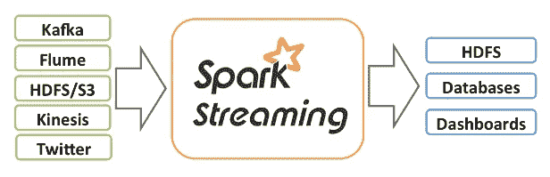

来源:spark.apache.org

# 如何启动火花流？

## 配置火花

首先，我们配置 spark，告诉它从哪里接收数据，是从本地目录、spark 集群、mesos 集群还是 kubernetes 集群。如果你不熟悉这些术语，不要担心。基本上，这些是集群管理系统，spark 需要这些系统来处理诸如检查节点健康状况和调度作业之类的任务。如果您选择您的本地目录作为主目录，您需要从您的本地机器中指定您希望 spark 在其上运行的核心的数量。运行的内核越多，性能就越快。如果指定*，则意味着使用系统中的所有内核。然后我们指定 app name，这是我们给 spark 应用程序起的名字。

```
SparkConf conf = new SparkConf().setAppName(“SparkApp”).setMaster(“local[*]”);
```

## 创建流式上下文对象

然后，我们创建一个 Java 流上下文的对象，它有点像打开了流开始的大门。它提供了从输入源创建 JavaDStream 和 JavaPairDStream 的方法，我们将进一步讨论这些方法。在创建 Java 流上下文对象时，我们需要指定批处理间隔；基本上，spark streaming 将传入的数据分成几批，因此最终结果也是成批生成的。一个**批处理间隔**告诉 spark 你需要获取数据多长时间，比如如果是 1 分钟，它将获取最后 1 分钟的数据。

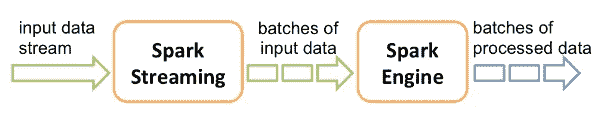

来源:[spark.apache.org](https://spark.apache.org/docs/latest/streaming-programming-guide.html)

所以数据将开始成批地涌入一个流中，这个连续的数据流被称为 **DStream** 。每一批数据流都包含可以并行处理的元素的集合，这个集合被称为 **RDD** 。

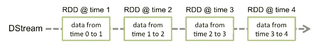

来源:spark.apache.org

```
JavaStreamingContext jssc = new JavaStreamingContext(conf, Durations.seconds(60));
```

# 开始传输数据

为了接收数据，流式上下文提供了从 TCP 套接字连接或作为输入源的文件流式传输数据的方法。这些源可以是像 HDFS、S3 等的源。要读取 textfiles，有 javastreamingcontext 的 textFileStream 方法。

```
JavaDStream<String> lines = jssc.textFileStream(“C:\\Users\\HP\\Downloads\\Spark_Streams”);
```

但是在流式上下文启动之前，您将无法读取目录中已经存在的文件，因为它只读取新创建的文件。

所以在这里，我将通过端口 9999 通过套接字连接传输数据，并用它创建一个 java 接收器输入数据流。

```
JavaReceiverInputDStream<String> lines = jssc.socketTextStream(“localhost”, 9999);
```

所以现在，如果你建立一个套接字连接，在终端中写一些东西，并运行 dstream，你会看到文本出现在控制台中。

注意:要启动一个 java 流上下文，我们需要告诉 spark 启动它，等待计算终止，然后停止它。我们需要通过 print()方法打印数据流。

```
lines.print();jssc.start();jssc.awaitTermination();jssc.stop();
```

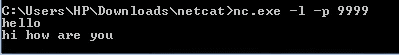

通过 TCP 套接字输入

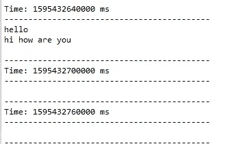

控制台中的输出

请注意，它在时间 t1 打印输出，但在时间 t2 和 t3 没有输出，因为它每分钟都获取数据。在下一个批处理间隔中，它没有接收到任何输入，所以它不打印任何东西。

现在我将向您展示如何使用 lanbda 函数对这些数据流进行一些转换。

# 地图变换

地图转换应用我们在数据流上指定的函数，并为每个输入值生成一个输出值。所以它基本上将一个流转换成另一个流。就像这里，我想计算文本行的长度，所以我将使用地图转换。

```
JavaDStream<Integer> length = lines.map(x -> x.length());
```

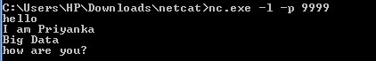

投入

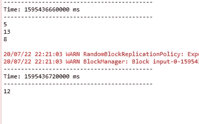

它计算文本行的长度

# 平面图变换

FlatMap 转换将函数应用于 DStream，但可以为每个输入值生成一个或多个输出值。因此，如果我想转换 RDD，使其产生多个值，我将使用平面图转换。

所以我在这里输入了一行文字“嗨，你好吗”，我想把它分成几个单词。我用了 lambda 函数。FlatMap 转换返回任意数量的值，这取决于 rdd 和应用的函数，因此返回类型必须是值流。

```
JavaDStream words = lines.flatMap(x -> Arrays.asList(x.split(“ “)).iterator());
```

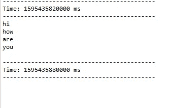

它将这一行拆分成单词

# 减少变形

reduce 变换聚合每个 RDD 中的元素。它接受单元素 rdd 的两个参数并返回一个。

这里，在我们应用平面映射函数并返回单词流之后，我将应用 reduce 变换来获得每个 RDD 中长度最大的单词。

```
JavaDStream<String> reduce = words.reduce((a,b) -> {String max_length_word;if(a.length() >= b.length()) {max_length_word = a;}else {max_length_word = b;}return max_length_word;});
```

请试着理解这段代码，它接受 String 类型的参数，其中每个 RDD 中的单词根据它们的长度进行聚合，返回长度最大的单词。

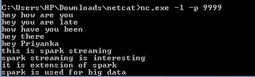

投入

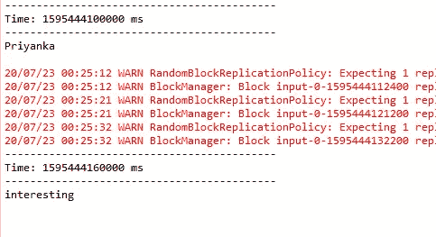

它返回每批中最大长度的单词

# 过滤变换

过滤转换根据给定的函数过滤数据流。就像在平面图转换之后，假设我想从单词流中过滤出单词 hello。

```
JavaDStream<String> filter = words.filter(x -> !x.equals(“hello”));
```

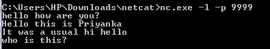

投入

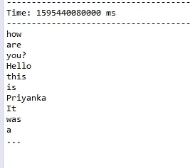

它过滤“你好”这个词

请注意，单词“Hello”没有被过滤，因为它包含大写字母，这是我们在代码中没有指定的。

# 映射对变换

mapToPair 转换将每个输入值转换为一对值。

```
JavaPairDStream<String, Integer> pairs = filter.mapToPair(x -> new Tuple2<String, Integer>(x, 1));
```

注意，这里创建的对象是 JavaPairDStream 而不是 DStream，因为我们在流中返回对。

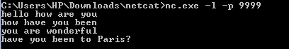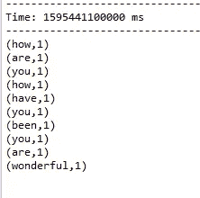

它返回单词和整数 1

# ReduceByKey 变换

在数据流中，我们可以使用 reduceByKey 在 key 的基础上聚集 rdd 的元素。与 reduce 转换不同，它采用成对的 rdd，而不是单元素 rdd。就像这里，它采用了一个字符串和整数的元组，我们正在合计一个单词在 RDD 中出现的次数。它接受两个参数并返回一个。但是在指定调用类型时，我们没有指定 tuple <string integer="">，我们只是指定了 Integer，因为 reduce by key 本身会注意到这个键，并根据指定的函数对它进行聚合。</string>

```
JavaPairDStream<String, Integer> sum = pairs.reduceByKey((a,b) -> a + b);
```

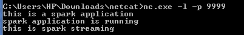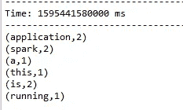

对于每个单词，它根据单词出现的次数对整数 1 求和

# 计数变换

计数转换计算每个 RDD 中的元素数，并返回包含单个元素 rdd 的数据流。

在应用平面图转换后，我们想知道每个 RDD 的字数。

```
JavaDStream<Long> count = words.count();
```

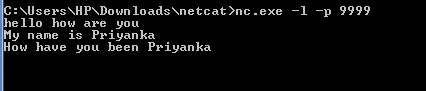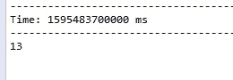

它返回文本行中的字数

所以 RDD 中的单词数是 13，所以它返回 13 作为输出。这是在应用了将单词行分割成单个单词的 flatMap 之后。如果我们不拆分单词就申请，看看我们会得到什么。

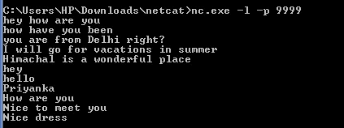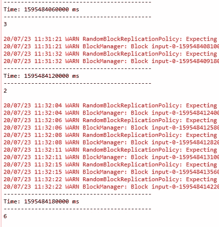

它返回它在每批中接收的行数

由于我们没有将这一行单词分割成单个的单词，spark 将整行单词视为一个单一的元素。在第一批中，它接收 3 行，因此它返回计数为 3，在接下来的批中，它接收 2 行和 6 行，因此计数分别为 3 和 6。

# 计数值转换

countByValue 获取 k 类型的数据流，并计算该键在 RDD 中出现的次数，然后返回(k，Value)对的 PairedDStream。

这里，在我用 flatMap 分割了单词行之后，我应用了 countByValue 转换。

```
JavaPairDStream<String, Long> countByValue = words.countByValue();
```

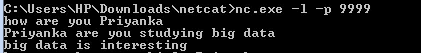

投入

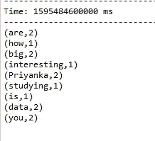

它计算一个单词在 RDD 中出现的次数

现在，我将向您展示我们可以在 rdd 上执行的一些操作。所以基本上我们是在包含 rdd 的数据流上应用转换，当我们指定一个转换时，我们是在那些 rdd 上应用函数。spark 提供了一些我们可以在这些 rdd 上应用的操作。

假设我想将应用 countByValue 后得到的键值对按降序排列。我能做的是交换那些键值对，然后排序，我会进一步展示。使用 mapToPair 转换，我在 RDDs 上使用 swap 操作来将其更改为(Long，String)对。

# 交换动作

```
JavaPairDStream<Long, String> swap = countByValue.mapToPair(x -> x.swap());
```

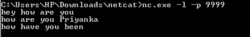

投入

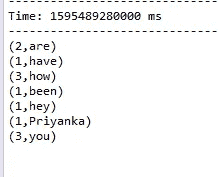

交换动作交换键值对

# SortByKey 操作

现在要按降序排列这些值，我可以使用 RDD 的 sortByKey 变换。它将按照指定的布尔值按升序或降序排序。如果我们不指定布尔值，默认情况下它将按升序排序。

# 变换对变换

现在要使用 sortByKey，我将使用 transformToPair 转换。transform 函数通过对每个 RDD 应用 RDD 到 RDD 变换来返回新的数据流。这里我想返回 PairedDStream，所以我将使用 transformToPair。

```
JavaPairDStream<Long, String> sort = swap.transformToPair(x -> x.sortByKey(false));
```

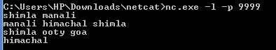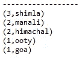

它按降序对键进行排序

现在，我可以再次使用 mapToPair 交换单词对，将单词作为键，将计数作为值。

```
JavaPairDStream<String, Long> swap_again = sort.mapToPair(x -> x.swap());
```

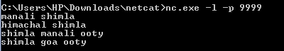

投入

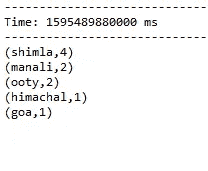

它又被交换了

这是 spark 流如何工作的概述，以及我们如何将转换应用于数据流的几个例子。感谢阅读！！！有疑问可以在评论区问我。