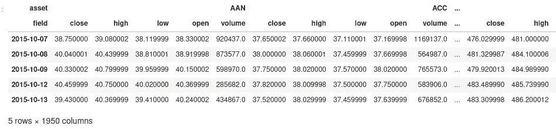
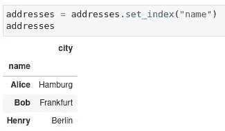

# 星火大战熊猫，第一部分——熊猫

> 原文：<https://towardsdatascience.com/spark-vs-pandas-part-1-pandas-10d768b979f5?source=collection_archive---------6----------------------->

## 为什么熊猫是表格数据的瑞士军刀？

在 [Unsplash](https://unsplash.com?utm_source=medium&utm_medium=referral) 上[翻滚 926](https://unsplash.com/@billow926?utm_source=medium&utm_medium=referral) 拍照

最近在 Medium 上有一篇很好的文章，解释了为什么[的数据科学家应该开始使用 Spark 和 Scala 而不是 Pandas](/stop-using-pandas-and-start-using-spark-with-scala-f7364077c2e0) 。虽然这篇文章包含了许多有效的观点，但我提出了一个更加不同的观点，这也反映在我个人的工作中，我使用两者，但用于不同类型的任务。

每当我给数据科学家做 PySpark 的培训时，我总是被问到他们是否应该从现在开始完全停止使用 Pandas，或者什么时候更喜欢 Pandas 和 Spark 这两个框架中的哪一个。要回答这个问题，您需要了解每种工具的优势和局限性，并且您应该了解这两种框架都是为了解决类似的问题而开发的，但是各有不同的侧重点。

这是比较 Spark 和熊猫的小编的第一部分。

*   星火大战熊猫，第一部分——熊猫
*   [星火大战熊猫，第二部——星火](/spark-vs-pandas-part-2-spark-c57f8ea3a781)

## 期待什么

我将介绍 Pandas 和 Spark 这两个框架，并讨论它们的优缺点，为公平的比较奠定基础。最初我想写一篇关于这个主题的文章，但是它一直在增长，直到我决定把它分开。

我不会得出 A 比 B 更好的结论，但是我会给你一些关于每个框架的焦点和局限性的见解。最后，我将给出一些建议，说明如何在这两种技术中选择一种来实现给定的任务。

这第一篇文章会给你一个关于熊猫的概述，它的优点和缺点以及它独特的卖点。

# 熊猫是什么？

Pandas 是一个 Python 库，也是在 Python 上处理结构化表格数据的事实上的标准。Pandas 提供了转换和预处理数据的简单方法，特别关注数字数据，但是它也可以用于其他数据，只要它的结构是表格。

许多读者会理解为什么 Pandas 现在如此重要，因为可能大多数数据科学项目在某个时间点使用 Python 作为编程语言。因此，这些项目依赖熊猫来读取、转换和可能写入数据。

熊猫在 Python 世界中受欢迎的原因是它简单但强大的编程接口，以及它与 [NumPy](https://numpy.org/) 以及大多数统计和机器学习库良好交互的事实。

## 熊猫数据模型

基本上，Pandas 将你的数据存储在所谓的*数据帧*中，这些数据帧本质上看起来像*表*，你可能从数据库*中知道。*数据帧有一组列和一组行，其中每一行包含所有列的条目(即使它们是 *NaN* 或 *None* 值，以表示缺失的信息)。

一个简单的熊猫表的例子，以“资产”作为索引和各种数字列

与数据库中的表类似，每个数据帧也有一个带有唯一键的索引*以有效地访问单个行或整个范围的行。Pandas 数据帧的命名列也可以看作是一个*水平索引*，它再次允许您有效地访问单个列或列的范围。*

垂直行索引和水平列索引也可以包含多个级别，这可能非常有用，例如，在一段时间内对多种不同资产的股票价格进行建模:

嵌套列索引和日期作为行索引的示例

Pandas 提供了关于行和列的非常正交的设计，它们在大多数(但不是所有)函数中是可互换的。如果这是不可能的，你可以很容易地*转置*一个数据帧，即把表格旋转 90 度，把所有的行变成列，反之亦然。注意，这种操作是传统数据库不可能完成的。

# 熊猫的灵活性

Pandas DataFrame API 非常灵活，提供了比传统数据库中的`SELECT`语句更多的功能。在本系列的下一部分中，让我们快速浏览一下最基本的，以便获得一种感觉，并能够比较 Spark 的功能。

对于下面的小例子，假设我们使用具有以下内容的数据帧`persons`:

一个包含一些人的熊猫数据框

由于大多数(但不是全部)操作也可以在传统数据库中执行，我也将提到相应的操作，以便将它们放入关系代数的视角中。

## 预测

可能最简单的转换之一是投影，它只是用现有列的子集创建一个新的 DataFrame。这个操作叫做*投影*，因为它类似于高维空间到低维空间的数学投影(例如 3d 到 2d)。具体来说，投影减少了维数，并且是等幂的，即，对结果第二次执行相同的投影将不再改变数据。

将人员数据框投影到“年龄”和“身高”列

SQL 中的投影是一个非常简单的`SELECT`语句，包含所有可用列的子集。

## 过滤

过滤中的下一个简单转换，它只选择可用行的子集。它类似于投影，但作用于行而不是列。

过滤 21 岁以上的人。

SQL 中的过滤通常在`WHERE`子句中执行。

## 连接

连接是关系数据库中的基本操作——没有它们，术语*关系*就没有什么意义了。Pandas 连接要求正确的数据帧已经被连接列索引。

对于一个小的演示，我首先加载第二个数据帧，其中包含一些人居住的城市的名称:

现在我们需要为该数据帧创建一个适当的索引，否则 Pandas 将拒绝执行连接操作:

最后，我们现在可以执行连接操作:

注意，这个例子表明术语*索引*确实是合适的，因为它提供了快速查找机制，这是连接操作所需要的。

在 SQL 中，连接操作是通过作为`SELECT`语句一部分的`JOIN`子句来执行的。

## 串联

在 Pandas 中，您还可以水平连接(粘合)数据帧(即从第二个数据帧中添加相同行数的列)或垂直连接(即从第二个数据帧中添加相同行数的行)。

对于水平连接不同数据帧的列(未示出), Pandas 将在索引上匹配，类似于通过匹配列来完成水平连接。

在 SQL 中，垂直连接可以使用`UNION`轻松完成，而水平连接需要更昂贵的`JOIN`操作。

## 聚合(水平+垂直)

熊猫也很好地支持简单的总聚合。以下示例计算了我们的`persons`数据框架中所有列的最小值、最大值和平均值:

对所有行的每一列执行聚合。SQL 还通过一个`SELECT`语句中的聚合函数(如`SUM`、`MIN`、`AVG`等)很好地支持总聚合。

Pandas 还可以对列执行逐行聚合，这在某些情况下很方便。例如，当查看约翰·霍普金斯大学系统科学与工程中心(CSSE)在 GitHub 上提供的一些[新冠肺炎数据时，最初看起来如下:](https://github.com/CSSEGISandData/COVID-19)

新冠肺炎数据

每行代表一个国家或州，并包含一列迄今为止的新冠肺炎病例总数。这种数据模式实际上对于存储在传统数据库中非常不友好，传统数据库通常只有有限的一组列，新的条目应该通过新的行来添加。但是这个表示将为每个日期添加一个新列。稍后，我们将看到如何将这些数据转换成一种更加数据库友好的格式。

但是现在，假设我们想计算每个不同地区的所有日期列的一些指标，比如新日冕的平均数量。这可以通过 Pandas 的几个小步骤轻松实现，包括水平聚合(与上面的垂直聚合相反):

这个例子显示了 Pandas 的灵活性，与关系数据库相反，关系数据库中的聚合本质上总是水平的，但是无论如何也不能以原始格式存储数据。

## 分组聚合

Pandas 还支持*分组聚合*，例如`persons`数据帧中每个性别的平均年龄和身高:

SQL 还通过`GROUP BY`子句和`SELECT`语句中的聚合函数支持分组聚合。

## 重塑

让我们回到上面的新冠肺炎数据集:

新冠肺炎数据

每天的病例数存储在单独的列中。不幸的是，这种表示可能并不适合每个用例，为每个日期提供单独的行可能更好。例如，如果您想将信息存储在关系数据库中，您应该定义一组固定的列，独立于存储的时间范围。

所需的转换可以通过两行 Pandas 代码轻松完成:

相同数据的整形表示。

这种表示现在非常适合存储在关系数据库中。其思想是每一行都包含维度的组合(“省/州”、“国家/地区”和“日期”)，这些维度唯一地标识该行。也就是说，这些列提供了一个复合主键。此外，每一行包含一个或多个指标(在这种情况下，它只是“计数”)。在分析数据库的世界里，这将被称为*事实表*。

## 数据源

Pandas 提供了对 CSV、JSON、Excel、固定宽度格式(FWF)、HDF5、Parquet、ORC、SAS、SPSS 的内置读写支持，它可以访问 SQL 数据库甚至 Google BigQuery 中的数据。

除了访问本地文件系统上的数据，Pandas 还支持两个远程文件系统，其中最重要的一个可能是 S3。

这种对文件格式和存储系统的广泛支持，使 Pandas 成为一个需要处理非常不同数据源的世界中的一员。

## 结论

Pandas 支持您在`SELECT` 语句中可以找到的大多数类似数据库的操作，但是它提供了更大的灵活性，并且更侧重于数字操作。它支持更多的操作，如滚动窗口计算和旋转，这只是两个常用的例子。

在内部，Pandas 使用 NumPy 数组，可以很容易地访问这些数组，并将其输入各种附加库，如 [scikit-learn、](https://scikit-learn.org/)、 statsmodels 甚至 [Tensorflow](https://tensorflow.org) 。同样，这使 Pandas 不同于传统的数据库，后者不提供这种集成。

# Pandas 运行时特征

到目前为止，一切听起来都很完美。但是，让我们稍微看一下引擎盖下面，检查熊猫的一些设计决策，以及这些决策的含义。

## 运行时平台

Pandas 本身是用 Python 和[cy thon](https://en.wikipedia.org/wiki/Cython)(Python 的一个超集，支持静态类型，将 Python 代码转换为 C，然后编译 C 代码以提供类似 C 的性能)混合编写的，具有解释型和动态类型语言的所有优点和缺点。但是由于大多数转换最终都是由一些低级和优化的 C 代码执行的，因此性能对于大多数用例来说已经足够了。

## 执行模型

Pandas 实现了一个所谓的 *eager* 执行模型，这仅仅意味着你对数据帧的任何转换都会被立即执行。这种*最不令用户惊讶*的方法非常适合交互式工作(就像数据科学家经常做的那样)，但它也有一些缺点:Pandas 无法通过融合多个操作来创建类似于*优化执行计划*的东西，因为每个转换都会立即执行。

*优化执行计划*的想法是相当古老的，它帮助许多 SQL 数据库透明地提高它们的性能——但是当然这些数据库一次看到一个完整的 SQL 查询，而不是一个接一个地看到每个微小的步骤。稍后我们将看到 Spark 实现的 l *azy 执行*的一些更重要的优点。

顺便提一下，Tensorflow 同时支持惰性和急切执行模型，明确建议只在开发期间使用急切执行模型，因为惰性执行由于全图优化而更快。

## **处理扩展性**

处理本身是单线程的，不能分布到不同的机器上。一些项目如 Dask 试图通过使用完全不同的后端重新实现 Pandas API 来克服这个限制。但是熊猫本身仅限于单线程。

虽然听起来很糟糕，但 Pandas 仍然非常有用，而且速度非常快，因为大部分工作都是在高度优化的 C/C++后端完成的。有时也可以用[多处理](https://docs.python.org/3/library/multiprocessing.html)或 [joblib](https://joblib.readthedocs.io/en/latest/) 库在 Pandas 上实现一些并行性。

## **数据可扩展性**

Pandas 要求您的所有数据都要放入本地计算机的主内存中。它既不能将数据溢出到磁盘，也不能在机器集群内分发数据。同样，像 [Dask](https://dask.org/) 或 [Vaex](https://vaex.readthedocs.io/en/latest/) 这样的项目试图通过实现分布式和/或核外处理来克服这种限制，同时提供 Pandas 兼容的(或 Pandas-like for Vaex) API。

## 结论

熊猫没有规模——就这么简单。如果您的数据集增长，您需要更多的 RAM，可能还需要更快的 CPU(就单核性能而言更快)。虽然这对某些人来说可能是限制性的，但这使整个库(相对)保持简单。

# 结论

Pandas 是一个非常通用的 Python 库，用于操作表格数据。与关系数据库相比，它为操纵和重新塑造表格数据提供了更大的灵活性，因此它不仅是数据科学项目(预)处理的瑞士军刀。

Pandas 的主要限制是你的数据需要放入 RAM，而且它不能很好地利用多个 CPU。但是，如果你的数据足够小，可以避开这些限制(这很可能仍然是数百万条记录)，Pandas 是一个非常好的灵活的库，它可以很好地集成到整个 Python 机器学习生态系统中。

下一次，我们将近距离观察竞争对手阿帕奇火花。