# 星火大战熊猫，第二部分——星火

> 原文：<https://towardsdatascience.com/spark-vs-pandas-part-2-spark-c57f8ea3a781?source=collection_archive---------1----------------------->

## 通过 Spark 扩展推动极限

保罗·卡莫纳在 [Unsplash](https://unsplash.com?utm_source=medium&utm_medium=referral) 上的照片

最初我想写一篇文章来公平地比较熊猫和火花，但它继续增长，直到我决定把它分开。这是小编的第二部。

*   [星火大战熊猫，第一部——熊猫](/spark-vs-pandas-part-1-pandas-10d768b979f5)
*   星火大战熊猫，第二部分——星火
*   星火大战熊猫，第三部分——语言
*   星火大战熊猫，第四部分——枪战与推荐

## 期待什么

第二部分描述了 Apache Spark。作为大数据工程系列的一部分，我已经写了一篇关于 Spark 的[不同的文章，但这次我将更多地关注与熊猫的不同之处。](/big-data-engineering-apache-spark-d67be2d9b76f)

# 什么是阿帕奇火花？

Apache Spark[是一个用 Scala 编写的大数据处理框架，目标是 Java 虚拟机，但它也为 Java、Python 和 r 提供语言绑定。Spark 的诞生可能与 Pandas 非常不同，因为 Spark 最初主要解决有效处理大量数据的挑战，这些数据不再适合单台计算机的内存(甚至不适合整个计算集群的内存总量)。](https://spark.apache.org/)

可以说 Spark 是通过提供更简单同时更强大的编程模型来取代 Hadoop MapReduce 的。Spark 非常成功地完成了这项任务，因为我认为没有项目会在今天之前开始编写新的 Hadoop MapReduce 作业，显然会转而使用 Spark。

## 火花数据模型

最初，Spark 只提供了一个名为 RDDs 的 API(现在称为低级 API ),它要求开发人员将他们的数据建模为类。几年后，Spark 由 *DataFrame* API 扩展，该 API 吸取了 Pandas 和 R 的许多好想法，现在是首选的 API(以及数据集，但我将在讨论中省略它们)。

与 Pandas 相似，Spark 数据帧建立在列和行的概念上，列集合隐式定义了一个在所有行之间共享的*模式*。

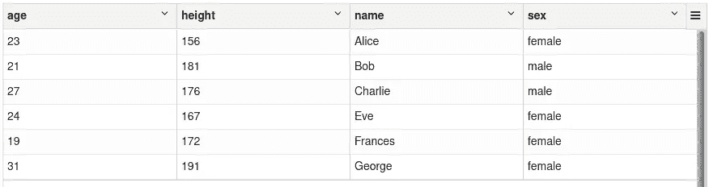

多列 Spark 数据框架

与 Pandas 不同，Spark 数据帧的模式定义还规定了可以存储在每行中的每列的数据类型。这一点与经典数据库非常相似，其中每一列都有一个固定的数据类型，并在所有记录上强制执行(较新的 NoSQL 数据库可能更灵活，但这并不意味着类型强制执行不好或过时)。您可以轻松地显示给定数据帧的模式，以便检查列及其数据类型:

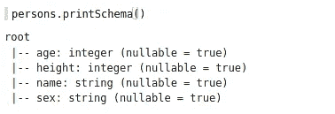

上述数据框架的模式

与 Pandas 相反，Spark 不支持任何索引来有效地访问数据帧中的单个行。Spark 通过蛮力解决了所有或多或少受益于索引的任务——因为所有转换总是在所有记录上执行，Spark 将根据需要动态地重新组织数据。

一般来说，Spark 中的*列*和*行*不像熊猫那样可以互换。缺乏正交性的原因是 Spark 被设计成根据行数而不是列数来缩放数据。Spark 可以轻松处理数十亿行，但是列的数量应该总是有限的(几百或几千)。

因此，当我们试图用开盘、收盘、盘低、盘高和成交量属性来模拟股票价格时，我们需要在 Spark 中采用与 Pandas 不同的方法。我们没有对不同的股票使用具有不同列的宽数据框架，而是使用更加*规范化的*(在某种意义上说是[数据库规范化](https://en.wikipedia.org/wiki/Database_normalization))方法，其中每一行都由其维度`date`和`asset`唯一标识，并包含指标`close`、`high`、`low`和`open`。

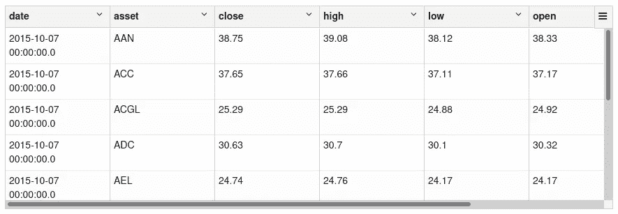

包含股票编号的数据帧

尽管 Apache Spark 的数据模型不如 Pandas 的灵活，但这并不一定是件坏事。随着 Sparks 专注于实现关系代数(下面将详细介绍),这些限制自然会出现，并且严格数据类型的实施有助于您更早地发现错误。

由于 Spark 不支持索引，所以它也不支持像 Pandas 这样的嵌套索引。相反，Spark 为深度嵌套的数据结构提供了很好的支持，就像在 JSON 文档或 Avro 消息中发现的那样。这些类型的数据经常在应用程序之间的内部通信协议中使用，Sparks 对它们的全面支持强调了它作为数据处理工具的重要性。*嵌套结构*被实现为复杂的数据类型，如结构、数组和映射，它们又可以包含这些复杂的数据类型。

作为一个例子，我给你看一些 Twitter 数据，这些数据在互联网档案馆公开。

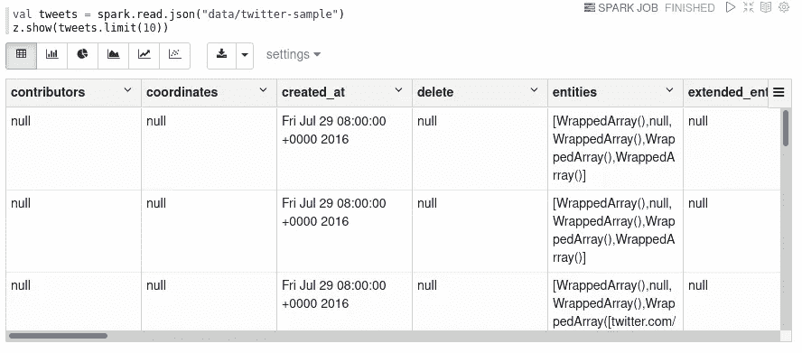

以表格形式显示的嵌套数据

这种表格表示并没有真正显示推文的复杂本质。查看该模式可以了解所有细节(尽管下面只显示了一个小节):

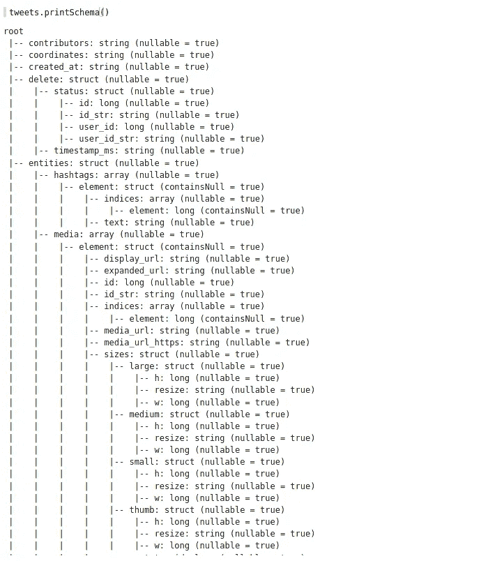

twitter 数据集完整模式的一部分

这种对复杂和深度嵌套模式的支持是 Spark 不同于 Pandas 的地方，Pandas 只能处理纯表格数据。由于这种类型的数据自然会出现在许多领域，所以知道 Spark 可以成为处理这些数据的工具是件好事。关于如何处理这类数据的建议可能是另一篇文章的有趣主题。

# 火花的灵活性

Apache Spark 还提供了广泛的转换，实现了传统数据库(MySQL、Oracle、DB2、MS SQL 等)中的完整关系代数。这意味着您可以像在 SQL 的`SELECT`语句中一样执行任何转换。

下面的 Spark/Scala 示例遵循第一篇文章中熊猫示例的思路。请注意 Spark 是如何在其所有方法中使用 SQL 的措辞(而不是语法)的。

## 预测

可能最简单的转换之一是投影，它只是用现有列的子集创建一个新的 DataFrame。这个操作叫做*投影*，因为它类似于高维空间到低维空间的数学投影(例如 3d 到 2d)。具体来说，投影减少了维数，并且它是[幂等的](https://en.wikipedia.org/wiki/Idempotence)，即，对结果再次执行相同的投影将不会再改变数据。

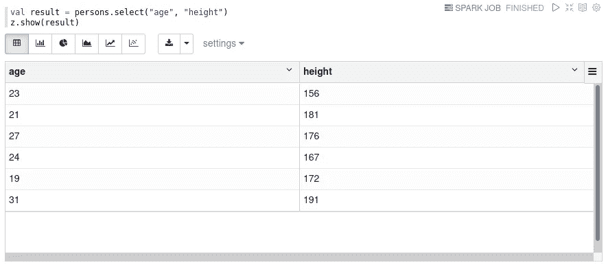

SQL 中的投影是一个非常简单的`SELECT`语句，包含所有可用列的子集。注意 Spark 方法的名字`select`是如何反映这种等价的。

## 过滤

过滤中的下一个简单转换，它只选择可用行的子集。

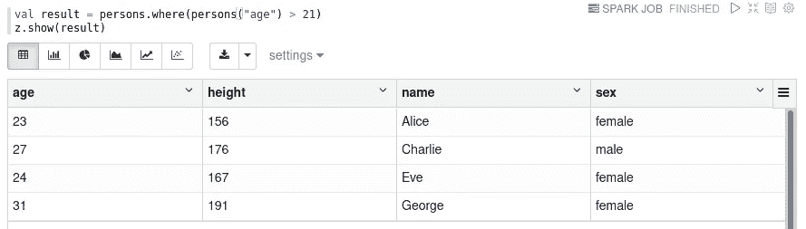

选择 21 岁以上的人。

SQL 中的过滤通常在`WHERE`子句中执行。再次注意，Spark 选择使用 SQL 术语`where`，尽管 Scala 用户更喜欢`filter`——实际上你也可以使用等效的方法`filter`来代替。

## 连接

连接是关系数据库中的基本操作——没有它们，术语*关系*就没有什么意义了。

对于一个小的演示，我首先加载第二个数据帧，其中包含一些人居住的城市的名称:

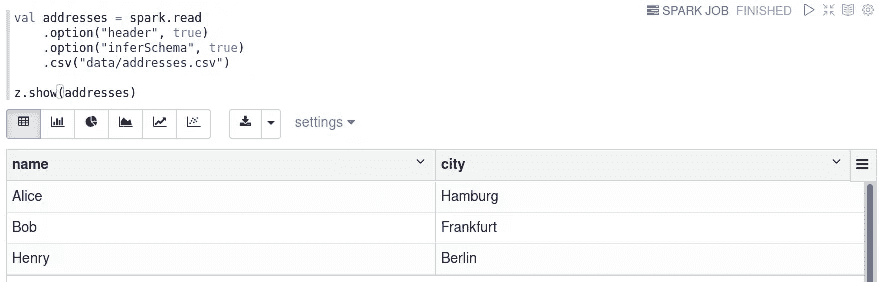

现在我们可以执行连接操作了:

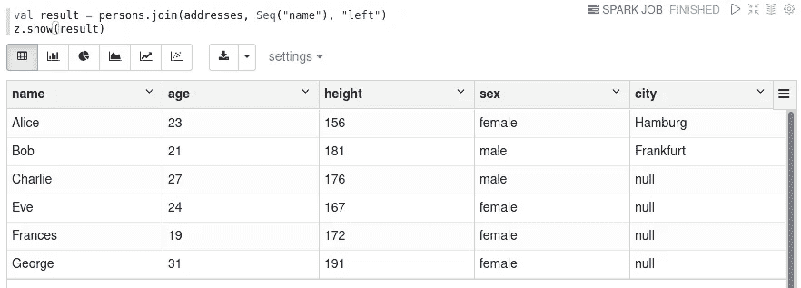

在 SQL 中，连接操作是通过作为`SELECT`语句一部分的`JOIN`子句来执行的。

注意，与 Pandas 不同，Spark 不需要对任何一个数据帧进行特殊的索引(如果您还记得的话，Spark 不支持索引的概念)。

Spark 不再依赖可用的索引，而是将数据重新组织，作为实现高效并行和分布式连接操作的一部分。这种重组将*在一个集群的所有机器之间重排*数据，这意味着两个数据帧的所有记录都将被重新分配，使得具有匹配连接键的记录被发送到同一台机器。一旦这个洗牌阶段完成，就可以在所有机器上使用[排序-合并连接](https://en.wikipedia.org/wiki/Sort-merge_join)独立并行执行连接。

# 串联

Spark 还支持多个数据帧的连接，但只是垂直连接(即从第二个数据帧添加相同列数的行)。

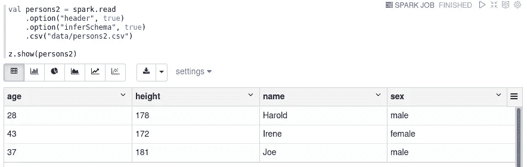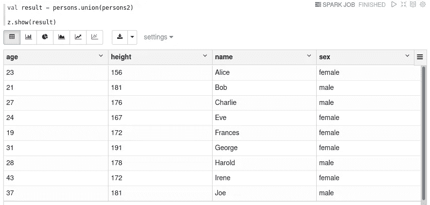

在 SQL 中，使用`UNION`可以很容易地完成垂直连接。

如果您需要两个数据帧的水平连接(这对 Pandas 来说很容易)，您必须使用 join 操作。在某些情况下，这可能很困难(甚至不可能)，特别是在没有自然连接键的情况下。

## 聚集

Spark 也很好地支持简单的汇总。以下示例计算了我们的`persons`数据框架中所有列的最小值、最大值和平均值:

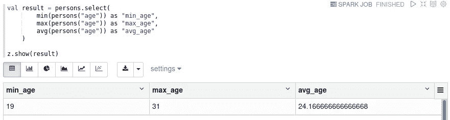

同样，Spark 明显模仿了 SQL，在 SQL 中，通过在`SELECT`语句中使用聚合函数(如`SUM`、`MIN`、`AVG`等)可以获得相同的结果。

与 Spark 相比，Pandas 还能够对数据帧的所有列执行行聚合。这在 Spark 中不可能直接实现，您需要手动合计所有列(这不是一个聚合)。请记住，Spark 是根据行数而不是列数来扩展的，并且行和列不像在 Pandas 中那样可以互换。

## 分组聚合

像传统数据库和熊猫一样，Spark 也支持分组聚合。例如，`persons`数据框的平均年龄和性别身高可计算如下:

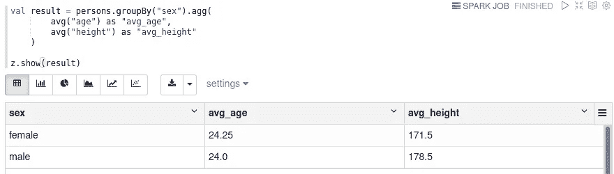

SQL 还通过`GROUP BY`子句和`SELECT`语句中的聚合函数支持分组聚合。

## 重塑

本系列的第一篇文章提供了一个小节，介绍了 Pandas 为改造桌子提供的灵活而强大的可能性。使用 Pandas，您可以轻松地将一个表分解成更小的子表(水平和垂直)，然后将它们连接在一起。对于 Pandas，你可以用一个手指来转置整个数据帧。

Spark 不提供这些操作，因为它们不太适合概念数据模型，在概念数据模型中，数据帧有一组固定的列，行数可能是未知的，甚至是无限的(在流式应用程序中，当新行进入系统时，它会不断地处理新行)。

## 数据源

Spark 支持 CSV、JSON、Parquet 和 ORC 文件开箱即用。由于 Spark 实际上是为了处理大量数据，所以您不会找到对处理 Excel 文件的直接支持(“如果它不再适合 Excel，它一定是大数据”)。除了传统文件之外，Spark 还可以轻松访问 SQL 数据库，并且有大量的连接器可用于所有其他类型的数据库系统(Cassandra、MongoDB、HBase 等等)。

当在“本地”模式下工作而不在集群上分配工作时，您可以很好地处理本地文件系统上的文件。但是，当您在集群中工作时，必须能够从集群中的所有机器访问数据。这可以通过使用一个共享的数据库来实现，这个数据库可以通过网络访问，或者通过使用一个共享的网络文件系统来实现(就像 HDFS 或者 S3 一样——但是 [NFS](https://en.wikipedia.org/wiki/Network_File_System) 也可以做到这一点，尽管可能带宽有限)。

## 限制

正如我已经多次指出的，Spark 和 Pandas 的数据模型之间的一个重要区别是 Spark 中的列和行缺乏可互换性。这意味着您不能简单地在 Apache Spark 中执行*转置*操作，也不能直接沿着列(只能沿着行)执行聚合。

## 结论

有了所有这些操作，Spark 可以被理解为一个处理外部数据的*关系执行引擎*。Spark 优雅地选择了 SQL 中使用的措辞和术语，因此大多数 SQL 用户将很快发现如何使用 Spark 执行特定的任务。

但是 Sparks design 已经在概念层面上对可能的转换类型施加了一些限制。Spark 总是假设一组固定的列和一个可能未知甚至无限数量的行。这种设计是 Sparks 扩展能力的基础，与熊猫形成鲜明对比。

# 火花运行时间特征

到目前为止，Pandas 似乎是更好的解决方案，因为它提供了更多的灵活性，并且与整个 Python 数据科学生态系统很好地集成在一起。但是现在当我们看 Apache Spark 的引擎盖下时，这种印象将会改变。

## **运行时平台**

Spark 是用面向 Java 虚拟机(JVM)的编程语言 [Scala](https://www.scala-lang.org/) 实现的。与 Python 相反，Scala 是一种编译过的静态类型语言，这两个方面通常有助于计算机生成(快得多)的代码。Spark 不依赖于优化的低级 C/C++代码，相反，所有代码在执行过程中都由 Java [实时(JIT)编译器](https://en.wikipedia.org/wiki/Just-in-time_compilation)进行了优化。

我敢说(但许多人会不同意)，与高度优化的(但特定于硬件的)C/C++甚至汇编代码相比，Java 平台作为一个整体可能无法发挥硬件的最佳性能。但是性能通常不仅仅是“足够好”，而且肯定比纯解释代码(即没有优化低级代码的 Python)好至少一个数量级。术语*快*和*慢*应该总是与特定的替代物联系在一起使用，在这种情况下就是 Python。

## **执行模式**

与 Pandas 相反，Spark 使用一个*延迟执行*模型。这意味着当您对数据帧进行某种转换时，数据不会立即得到处理。相反，您的转换被记录在一个*逻辑执行计划*中，它本质上是一个图，其中节点表示操作(比如读取数据或应用转换)。然后，当需要所有转换的结果时，Spark 将开始工作——例如，当您想要在控制台上显示一些记录，或者当您将结果写入文件时。

正如在专门讨论 Pandas 的文章中已经提到的，这种懒惰执行模型具有巨大的优势，它为 Spark 提供了在执行之前优化整个计划的能力，而不是盲目地遵循开发人员指定的步骤。内部火花使用以下阶段:

1.  从开发人员指定的转换中创建一个*逻辑执行计划*
2.  然后，导出一个*分析执行计划*，其中检查并解析所有列名和对数据源的外部引用
3.  然后，通过反复应用可用的优化策略，该计划被转换成*优化的执行计划*。例如，过滤操作尽可能地靠近数据源，以便尽可能早地减少记录数量。但是还有更多的优化。
4.  最后，上一步的结果被转换成一个*物理执行计划*，其中转换被一起流水线化成所谓的*阶段*。

为了完整起见，物理执行计划随后被沿着数据分割成所谓的*任务*，这些任务随后可以由集群中的机器并行执行和分配。

这种通用方法可能与所有关系数据库都非常相似，它们也在执行 SQL 查询之前用相似的策略对其进行优化。但是，正如我们在下一段中看到的，延迟执行不仅仅是优化。

## **处理扩展性**

Spark 本质上是多线程的，可以利用机器的所有内核。此外，Spark 从一开始就被设计为在可能有数百台机器和数千个内核的大型集群中执行工作。

通过将工作总量分解为单个任务，然后可以并行独立处理(只要每个任务的输入数据可用)，Spark 可以非常有效地利用可用的集群资源。在不浪费大量资源(CPU 能力、RAM 和磁盘存储)的情况下，在集群中实现一个*渴望*执行模型要困难得多。

## **数据可扩展性**

Spark 还可以很好地处理海量数据。它不仅可以通过集群中的多台机器进行扩展，而且*将中间结果溢出到磁盘的能力*是 Spark 设计的核心。因此，Spark 几乎不受主内存总量的限制，而只受可用磁盘空间总量的限制。

重要的是要理解，通过延迟执行计划，总的工作数据集永远不会在任何时间点完全具体化到 RAM 中。相反，所有的数据(包括输入数据和中间结果)被分割成小块，它们被独立处理，甚至结果最终被存储在小块中，这些数据永远不需要一次放入 RAM。

如您所见，Spark 的灵活性稍小，但它的可伸缩性超过了它，无论是从计算能力还是从数据大小来看都是如此。Spark 是为熊猫以外的不同类型的问题而制造的。

## 结论

就数据和处理能力而言，几乎无限的可扩展性使 Spark 成为一个*分布式并行关系执行引擎。*

# 结论

像熊猫一样，Spark 是一个非常通用的处理大量数据的工具。虽然 Pandas 在重塑功能方面超过了 Spark，但 Spark 擅长处理非常庞大的数据集，除了 RAM 之外，它还利用磁盘空间，并扩展到一个集群中的多个 CPU 核心、多个进程和多台机器。

只要您的数据有一个固定的模式(即每天不添加新列)，Spark 就能够处理它，即使它包含数千亿行。这种可扩展性以及几乎任何存储系统(即远程文件系统、数据库等)的连接器的可用性使 Spark 成为大数据工程和数据集成任务的绝佳工具。

有了这第二部分，我们现在应该对熊猫和 Spark 的重点有个大概的了解。但是在我们最终给出何时使用什么的建议之前，我们还应该检查编程语言和两种框架所处的生态系统。这将是本系列下一部分的主题。