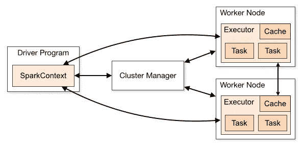

# spark session vs spark context vs SQLContext

> 原文：<https://towardsdatascience.com/sparksession-vs-sparkcontext-vs-sqlcontext-vs-hivecontext-741d50c9486a?source=collection_archive---------1----------------------->

## SparkSession、SparkContext 和 SQLContext 有什么区别？


由 [Unsplash](https://unsplash.com/photos/PC_lbSSxCZE) 上的[克里斯托佛罗拉](https://unsplash.com/@krisroller)拍摄的照片

在大数据时代，Apache Spark 可能是最受欢迎的技术之一，因为它提供了一个统一的引擎，可以在合理的时间内处理大量数据。

在本文中，我将介绍 Spark 应用程序的各种入口点，以及这些入口点是如何随着发布的版本而发展的。在这样做之前，浏览一些基本概念和术语可能是有用的，这样我们就可以更容易地跳转到入口点，即 SparkSession、SparkContext 或 SQLContext。

# Spark 基本架构和术语

Spark 应用程序由集群上的一个**驱动程序**和一组**执行器**组成。驱动程序是一个进程，它执行 Spark 应用程序的主程序，并创建协调作业执行的 **SparkContext** (稍后详细介绍)**。**执行器是运行在集群工作节点上的进程，负责执行驱动程序进程分配给它们的**任务**。

集群管理器(如 Mesos 或 YARN)负责将物理资源分配给 Spark 应用程序。



图片取自 [Apache Spark 文档](https://spark.apache.org/docs/latest/cluster-overview.html#components)

# 入口点

每个 Spark 应用程序都需要一个入口点，允许它与数据源通信并执行某些操作，比如读写数据。在 Spark **1.x** 中，引入了三个入口点: **SparkContext** 、 **SQLContext** 和 **HiveContext。**自从 **Spark 2.x** 以来，引入了一个名为 **SparkSession** 的新入口点，该入口点基本上结合了上述三个上下文中的所有可用功能。请注意，即使在最新的 Spark 版本中，所有上下文仍然可用，主要是为了向后兼容。

在接下来的部分中，我将讨论上述入口点的目的以及它们之间的区别。

# SparkContext、SQLContext 和 HiveContext

如前所述，Spark 的最早版本提供了这三个入口点，每个入口点都有不同的用途。

## **火花上下文**

Spark 应用程序的驱动程序进程使用 **SparkContext** 来建立与集群和资源管理器的通信，以便协调和执行作业。SparkContext 还允许访问其他两个上下文，即 SQLContext 和 HiveContext(稍后将详细介绍这些入口点)。

为了创建 SparkContext，首先需要创建一个 Spark 配置( *SparkConf* )，如下所示:

```
// Scalaimport org.apache.spark.{SparkContext, SparkConf}val sparkConf = new SparkConf() \
    .setAppName("app") \
    .setMaster("yarn")
val sc = new SparkContext(sparkConf)
```

```
# PySparkfrom pyspark import SparkContext, SparkConfconf = SparkConf() \
    .setAppName('app') \
    .setMaster(master)
sc = SparkContext(conf=conf)
```

*注意，如果你使用 spark-shell，SparkContext 已经可以通过变量* ***sc 获得。***

## **SQLContext**

**SQLContext** 是 *SparkSQL* 的入口点，SparkSQL 是用于结构化数据处理的 Spark 模块。一旦 sqlContext 被初始化，用户就可以使用它对数据集和数据帧执行各种“类似 SQL”的操作。

为了创建 SQLContext，首先需要实例化 SparkContext，如下所示:

```
// Scalaimport org.apache.spark.{SparkContext, SparkConf}
import org.apache.spark.sql.SQLContextval sparkConf = new SparkConf() \
    .setAppName("app") \
    .setMaster("yarn")val sc = new SparkContext(sparkConf)
val sqlContext = new SQLContext(sc)
```

```
# PySparkfrom pyspark import SparkContext, SparkConf
from pyspark.sql import SQLContextconf = SparkConf() \
    .setAppName('app') \
    .setMaster(master)sc = SparkContext(conf=conf)
sql_context = SQLContext(sc)
```

## **HiveContext**

如果您的 Spark 应用程序需要与 Hive 通信，并且您正在使用 Spark < 2.0 then you will probably need a **HiveContext** if。对于 Spark 1.5+，HiveContext 还提供了对窗口函数的支持。

```
// Scalaimport org.apache.spark.{SparkConf, SparkContext}
import org.apache.spark.sql.hive.HiveContextval sparkConf = new SparkConf() \
    .setAppName("app") \
    .setMaster("yarn")val sc = new SparkContext(sparkConf)
val hiveContext = new HiveContext(sc)hiveContext.sql("select * from tableName limit 0")
```

```
# PySparkfrom pyspark import SparkContext, HiveContextconf = SparkConf() \
    .setAppName('app') \
    .setMaster(master)sc = SparkContext(conf)
hive_context = HiveContext(sc)
hive_context.sql("select * from tableName limit 0")
```

从 Spark 2.x+开始，两个新增功能使得 HiveContext 变得多余:

a)引入了 SparkSession，它也提供了配置单元支持

b)发布了本机窗口函数，并且基本上用本机 Spark SQL UDAFs 替换了配置单元 udaf

# 火花会议

Spark 2.0 引入了一个名为 **SparkSession** 的新入口点，基本上取代了 SQLContext 和 HiveContext。此外，它让开发人员可以立即访问 SparkContext。为了创建一个支持 Hive 的 SparkSession，您所要做的就是

```
// Scalaimport org.apache.spark.sql.SparkSessionval sparkSession = SparkSession \
    .builder() \
    .appName("myApp") \
    .enableHiveSupport() \
    .getOrCreate()// Two ways you can access spark context from spark session
val spark_context = sparkSession._sc
val spark_context = sparkSession.sparkContext
```

```
# PySparkfrom pyspark.sql import SparkSessionspark_session = SparkSession \
    .builder \
    .enableHiveSupport() \
    .getOrCreate()# Two ways you can access spark context from spark session
spark_context = spark_session._sc
spark_context = spark_session.sparkContext
```

# **结论**

在本文中，我们讨论了 SparkContext、SQLContext 和 HiveContext 这些在 Spark 早期版本中可用的旧入口点。

我们还看到了最新的入口点 SparkSession 如何使其他三个上下文的实例化变得多余。如果你使用的是 Spark 2.x+，那么你真的不应该担心 HiveContext、SparkContext 和 SQLContext。您所要做的就是创建一个 SparkSession，为 Hive 和类似 sql 的操作提供支持。此外，如果您出于任何原因需要访问 SparkContext，您仍然可以通过 SparkSession 来完成，正如我们在前一个会话的示例中看到的那样。另一个需要注意的重要事情是，Spark 2.x 附带了最初在 HiveContext 中引入的原生窗口函数。

PS:如果你还没有使用 Spark 2.x，我强烈建议你开始使用。

[**成为会员**](https://gmyrianthous.medium.com/membership) **阅读介质上的每一个故事。你的会员费直接支持我和你看的其他作家。**