# 稀疏变分高斯过程(SVGP) —当数据很大时该怎么办

> 原文：<https://towardsdatascience.com/sparse-and-variational-gaussian-process-what-to-do-when-data-is-large-2d3959f430e7?source=collection_archive---------3----------------------->

图片来自 [Pixabay](https://pixabay.com/photos/rabbit-cartoon-beach-sand-drawing-1664927/)

大数据是解决许多机器学习问题的良药。但是一个人的解药可能是另一个人的毒药。大数据导致许多贝叶斯方法不切实际地昂贵。我们需要做些什么，否则贝叶斯方法就会被大数据革命抛在后面。

在这篇文章中，我将解释为什么大数据使一种非常流行的贝叶斯机器学习方法-高斯过程-变得昂贵。然后我将介绍贝叶斯的解决方案——稀疏和变分高斯过程模型(SVGP 模型)，它将高斯过程带回了游戏中。

# 一些符号

中支持文本中的 Unicode。这允许我写很多数学下标符号，比如 *X₁* 和 *Xₙ.但是我写不出其他的下标。例如:*

所以在正文中，我会用一个下划线“_”来引出这样的下标，比如 *X_** 和 *X_*1* 。

如果一些数学符号在你的手机上显示为问号，请尝试从电脑上阅读这篇文章。这是某些 Unicode 呈现的已知问题。

# 高斯过程回归模型

假设我们有一些训练数据 *(X，Y)。*X*和 Y*都是长度为 *n.* 的浮点向量，所以 *n* 是训练数据点的数量。我们想找到一个从 *X* 到 *Y* 的回归函数。这是一个典型的回归任务。我们可以使用高斯过程回归模型(GPR)来找到这样一个函数。**

高斯过程回归模型是最简单的高斯过程模型。如果你需要刷新你的记忆，文章[理解高斯过程，苏格拉底方式](/understanding-gaussian-process-the-socratic-way-ba02369d804)是一个伟大的阅读。该模型有两部分——先验和似然:

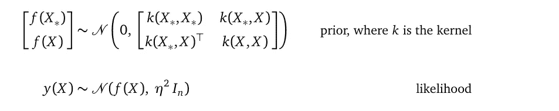

**GP 先验** 高斯过程先验(GP 先验)是随机变量向量 *f(X)* 和 *f(X_*)* 上的多元高斯分布:

*   *f(X)* 是长度为 *n 的随机变量向量；*它代表在训练位置 *X* 的潜在回归函数的可能值。
*   *f(X_*)* 也是一个随机变量向量。它代表在测试位置 *X_** 的潜在回归函数的可能值。它的长度 *n_** 取决于您将要求模型对多少个测试位置进行预测。 *n_** 可以很大。

我将把先验缩短为:

这个多元高斯分布具有零均值，它使用一个核函数 *k* 来定义它的协方差矩阵。协方差矩阵 *k(X，X)* 是一个 *n×n* 矩阵。对于函数 *k* ，你有很多选择，在本文中，我们使用平方指数函数来表示 *k* :

其中信号方差 *σ* 和长度标度 *l* 为模型参数*。*

**似然** 在似然中， *y(X)* 是一个长度为 *n* 的随机变量向量。它来自多元高斯分布，具有均值 *f(X)* 和协方差 *η Iₙ，*其中 *η* 是称为噪声方差的标量模型参数， *Iₙ* 是一个 *n×n* 单位矩阵，因为我们假设了独立的观测噪声。

训练数据 *Y* 被建模为随机变量向量 *y(X)* 的样本。由于 *y(X)* 依赖于 *f(X)* ，我们也将可能性表示为 *p(y(X)|f(X))* 。我将用 *y* 作为 *y(X)* 的简写，用 *p(y|f)* 作为可能性的简写。

由于 *f* 和 *y* 都是多元高斯随机变量，而 *f* 是 *y* 的均值，我们可以将 *y* 改写为 *f:* 的线性变换

然后我们可以应用多元高斯线性变换规则推导出 *y* 的分布，而不用提及随机变量 *f* :

我们可以写下 *y* 的概率密度函数:

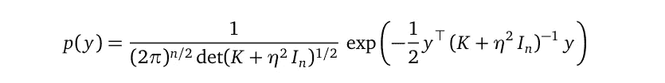

*p(y)* 就是著名的边际似然。

**参数学习** 我们的高斯过程回归模型有三个模型参数，lengthscale *l* ，信号方差 *σ，*和观测方差 *η。我们在建模过程中引入了它们，但是我们不知道应该将这些模型参数设置为什么具体值。我们使用参数学习来找到它们的最佳具体值:*

*   “最优”是指用那些具体的值，我们的模型可以最好地解释训练数据 *(X，Y)* 。而且，
*   “解释训练数据”，在概率建模(这是我们正在做的)的上下文中，意味着训练数据由我们的模型生成的可能性有多大，通过边际可能性 *p(y)* 来衡量。

一旦训练数据 *X* 和 *Y* 被插入，边际可能性 *p(y)* 是具有所有模型参数 *l、【σ】、*和 *η* 的函数。为了找到它们的最佳值，参数学习使用梯度下降来最大化关于那些模型参数的目标函数 *log(p(y))* 。目标函数的公式如下:

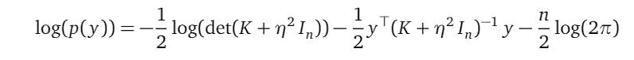

**进行预测** 找到模型参数的最优值(也称为校准模型)后，我们就可以进行预测了。高斯过程模型使用后验分布进行预测。

在我们的具有高斯似然的高斯过程回归模型中，后验 *p(f_*，f|y)* 具有封闭形式的解析表达式。为了在测试位置 *X_** 对 *f_** 进行预测，我们将 *f* 从后面边缘化:

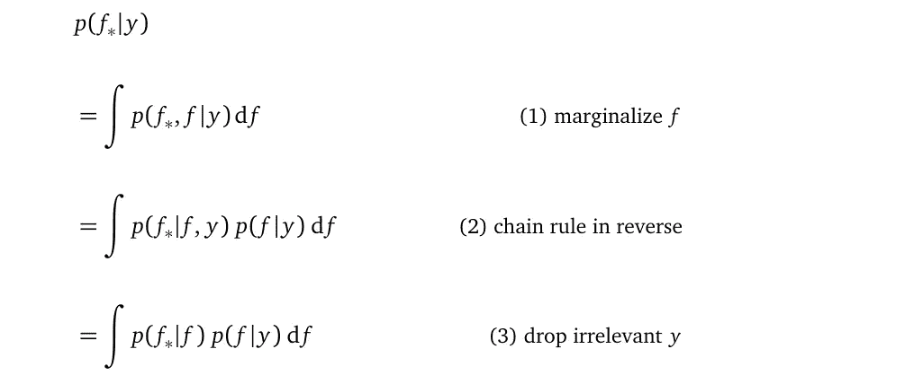

在行(3)处，被积函数包括两个概率密度— *p(f_*|f)* 和 *p(f|y)* 。我们可以通过应用多元高斯条件规则从 GP 先验中导出 *p(f_*|f)* 。贝叶斯法则告诉我们如何计算 p(f|y)。准备好它的成分后，我们可以推导出预测分布的解析表达式 *p(f_*|y)* :

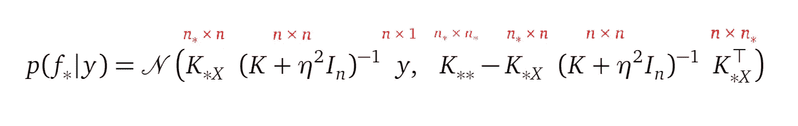

上面表达式中矩阵的形状用红色小符号表示。

请到[理解高斯过程，苏格拉底方式](/understanding-gaussian-process-the-socratic-way-ba02369d804)(*计算后验*部分)获取 *p(f_*|y)* 的完整推导。

预测分布 *p(f_*|y)* 是随机变量向量 *f_** 上的分布，其长度为 *n_** 。其结构揭示了在高斯过程回归模型中， *f_** 是 *y* 的线性变换。该模型试图使用来自 *y.* 的信息来解释 *f_** 内核(函数 *k* ，训练位置 *X，*和测试位置 *X_** )主要决定从 *y* 到 *f_** 的转换，当然还有来自观测噪声*ηiₙ*的帮助

请注意，测试位置 *n_** 的数量可以远大于训练点 *n* 的数量。随着 *n_** 变大，矩阵 *K_*** ， *K_*X* 变大，但是正在求逆的矩阵 *K+η Iₙ* ，保持不变， *n×n* 。

# 矩阵求逆的诅咒

在这个高斯过程回归模型中，参数学习的目标函数和预测分布都提到了矩阵求逆 *(K+η Iₙ)⁻* )。矩阵求逆计算量很大。一个 *n×n* 矩阵求逆尺度中运算(如两个数相加、相乘)的次数，其中 *n，*中 *n* 为数据点数。

具有 10，000 个数据点的数据集的高斯过程回归模型需要 10 次运算来对其协方差矩阵求逆。作为比较，我们的宇宙包含 10⁷⁸到 10⁸原子。一个包含 10，000 个点的数据集在现代标准下是非常小的。

*(K+σ Iₙ)⁻* 是将我们的高斯过程回归模型应用于即使是中等规模的数据集也过于昂贵的原因。

例如，下面是一个包含 10，000 个点的数据集:

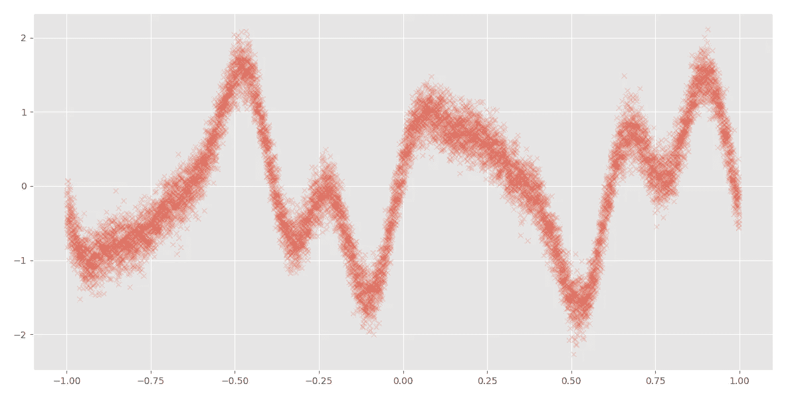

那些小红叉是数据点。当我试图使用该数据集来执行高斯过程回归模型的参数学习时，我看到了以下警告消息，我等待了几个小时，然后我终止了该程序，因为我不想再等待它了——这是一个机器学习模型，不是我的孩子，我对模型没有无限的耐心:

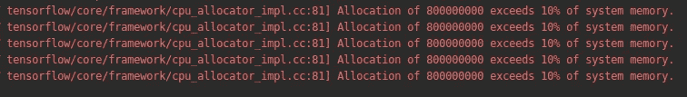

此警告消息表明模型需要分配大量内存来执行矩阵运算。而漫长的等待让你对 *n* 缩放*有了生动的印象。*

# (K+ *σ Iₙ* )⁻为什么会出现？

矩阵求逆 *(K+σ Iₙ)⁻* 出现在目标函数 *log p(y)* 和预测分布中，因为我们使用了来自 g p 先验的以下因子分解:

*   我们使用条件 *p(f_*|f)* 部分进行预测，因为这部分将我们在训练地点知道的(即 *f* )和我们在测试地点不知道的(即 *f_** )联系在一起。 *p(f_*|f)* 见前面推导。
*   我们使用边际 *p(f)* 部分，结合似然*p(y | f)*进行参数学习，因为该部分将观测值可用的随机变量(即 *y* )和观测值不可用的随机变量(即 *f* )联系在一起。 *p(y)* 见前面的推导。

概率论允许我们进行上述因式分解，只要:

1.  *p(f_*|f)* 是一个既提到 *f_** 又提到 *f* 的函数； *p(f)* 是提到 *f* 的函数。这确保了因式分解与关节 *p(f_*，f)* 具有相同的 API。
2.  *p(f_*|f)* 和 *p(f)* 都是合适的概率密度函数。这确保了因式分解仍然是有效的概率密度函数。

选择多元高斯分布作为先验满足了这两个要求，并且使得 *p(f_*|f)* 和 *p(f)* 的推导变得容易:

1.  通过对先验应用多元高斯条件规则来导出 *p(f_*|f)* 。
2.  通过对先验应用多元高斯边际化规则来导出 *p(f)* 。

但是这种因式分解埋下了无法承受的矩阵求逆，因为边际 *p(f)* 是多元高斯分布:

而 *K⁻* 就在这个概率密度函数里。边际似然 *p(y)* 继承了这种反演，做出了自己的贡献 *σ Iₙ* ，产生了那个负担不起的项 *(K+σ Iₙ)⁻。*

# 我们可以降采样吗？

由于数据的大小 *n* 控制着我们很难求逆的协变矩阵 *K* 的形状，我们可以选择训练数据的子集吗？这称为下采样。我们可以，但是机器学习实践者不喜欢下采样，因为:

*   它丢弃了部分训练数据。训练数据是机器学习任务中最有价值的东西。扔掉一部分是一种罪过。
*   很难决定丢弃训练数据的哪一部分。我们是等距降采样吗？

# 可以总结一下训练数据吗？

既然我们不想对训练数据进行下采样，但是处理训练数据对我们来说代价太大，那么我们可以对训练数据进行汇总吗？

让我们引入一组新的随机变量*f(xₛ*，在某些地方简称为*fₛ*xₛ. **Xₛ* 是一个长度为 *nₛ.的标量向量*下标“*ₛ”*代表“稀疏”*。我们不知道那些标量的值，它们是新的模型参数。但是我们确实要求 *nₛ* 比 *n* 小得多——这就是总结的要点。并且我们需要为 *nₛ* 选择数值，它不是模型参数*。***

*我们称 *Xₛ诱导位置*，称 *fₛ诱导随机变量*。不要问为什么。众所周知，机器学习者作为一个群体并不擅长起名。接受这些名字有点意义。*

*目前，在一个已经很昂贵的模型中引入更多的随机变量似乎并不明智，但请继续阅读，因为这被证明是总结所有训练数据的关键。*

# *稀疏变分高斯过程模型*

*我们用 *fₛ* 来总结训练数据是什么意思？不出所料，我们的意思是我们的模型应该以很高的概率生成训练数据。为了实现这一目标:*

1.  *位置 *Xₛ、*处的 *fₛ* 和训练位置 *X、*处的随机变量 *f* 之间必然存在某种关系，换句话说， *fₛ* 和 *f* 不是独立的。这是因为我们要用 *fₛ* 来概括训练数据 *Y.* 和 *Y* 是由观察随机变量 *y* 来建模的，它取决于潜在随机变量 *f* 。如果 *fₛ* 和 *f* 独立，则 *fₛ* 和 *Y* 之间没有联系；因此， *fₛ* 无法总结*y。*我们的 SVGP 模型使用模型的先验来建立这种关系。*
2.  *在给定模型的情况下，需要对训练数据的概率进行度量。模型的可能性定义了这个度量。*

## *稀疏先验*

*我们使用多元高斯分布来建立 *fₛ* 和 *f* 之间的关系作为我们的新先验，我们称之为稀疏先验，因为它包括了稀疏诱导随机变量 *fₛ* :*

*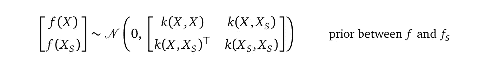*

*我将把它简化为:*

**

*我们可以在先前的密度函数定义中清楚地看到，随机变量 *fₛ* 和 f 是相关的——因为协方差矩阵 *Kₓₛ* 及其转置 *Kₓₛᵀ* 中的非对角元素不为 0。*

*请将上述公式与高斯过程回归模型中的旧先验公式进行比较，此处再次显示:*

**

*通过比较这两个分布，我们发现它们具有相同的结构。这给了我们一些关于诱导变量 *fₛ:* 背后的直觉的提示*

*   *在之前的 SVGP 中，我们用诱导位置*fₛ*xₛ来解释训练位置 *X* 的 *f* 。协方差矩阵 *Kₓₛ* 定义了 *f* 和 *fₛ.之间的相关性*和内核函数 *k* 定义了 *Kₓₛ.中的每个条目**
*   *在 GPR 之前，我们使用训练位置 *X* 处的 *f* 来解释测试位置 *X_** 处的 *f_** 。协方差 *K_*X* 定义了 *f_** 和 *f* 之间的相关性。同样，同一个内核函数 *k* 定义了 *K_*X.* 的每个条目*

*SVGP 先验和 GPR 先验都使用多变量高斯条件规则作为从一个随机变量向量解释另一个随机变量向量的机制:*

*   *SVGP 用 *p(f|fₛ)* 从 *fₛ* 的信息中解释 *f* 。*
*   *GPR 用 *p(f_*|f)* 从 *f* 的信息中解释 *f_** 。*

## *诱导变量背后的直觉*

*认识到 SVGP 和 GPR 先验之间的协同作用给了我们“使用诱导变量来总结训练数据”的定义。*总结*这个词的意思是“用简短的形式表达关于某事最重要的事实”。回到我们之前的 SVGP:*

*   *我们用 *fₛ* 通过条件概率密度函数*p(f|fₛ*来表示 *f* 。*
*   *我们要求诱导变量 *nₛ* 的数量小于(并且通常要小得多)训练数据点 *n* 的数量。这就是诱导变量*汇总*训练数据的原因。这也是我们称 SVGP 模型*稀疏*的原因——我们想在关键诱导位置使用少量诱导变量来解释训练位置的大量随机变量。*

*诱导变量或位置数 *nₛ* 不是模型参数*。*我们需要决定它的值*。*在我们决定了 *nₛ的值之后，*我们将有一个长度为 *nₛ* 的矢量 *Xₛ* ，代表那些诱导变量的位置。我们不知道那些位置在哪里，它们是模型参数，并且我们将使用参数学习来为那些诱导位置以及其他模型参数找到具体值。*

*你可能想知道，为什么我们假设我们可以为诱导位置 *nₛ* 的数量提供一个好的值，但是把计算这些位置的工作留给优化器？因为对我们来说，为实际位置得出一个单一的整数比得出 *nₛ* 浮点数(或浮点向量，如果 *X* 是多维的)更容易。我们在使用聚类算法时做了同样的事情—我们假设我们很清楚数据中有多少个聚类，并让聚类算法计算出每个聚类的中心位置。*

## *SVGP 先验应该超过 f，f *ₛ和 f_*？**

*在上面，我写的稀疏先验是在 *f* 和 *fₛ.之间的联合分布*你可能会问，这个先验不也应该包括测试位置 *X_** 的随机变量向量 *f_** 吗？是的，你是对的，完全稀疏 SVGP 先验的确是:*

*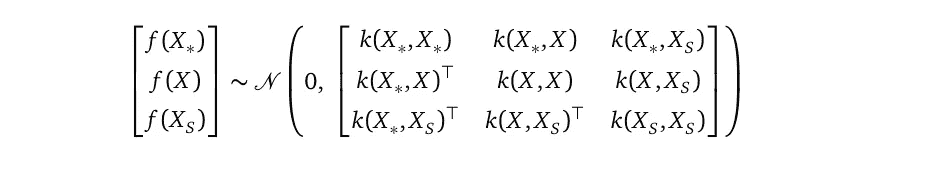*

*但是为了参数学习的目的，我们可以将多元高斯边际化规则应用于这个完整的，然后积分出 *f_** ，就像我们一直做的那样。只有我们做预测的时候，才会通过多元高斯条件规则把 *f_** 带回来。*

## *同样的可能性*

*和以前一样，我们使用可能性来建立先验数据和训练数据之间的联系。我们继续使用相同的高斯似然性:*

*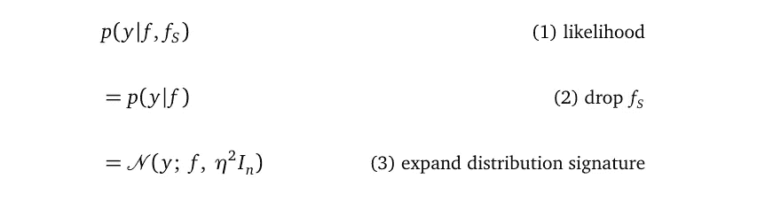*

## *衡量我们的模型解释训练数据的能力*

*我们需要一个量来衡量诱导变量对训练数据的总结程度。边际可能性 *p(y)* 是我们的度量。它报告了一个介于 0 和 1 之间的浮点数——给定我们的模型的数据的概率。我们可以在我们的 SVGP 模型中推导出 *p(y)* 的公式如下:*

*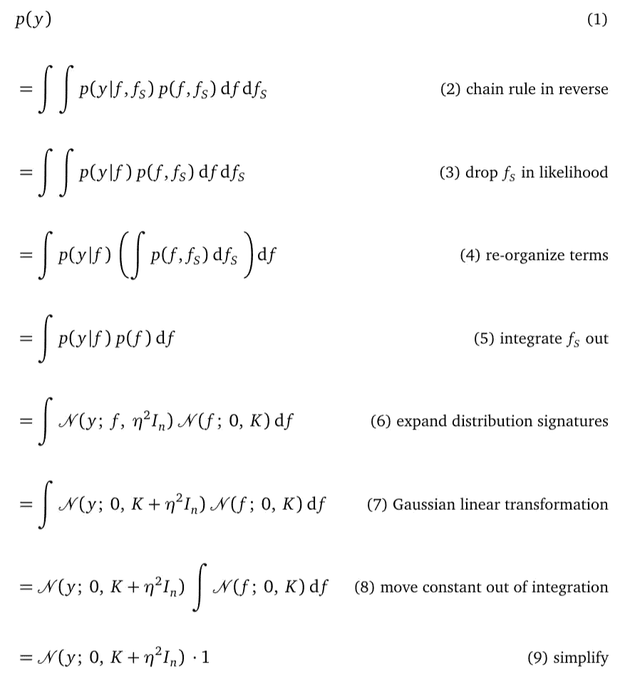*

*第(2)行给出了我们为什么选择边际可能性 *p(y)* 作为我们的度量的理由。第(2)行显示 *p(y)* 被定义为关于 SVGP 先验中的随机变量 *f* 和 *fₛ* 的期望。因此 *p(y)* 是数据 *y* 的平均似然，通过权重 *p(f，fₛ).】考虑了 *f* 和 *fₛ* 的所有可能值*我们说: *f* 和 *fₛ* ，作为随机变量，可以以不同的概率取不同的值。 *f* 和 *fₛ* 的每一个不同的值通过可能性 *p(y|f，fₛ).)产生不同的数据概率*因此，为了衡量我们的模型平均生成训练数据的能力，我们使用这些可能性概率的加权和，即 *p(y)* 。*

*顺便说一下，推导边际似然公式很重要，不仅因为它是我们的模型如何解释训练数据的度量，而且它是我们需要计算后验概率 p(f，fₛ|y)的一个量:*

*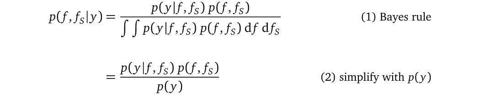*

*在分母中，我写了两个整数符号，一个是给 *f* 的，一个是给 *fₛ* 的。你可以看到第(2)行分母上的边际可能性 p(y) 。*

# *回到起点？*

*从我们的 SVGP 模型来看边际可能性 *p(y)* 的最终公式:*

**

*我们意识到这与我们在高斯过程回归模型中的公式是一样的。随之而来的有两个问题:*

1.  *该公式提到了 *n×n* 协方差矩阵 *K.* ，因此我们仍然有昂贵的矩阵求逆。*
2.  *这个公式只提到了长度尺度 *l* ，信号方差 *σ，*和观测噪声方差 *η。*没有提到诱导位置 *Xₛ* ，也是模型参数*。*参数学习的有效目标函数必须包括所有模型参数。所以这个公式不是一个有效的目标函数。*

*因此，即使在可能性是高斯的情况下，我们也不能使用贝叶斯规则来计算后验概率，并且我们不能使用 *log p(y)* 作为参数学习的目标函数。*

*推导哪里出错了？当我们从联合分布 *p(f，fₛ).】中整合出 *fₛ* 时，就是上面推导的第(5)行*这一步不仅导致边际分布 *p(f)* ，这是我们想要避免的；它还删除了所有提及 *Xₛ、*kₛₛ.的内容*

*由于应用贝叶斯规则计算后验概率需要计算边际似然 *p(y)* 并且计算 *p(y)* 最终会出现上述问题，所以我们需要考虑另一种计算后验概率的方法，不需要计算 *p(y)* 。*

*变分推理技术直接逼近后验概率 p(f，fₛ|y)t29，而不是使用贝叶斯规则。因此，它不需要计算边际可能性 *p(y)* 。为了刷新您对高斯过程模型的变分推断的记忆，请进入[变分高斯过程——当事情不是高斯的时候该怎么办](/variational-gaussian-process-what-to-do-when-things-are-not-gaussian-41197039f3d4)。*

*顺便说一下，变分推断在高斯过程之外的贝叶斯模型中被广泛使用。[揭开 Tensorflow 时间序列的神秘面纱:局部线性趋势](/demystifying-tensorflow-time-series-local-linear-trend-9bec0802b24a)展示了 Google 的 Tensorflow 时间序列库如何使用它来计算时间序列模型的后验概率。并且[去噪扩散模型](https://medium.com/towards-data-science/understanding-the-denoising-diffusion-probabilistic-model-the-socratic-way-445c1bdc5756)用它生成人脸。*

*让我们试试变分推理。*

# *变分推理*

*后验概率 p(f，fₛ|y) 是随机变量向量 *f* 和 *fₛ.的联合分布*变分推理使用一种新的分布 *q(f，fₛ)*称为变分分布，来逼近真实的后验概率 *p(f，fₛ|y).*分布 *q(f，fₛ)* 在同一组随机变量上，我们要求它的行为与真实后验相似。那就是 *q(f，fₛ)* 逼近后 *p(f，fₛ|y)* 的意思。*

*变分推理技术给了我们 *ELBO* 公式。通过相对于模型参数最大化 *ELBO* ，我们最终得到一个 *q(f，fₛ)* ，它近似于真实的后验概率 *p(f，fₛ|y)* 。*

*让我们首先决定变分分布 *q(f，fₛ)* 的结构，然后推导出 *ELBO* 的公式。*

*顺便说一下，由于我们正在使用变分分布 *q(f，fₛ)* 来逼近后验 *p(f，fₛ|y)* ，我们的模型可以处理高斯和非高斯似然性——这是将变分推理引入高斯过程世界的最初动机，参见[此处](/variational-gaussian-process-what-to-do-when-things-are-not-gaussian-41197039f3d4)。*

## **q(f，fₛ)应该是什么样子的？**

*让我们提出变分分布 *q(f，fₛ)* ，它是一个联合分布*，*由下面的因式分解 *:* 定义*

**

*其中 *p(f|fₛ)* 是通过将多元高斯条件规则应用于稀疏先验 *p(f，fₛ)* 而得到的，并且 *q(fₛ)* 是多元高斯分布。*

*我说“提议”是因为我们是建模者，我们有充分的自由来决定 *q(f，fₛ)* 的公式应该是什么，只要它是一个提到随机变量 *f* 和 *fₛ* 的表达式，并且它是一个在 *f* 和 *fₛ* 的所有可能值上积分为 1 的适当的概率密度。我们建议将联合 *q(f，fₛ)* 分解成两个分量 *p(f|fₛ)* 和 *p(fₛ)* ，并为它们选择特定的形式，如下所述，因为它们给我们数学上的便利。*

****【p(f|fₛ】*分布** 稀疏 GP 先验再次显示如下，我用红色符号标注了它的不同组成部分，为多元高斯条件规则应用做准备。*

**

*多元高斯条件规则是:*

*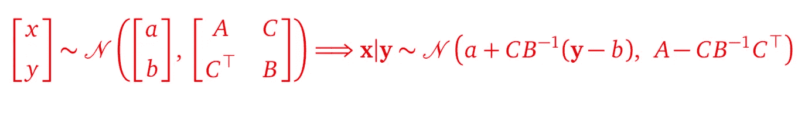*

*在推导之前将此规则应用于稀疏 GP:*

*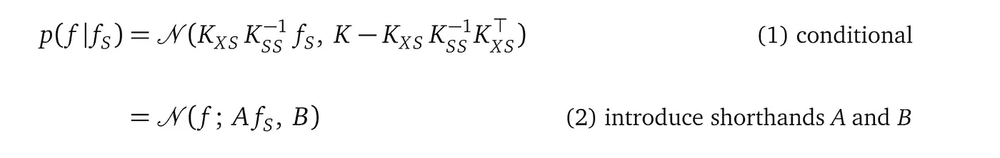*

*随着*

**

*需要注意的是， *A* 和 *B* 只提到了 *Kₛₛ* 的逆，一个更小的 *nₛ×nₛ* 矩阵。他们不提 *K* 的逆，是一个更大的 *n×n* 矩阵*。*在 *A* 和 *B* 中，矩阵 *Kₓₛ* 的大小为 *n×nₛ* 可以大，因为 *n* 可以大。但是我们不需要逆 *Kₓₛ* ，所以它的大小不成问题。*

*这样选择 *p(f|fs)* 的好处是使 *ELBO* 的推导更简单。我会在我们完成 *ELBO* 的推导时指出这些优点。*

****q(fₛ)*分布** *q(fₛ)* 是变分分布 *q(f，fₛ)* 因式分解*里面的一个分量。*我们称 *q(fₛ)* 边际变分分布，因为它只提到联合中两个随机变量向量之一 *q(f，fₛ).**

*我们需要决定 *q(fₛ)* 是什么样子，不出所料，我们将 *q(fₛ)* 定义为多元高斯分布:*

**

**μ* 是均值向量；它的长度是 *nₛ* ，诱导变量的个数。*σ*是协方差矩阵；它的尺寸是 *nₛ×nₛ.**

## *为什么我们选择把 q(f，f *ₛ)因式分解成* p(f|fₛ)q(fₛ) *？**

*尽管我们可以自由决定变分分布*q(f，fₛ)*应该是什么样子，但它值得我们解释一下为什么我们选择了这个特殊的因式分解*p(f|fₛ)q(fₛ).**

*首先，为什么我们决定进行因式分解，而不是直接处理联合 q(f，fₛ)？在接缝上工作意味着将变分分布定义为:*

**

*以 *m₁* 和 *m₂* 、 *C₁* 、 *C₂、*和 *C₃* 为模型参数。*

*你可以这样做，但是 *ELBO* 的推导就变得复杂了。更有问题的是，这个模型的参数会比数据点的数量更多。正如我们在[变分高斯过程中所解释的——当事情不是高斯的时候该怎么办](/variational-gaussian-process-what-to-do-when-things-are-not-gaussian-41197039f3d4),*一个有太多参数的模型？*节，这样的模型容易过拟合。*

*第二，鉴于我们更喜欢做因式分解而不是联合，根据概率论，你要么做*【p(f|fₛ)q(fₛ】*要么做*【p(fₛ|f)p(f】*，没有其他办法*。*我们该选哪个？*

*显然，我们已经吸取了教训，要远离边际 *p(f)* ，这将导致 *n×n* 矩阵求逆*。*取而代之，我们用 q( *fₛ)，*其中只有*有*一个 *nₛ×nₛ* 矩阵求逆*。*我们可以选择一个足够小的 *nₛ* 这样计算成本是可以承受的，但是引入的变量数量太少就不能很好的概括训练数据。天下没有免费的午餐。所以我们最终选择了 *p(f|fₛ)q(fₛ)* 因式分解。*

## *厄尔布河*

*由于边际似然 *p(y)* 是我们对 SVGP 模型解释训练数据的程度的度量，我们希望根据模型参数最大化它。为了计算方便，我们通常最大化 *log p(y)* 。由于 *log p(y)* 很难计算(此处[为](/variational-gaussian-process-what-to-do-when-things-are-not-gaussian-41197039f3d4)看原因)，变分推理技术使用 *ELBO* 公式作为备选的最大化目标函数。 *ELBO* 的推导如下:*

*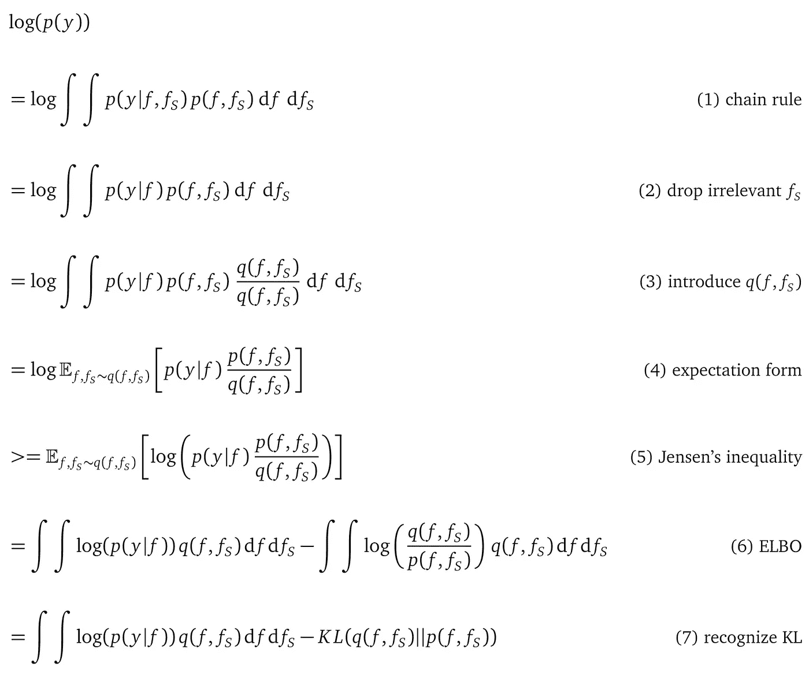*

*第(7)行揭示出 *ELBO* 由两项组成，第一项称为似然项，第二项称为 KL 项。我们需要推导这两项的解析表达式，这样梯度下降算法可以计算解析 *ELBO* 相对于模型参数的梯度。*

***似然项***

*这里我们进一步操纵可能性项:*

*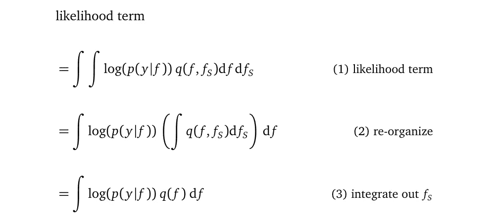*

*第(1)行是在 *ELBO 中定义的似然项。**

*第(2)行将 *fₛ* 上的积分归入括号中。*

*第(3)行计算括号中的积分到边缘 *q(f)* 中。*

**q(f)* 是由联合变分分布 *q(f，fₛ)*通过积分 *fₛ* 出*得到的随机变量向量 *f* 的边际。*注意 *q(f)* :*

*   **q(f)* 是随机变量向量的一个分布 *f* ，它不是边际变分分布*q(fₛ)=q(fₛ；μ, Σ).*后者是一个分布在随机变量上的向量 *fₛ.**
*   **q(f)* 不是我们可以利用多元高斯边缘化规则直接从 SVGP 先验中读出的边际 *p(f)* 。*

*我们不能使用多元高斯边际化规则简单地从联合分布 *q(f，fₛ).】中读出边际分布 *q(f)** 这是因为变分分布 *q(f，fₛ)* 没有被定义为多元高斯分布；它被定义为因式分解 *p(f|fₛ) q(fₛ).**

*我们需要推导出 *q(f)的解析表达式。*但是由于这种因式分解，推导边际 *q(f)* 很简单:*

*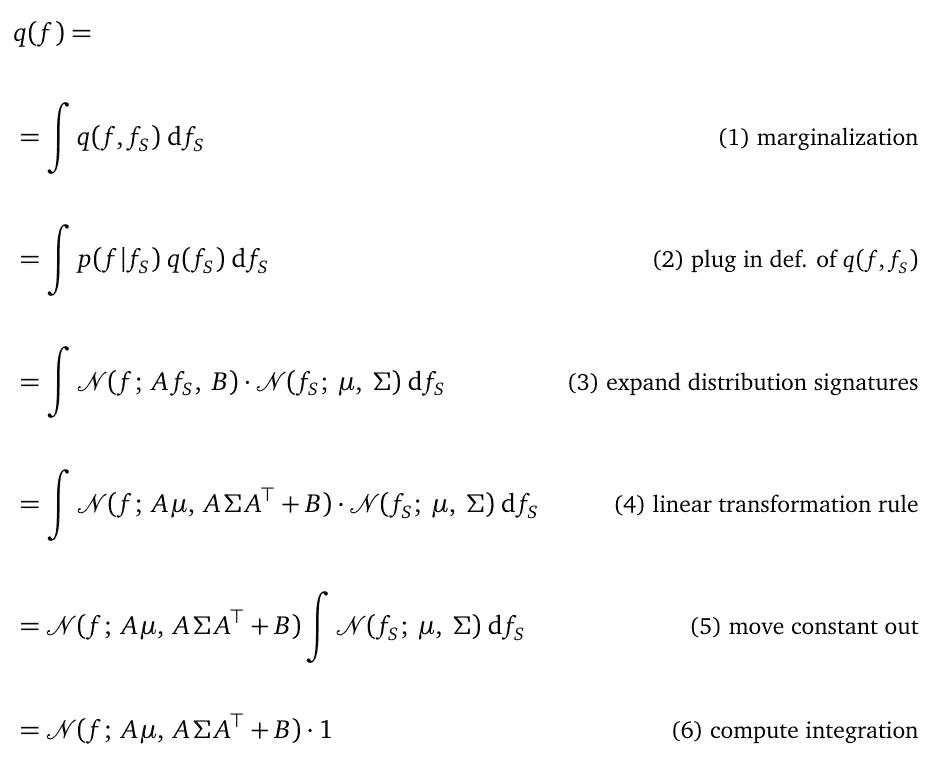*

*线(1)将联合变分分布 *q(f，fₛ).】中的随机变量 *fₛ* 积分**

*第(2)行写出了我们之前定义的 *q(f，fₛ)* 的因式分解公式。*

*第(3)行显示了 *p(f|fₛ)=𝒩(f 的概率密度函数；Afₛ，B)* 即我们之前推导出的，*为 q(fₛ的概率密度函数；μ，σ)*，这是我们提出来的。*

*第(4)行应用多元高斯线性变换规则将概率密度函数 *p(f|fₛ)* 转换成不提及 *fₛ.的表达式*反而提到参数 *μ* 是来自分布 *q(fₛ的*σ*；μ, Σ).*这一行显示了**在变分分布 *q(f，fₛ)——*的定义中引入条件 *p(f|fₛ)* 的一个好处**我们可以记下*𝒩(f；Aμ，aσaᵀ+b)*没有提到随机变量 *fₛ.*这使得下一行成为可能。*

*线(5)将随机变量 *f* 的分布移出积分，因为它没有提到 *fₛ* ，并且相对于 *fₛ.上的积分是常数**

*第(6)行计算积分为 1，因为概率密度函数积分为 1。*

*随着 *q(f)* 的导出， *ELBO* 中的似然项变为:*

**

*内部分布*𝒩(f；Aμ，aσaᵀ+b)，A* 和 *B* 只提到了一个单矩阵求逆 *— Kₛₛ⁻* ，其大小为 *nₛ×nₛ.公式中没有提到昂贵的 K⁻。**

*似然项是一个 n 维积分。我们可以使用高斯求积([这里](/variational-gaussian-process-what-to-do-when-things-are-not-gaussian-41197039f3d4)看如何)来导出近似这个积分结果的解析表达式。结果是具有以下模型参数的函数:*

*   *观测噪声方差 *η* ，从似然 *p(y|f)* 。*
*   *长度刻度 *l* ，信号方差σ 和感应位置 *Xₛ* 来自 *A* 和*b**
*   *参数 *μ，σ来自 q(fₛ).**

*所以似然项提到了所有的模型参数。*

****fₛkl(q(f,fₛ)||p(f)*任期***

*现在我们推导出 *ELBO* 中 KL 项的解析表达式。*

*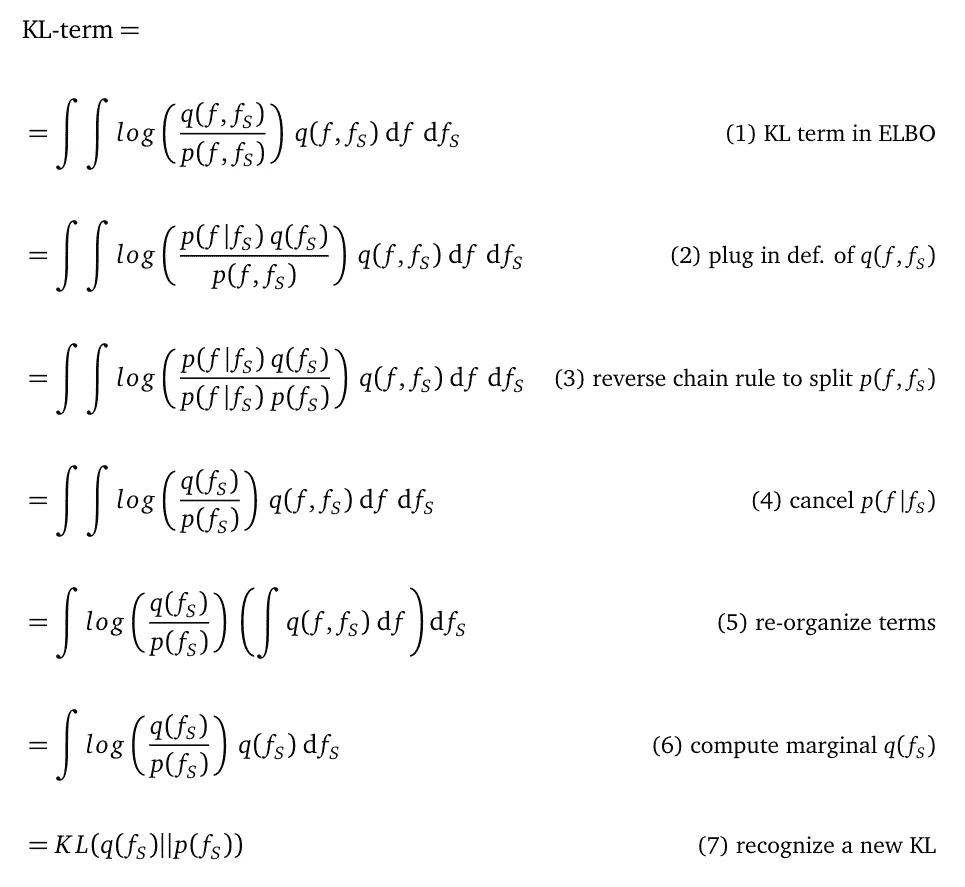*

*第(2)行插入变分分布的定义 *q(f，fₛ).**

*第(3)行使用反向链规则在 *p(f，fₛ).之前分割 GP**

*第(4)行从分数中取消了 *p(f|fₛ)* 项。这是**将变分分布 *q(f，fₛ)* 定义为因式分解 *p(f|fₛ)q(fₛ的另一个优点***——我们可以取消 *p(f|fₛ)* 项来简化我们的计算。*

*第(5)行将提到随机变量向量的项重新组织成它自己的积分。*

*第(6)行计算这个内部积分，留下分布 *q(fₛ).*注意，之前我们将该分布定义为*q(fₛ)=𝒩(fₛ；μ, Σ).**

*第(7)行认识到最终公式是边际变分分布*q(fₛ*和边际 GP 先验 *p(fₛ).之间的新 KL 散度**

*双双*q(fₛ)=𝒩(fₛ；μ，σ)*和*p(fₛ)=𝒩(fₛ；0，Kₛₛ)* 是多元高斯分布，所以它们的 KL 散度是解析的。这就是****选择*【q(fₛ】*作为多元高斯分布的优势**。 *q(fₛ)* 和 *p(fₛ)* 之间的 KL 散度为:***

***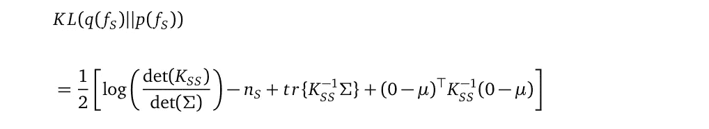***

****det* 是矩阵行列式运算符。 *tr* 是追踪运算符。 *nₛ* 是随机变量向量 *fₛ* 的长度，或者等价地，诱导位置的个数*。*这个公式也只提到了单矩阵求逆 *Kₛₛ⁻。*这还不包括昂贵的 *K⁻* ，它的尺寸是 *n×n.****

***上面的表达式已经是解析的了。它提到了以下模型参数:***

*   ****μ* 和*σ*来自边际变分分布*q(fₛ；μ, Σ).****
*   ***长度刻度 *l* ，信号方差σ *和感应位置 *Xₛ* 来自 *Kₛₛ.*****

***请注意这个 KL 术语根本没有提到我们的训练数据 *(X，Y)* 。***

***现在我们已经推导出了 *ELBO* 的解析表达式，并准备将其用作参数学习的目标函数。***

# ***参数学习***

****ELBO* 的解析表达式是一个以所有模型参数为自变量的函数。我们使用梯度下降来最大化 *ELBO* 以找到那些模型参数的最优值。***

## ***我们的模型中有多少参数？***

***让我们首先计算一下模型参数中包含的标量的数量:***

*   ***lengthscale *l* ，来自内核函数，是一个单标量*。****
*   ***同样来自内核函数的信号方差σ ，是单标量*。****
*   ***来自高斯似然的观测噪声方差 *η* 是单个标量。***
*   ***边际变分分布 *q(fₛ)* 的均值向量 *μ* 有长度 *nₛ* ，所以它包含 *nₛ* 标量。***
*   ***来自边际变分分布*q(fₛ*的协方差向量*σ*具有形状 *nₛ×nₛ* 。它是一个对称矩阵，所以它包含 *nₛ(nₛ+1)* 标量*。****

***我们的模型包含 *3+ nₛ(nₛ+1)* 可训练标量，我们需要通过梯度下降*找出它们的值。*而且我们可以选择诱导点数 *nₛ* 来控制要学习的标量总数。我们可以选择一个小的 *nₛ* ，这样我们模型中的标量总数就大大小于训练数据点 *n* 的数量。***

***定义*q(fₛ*以减少可训练标量数量的另一种流行方法是平均场参数化。关于平均场参数化的更多细节，参见[此处的](/variational-gaussian-process-what-to-do-when-things-are-not-gaussian-41197039f3d4)，q 部分的*平均场参数化。****

## ***我们应该使用多少个诱导位置？***

***我们需要决定使用多少诱导位置 *nₛ* 。我们使用的诱导位置越多，模型就能越好地用相应的诱导变量 *fₛ* 总结你的训练数据，但是计算，即矩阵 *Kₛₛ* 的逆矩阵，就越昂贵*。****

***因为我们希望我们的诱导变量能够很好地总结训练数据点，所以我们应该在遍历训练数据的基础函数中的每个波峰和波谷至少使用一个诱导点。***

***当然，只有当你的 *X* 是一个或者两个维度的时候，你才能够可视化你的训练数据来看到那些波峰和波谷。***

***因此，一个实用的经验法则是，在你的预算允许的情况下，使用尽可能多的诱导变量，比如时间、记忆。例如，你从较少的诱导位置开始，逐渐增加 *nₛ* ，看看你是否能在预算内得到更大的 *ELBO* 。***

## ***随机梯度下降***

*****全梯度评估可能很昂贵** 在稀疏先验的情况下，即使我们不存在对大矩阵求逆的问题，但在使用梯度下降的参数学习期间，我们仍然存在潜在的内存和速度问题。这是因为梯度下降在每个优化步骤执行以下三个任务:***

1.  ***它首先从 *ELBO 的解析表达式中计算出每个可训练标量的部分梯度表达式。*这导致 *3+ nₛ(nₛ+1)* 解析偏梯度表达式*。*实际上，梯度下降只计算这些解析表达式一次。这里我们假设梯度表达式是在每一步计算的，以便于理解。***
2.  ***然后，它插入训练数据 *(X，Y)* ，以及 *3+ nₛ(nₛ+1)* 标量的所有当前值，以将那些解析部分梯度表达式评估为具体梯度，具体梯度是长度为 *3+ nₛ(nₛ+1).的浮点向量****
3.  ***最后，它使用这个浮点梯度向量来更新那些可训练标量的值。***

***当训练数据很大时，任务 2 的开销很大。让我们通过研究 *ELBO* 公式来看看为什么:***

***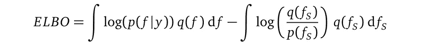***

***在右边，第一项是可能性项。第二项是 KL 项。***

***KL 术语没有提到训练数据(不是 *X* ，也不是 *Y* ) *:****

*   ****q(fₛ)=𝒩(fₛ；μ，σ)*，并未提及 *X 或*y***
*   ****p*(*fₛ)=𝒩(fₛ；0，Kₛₛ)，*其中 *Kₛₛ* 提到 *Xₛ* ，而不是 *X.****

***所以计算 KL 项有多贵，取决于我们完全可以控制的诱导变量 *nₛ* 的数量。换句话说，我们可以选择一个足够小的 *nₛ* ，这样计算 KL 项的梯度就不会很昂贵。***

***另一方面，似然项提到了完整的训练数据 *(X，Y):****

*   ****log(p(f|y))* 通过观察随机变量 *y* 提到 *Y* 。***
*   ****q(f)=𝒩(f；Aμ，aσaᵀ+b)*通过矩阵 *A* 和 *B* 提到*x*是因为 *X* 出现在 *K* 和 *Kₓₛ* :***

******

***当训练数据很大时，在每个优化步骤评估似然项的梯度是昂贵的。我们无法控制这个梯度计算有多贵——数据点的数量 *n* 决定它有多贵，我们希望我们所有宝贵的数据点都参与参数学习。***

*****随机梯度评估救援** 随机梯度下降(SGD)是梯度下降算法的一种变体。它通过在每个优化步骤仅计算在训练数据的子集上评估的目标函数的梯度，解决了昂贵的梯度评估的问题。当训练数据的这个子集包含单个数据点时，使用术语随机梯度下降。当该子集包含多个训练数据点时(该子集被称为小批量)，使用术语小批量随机梯度下降。在下文中，对于较短的句子，我使用 batch 代替 mini-batch，并使用随机梯度下降来表示 mini-batch 随机梯度下降。***

***如果你不确定“计算在一批数据上评估的目标函数的梯度”是什么意思，请参阅本文的附录。***

***在高层次上，随机梯度下降算法执行以下操作:***

1.  ***从训练数据中随机均匀抽样，替换一批 *m* 个数据点，其中 *m* 为该批的大小。***
2.  ***然后按照原始梯度下降算法中的步骤，使用批处理，就好像它是完整的训练数据一样。***

***通过控制批量大小 *m* ，我们可以控制每个优化步骤的梯度评估的成本。***

***这具有巨大的实际影响。通过使用随机梯度下降，有时您可以将花费在参数学习上的时间从一天减少到一个小时以内。***

***但是这种便利伴随着一个问题:由于对一个批次进行采样的随机性，对一个批次计算的梯度变得随机——不同的批次给你一个困难的梯度。我们称之为*随机梯度*。这种算法因此而得名。***

***我们可以将每个采样数据点视为一个随机变量。这个随机变量可以以 *1/n* 相等的概率取 *n* 个不同的值，其中 *n* 为训练数据点的数量。这是因为我们对一批数据点随机、均匀地进行采样，并进行替换(因此，当您绘制第二个数据点时，您仍然是从具有 *n* 个点的同一数据集中进行绘制)，从训练数据中进行采样。对一批中的那些随机变量的梯度评估变成随机变量本身。更多详情见附录。***

***我们希望确保随机梯度下降渐近收敛到梯度下降收敛到的相同模型参数值。这是因为来自梯度下降的结果是我们作为正确答案的参考，通过切换到快速随机梯度下降算法，我们仍然希望得到相同的结果，至少是渐近的。为了保证渐近地得到相同的结果，我们要求随机梯度是梯度下降算法计算的全梯度的无偏估计量。这意味着随机梯度的期望与完全梯度相同。***

***这具有直观的意义:梯度下降使用在全部训练数据上计算的梯度作为方向来更新模型参数的值。另一方面，随机梯度下降使用在训练数据子集上计算的随机梯度。因此，单个随机梯度很可能不会像全梯度那样指向同一个方向。但是如果平均起来，随机梯度(许多批次的平均值)与完全梯度指向相同的方向，我们就可以了。***

***本文附录证明了随机梯度是全梯度的无偏估计量。因此，我们可以使用随机梯度下降来优化 SVGP 模型的 *ELBO* 。***

# ***优化难度***

***我们使用梯度下降来最大化目标函数*艾尔博*。如果我们仔细想想， *ELBO* 在一个公式中结合了两种优化:***

1.  ***找到核参数 *l* 和 *σ，*和噪声方差 *𝜂，*和诱导位置 *Xₛ* 的值，使得真实后验很好地解释训练数据。***
2.  ***找到变分参数 *μ，σ*的值，使得变分分布*q(f；μ，σ)*近似于真实的后井。***

***直到现在，我们假设梯度下降可以为我们做这些。但这对于梯度下降来说要求太高了。这在数学上意味着:ELBO 可以是高度非凹的，有很多局部极大值。梯度下降法作为一种局部优化方法，会卡在一个局部最大值上，不一定是一个好的局部最大值。因此，我们如何优化这些模型就成了它自己的艺术/科学:***

*   ***使用哪个优化器，亚当还是自然渐变？***
*   ***我们如何衰减学习率，分段衰减，还是指数衰减？***
*   ***我们如何在优化开始前初始化模型参数？***
*   ***我们如何处理数值不稳定性？对于高斯过程模型，这意味着当我们对一个矩阵求逆时[乔莱斯基分解](https://en.wikipedia.org/wiki/Cholesky_decomposition)失败。***

***这是一个很大的话题，我将在未来的几篇文章中解释它。***

# ***做预测***

***贝叶斯模型使用后验分布进行预测。给定一些测试位置 *X_** ，我们可以导出预测分布 *p(f_*|y)。*我们用 *p(f_*|y)* 来做预测。但在此之前，让我们想想我们的 SVGP 模型如何能够做出预测。***

***答案归结为测试位置 *X_** 的随机变量 *f_** 与诱导位置 *Xₛ.的随机变量 *fₛ* 如何相关*下面再次显示的完整 SVGP 先验定义了这种关系:***

******

***SVGP 先验使用相同的核函数 *k* 将每对随机变量联系在一起，无论它们来自 *f_** 、 *f* 还是 *fₛ.*核函数 *k* 有两个参数，lengthscale *l* 和信号方差 *σ* 。参数学习为 *l* 和 *σ找到单个值。*这意味着模型将使用相同的相关结构(多变量高斯条件)来:***

*   ***从诱导变量*fₛ*xₛ.*解释或总结训练地点 *X* 的训练数据 *f (* 通过可能性*p(y | f)】*****
*   ***从诱发变量*fₛ*xₛ.*解释或预测测试点*f _ **x _ *****

***我们假设测试数据来自与训练数据相同的生成过程。如果这个假设不成立，就不会存在一个可以从过去学习并预测未来的模型。在这种假设下，如果具有通过梯度下降找到的参数值的核函数能够使用诱导变量(在高边际可能性 *p(y)* 意义上，或者等价地，在高 *ELBO* 意义上)来总结训练数据，则具有相同参数设置的相同核应该允许我们从相同的诱导变量集合对 *X_** 处的测试位置处的 *f_** 做出合理的预测。这就是 SVGP 模型能够做出预测的原因。***

***现在，我们来推导实际的预测分布 *p(f_*|y)* 。***

## ***导出预测分布 p(f_*|y)***

***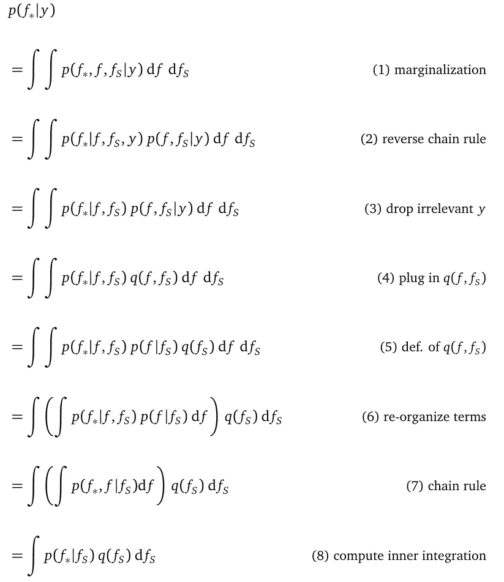***

***第(1)行从全后验 *p(f_*，f，fₛ|y)* 中边缘化 *f* 和 *fₛ* 给你预测分布 *p(f_*|y)* 只针对 *f* 。但是请注意，我们不知道 *p(f_*，f，fₛ|y)* 的联合概率密度，我们必须将其分解成一些分量分布的乘积，这些分量分布的概率密度是我们已知的。***

***第(2)行对关节 *p(f_*，f，fₛ|y)* 应用反向链规则，将其分解为两个分量 *p(f_*|f，f_ₛ，y)* 和 *p(f，fₛ|y).****

***第(3)行丢弃了不相关的 *y* ，因为给定 *f* 和 *fₛ* ，随机变量 *f_** 独立于 *y.* 我们可以做到这一步，因为我们将模型设计成具有这样的性质:f_* 独立于 *y，*给定 *f* 和 *fₛ.****

***第(4)行将变分分布 *q(f，fₛ)* 插入后验分布 *p(f，fₛ|y)* 的位置，因为 *q(f，fₛ)* 近似于后验分布。***

***第(5)行插入了 q(fₛ).的定义***

***第(6)行将提到 *f* 的所有术语重新组织成自己的内部集成，覆盖 *f* 。***

***第(7)行应用链式法则来简化内部积分。***

***第(8)行通过将 *f* 排斥在关节 *p(f_*，f|fₛ)* 之外来计算内部积分，从而产生 *p(f_*|fₛ)* 。***

*****预测分布未提及训练数据** 第(8)行的公式揭示了预测分布仅取决于诱导变量 *fₛ* ，而不取决于训练位置的随机变量 *f* 。这意味着来自训练数据的所有信息都被吸收到分布 q(*fₛ；μ，σ)*和梯度下降为其他模型参数找到的值 *l* 、 *σ、*和 *η。*参数学习后，模型不再需要训练数据。这说明诱导变量真实地概括了训练数据。这与高斯过程回归模型不同，高斯过程回归模型需要训练数据进行预测。***

***因此 *f_** 的预测分布为:***

******

***我们知道*q(fₛ)=𝒩(fₛ；μ，σ)*，我们可以通过对稀疏先验 *p(f_*，fₛ)* 应用多元高斯条件规则来推导出 *p(f_*|fₛ)* 的公式，它已经将 *f* 边缘化了:***

******

***这导致了条件 *p(f_*|fₛ)* 的公式:***

***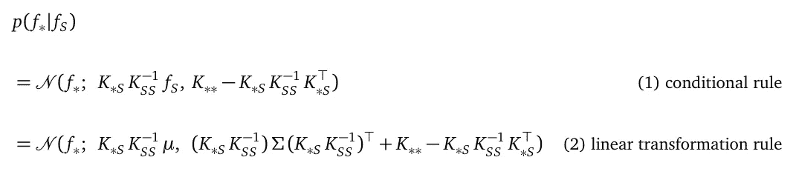***

***第(1)行是条件规则应用的结果。揭示了 *f_** 是随机变量 *fₛ.的线性变换****

***第(2)行应用多元高斯线性变换规则推导出 *p(f_*|fₛ)* 的公式，其中提到了来自 *q(fₛ的 *μ* 和*σ*；μ，σ)，*但没有提到 *fₛ.****

***现在我们可以写出预测分布的公式 *p(f_*|y)* :***

***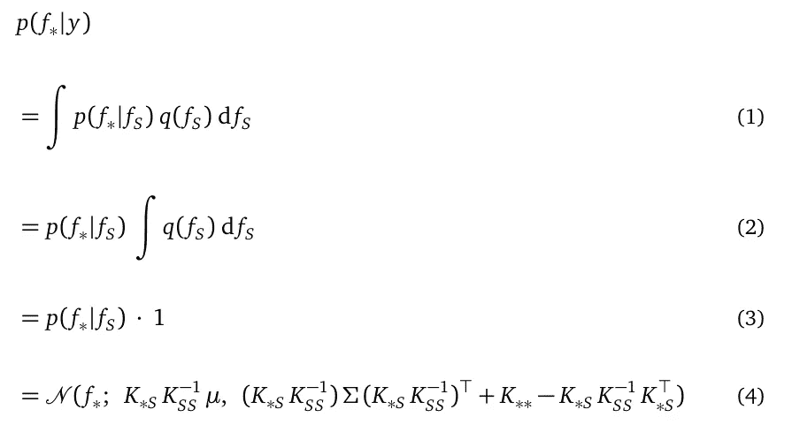***

***第(1)行是预测分布的定义。***

***第(2)行将 *p(f_*|fₛ)* 移至积分之外，因为它是一个没有提到 *fₛ* (尽管有符号 *p(f_*|fₛ)* 提到 *fₛ* ) *的公式。*所以它对于在 *fₛ.上的积分是常数****

***第(3)行将积分计算为 1，因为概率密度函数积分为 1。***

***第(4)行显示了 *p(f_*|fₛ).的公式****

***预测分布的公式很长。不需要完全解析它们。这是机械地应用多变量高斯分布的一些规则的结果。需要注意的是，在这个公式中:***

1.  ***我们只需要对矩阵 *Kₛₛ* 求逆。我们可以通过决定诱导位置 *nₛ* 的数量来完全控制这种转化的成本。***
2.  ***最终的公式证实，为了进行预测，SVGP 模型不再需要训练数据——该公式没有提到 *X* 或 *Y* 。***

# ***结果，和更好的结果***

***让我们将 SVGP 模型应用于具有 10，000 个点的示例数据集。我用 15 个等距诱导位置初始化模型，进行了 30000 步随机梯度下降进行参数学习，每批由 100 个数据点组成。这里的代码是[这里是](https://gist.github.com/jasonweiyi/7a79da8a4cf72c2c86a205027c5e2fb9)。***

***不再有内存消耗警告，参数学习过程不到一分钟就完成了。***

***下图显示了参数学习前后我们的模型预测。顶部的图显示的是之前的情况，底部的图显示的是之后的情况。***

***在每个图中，红叉是训练数据点。粗蓝色曲线是测试位置的平均模型预测(后验均值)，伴随着 95%的置信区间(根据后验方差计算)，显示为浅蓝色带。我选择测试位置为-1 和 1 之间的 100 个等距点。零 x 轴线上的小黑点是这 15 个诱导位置的位置。***

***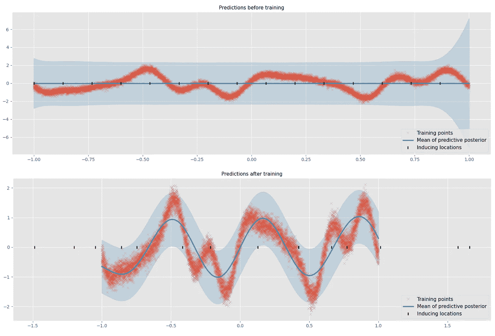***

***看上面的部分，我们看到在参数学习之前，模型做出了非常糟糕的预测。预测的平均值全为零，置信区间很宽——这就是 GP prior 要做的事情。上半部分右边置信区间的大漏斗形状是因为我们最后的诱导位置(右边最后一个黑点)离训练数据很远。我们还没有使用参数学习来用训练数据拟合模型，难怪预测会很差。***

***查看底部，我们可以看到优化器确实为模型参数找到了一些值，因此模型现在可以更好地解释训练数据。预测的平均值现在更接近数据点，也更接近置信区间。***

***但我不得不说，我对模型的表现感到失望——预测的平均值(蓝色曲线)并没有真正捕捉到训练数据；置信区间没有很好地限制训练数据。还有，看看优化后的诱导位置，有些甚至超出了训练数据 *X* 的范围[-1，1]。对了，最大化的*爱尔博*是-5583。***

***我们的 SVGP 模型应该有能力做得更好。可能由于我们前面谈到的优化困难，优化器未能找到更好的模型参数值。我们能帮助优化程序吗？***

## ***更加优化友好的参数化***

***我们最初对随机变量向量 *fₛ* 上的稀疏先验和变分分布的定义是 *:****

***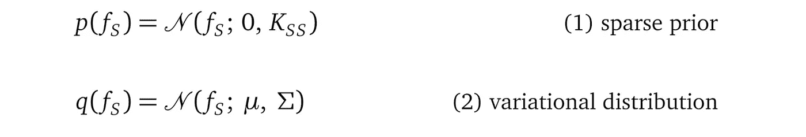***

***(1)和(2)表明 *fₛ* 被定义为来自稀疏先验和变分分布中的不同且不相关的分布。来自先验的 *Kₛₛ* 中的模型参数 lengthscale *l* 和信号方差 *σ* 与来自变分分布的参数 *μ* 和*σ*无关。先验分布和变分分布与模型观点完全无关。这意味着优化器可以将先验移向后验(通过改变 *l* 和 *σ* 的值)，而完全独立于将变分分布移向真实后验(通过改变 *μ* 和*σ*的值)。这种自由赋予了优化器不同的任务。***

***有办法降低自由程度吗？是的，有，这里有一个优雅的方式。***

## ****fₛ* 的重新参数化***

***让我们引入一个新的随机变量向量 *u* ，它与 *fₛ.的长度相同*而我们将*重新定义为*u:fₛ=卢，*其中 *L* 是从矩阵 *Kₛₛ* 的乔莱斯基分解得到的下三角矩阵。换言之，*llᵀ=kₛₛ*； *L* 中的*和*条目是从 *Kₛₛ* 中的条目构建的分析表达式。****

****在稀疏先验中，我们让 *u* 来自一个标准的多元高斯分布，即 *u* ~ *𝒩(0，1)* 。于是稀疏先验 *p(fₛ)* 就变成了:****

****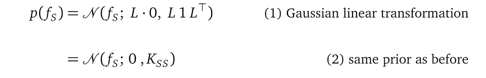****

****和以前一样。****

****对于变分分布，设 *u* 来自均值为 *μᵤ* 协方差矩阵为*σᵤ、*即*、u~𝒩(μᵤ、σᵤ).的多元高斯分布*****

****由于*= Lu，*我们可以使用多元高斯线性变换规则导出变分分布*的概率密度函数:*****

**********

*****我们可以看到，这个重新参数化的 *q* ( *fₛ)* 中的 *fₛ* 仍然是一个多元高斯随机变量。这个新的变分分布和原来的变分分布之间的差别*q*(*fₛ)=𝒩(fₛ；μ，σ)*在于多元高斯分布的参数化不同:*****

*   ****在老*问*(*fₛ)=𝒩(fₛ；μ，σ)*，高斯分布由 *μ* 和*σ参数化。*****
*   ****在新的*问*(*fₛ)=𝒩(fₛ；Lμᵤ，lσᵤlᵀ)*，高斯分布由 *L (* 参数化，最终由长度标度 *l* 和信号方差*σ*、 *μᵤ* 和*σᵤ.参数化*****

****这种不同的参数化没有什么奇特之处。不同地参数化一个量是我们在高中学过的概念— [参数方程](https://en.wikipedia.org/wiki/Parametric_equation)。****

## ****新参数化的动机****

****定义 *fₛ* 为*卢*在新的变分分布 *q* ( *fₛ)=𝒩(fₛ内将内核参数长度标度 *l、*信号方差 *σ* 和变分参数 *μᵤ* 和*σᵤ*联系在一起；lσᵤlᵀ).lμᵤ*****

***还记得在*优化难度*一节中，我们讨论过 *ELBO* 公式在一个公式中实现了两个优化目标:***

1.  ***找出核参数 *l* 和 *σ、*以及噪声方差 *𝜂、*和诱导位置 *Xₛ* 的值，使得真实后验很好地解释训练数据。***
2.  ***找到变分参数 *μ，σ*的值，使得变分分布*q(f；μ，σ)*近似于真实的后井。***

***新的参数化*fₛ=卢*将这两个目标联系在一起——每次优化器改变内核参数 *l* 和 *σ，*下面的三角形 *L* 也会改变，因为 *L* 中的条目是提到 *l* 和 *σ的表达式。*当 *L* 变化*时，*的变分分布*q*(*fₛ)=𝒩(fₛ；Lμᵤ，lσᵤlᵀ)*也发生变化，因为它被均值 *Lμᵤ* 和协方差*lσᵤlᵀ.参数化****

***如果你需要一个比喻，想想你的小指和无名指——它们的运动是相互依赖的。你移动你的小手指，你的无名指也会移动。***

***我们通过使用*fₛ=陆*参数化来达到同样的效果。当优化器通过改变内核参数 *l* 和 *σ* 的值将先验向后验移动时，变分分布*q*(*fₛ)=𝒩(fₛ；Lμᵤ，lσᵤlᵀ)*，*，*我们用来近似后验的，也移动(向最大化 *ELBO* 的方向，我们的实验结果证明了这一点)。这种受限的自由度使得优化器的任务更加简单。***

*   ***当优化器通过改变内核参数 *l* 和 *σ* 的值将先验向后验移动时，变分分布*q*(*fₛ)=𝒩(fₛ；Lμᵤ，lσᵤlᵀ)*，我们用来近似后验概率的，也移动了(向 ELBO 最大化的方向移动，正如我们的实验结果所证明的)因为它是由 *Lμᵤ* 和*lσᵤlᵀ*和 *L* 提到的内核参数来参数化的。这种受限的自由度使得优化器的任务更加简单。***

***这与原来的 *q* ( *fₛ)=𝒩(fₛ不一样；μ, Σ).*在最初的情况下，优化器可以改变 *l* 和 *σ* ，但是如果优化器不改变 *μ或σ*，变分分布将保持不变。这种不相关的自由给优化器留下了更艰巨的任务。***

***需要注意一件微妙的事情:我们的小指和无名指确实是相互依赖的，你不能在移动另一个手指的时候保持一个手指不动，不管你先移动哪个手指。但是由*fₛ=卢*参数化引入的先验和变分分布的共同运动只发生在一个方向上。你移动先验(通过改变核参数 *l* 和 *σ* 的值)，然后变分分布移动。然而，如果你移动变分分布(通过改变 *μᵤ* 和*σᵤ*的值)，先验不会移动。但是，正如我们在改进的实验结果中看到的，即使是这种单向的共同运动也可以大大帮助优化器。***

## ***更合适的模型***

***有了*=陆*参数化，经过参数学习，我们的模型在预测方面要好得多:***

***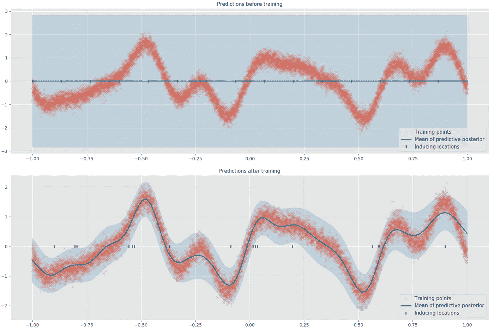***

***该图清楚地显示了正确参数学习的效果:***

1.  ***在参数学习之前，诱导位置是等距离分离的。这是我们初始化它们的地方。参数学习过程在训练数据变化更快的区域放置更多的诱导位置，而在训练数据变化更平稳的区域放置更少的诱导位置。***
2.  ***在参数学习之前，模型对训练数据的解释很差，这反映在顶部图中的预测具有零均值和非常大的方差。经过参数学习后，模型能够很好地解释数据，体现为贯穿中间训练数据的后验均值，置信区间与训练数据紧密有界。此外，优化的诱导位置在数据 *X* 的范围[-1，1]内。***

***对了，最大化的 *ELBO* 值是-1665。因为我们最大化了 ELBO，所以从-5583 到-1665 是个好消息。***

## ***还是同一个型号？***

***你可能想知道，有了新的参数化，=陆，我们是否还像以前一样定义相同的 SVGP 模型？是的，我们是。这是因为无论有没有新的参数化，我们的模型:***

*   ***使用多元高斯分布作为先验***
*   ***使用高斯似然***
*   ***使用多元高斯分布作为变分分布来近似真实的后验分布。***

***换句话说，模型具有相同的结构，因此具有相同的表现力。的确，一些随机变量，即 *fₛ* ，被不同地参数化。但是，您可以将这种参数化视为同一个多元高斯概率密度函数 API 的不同实现。如果你愿意，你可以用你自己的方式参数化 *fₛ* ，也许这对优化器帮助更大。***

***所以我们说的是同一个模型。但是正如我们已经看到的，不同地参数化模型可以帮助参数学习找到更好的值。***

## ***厄尔布看起来像什么？***

***让我们看看 *ELBO* 在 *fₛ=Lu* 参数化后是什么样子。 *ELBO* 由两项组成，似然项和 KL 项。***

*****似然项** 没有 *fₛ=Lu* 参数化，似然项为:***

******

***随着***

******

****fₛ=Lu* 参数化影响 *μ* 和*σ*，它们来自原始变分分布*q*(*fₛ)=𝒩(fₛ；μ，σ)*以下述方式 *:* 新的变分分布变成*q*(*fₛ)=𝒩(fₛ；lσᵤlᵀ).lμᵤ*这是因为:***

1.  ****fₛ=Lu 和 u~𝒩(u；μᵤ，σᵤ)****
2.  ***应用多元高斯线性变换规则后，你会得到*q*(*fₛ)=𝒩(fₛ；lσᵤlᵀ).lμᵤ*换句话说， *μ=Lμᵤ，σ=lσᵤlᵀ.****

***可能性术语中的其他术语不受影响。诚然，我们可以把 *Kₛₛ= LLᵀ* 写成，但由于 *L* 没有提到新引入的随机变量 *u* ， *Kₛₛ* 不受参数化的影响， *A* 和 *B* 也不受影响。***

***如果我们将受影响的项 *μ=Lμᵤ* 和*σ=lσᵤlᵀ*代入原始可能性项，我们得到:***

***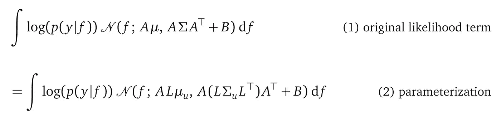***

***如前所述，我们仍然可以使用高斯积分来导出近似该积分结果的解析表达式。***

*****KL 术语*****

****ELBO* 中原来的 KL 术语是:***

***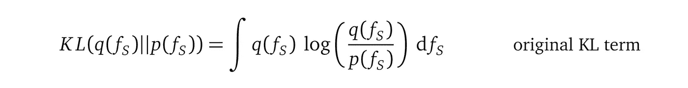***

***我们可以看到，q( *fₛ)、*、d *fₛ* 项都受到 *fₛ=Lu* 参数化的影响。让我们一个一个地解决它们。***

***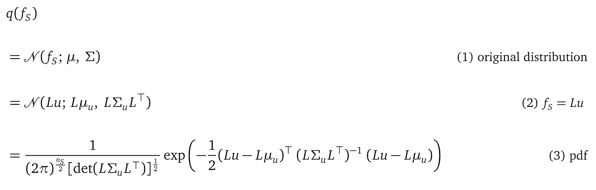***

***在上面的概率密度函数中， *nₛ* 是 *fₛ* 随机变量向量的长度，也是诱导位置*的个数。****

***让我们简化上面公式中的不同部分。这些推导并不难，它们需要耐心。如果你和两个孩子被锁在家里三个月，你自然会意识到耐心有多重要。开始了。***

***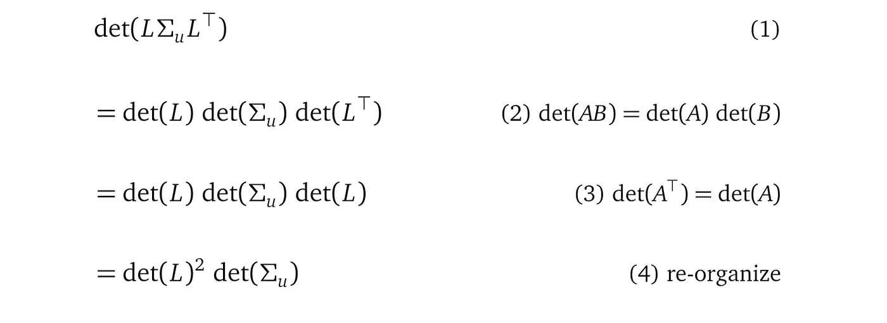***

***请注意，我们可以在第(4)行进行重组，因为矩阵的行列式是数字，而不是矩阵。***

***在指数运算符内部:***

***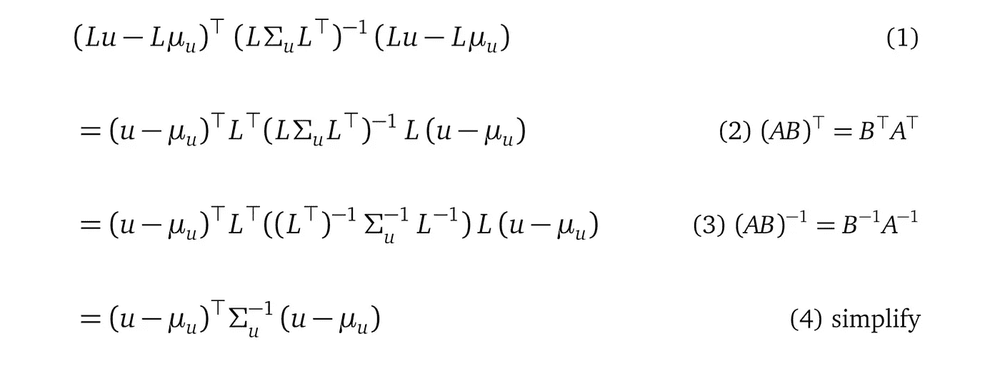***

***加上这些简化的量，*【q(fₛ】*就变成了:***

***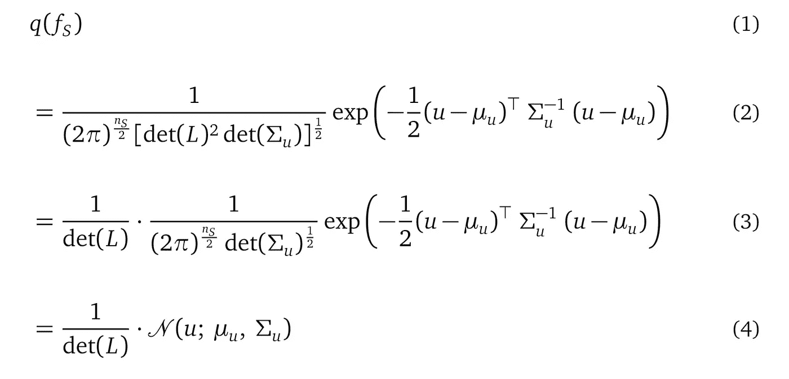***

***我们可以看到 *q(fₛ)* 可以表示为概率密度*𝒩(u；μᵤ，σᵤ)*按系数 *1/det(L)* 缩放。***

***按照同样的程序，我们可以将 *p(fₛ)* 表示为:***

***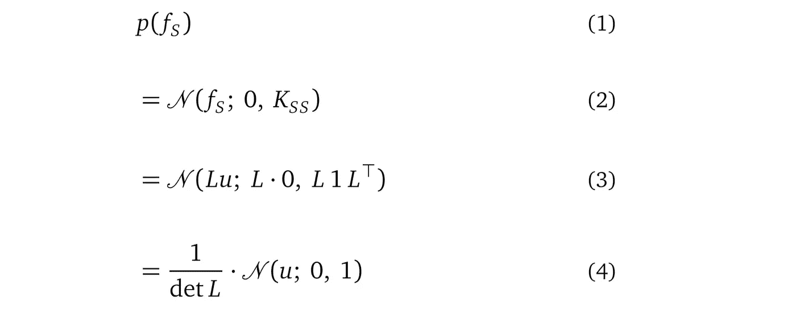***

***所以 KL 项可以表示为:***

***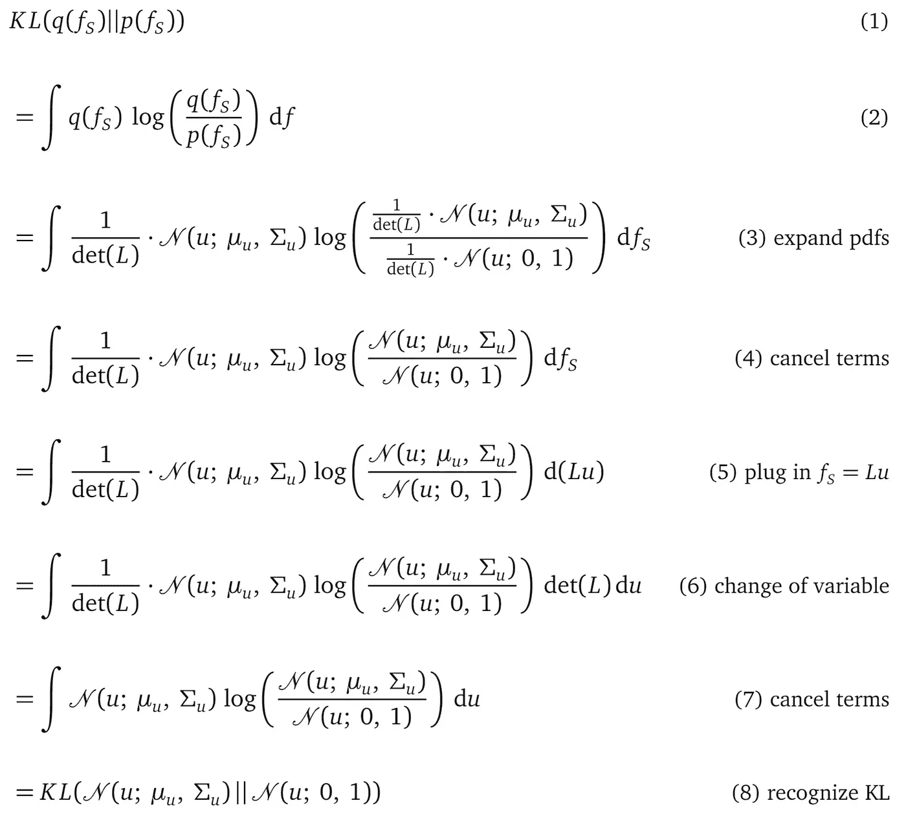***

***通过 *fₛ=Lu* 参数化， *ELBO* 中的 KL 项可以表示为 *𝒩(u 之间的 KL 散度；μᵤ、*和*𝒩(u；0，1)* ，如第(8) *行。多优雅啊！****

***顺便说一下，我们所做的是推导这个新的 KL 项，应用[替代积分](https://en.wikipedia.org/wiki/Integration_by_substitution)过程，将原来对 *fₛ* 的积分转化为对 *u.* 的积分。在高斯过程中，我们已经多次使用这个过程。最后一次是在 [*变分高斯过程——当事情不是高斯*](/variational-gaussian-process-what-to-do-when-things-are-not-gaussian-41197039f3d4) 的时候我们推导出了*埃尔博*公式中似然项的解析表达式。你必须掌握代换积分法。***

***和以前一样，由于这个新 KL 中的两个分布都是高斯分布，所以它的解析表达式是可用的。***

***使用 *fₛ=Lu* 参数化的最终 *ELBO* 公式为:***

***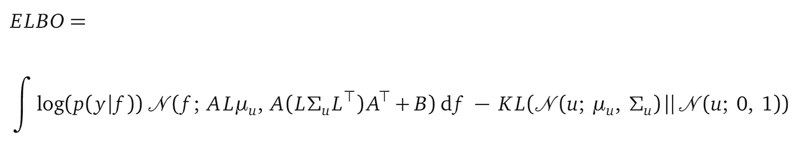***

## ***理论上的模型等价与实践中的优化结果***

***通过 *fₛ=Lu* 参数化，新导出的 *ELBO* 表达式计算出与旧 *ELBO* 相同的数量。这是因为我们所做的所有操控都是平等的操控。我们没有做任何引入不平等的事情。你可以理解，同一个 *ELBO* 可以用不同的方式实现，但是它们有相同的语义。***

***因此，使用 *fₛ=Lu* 参数化，我们仍然有相同的模型，并且我们在参数学习期间最大化相同的目标函数。从数学上讲，如果我们以相同的模型参数初始值开始优化，我们应该得到相同的优化值:***

*   ***相同长度刻度 *l* ，信号方差 *σ* 和观测方差 *η* 。***
*   ***相同诱导位置 *Xₛ.****
*   ***相同的变分参数 *μ=Lμᵤ* 和*σ=lσᵤ*用于*q(fₛ；μ, Σ).*注意这里我们应该得到相同的 *μ和σ，*但是有了 *fₛ=Lu* 参数化， *μ* 和*σ*通过 *L、*和*σᵤ.表示****

***但是我们已经看到了用 *fₛ=Lu* 参数化改进的实验结果。由于模型结构没有改变，我们的模型能够预测更好结果的唯一方法是优化器为模型参数返回不同的最优值。***

***这个更好的结果表明，即使使用 *fₛ=Lu* 参数化，我们有相同的模型，我们用相同的目标函数优化，新的参数化有助于优化。这就是我们使用这个参数化的原因。***

***在机器学习中，我们经常以不同的方式重新参数化模型，以获得数学上的便利和更好的优化结果。这是一项需要学习的重要技术。***

***你可能会想，我要怎么学呢？这些重新参数化似乎是随机出现的。这倒是真的。因此，学习它的一个实用方法是看它发生几次:***

*   ***在[揭开 Tensorflow 时间序列的神秘面纱:局部线性趋势](/demystifying-tensorflow-time-series-local-linear-trend-9bec0802b24a)中，我们使用了重新参数化技巧(在*章节重新参数化技巧*中)来使样本平均在梯度下降中工作。***
*   ***在本文中，我们使用重新参数化来帮助梯度下降找到更好的模型参数值。***
*   ***将来，当我们谈到自然梯度时，我们将再次讨论高斯分布的重新参数化。***

***你看，我们逐渐建立起自己！***

## ***为什么优化器移动诱导位置？***

***我相信你已经熟悉了优化器为什么要改变内核参数，比如 lengthscale *l* 来让我们的模型很好地解释训练数据(如果没有，请看[这里的](/understanding-gaussian-process-the-socratic-way-ba02369d804)，计算后验部分的*)。因此本节重点介绍新模型参数——诱导位置 *Xₛ.*****

***让我们考虑一下，为什么优化器将更多的诱导位置分配给训练数据变化更快的区域，而将较少的诱导位置分配给训练数据更平滑的区域。***

***优化器的工作是优化 *ELBO* ，它是边际可能性 *p(y)* 的代理，测量诱导变量 *fₛ* 如何解释代表训练数据的随机变量 *f、*。正如我们之前提到的，该模型在导出条件 *p(f|fₛ)* 之前将多变量高斯条件规则应用于 SVGP，以实现使用 *fₛ* 解释 *f* 的目标:***

***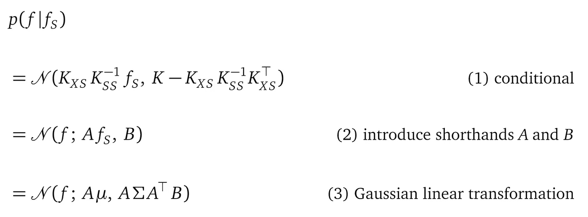***

***随着***

***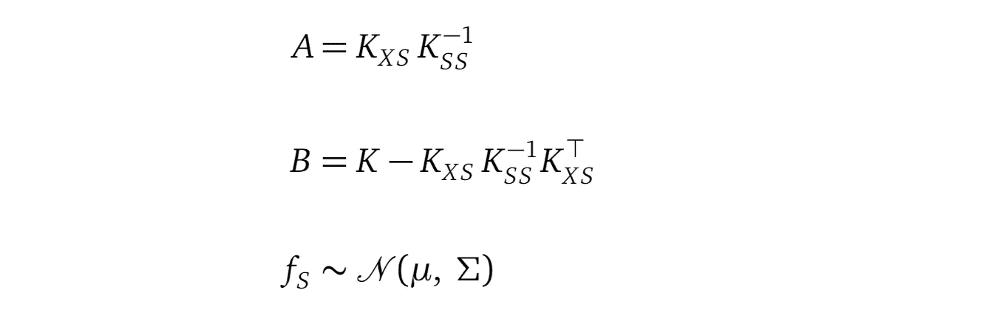***

***第(2)行显示 *f* 是来自 *fₛ的线性变换— A* 是变换矩阵，带有一些噪声矩阵 *B.* 。第(3)行应用多元高斯线性变换规则来重写 *f* 的概率密度函数，而没有提到 *fₛ —* 它只提到来自 *fₛ~𝒩(μ，σ的分布的参数 *μ* 和*σ*。*记住，如果我们使用 *fₛ=Lu* 参数化*，μ=lμᵤ*和*σ=lσᵤlᵀ*。***

***第(3)行显示 *f* 的平均值，即 *Aμ* ，是 *fₛ* 的平均值的加权和，即 *μ* ，其中 *A* 给出权重。 *A* 的公式包含矩阵 *Kₓₛ.Kₓₛ* 使用核函数 *k* 来定义任意两个潜在随机变量之间的相关性，无论它们来自 *f* 还是 *fₛ.****

***优化器为内核的长度尺度 *l* 选择一个单一的值，这个值是所有训练数据点之间的一个折衷——这个单一的长度尺度表示所有交易数据的平均值，即两个随机变量需要有多接近才能有足够大的相关性。***

***在这个单一值 *l* 下，我们的模型能够解释训练数据变化更快的区域的唯一方法是在那些区域中有更多的诱导变量。这是因为只有附近的诱导变量才能更有效地参与加权求和公式，来解释那些快速变化的训练数据点。“有效地”，我的意思是只有足够接近训练数据点的诱导变量将具有足够大的权重(由 *A* 中的 *Kₓₛ* 组件定义)来解释该训练数据点。***

***这就是优化器在训练数据变化更快的区域分配更多诱导位置的原因。***

# ***结论***

***现在我们完成了稀疏和变分高斯过程模型。恭喜你！让我们回顾一下高斯过程的历程:***

*   ***我们从[高斯过程回归(GPR)模型](/understanding-gaussian-process-the-socratic-way-ba02369d804)开始。它只接受高斯似然，不能扩展到大型数据集。***
*   ***然后我们继续使用[变分高斯过程(VGP)模型](/variational-gaussian-process-what-to-do-when-things-are-not-gaussian-41197039f3d4)。它接受高斯和非高斯的可能性，如伯努利，但它仍然不能扩展到大型数据集。***
*   ***然后，我们探讨了本文中的稀疏变分高斯过程(SVGP)模型。该模型接受高斯和非高斯可能性，并且可以扩展到大型数据集。***

***当在具有大型数据集的实际设置中应用高斯过程时，SVGP 模型将是您的起点。***

# ***支持我***

***如果你喜欢我的故事，如果你考虑通过这个链接成为一名灵媒会员来支持我，我将不胜感激:[https://jasonweiyi.medium.com/membership](https://jasonweiyi.medium.com/membership)。***

***我会继续写这些故事。***

# ***参考***

***[大数据的高斯过程](https://arxiv.org/pdf/1309.6835)(更多介绍)
[可扩展的变分高斯过程分类](http://proceedings.mlr.press/v38/hensman15.pdf)(更多数学内容)***

# ***附录:证明随机梯度下降对 SVGP 模型参数学习有效***

***由于随机梯度下降算法要求从一批训练数据计算的随机梯度是从全部训练数据计算的全部梯度的无偏估计量，让我们证明这是我们的 SVGP 模型的情况。不要被“证明”这个词吓呆了。证明非常简单，它展示了一种你在机器学习算法推理中常见的模式。***

***我们首先看什么是梯度下降使用的所有训练数据计算的全梯度。相对于所有模型参数，在 *ELBO* 上计算梯度，表示为 *θ={l，σ，η，μ，σ}。*ELBO*ELBO*是:***

******

***第一项是似然项，第二项是 KL 项。KL 项没有提到训练数据 *(X，Y)* ，它相对于 *θ* 的梯度在全数据情况和分批情况下是相同的。所以我们只需要专注于用一批抽样数据证明似然项的梯度是全数据下似然项梯度的无偏估计量。***

***让我们来操纵可能性项:***

***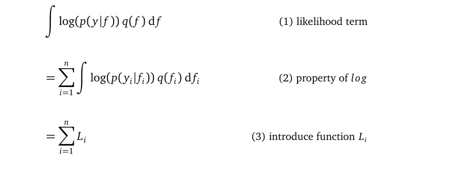***

***第(2)行使用 *log* 的属性和多元高斯分布 *q(f)* 的边缘化属性来导出作为一维积分之和的似然性。推导见[此处](/variational-gaussian-process-what-to-do-when-things-are-not-gaussian-41197039f3d4)。***

***第(3)行引入了简写 *Lᵢ* 来指代这些一维集成。 *Lᵢ* 是模型参数的函数，为了节省篇幅我没有写出 *θ* 。每个 *Lᵢ* 都会提到来自我们训练数据集*的第*个*数据点 *(Xᵢ，Yᵢ)* 。****

## ***完全渐变***

***完整训练数据的似然项的梯度为:***

***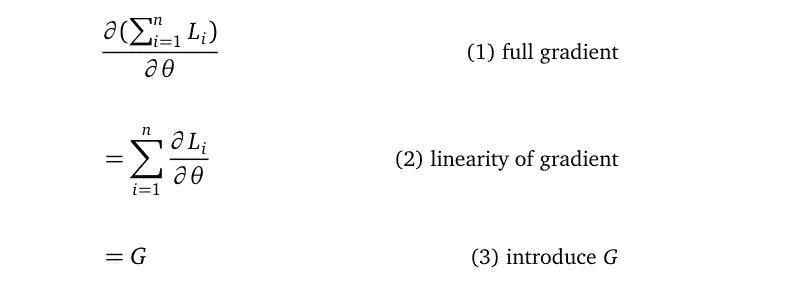***

***线(1)获取关于模型参数集 *θ的似然项的梯度。****

***第(2)行使用梯度的线性属性将梯度运算符推入求和中。***

***第(3)行为全渐变引入了一个新名字 *G* 。***

***我们需要证明一批评估的似然性的随机梯度的期望与 *G* 相同。***

## ***随机梯度***

***将一批定义为一个集合 *M={j₁、j₂、…、jₘ}* 。每个元素 *jₖ* ( *k* from 1 到 *m* )是一个随机变量，来自均匀分布 *jₖ~Uniform(1，n)* ，其中 *n* 为训练数据点的个数。这个随机变量表示批处理包含的数据点的索引。我们将 *jₖ* 建模为均匀分布，以表示从我们的训练数据集中随机且均等地选择(替换)数据点，从而创建一个批次。***

***例如， *M* ={ *j₁=* 1， *j₂=* 3， *j* ₃=5}表示该批包含 3 个数据点。这些数据点是来自训练集 *(X，Y)* 的第 1、第 2 和第 5 个数据点。***

***因此，对批次 *M* 评估的可能性表示为:***

******

***相对于模型参数集 *θ的随机梯度为****

******

***每次你画一批，你有一个不同的集合 M，因此不同的梯度。换句话说，梯度变成了一个随机变量。所以我们称之为随机梯度。***

***上述随机梯度相对于随机变量 *j* 的期望值为:***

******

***我们需要证明这个期望等于全梯度 *G* 。***

***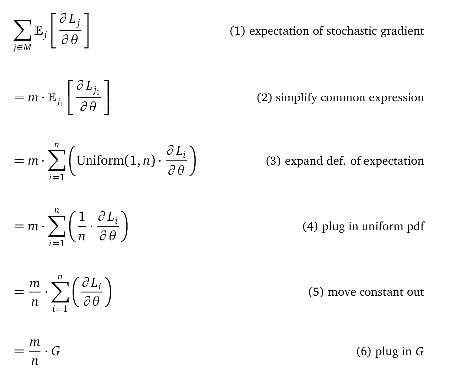***

***线(1)是对一批数据计算的随机梯度的期望值。***

***由于每个随机变量 *j∈M* 都来自同一个均匀分布 *Uniform(1，n)* ，所以它们的期望应该是相同的。所以第(2)行使用单个元素 *j₁* 来计算这个期望值。最终结果将是 *m* ，批量，乘以相对于 *j₁* 的预期结果。***

***第(3)行写出了计算相对于 *j₁* 的期望值的公式。并且线(4)插入均匀概率密度 *1/n* 。***

***第(5)行将通用表达式 *1/n* 移出求和。注意，剩余总和等于全梯度 *G* 。因此线路(6)插入 *G* 。***

***我们认识到随机梯度的期望是 *m/n* 乘以全梯度，因此随机梯度不是全梯度的无偏估计量。但是我们可以通过将随机梯度乘以 *n/m* 来构造一个无偏估计量。这就是随机梯度下降算法对 SVGP 模型所做的。***

***上述证明是一种流行的证明模式。你会在决定随机梯度下降是否适用于机器学习模型的过程中看到它。在文章“[中，我们可以在线性回归模型上使用随机梯度下降(SGD)吗？](/can-we-use-stochastic-gradient-descent-sgd-on-a-linear-regression-model-e50327b07d33)”对于线性回归模型，我写了一个非常类似的证明。***