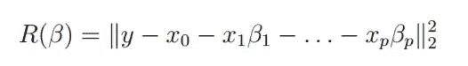
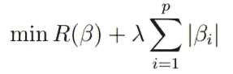
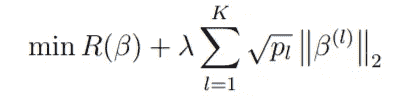
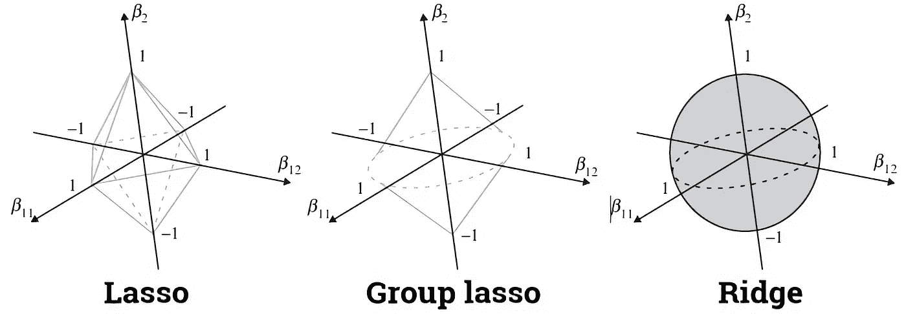
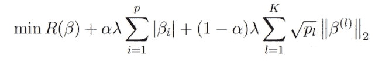

# Python 中的稀疏群组套索

> 原文：<https://towardsdatascience.com/sparse-group-lasso-in-python-255e379ab892?source=collection_archive---------14----------------------->

## 如何在回归中使用最佳变量选择技术之一


准备使用套索，捕捉一些有意义的变量。普里西拉·杜·普里兹在 [Unsplash](https://unsplash.com?utm_source=medium&utm_medium=referral) 上的照片

所以昨天我为 python 发布了一个新的包: [**asgl**](https://github.com/alvaromc317/asgl) (这个名字来源于自适应稀疏组套索)，它增加了许多在 R 包中已经可用但在 python 中不可用的功能，比如求解稀疏组套索模型，并且超越了这一点，增加了额外的功能来改善稀疏组套索可以提供的结果。

这将是关于回归中最先进的正则化技术系列的第一篇文章，我想开始谈谈稀疏群套索:它是什么以及如何使用它。具体来说，在这里我们将看到:

*   什么是**稀疏群套索**
*   如何在 **python** 中使用稀疏群组套索
*   如何进行 **k 倍交叉验证**
*   如何使用**网格搜索**才能找到最优解。

# 什么是稀疏群套索

为了理解什么是稀疏群组套索，我们需要(简要地)谈谈两种技巧:**套索**和**群组套索**。给定一个风险函数，例如线性回归风险，



线性回归模型的风险函数

***套索:*** 定义了在β系数的绝对值上增加一个惩罚项，



套索惩罚公式

这个定义提供了**稀疏解**，因为它会将一些β系数(与响应变量最不相关)置零。这种惩罚的效果可以使用λ参数来控制**。较大的λ值提供了惩罚更重要的解决方案，因此β系数中有更多的零。这主要在**高维数据集**中有用，这里的变量比观察值多，但我们只期望变量中的一小部分真正有意义。**

但是，在某些情况下，X 中的预测变量具有自然的分组结构。例如，在生物统计学中，通常处理遗传数据集，其中预测因子被分组到遗传途径中。在股票市场分析中，人们可以将来自同一业务领域的公司分组。在气候数据中，人们可以对不同的地区进行分组 lasso 提供了单独的稀疏解决方案，而不是分组稀疏。

***群拉索:*** 于是群拉索来救援了。组套索是建立为属于同一组的系数的平方和。



群体套索惩罚公式

通过这种方式，它考虑了预测器的可能**分组结构，并且它将整组变量发送到零。如果所有组的大小都是 1(每个组只有一个预测值)，我们将求解一个套索模型。让我们用图形来看套索和套索组，**



套索、成组套索和山脊惩罚比较

在上图中，我们有一个简单的问题，有三个系数，β₁
β₁₁和β₁₂.最后两个系数组成一个组，正如我们看到的，lasso(左图)没有考虑这个分组信息，但 group lasso 考虑了。所以群套索可以看成是群与群之间的套索，群内的脊。如果一个群体有意义，我们选择整个群体。如果不是，我们把它发送到零。

***稀疏群套索:*** 最后就是这里了，



稀疏群套索罚函数

> 稀疏组套索是套索和套索组之间的线性组合，因此它提供了稀疏组之间和之内的解决方案。

这种技术从最有意义的组中选择最有意义的预测值，是近年来最好的变量选择方法之一。然而，直到现在，python… *的稀疏组套索还没有实现。*

# **迁移到 python:安装 asgl**

让我们从安装`asgl`开始。这可以使用`pip`轻松完成

```
pip install asgl
```

或者，你可以提取 github 库并运行`setup.py`

```
git clone [https://github.com/alvaromc317/asgl](https://github.com/alvaromc317/asgl).git
cd asgl
python setup.py
```

# 导入库

一旦我们安装了这个包，我们就可以开始使用它了。首先，让我们导入我们将在本例中使用的库和`BostonHousing`数据集。

这里，除了导入数据集，我们还创建了一个名为`group_index`的变量。这个变量描述了数据的分组结构，所以如果我们有 13 个预测值，`group_index`应该是一个长度为 13 的变量，如果前三个预测值组成一个组，它们应该有相同的`group_index`值。然而，`BostonHousing` dataset 没有自然的分组结构，所以为了本文的目的，我们在这里定义一个假的。

# sgl 模型的参数

如果我们看一下上面的稀疏群套索方程，我们可以看到**有两个参数α和λ可以优化。** λ控制我们希望给予惩罚的权重，因此λ值越大，产生的解越稀疏。α控制套索和组合套索之间的权衡。α等于 1 提供套索，α等于 0 提供组合套索。现在，通常，我们可以为这两个参数定义一个可能值的网格，并尝试找到使误差最小的组合。

此外，我们指定要求解的模型类型(lm，因为我们正在求解一个线性模型)、惩罚(sgl，因为我们需要稀疏组 lasso)、要使用的错误类型(MSE，因为我们将使用均方误差)以及最后，我们可以指明是要顺序还是并行运行该代码。**并行执行**利用了`multiprocess` python 库，可以比顺序执行更快地解决问题。

# **交叉验证**

我们已经定义了 23 个可能的λ值和 20 个可能的α值的网格。共有 460 种参数组合。我们将使用交叉验证(并行运行)找到最佳组合

所以首先，我们定义一个`CV`对象，我们插入上面定义的所有参数信息。然后，我们运行`cross_validation()`函数，该函数将返回 460 个模型中的每一个在 k 次折叠中达到的误差。

这样，我们**搜索最小化均方误差的参数值**，并将它们的值存储在`optimal_lambda`和`optimal_alpha`中。

就这么简单，我们找到了我们的最优模型。

# 获得最终误差

然而，应该记住，交叉验证误差有点偏差，因此为了获得最终预测误差，我们将使用最佳参数运行最终训练/测试分割。

首先，我们定义一个`ASGL`对象，我们将使用它来拟合一个简单的稀疏组套索模型(没有交叉验证)。然后，我们使用函数`train_test_split()`将数据分成 70%训练 30%测试，我们拟合模型，以便获得β系数的最终估计值(存储在`final_beta_solution`

给定一个新的数据集，我们可以使用函数`ASGL.predict()`预测响应变量的值，并使用带有函数`error_calculator`的测试集计算最终预测误差。

以上就是如何用 python 实现稀疏群组套索。我希望你喜欢这篇文章，并发现它很有用，所以*继续关注*这个系列的未来文章，如果你有任何问题/建议，请不要犹豫，与我联系。

要更深入地了解`asgl`包提供了什么，我推荐阅读 github 库中提供的 [jupyter 笔记本](https://github.com/alvaromc317/asgl/blob/master/user_guide.ipynb)。

祝你今天开心！玩的开心！