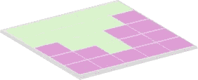
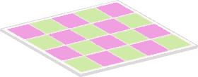
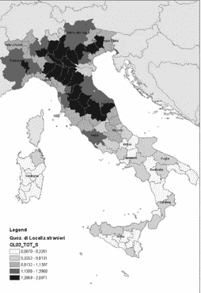

# 空间自相关:靠近的对象影响其他靠近的对象

> 原文：<https://towardsdatascience.com/spatial-autocorrelation-close-objects-affecting-other-close-objects-90f3218e0ac8?source=collection_archive---------34----------------------->

## 深入探讨空间自相关及其行业使用案例

尼克·舒利亚欣在 [Unsplash](https://unsplash.com?utm_source=medium&utm_medium=referral) 上的照片

# 地理空间相关性

地理空间自相关是指一个对象与附近其他对象的相似程度。“Auto”表示自我，“correlation”表示关联。通俗地说，它衡量的是近距离物体与其他近距离物体的相似程度。

> GIS 的第一条规则:任何事物都与其他事物相关。但是近处的事物比远处的事物更相关(瓦尔多·r·托布勒，1970)

## 要理解这个规律，我们来举个例子。

假设你从类似[房产](https://housing.com/)的房源网站上随机挑选了一栋房子，让我们假设房子的价格是 60 万美元。接下来，假设紧挨着它的房子也挂牌出售，你要预测它的价格。给你 65 万美元和 280 万美元两个选择，你会选哪个？

如果你选择了 60 万美元，那么你已经下意识地知道什么是空间自相关。它是两个相邻物体在一些共同特征上的相关性(*例如房价*)。

空间自相关的一个潜在应用是，它有助于分析生态和疾病的聚集和分散。诸如“*该疾病是孤立病例*”或“*各地的降雨模式是聚集的还是相同的*”等问题可以通过空间自相关分析得到很好的理解和回答。

# 技术定义

从技术上来说，空间自相关是指在空间尺度上相互接近的变量的观测值之间的关联性的度量。变量可以是:

1.在连续表面上的任何点(如一个地区的土地利用类型或年降水量)

2.在特定区域的一组固定地点(例如一组零售店)

3.跨越细分一个地区的一组区域(例如在划分一个城市地区的人口普查数据中拥有两辆或更多汽车的家庭的数量或比例)。

自相关违背了统计学的核心原则，即观测值相互独立。根据经典统计学中独立性的假设，组间的*观测值*和组内的*观测值*应该是独立的。因此，空间自相关显然违反了上述假设。

Patrick assaléon[Unsplash](https://unsplash.com?utm_source=medium&utm_medium=referral)摄影

> 空间相关性的概念是时间相关性的一种扩展。唯一的区别在于，时间相关性测量的是一个变量随时间的变化，而空间相关性测量的是两个变量的变化-观测值(如收入、降雨量等值)和位置。

# 空间相关性的类型

地理空间中最常见的空间关联形式是面片和梯度。

变量中的空间相关性可以是*外源性*(由另一个空间自相关变量如降雨量引起)或*内源性*(由某种起作用的过程如疾病传播引起)。

这里有一个视频详细讲述了空间自相关如何帮助提高空间自相关的重要性**。**

[来源](https://www.youtube.com/watch?v=k-emjdYiOQw)

# **莫兰的我**

空间自相关通过 Moran 的 I 进行测量。Moran 的 I 是一个相关系数，用于测量数据集中的整体空间相关性。莫兰 I 可分为正、负和无空间自相关:

## **1。正相关**:

当相似值在地图上聚集在一起时，空间相关性为正。当 Moren I 接近+1 时，出现正自相关。下图显示了一个区域的土地覆盖情况，这是一个正相关的示例，因为相似的聚类就在附近。

描述正相关的土地覆盖图像

## 2.**负相关**:

当不同的值在地图上聚集在一起时，空间相关性为负。当莫兰的 I 值为-1 时，会出现负的空间自相关。棋盘是负自相关的一个很好的例子，因为不同的值彼此相邻。

不同的对象聚集在一起，因此负相关

## 2.零相关:

莫兰 I 值为 0 表示没有空间自相关。

# 空间相关性的应用

空间自相关的重要性在于，它有助于定义空间特征在影响空间中的给定对象时有多重要，以及对象与空间属性之间是否存在明确的关系。以下是空间自相关的一些有趣的工业用例:

1.  **衡量不平等:**空间自相关有助于找出收入、人口或种族方面的不平等和多样性的衡量标准。它利用莫兰 I 系数来分析收入、人口等参数在某一地区是聚集分布还是均匀分布。[ [来源](http://ncbi.nlm.nih.gov/pmc/articles/PMC6068954/)
2.  **环境**:空间自相关有助于发现城市土壤中稀土元素的污染热点。[ [来源](/spatial-autocorrelation-neighbors-affecting-neighbors-ed4fab8a4aac)
3.  **兴趣点:**自相关用于将不同参数映射为感兴趣变量的距离函数。例如，房价在离市中心多远的地方开始下降
4.  **生态学**:空间自相关在海洋和珊瑚礁生态系统中被广泛用于重要的应用，如场地适宜性分析，以确定贻贝延绳钓养殖场或海洋水产养殖规划的区域。
5.  **人口统计**:空间自相关用于绘制和分析选举期间的投票率，例如，空间自相关用于绘制法国总统选举和法国地方选举期间的缺席情况。[ [来源](https://www.researchgate.net/publication/320988214_Spatial_Autocorrelation_in_Voting_Turnout)

照片由[于切尔·莫兰](https://unsplash.com/@yucelmoran?utm_source=medium&utm_medium=referral)在 [Unsplash](https://unsplash.com?utm_source=medium&utm_medium=referral) 上拍摄

# 案例研究:意大利人口的移民分析

自相关对迁移分析有很大影响。这项研究是论文[在这里](https://www.researchgate.net/publication/229866917_Analyzing_Migration_Phenomena_with_Spatial_Autocorrelation_Techniques)的复制。这里的案例考虑了对意大利外国人口迁移的分析。

移民是不同规模的人口动态演变的关键因素，对经济、文化和环境都有影响。利用空间自相关，我们确定了代表移民集中的空间集群。

从技术上讲，这里的莫兰 I 系数表示外来人口与本地居民人口比率的加权方差与广义方差之间的差异。通俗地说，它表达了给定地点的*外来人口/人口比例*与相邻空间单元的*外来人口/人口比例*之间的相关性。

使用相关指数 [LISA](http://www.dpi.inpe.br/cursos/ser301/referencias/bivand/node9.html) (空间关联的局部指标)，我们将场景分成五类:

1.现象值高且与其周围环境高度相似(高-高)的位置被定义为*热点*

2.现象值低且与周围环境相似度低(低-低)的地点被定义为*冷点。*

3.现象值高而相似度低的位置，反之亦然。这些被称为*空间异常值。*

[来源](https://link.springer.com/chapter/10.1007%2F978-3-642-12156-2_5)

迁徙种群受到抑制的区域可分为以下三类:

1.  第一类在地理上集中在东北部地区，代表正相关值(类型:高-高)。这些群体的特点是收入机会/福利不断增加，因此吸引了寻找工作的外国人。
2.  在中心区域发现第二个聚类，其代表正相关的值(类型:高-高)。这些地区显示出福利更高的相似特征。
3.  第三个集群是在意大利南部的城镇发现的(类型:低-低)。这些地区的典型特征是收入低，就业机会少。

# 结论

空间自相关不仅将相似的对象与其他相似的对象聚集在一起，而且还表示相关或相似的程度。它有助于发现隐藏的模式和关系。它在生态学和人口统计学中有很多应用。

*原贴* [*此处*](https://blog.locale.ai/geospatial-autocorrelation/) *。*

*在现场，我们正在构建一个“* ***运营*** *”分析平台，使用按需公司供应和运营团队的位置数据。如果想深入钻研，可以查看我们的* [*网站*](http://locale.ai/) *out 或者在*[*LinkedIn*](https://www.linkedin.com/in/aditi-sinha-6b774ba9/)*或者*[*Twitter*](https://twitter.com/aditi1002)*上与 Aditi 取得联系。*